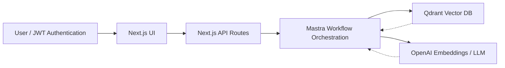

# GitHub Copilot Instructions for Mastra Governed RAG

## Repository Overview

**Project**: Mastra Governed RAG - Enterprise-grade secure Retrieval-Augmented Generation system with role-based access control.

**Purpose**: Traditional RAG systems risk exposing sensitive data. This template provides enterprise-grade security with hierarchical RBAC, document classification, and multi-agent security pipelines to ensure users only access authorized corporate knowledge.

**Key Features**:

- **Hierarchical RBAC**: Roles inherit access (public → employee → dept viewer/admin → admin)
- **Document Classification**: Public/internal/confidential with tag-based filtering
- **Multi-Agent Security**: Agents for retrieval, reranking, answering, and verification
- **Audit-Ready**: Citations and logs for compliance
- **Step-Up Authentication**: Elevated access for confidential content

**Technology Stack**:

- **Frontend**: Next.js 15.5.3, React 19.1.1, TypeScript 5.9.2, Tailwind CSS 4.1.13, shadcn/ui components
- **Backend**: Mastra 0.17 (AI orchestration), Qdrant vector database, LibSQL storage
- **AI**: OpenAI API, Google Gemini 2.5, AI SDK providers
- **Infrastructure**: Docker Compose, Redis caching, JWT authentication
- **Development**: ESLint, Prettier, Vitest testing, Turbopack hot reload
- **Node.js**: >= 20.9.0 required

## Project Architecture

### Core Structure

```bash
mastra-governed-rag/
├── app/                    # Next.js routes and API endpoints
│   ├── api/               # API routes (/api/chat, /api/index, /api/auth)
│   ├── about/             # Static pages
│   ├── docs/              # Documentation pages
│   └── page.tsx           # Home page
├── src/
│   ├── mastra/            # Core Mastra implementation
│   │   ├── agents/        # 15+ specialized AI agents
│   │   ├── workflows/     # Orchestrated agent workflows
│   │   ├── tools/         # Reusable agent tools
│   │   ├── services/      # Business logic (AuthenticationService, etc.)
│   │   ├── schemas/       # Zod schemas for type safety
│   │   └── config/        # Configuration (logger, vector store, storage)
│   ├── cli/               # Command-line interface
│   └── types.ts           # Global type definitions
├── components/            # React UI components (ChatInterface, AuthPanel, etc.)
├── cedar/                 # Cedar OS 3D interactive components
├── lib/                   # Shared utilities (auth, jwt-utils, utils)
├── corpus/                # Sample documents for indexing
├── docs/                  # Comprehensive documentation
└── docker-compose.yml     # Infrastructure services
```

### Security Pipeline Architecture



**RAG Security Pipeline**:

1. **Identity Agent**: Validates user JWT and role claims
2. **Policy Agent**: Generates access filters based on role hierarchy
3. **Retrieve Agent**: Queries Qdrant with security filters
4. **Rerank Agent**: Relevance scoring with access constraints
5. **Answerer Agent**: Generates secure responses
6. **Verifier Agent**: Compliance checking and audit logging

## Development Environment Setup

### Prerequisites

- **Node.js**: >= 20.9.0 (check with `node --version`)
- **Docker & Docker Compose**: For Qdrant and Redis services
- **Git**: For version control

### Initial Setup (Always run in this order)

```bash
# 1. Clone and install dependencies
git clone https://github.com/ssdeanx/governed-rag-ai.git
cd mastra-governed-rag
npm install

# 2. Configure environment (copy template and edit)
cp .env.example .env
# Edit .env with required API keys (OpenAI, Qdrant URL, JWT secret, etc.)

# 3. Start infrastructure services
docker-compose up -d  # Starts Qdrant (port 6333) and Redis (port 6379)

# 4. Index sample documents
npm run cli index

# 5. Start development servers
npm run dev  # Concurrent: Next.js (port 3000) + Mastra backend (port 4111)
```

### Environment Variables (Required)

```bash
# AI APIs (choose one or both)
OPENAI_API_KEY=your_openai_api_key
GOOGLE_GENERATIVE_AI_API_KEY=your_gemini_api_key

# Vector Database
QDRANT_URL=http://localhost:6333
QDRANT_COLLECTION=governed_rag

# Authentication
JWT_SECRET=your_secure_jwt_secret
TENANT=acme

# Storage
DATABASE_URL=file:deep-research.db

# Optional: Monitoring
LANGFUSE_PUBLIC_KEY=your_langfuse_key
LANGFUSE_SECRET_KEY=your_langfuse_secret
```

### Development Commands

```bash
# Full development stack
npm run dev              # Next.js + Mastra backend concurrently

# Individual services
npm run dev:next         # Next.js only (http://localhost:3000)
npm run dev:mastra       # Mastra backend only (http://localhost:4111)

# Build and test
npm run build            # Production build
npm run build-cli        # CLI build (dist/index.js)
npm run lint             # ESLint checking
npm run pretty           # Prettier formatting
npm test                 # Run all tests (Vitest)
npm run test:unit        # Unit tests only
npm run test:integration # Integration tests only

# CLI operations
npm run cli index        # Index documents into vector database
npm run cli query "$(npm run jwt:finance)" "What is expense policy?"
npm run cli demo         # Interactive demo mode

# JWT token generation for testing
npm run jwt:finance      # Generate finance viewer JWT
npm run jwt:hr           # Generate HR admin JWT
npm run jwt:admin        # Generate admin JWT
```

## Build and Validation Process

### Build Sequence (Always follow this order)

1. **Install**: `npm install` (run after any package.json changes)
2. **Lint**: `npm run lint` (ESLint with TypeScript rules)
3. **Test**: `npm test` (Vitest with coverage reporting)
4. **Build**: `npm run build` (Next.js production build)
5. **CLI Build**: `npm run build-cli` (TypeScript compilation to dist/)

### Validation Steps

- **TypeScript**: Strict mode enabled, no `any` types allowed
- **ESLint**: Custom rules for React, TypeScript, and code quality
- **Prettier**: Consistent formatting (4 spaces, single quotes, ES5 trailing commas)
- **Tests**: Vitest with jsdom environment, 10-second timeout
- **Coverage**: V8 provider with HTML/JSON/LCOV reports

### Common Build Issues and Solutions

#### Qdrant Connection Failed

```bash
# Check Qdrant health
curl http://localhost:6333/health

# View logs and restart
docker-compose logs qdrant
docker-compose down && docker-compose up -d
```

#### Authentication Errors

```bash
# Regenerate test tokens
npm run jwt:finance  # or jwt:hr, jwt:admin

# Verify JWT secret in .env
echo $JWT_SECRET
```

#### Build Failures

```bash
# Clear caches and rebuild
rm -rf .next node_modules
npm install
npm run build
```

#### Test Failures

```bash
# Run with verbose output
npm test -- --reporter=verbose

# Run specific test file
npm test src/mastra/agents/retrieve.agent.test.ts
```

## Code Architecture Patterns

### Agent Development (REQUIRED Pattern)

All agents must follow the Kilocode contract pattern:

```typescript
// Kilocode: Agent Contract
// owner: team-ai
// category: mastra-agent
// approvalRequired: true
// tools:
//  - vector-query.tool
// inputSchema: src/mastra/schemas/agent-schemas.ts::Input
// outputSchema: src/mastra/schemas/agent-schemas.ts::MyOutput
// requiredCallerClaims:
//  - roles: [role:engineering]
//  - tenant: engineering
// approvedBy: samm
// approvalDate: 9/24

import { Agent } from '@mastra/core/agent'
import { createResearchMemory } from '../config/libsql-storage'

export const myAgent = new Agent({
    id: 'my-agent',
    name: 'My Agent',
    instructions: `
<role>
You are a [Role Description].
</role>

<persona>
- **[Trait]:** [Description]
</persona>

<process>
When given a task, you must follow this process:
1. **[Step 1]**
2. **[Step 2]**
</process>
  `,
    memory: createResearchMemory(),
    // ... additional config
})
```

### Workflow Logging (REQUIRED Pattern)

All workflow steps must include structured logging:

```typescript
import { logStepStart, logStepEnd, logError } from "../config/logger";

const workflowStep = createStep({
  id: 'step-name',
  inputSchema: z.object({...}),
  outputSchema: z.object({...}),
  execute: async ({ inputData }) => {
    logStepStart('step-name', inputData);
    try {
      // Implementation
      const result = await processData(inputData);
      logStepEnd('step-name', result, Date.now() - startTime);
      return result;
    } catch (error) {
      logError('step-name', error, inputData);
      throw error;
    }
  }
});
```

### Schema Validation (REQUIRED)

All data structures use Zod schemas for runtime validation:

```typescript
// In src/mastra/schemas/agent-schemas.ts
export const mySchema = z.object({
    field: z.string().min(1),
    optionalField: z.string().optional(),
})

// In components/services
import { mySchema } from '../schemas/agent-schemas'

const validatedData = mySchema.parse(inputData)
```

## Security Model

### Role Hierarchy (MANDATORY)

```text
admin (100) > dept_admin (80) > dept_viewer (60) > employee (40) > public (10)
```

### Document Classifications

- **Public**: General information (accessible to all)
- **Internal**: Department-specific content (employees only)
- **Confidential**: Highly sensitive data (elevated access required)

### Access Control Rules

- **Zero-trust**: Security validation at every pipeline stage
- **Step-up authentication**: Elevated access for confidential content
- **Audit logging**: All security events tracked
- **JWT validation**: Every API endpoint validates tokens

## File Organization Standards

### Import Patterns

```typescript
// External libraries first
import { z } from 'zod'
import { createStep } from '@mastra/core'

// Internal modules (grouped)
import { logStepStart } from '../config/logger'
import { mySchema } from '../schemas/agent-schemas'

// Types (with type keyword)
import type { UserClaims } from '../types'
```

### Naming Conventions

- **Files**: kebab-case for directories, camelCase for files
- **Classes**: PascalCase
- **Functions/Methods**: camelCase
- **Constants**: UPPER_SNAKE_CASE
- **Types/Interfaces**: PascalCase

### Directory Structure Rules

- **Agents**: `src/mastra/agents/*.agent.ts`
- **Workflows**: `src/mastra/workflows/*.workflow.ts`
- **Tools**: `src/mastra/tools/*.tool.ts`
- **Services**: `src/mastra/services/*.ts`
- **Schemas**: `src/mastra/schemas/*.ts`
- **Components**: `components/*.tsx`

## Testing Standards

### Test Structure

```typescript
// src/mastra/agents/myAgent.test.ts
import { describe, it, expect, vi } from 'vitest'
import { myAgent } from './myAgent'

describe('myAgent', () => {
    it('should process input correctly', async () => {
        const result = await myAgent.run({ input: 'test' })
        expect(result).toBeDefined()
    })
})
```

### Test Configuration

- **Framework**: Vitest with jsdom environment
- **Timeout**: 10 seconds per test
- **Coverage**: V8 provider, exclude node_modules and test files
- **Global Setup**: `./globalSetup.ts` and `./testSetup.ts`

## Deployment and Production

### Production Build

```bash
npm run build      # Next.js production build
npm run build-cli  # CLI build
npm run start      # Production server
```

### Production Requirements

- Environment variables must be set
- Qdrant database connection required
- Docker Compose for infrastructure
- JWT secrets properly configured
- Audit logging enabled

### Docker Deployment

```bash
# Build and run production stack
docker-compose up -d

# Scale services as needed
docker-compose up -d --scale qdrant=3
```

## Troubleshooting Guide

### Development Issues

#### Hot Reload Not Working

```bash
# Clear Next.js cache
rm -rf .next

# Check concurrently configuration
npm run dev  # Should show both Next.js and Mastra logs
```

#### Agent Not Responding

```bash
# Check Mastra backend logs
npm run dev:mastra

# Verify agent registration in src/mastra/index.ts
# Check agent instructions and schemas
```

#### Vector Search Failing

```bash
# Verify Qdrant is running
curl http://localhost:6333/health

# Check collection exists
curl "http://localhost:6333/collections/governed_rag"

# Re-index documents
npm run cli index
```

### Performance Issues

#### Slow Builds

- Use Turbopack (`npm run dev:next`)
- Clear node_modules and reinstall
- Check for circular dependencies

#### Memory Issues

- Monitor Redis cache usage
- Check Qdrant memory configuration
- Review agent memory configurations

### Security Issues

#### JWT Validation Failing

```bash
# Verify JWT secret matches .env
echo $JWT_SECRET

# Test token generation
npm run jwt:admin

# Check token expiration
```

#### Access Denied Errors

- Verify role hierarchy configuration
- Check document classification settings
- Review access filter logic in workflows

## Key Files and Locations

### Configuration Files

- `package.json` - Dependencies and scripts
- `tsconfig.json` - TypeScript configuration (strict mode)
- `vitest.config.ts` - Test configuration
- `eslint.config.js` - Linting rules
- `prettier.config.js` - Code formatting
- `next.config.mjs` - Next.js configuration
- `docker-compose.yml` - Infrastructure services

### Core Implementation

- `src/mastra/index.ts` - Main Mastra configuration
- `src/mastra/workflows/governed-rag-answer.workflow.ts` - Main RAG pipeline
- `src/mastra/agents/` - All AI agents (15+ agents)
- `src/mastra/services/AuthenticationService.ts` - Security logic
- `src/mastra/schemas/agent-schemas.ts` - Zod validation schemas

### API Endpoints

- `app/api/chat/route.ts` - Main RAG query endpoint
- `app/api/index/route.ts` - Document indexing endpoint
- `app/api/auth/` - Authentication endpoints

### UI Components

- `components/ChatInterface.tsx` - Main chat UI
- `components/AuthPanel.tsx` - Authentication UI
- `components/IndexingPanel.tsx` - Document indexing UI

## Continuous Integration

### GitHub Workflows

- `gemini-review.yml` - Automated code review using Gemini
- `gemini-triage.yml` - Issue triage automation
- Various dispatch and scheduled workflows

### Pre-commit Checks

```bash
# Always run before committing
npm run lint
npm test
npm run build
```

### Code Review Requirements

- TypeScript strict mode compliance
- Zod schema validation for new APIs
- Security implications reviewed
- Test coverage maintained
- Agent contracts follow Kilocode pattern

## Trust the Instructions

These instructions are comprehensive and validated. When working with this codebase:

1. **Always follow the setup sequence** in the specified order
2. **Use the REQUIRED patterns** for agents, workflows, and schemas
3. **Run validation steps** before committing changes
4. **Check the troubleshooting guide** for common issues
5. **Trust these instructions** over assumptions - they are based on extensive testing and validation

If information is missing from these instructions, search the codebase using grep/find tools rather than making assumptions. The instructions prioritize the most common development scenarios and build failures to minimize exploration time.</content>
<parameter name="filePath">/home/sam/mastra-governed-rag/.github/copilot-instructions.md
