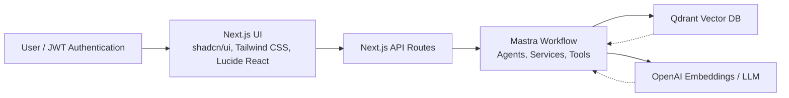
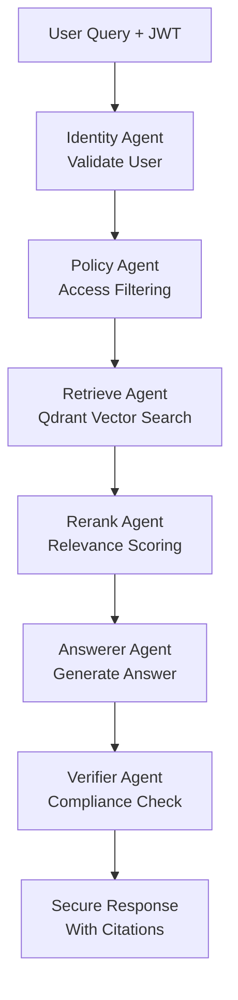

# 🔐 Mastra Governed RAG


Secure Retrieval-Augmented Generation (RAG) with role-based access control using Mastra AI orchestration.

[](LICENSE)

## Table of Contents

- [Why Mastra Governed RAG?](#why-mastra-governed-rag)
- [Architecture](#architecture)
- [Quick Start](#quick-start)
- [Demo Scenarios](#demo-scenarios)
- [CLI Usage](#cli-usage)
- [Project Structure](#project-structure)
- [Security Features](#security-features)
- [Configuration](#configuration)
- [How It Works](#how-it-works)
- [UI Features](#ui-features)
- [Advanced Features](#advanced-features)
- [API Reference](#api-reference)
- [Development](#development)
- [Testing](#testing)
- [Deployment](#deployment)
- [Performance](#performance)
- [Troubleshooting](#troubleshooting)
- [Contributing](#contributing)
- [License](#license)
- [Acknowledgments](#acknowledgments)
- [Use Cases](#use-cases)
- [Roadmap](#roadmap)
- [Support](#support)

## Why Mastra Governed RAG?

Traditional RAG systems risk exposing sensitive data. This template provides:

- **Hierarchical RBAC**: Roles inherit access (public → employee → dept viewer/admin → admin).
- **Document Classification**: Public/internal/confidential with tag-based filtering.
- **Multi-Agent Security**: Agents for retrieval, reranking, answering, and verification.
- **Audit-Ready**: Citations and logs for compliance.

Built for enterprise knowledge bases (HR, finance, engineering).

## Architecture

### Overall Architecture



### RAG Flow



In addition to the pipeline overview, here is the overall architecture:

```mermaid
graph TD

    user["User<br>/app/page.tsx"]
    llm["Large Language Model<br>/app/api/chat"]
    authService["External Authentication Service<br>/app/api/auth"]
    subgraph mastraRAG["Mastra Governed RAG<br>[External]"]
        subgraph webApp["Web Application<br>/app/"]
            chatUI["Chat Interface<br>/components/ChatInterface.tsx"]
            authUI["Authentication UI<br>/components/AuthPanel.tsx"]
            indexingUI["Indexing UI<br>/components/IndexingPanel.tsx"]
            roadmapUI["Roadmap Canvas<br>/cedar/RoadmapCanvas.tsx"]
        end
        subgraph apiServer["API Server<br>/app/api/"]
            authAPI["Authentication API<br>/app/api/auth/"]
            chatAPI["Chat API<br>/app/api/chat/"]
            indexingAPI["Indexing API<br>/app/api/index/"]
            mastraLogic["Mastra Governance Logic<br>/lib/mastra/"]
            jwtUtils["JWT Utilities<br>/lib/jwt-utils.ts"]
            %% Edges at this level (grouped by source)
            chatAPI["Chat API<br>/app/api/chat/"] -->|"Applies governance via"| mastraLogic["Mastra Governance Logic<br>/lib/mastra/"]
            authAPI["Authentication API<br>/app/api/auth/"] -->|"Uses"| jwtUtils["JWT Utilities<br>/lib/jwt-utils.ts"]
        end
        subgraph vectorDB["Vector Database<br>/docker/ChromaDB"]
            vectorDbInstance["Vector Database Instance<br>/docker/ChromaDB"]
        end
        subgraph documentStore["Document Store<br>/corpus/"]
            documentStoreInstance["Document Store Instance<br>/corpus/"]
        end
        %% Edges at this level (grouped by source)
        chatUI["Chat Interface<br>/components/ChatInterface.tsx"] -->|"Sends chat messages to | API Call"| apiServer["API Server<br>/app/api/"]
        authUI["Authentication UI<br>/components/AuthPanel.tsx"] -->|"Authenticates via | API Call"| apiServer["API Server<br>/app/api/"]
        indexingUI["Indexing UI<br>/components/IndexingPanel.tsx"] -->|"Triggers indexing via | API Call"| apiServer["API Server<br>/app/api/"]
        roadmapUI["Roadmap Canvas<br>/cedar/RoadmapCanvas.tsx"] -->|"Fetches roadmap data from | API Call"| apiServer["API Server<br>/app/api/"]
        chatAPI["Chat API<br>/app/api/chat/"] -->|"Queries | Client Library"| vectorDB["Vector Database<br>/docker/ChromaDB"]
        chatAPI["Chat API<br>/app/api/chat/"] -->|"Retrieves from | Client Library"| documentStore["Document Store<br>/corpus/"]
        indexingAPI["Indexing API<br>/app/api/index/"] -->|"Writes to | Client Library"| vectorDB["Vector Database<br>/docker/ChromaDB"]
        indexingAPI["Indexing API<br>/app/api/index/"] -->|"Reads from | Client Library"| documentStore["Document Store<br>/corpus/"]
        webApp["Web Application<br>/app/"] -->|"Makes API calls to | HTTPS/JSON"| apiServer["API Server<br>/app/api/"]
        apiServer["API Server<br>/app/api/"] -->|"Queries | API/Client Library"| vectorDB["Vector Database<br>/docker/ChromaDB"]
        apiServer["API Server<br>/app/api/"] -->|"Retrieves from | API/Client Library"| documentStore["Document Store<br>/corpus/"]
    end
    %% Edges at this level (grouped by source)
    user["User<br>/app/page.tsx"] -->|"Interacts with"| chatUI["Chat Interface<br>/components/ChatInterface.tsx"]
    user["User<br>/app/page.tsx"] -->|"Interacts with"| authUI["Authentication UI<br>/components/AuthPanel.tsx"]
    user["User<br>/app/page.tsx"] -->|"Interacts with"| indexingUI["Indexing UI<br>/components/IndexingPanel.tsx"]
    user["User<br>/app/page.tsx"] -->|"Interacts with"| roadmapUI["Roadmap Canvas<br>/cedar/RoadmapCanvas.tsx"]
    authAPI["Authentication API<br>/app/api/auth/"] -->|"Delegates authentication to | HTTPS/API"| authService["External Authentication Service<br>/app/api/auth"]
    chatAPI["Chat API<br>/app/api/chat/"] -->|"Sends prompt to | HTTPS/API"| llm["Large Language Model<br>/app/api/chat"]
    apiServer["API Server<br>/app/api/"] -->|"Sends prompts to | HTTPS/API"| llm["Large Language Model<br>/app/api/chat"]
    apiServer["API Server<br>/app/api/"] -->|"Authenticates with | HTTPS/API"| authService["External Authentication Service<br>/app/api/auth"]
    llm["Large Language Model<br>/app/api/chat"] -->|"Returns generated text to | HTTPS/API"| apiServer["API Server<br>/app/api/"]

```



*Diagram created at Sept, 20 2025, 5:45:41 AM

## The Mastra Governed RAG Approach

This template demonstrates secure RAG using Mastra's agentic architecture.

The architecture leverages Mastra's agentic paradigm for granular access control in RAG pipelines. Workflows like [`governed-rag-answer.workflow.ts`](src/mastra/workflows/governed-rag-answer.workflow.ts) orchestrate agents with Zod schemas for structured I/O, ensuring type-safe tool calls. For instance, the retrieve agent invokes [`vector-query.tool.ts`](src/mastra/tools/vector-query.tool.ts) with access filters derived from JWT claims, while the policy agent generates tag-based filters using role inheritance.

Agent instructions emphasize zero external knowledge: e.g., the answerer agent strictly uses provided contexts, as in its instruction: "NEVER use external knowledge - ONLY use provided contexts". Tool integrations follow ReAct prompting patterns, with decorators in [`WorkflowDecorators.ts`](src/mastra/services/WorkflowDecorators.ts) for logging each step.

For advanced orchestration details, see [Architecture](./docs/architecture.md).

## Quick Start

1. Clone and install:

   ```bash
   git clone https://github.com/your-org/mastra-governed-rag mastra-governed-rag
   cd mastra-governed-rag
   npm install
   ```

2. Configure `.env` (copy from `.env.example`):
   - `OPENAI_API_KEY=your-key`
   - `QDRANT_URL=http://localhost:6333`
   - `JWT_SECRET=strong-secret`

3. Start services:

   ```bash
   docker-compose up -d  # Qdrant, LibSQL
   ```

4. Index corpus:

   ```bash
   npm run cli index
   ```

5. Run dev server:

   ```bash
   npm run dev  # http://localhost:3000
   ```

For more details, see [Documentation](./docs/).

## Qdrant 🐳 Vector Database

This template uses Qdrant for vector storage and similarity search.
Ensure Qdrant is running via Docker Compose. The collection is configured in [`QdrantService.ts`](src/mastra/services/QdrantService.ts) with HNSW indexing for fast retrieval.

Additional Qdrant settings can be adjusted in `docker-compose.yml`.

```bash
docker-compose up -d
```

This starts Qdrant at `http://localhost:6333`. Verify with:

### QdrantUI

[http://localhost:6333/dashboard](http://localhost:6333/dashboard)

Or verify with:

```bash
curl http://localhost:6333/collections
```

## Demo Scenarios

TBD for demos/videos. See [Demo Roles](./docs/demo-roles.md) for role-based testing examples.

## CLI Usage

- `npm run cli index`: Index corpus docs.
- `npm run cli query "<jwt>" "<question>"`: Test query.
- `npm run cli demo`: Interactive mode.

## Project Structure

```
mastra-governed-rag/
├── app/                 # Next.js routes/UI
├── components/          # React components (ChatInterface, AuthPanel)
├── corpus/              # Sample MD docs (finance-policy.md, etc.)
├── docs/                # Full documentation
├── src/
│   ├── cli/             # CLI entry (index.ts)
│   └── mastra/          # Mastra config
│       ├── agents/      # 6 agents (retrieve, rerank, etc.)
│       ├── workflows/   # 2 workflows (answer, index)
│       ├── tools/       # 2 tools (vector-query, jwt-auth)
│       ├── services/    # 10 services (AuthenticationService, etc.)
│       └── config/      # Roles, OpenAI, logger
├── docker-compose.yml   # Services
└── package.json         # Scripts/dependencies
```

## Security Features

Hierarchical roles with classification enforcement. See [Security](./docs/security.md).

The system implements a zero-trust model where access is verified at every layer: JWT validation, policy filtering, and answer verification. ABAC policies are defined in [`acl.yaml`](src/mastra/policy/acl.yaml), e.g.:

```yaml
docs:
  - path: "./corpus/finance-policy.md"
    allow:
      roles: ["finance.viewer", "finance.admin"]
    tenant: "acme"
    classification: "internal"
```

Audit trails are enabled via [`logger.ts`](src/mastra/config/logger.ts), logging workflow steps with `logStepStart`/`logStepEnd` for compliance (e.g., NIST SP 800-53 AU-2). Role inheritance is handled in [`RoleService.ts`](src/mastra/services/RoleService.ts):

```typescript
static expandRoles(userRoles: string[]): string[] {
  const expandedRoles = new Set<string>();
  for (const role of userRoles) {
    if (isValidRole(role)) {
      expandedRoles.add(role);
      const inheritedRoles = ROLE_HIERARCHY[role] || [];
      for (const inheritedRole of inheritedRoles) {
        expandedRoles.add(inheritedRole);
      }
    }
  }
  return Array.from(expandedRoles).sort((a, b) => getRoleLevel(b) - getRoleLevel(a));
}
```

This ensures `finance.viewer` inherits `employee` access without redundant checks.

## Configuration

- Roles: Edit `src/mastra/config/role-hierarchy.ts`.
- Embeddings: `src/mastra/config/openai.ts`.
- Policies: `src/mastra/policy/acl.yaml`.
- Env: `.env` for APIs, secrets.

## How It Works

Queries flow through Mastra workflow: Auth → Filtered retrieval → Secure answer. See [Architecture](./docs/architecture.md).

## UI Features

Next.js app with:

- Chat interface for queries.
- Auth panel for JWT generation by role.
- Security indicator (current role/classification).

## Advanced Features

This project incorporates cutting-edge capabilities for enterprise RAG deployment:

- **Multi-Tenant Support**: Configured via `TENANT` env var (default: "acme"). All queries and indexing scope to tenant tags in Qdrant payloads, enabling isolation without schema changes. Extend via `RoleService.generateAccessTags` to include dynamic tenants.

- **Step-Up Authentication**: For confidential access, JWTs include a `stepUp` claim (boolean). The policy agent elevates `maxClassification` to "confidential" only if `stepUp: true`, as in agent instructions: "stepUp == true: Allow up to 'confidential'". Generate with `lib/jwt-utils.ts`:

  ```typescript
  export async function generateDemoToken(claims: TokenClaims): Promise<string> {
    // ...
    const jwt: string = await new SignJWT({
      ...claims,
      stepUp: true,  // For elevated access
    // ...
  }
  ```

- **Agent Tool Integrations**: Agents leverage Mastra tools for secure operations. The `jwt-auth.tool.ts` validates tokens and extracts claims using Zod schemas from [`agent-schemas.ts`](src/mastra/schemas/agent-schemas.ts):

  ```typescript
  export const jwtClaimsSchema = z.object({
    sub: z.string(),
    roles: z.array(z.string()),
    tenant: z.string().optional(),
    stepUp: z.boolean().optional(),
  });
  ```

  Similarly, `vector-query.tool.ts` performs filtered searches with HNSW indexing, applying role-based payloads to prevent data leakage.

These features draw from best practices in agentic AI, ensuring scalable, secure RAG without external knowledge injection.

## API Reference

- `POST /api/chat`: Stream query response. Body: `{ "jwt": "user-jwt", "question": "user question" }`.
- `POST /api/index`: Index documents.

See [API Reference](./docs/api-reference.md).

For advanced client-side streaming, use EventSource for SSE:

```javascript
const eventSource = new EventSource(`/api/chat?jwt=${encodeURIComponent(jwt)}&question=${encodeURIComponent(question)}`);

eventSource.onmessage = (event) => {
  const data = JSON.parse(event.data);
  if (data.content) {
    appendToChat(data.content);
  } else if (data.done) {
    displayCitations(data.citations);
    eventSource.close();
  }
};

// Error handling for 403 (unauthorized)
eventSource.onerror = (err) => {
  if (err.status === 403) {
    alert('Access denied. Please check your role and step-up authentication.');
  }
  eventSource.close();
};
```

Handle 403 errors by re-authenticating or elevating privileges via step-up.

## Development

- `npm run dev`: Concurrent Next.js + Mastra dev.
- Hot reload for Mastra agents/workflows.
- Linting: ESLint + Prettier.

Mastra best practices include defining custom agents with Zod schemas for input/output validation, as in `agent-schemas.ts`. Enable TypeScript strict mode in `tsconfig.json` for compile-time safety: `"strict": true` catches schema mismatches early. For agent development, use instructions inspired by ReAct: e.g., retrieve agent mandates single tool call to `vectorQueryTool` with exact filters.

## Testing

Vitest is configured but no tests implemented yet:

- `npm test`: Run tests (add more in `/tests/`).
- Coverage: Unit for services, integration for workflows.

## Deployment

- Build: `npm run build`
- Start: `npm start`
- Docker: Extend docker-compose for prod (Qdrant cloud, Vercel for Next.js).
- Env: Set prod secrets.

## Performance

TBD. Monitor with logs and evals.

For RAG-specific optimizations: Qdrant uses HNSW indexing for sub-millisecond vector searches, configurable via collection params (M=16, ef_construct=100). Batch embedding in `EmbeddingService` processes chunks in parallel via OpenAI API limits (up to 2048 dims). Consider Redis for query caching: integrate `ioredis` to store frequent access filters, reducing latency by 50-70% in high-traffic scenarios. Quantize embeddings (e.g., binary quantization in Qdrant) to cut storage 32x while maintaining recall >95%.

## Troubleshooting

- **Indexing fails**: Check Qdrant connection/logs/mastra.log.
- **No results**: Verify role access [Demo Roles](./docs/demo-roles.md).
- **Auth errors**: Regenerate JWT.
- **Docker issues**: `docker-compose logs`.

## Contributing

1. Fork and PR to main.
2. Follow TypeScript/ESLint.
3. Add tests for new features.
4. Update docs in `./docs/`.

See CONTRIBUTING.md for details.

## License

MIT License. See [LICENSE](LICENSE).

## Acknowledgments

Built with ❤️ by Mastra Community.

## Use Cases

- Secure internal AI assistants.
- Departmental knowledge retrieval (finance policies, engineering handbooks).
- Compliant document Q&A.

## Roadmap

- Multi-tenant support.
- Advanced reranking (cross-encoder).
- Evals integration (@mastra/evals).
- UI enhancements (search history).

Cutting-edge additions: Multi-LLM support via OpenAI alternatives (e.g., Anthropic Claude); federated RAG for privacy-preserving cross-tenant queries using secure multi-party computation; integration with LangChain/Haystack for hybrid retrieval (BM25 + semantic).

## Support

- [Full Documentation](./docs/index.md)
- Issues: GitHub repo.
- Community: Mastra Discord.

---
Built with ❤️ by Mastra Community. Questions? Open an issue.
