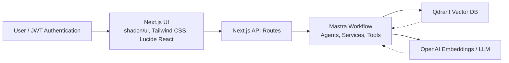
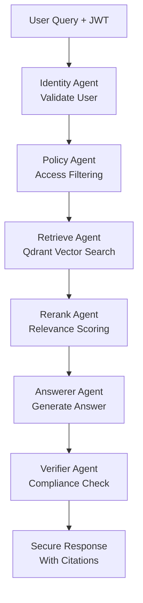

# 🔐 Mastra Governed RAG


Secure Retrieval-Augmented Generation (RAG) with role-based access control using Mastra AI orchestration.

[](LICENSE)

## Overview

Traditional RAG systems risk exposing sensitive data. This template provides enterprise-grade security with **hierarchical RBAC**, **document classification**, and **multi-agent security pipelines** to ensure users only access authorized corporate knowledge.

### Key Features

- **Hierarchical RBAC**: Roles inherit access (public → employee → dept viewer/admin → admin)
- **Document Classification**: Public/internal/confidential with tag-based filtering
- **Multi-Agent Security**: Agents for retrieval, reranking, answering, and verification
- **Audit-Ready**: Citations and logs for compliance
- **Step-Up Authentication**: Elevated access for confidential content

### Architecture



**RAG Security Pipeline:**



## Getting Started

### Prerequisites

- Node.js >=20.9.0
- Docker and Docker Compose
- Git
- OpenAI API key

### Quick Setup

1. **Clone and install:**

   ```bash
   git clone https://github.com/ssdeanx/governed-rag-ai.git
   cd mastra-governed-rag
   npm install
   ```

2. **Configure environment:**

   ```bash
   cp .env.example .env
   # Edit .env with your OpenAI API key and other settings
   ```

3. **Start services:**

   ```bash
   docker-compose up -d  # Qdrant vector database
   ```

4. **Index documents:**

   ```bash
   npm run cli index
   ```

5. **Start development:**

   ```bash
   npm run dev  # http://localhost:3000
   ```

> [!TIP]
> For detailed setup instructions, see the [Quick Start Guide](./docs/quick-start.md).

## Features

### Security & Governance

- **Role-Based Access Control**: Hierarchical permissions with inheritance
- **Document Classification**: Public, internal, and confidential content levels
- **Step-Up Authentication**: Elevated access for sensitive operations
- **Audit Logging**: Comprehensive security event tracking
- **Zero-Trust Architecture**: Security validation at every pipeline stage

### AI & RAG Capabilities

- **Multi-Agent Orchestration**: Specialized agents for different RAG stages
- **Secure Vector Search**: Filtered retrieval based on user permissions
- **Contextual Reranking**: Relevance scoring with security constraints
- **Citation Generation**: Source attribution with access verification
- **Streaming Responses**: Real-time answer generation with SSE

### Developer Experience

- **Type-Safe Development**: Full TypeScript with Zod schema validation
- **Hot Reload**: Concurrent development for frontend and backend
- **Comprehensive Testing**: Vitest framework with service and workflow tests
- **Docker Integration**: Containerized development environment
- **Extensive Documentation**: Complete API references and guides

## Project Structure

```bash
mastra-governed-rag/
├── app/                    # Next.js routes and API endpoints
├── components/             # React UI components
├── cedar/                  # Cedar OS interactive components
├── corpus/                 # Sample documents for indexing
├── docs/                   # Comprehensive documentation
├── src/
│   ├── mastra/            # Core Mastra implementation
│   │   ├── agents/        # AI agents (identity, policy, retrieve, etc.)
│   │   ├── workflows/     # Orchestrated agent workflows
│   │   ├── tools/         # Reusable agent tools
│   │   ├── services/      # Business logic and integrations
│   │   └── config/        # Configuration and role hierarchy
│   └── cli/               # Command-line interface
├── lib/                    # Shared utilities and client libraries
└── docker-compose.yml     # Development services
```

## Usage Examples

### Basic Query with Authentication

```typescript
// Generate JWT for a finance viewer
const jwt = generateDemoJWT('finance');

// Query the system
const response = await fetch('/api/chat', {
  method: 'POST',
  headers: { 'Content-Type': 'application/json' },
  body: JSON.stringify({
    jwt,
    question: 'What is the expense reimbursement policy?'
  })
});

const result = await response.json();
// Returns secure answer with citations
```

### Role-Based Access Demonstration

```bash
# Test different user roles
npm run cli query "$(npm run jwt:finance)" "What are expense approval thresholds?"
npm run cli query "$(npm run jwt:hr)" "What is executive compensation policy?"
npm run cli query "$(npm run jwt:public)" "What is our company mission?"
```

> [!NOTE]
> Each role sees different results based on their access level. See [Demo Roles](./docs/demo-roles.md) for complete examples.

## API Reference

### Core Endpoints

- `POST /api/chat` - Secure RAG queries with streaming responses
- `POST /api/index` - Document indexing with classification
- `GET /api/auth/*` - Authentication endpoints

### Request/Response Format

```typescript
// Chat request
{
  "jwt": "eyJhbGciOiJIUzI1NiIs...",
  "question": "What is the company policy on X?"
}

// Streaming response
data: {"content": "According to the policy..."}
data: {"done": true, "citations": [...]}
```

For complete API documentation, see [API Reference](./docs/api-reference.md).

## Development

### Local Development

```bash
# Start all services
npm run dev  # Frontend + Mastra backend

# Individual services
npm run dev:next   # Next.js only
npm run dev:mastra # Mastra only
```

### Testing

```bash
# Run all tests
npm test

# CLI operations
npm run cli index    # Index documents
npm run cli query    # Test queries
npm run cli demo     # Interactive demo
```

### Code Quality

```bash
# Linting and formatting
npm run lint
npm run pretty
```

## Deployment

### Docker Deployment

```bash
# Build and run
docker-compose up -d
```

### Production Considerations

- Configure production environment variables
- Set up proper JWT secrets
- Enable audit logging
- Configure Qdrant for production scale

## Security Model

### Role Hierarchy

```text
admin (100) > dept_admin (80) > dept_viewer (60) > employee (40) > public (10)
```

### Document Classifications

- **Public**: General information accessible to all
- **Internal**: Department-specific content for employees
- **Confidential**: Highly sensitive data requiring elevated access

### Access Control

Policies are defined in `src/mastra/policy/acl.yaml`:

```yaml
docs:
  - path: "./corpus/finance-policy.md"
    allow:
      roles: ["finance.viewer", "finance.admin"]
    classification: "internal"
```

## Resources

- [Full Documentation](./docs/index.md)
- [Architecture Guide](./docs/architecture.md)
- [Security Implementation](./docs/security.md)
- [API Reference](./docs/api-reference.md)
- [Mastra Framework](https://mastra.ai)
- [Qdrant Documentation](https://qdrant.tech/documentation/)

## Troubleshooting

### Common Issues

#### Qdrant Connection Failed

```bash
# Check Qdrant status
curl http://localhost:6333/health

# Restart services
docker-compose down && docker-compose up -d
```

#### Authentication Errors

```bash
# Regenerate JWT tokens
npm run jwt:finance  # or other roles
```

#### No Search Results

- Verify document indexing: `npm run cli index`
- Check user role permissions
- Review Qdrant collection status

For detailed troubleshooting, see [Troubleshooting Guide](./docs/troubleshooting.md).

## Roadmap

- Multi-tenant support
- Advanced reranking algorithms
- Integration with additional LLM providers
- Enhanced audit and compliance features
- Performance optimizations for large document sets

---

Built with ❤️ using [Mastra](https://mastra.ai) • [Next.js](https://nextjs.org) • [Qdrant](https://qdrant.tech)

## Contributing

We welcome contributions! Please see our [Contributing Guide](./CONTRIBUTING.md) for details.

## License

This project is licensed under the MIT License - see the [LICENSE](./LICENSE) file for details.

---
Built with ❤️ by Mastra Community. Questions? Open an issue.


