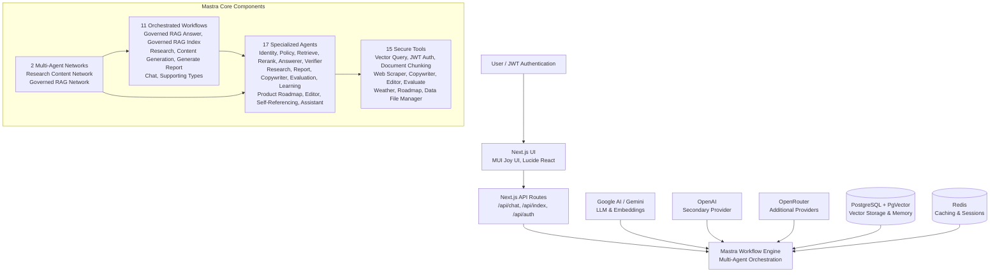
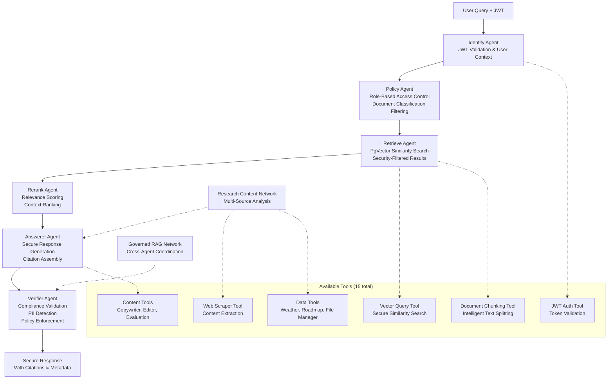

# 🔐 Mastra Governed RAG


Secure Retrieval-Augmented Generation (RAG) with role-based access control using Mastra AI orchestration.

[](LICENSE)

## Overview

Traditional RAG systems risk exposing sensitive data. This template provides enterprise-grade security with **hierarchical RBAC**, **document classification**, and **multi-agent security pipelines** to ensure users only access authorized corporate knowledge.

### Key Features

- **Hierarchical RBAC**: Roles inherit access (public → employee → dept viewer/admin → admin)
- **Document Classification**: Public/internal/confidential with tag-based filtering
- **Multi-Agent Security**: Agents for retrieval, reranking, answering, and verification
- **Audit-Ready**: Citations and logs for compliance
- **Step-Up Authentication**: Elevated access for confidential content

### Architecture



**Detailed RAG Security Pipeline:**



## Getting Started

### Prerequisites

- Node.js >=20.9.0
- Docker and Docker Compose
- Git
- OpenAI API key

### Quick Setup

1. **Clone and install:**

    ```bash
    git clone https://github.com/ssdeanx/governed-rag-ai.git
    cd mastra-governed-rag
    npm install
    ```

2. **Configure environment:**

    ```bash
    cp .env.example .env
    # Edit .env with your OpenAI API key and other settings
    ```

3. **Set up authentication (Supabase):**

    This application uses Supabase for user authentication. You need to:

    a. **Create a Supabase project** at [https://supabase.com/dashboard](https://supabase.com/dashboard)

    b. **Get your credentials** from Project Settings:
       - `SUPABASE_URL` - Your project URL (e.g., `https://xxxxx.supabase.co`)
       - `SUPABASE_ANON_KEY` - Your anon/public key

    c. **Update your `.env` file** with Supabase credentials:
       ```bash
       SUPABASE_URL="https://your-project.supabase.co"
       SUPABASE_ANON_KEY="your_anon_key_here"
       NEXT_PUBLIC_SUPABASE_URL="https://your-project.supabase.co"
       NEXT_PUBLIC_SUPABASE_ANON_KEY="your_anon_key_here"
       ```

    d. **Configure GitHub OAuth** (optional):
       - In Supabase Dashboard: Authentication > Providers > GitHub
       - Add your GitHub OAuth app credentials
       - Callback URL: `https://your-project.supabase.co/auth/v1/callback`
       - Update `.env` with `GITHUB_CLIENT_ID` and `GITHUB_CLIENT_SECRET`

    📖 **See [docs/AUTH_ARCHITECTURE.md](docs/AUTH_ARCHITECTURE.md) for detailed authentication documentation.**

4. **Start database (optional):**

    ```bash
    # Only needed if using local PostgreSQL
    docker-compose up -d db
    ```

5. **Index documents:**

    ```bash
    npm run cli index
    ```

6. **Start development:**

    ```bash
    npm run dev  # http://localhost:3000
    ```

### AI & RAG Capabilities

- **Multi-Agent Orchestration**: Specialized agents for different RAG stages
- **Secure Vector Search**: Filtered retrieval based on user permissions
- **Contextual Reranking**: Relevance scoring with security constraints
- **Citation Generation**: Source attribution with access verification
- **Streaming Responses**: Real-time answer generation with SSE

## AI Agents

This system employs a comprehensive multi-agent architecture with 17 specialized agents:

### Core RAG Agents

- **Identity Agent** - Validates user authentication and permissions
- **Policy Agent** - Enforces access control and security policies
- **Retrieve Agent** - Performs intelligent document retrieval with security filtering
- **Rerank Agent** - Ranks and scores retrieved documents for relevance
- **Answerer Agent** - Generates secure responses with citations
- **Verifier Agent** - Validates responses for compliance and accuracy

### Specialized Agents

- **Research Agent** - Conducts in-depth research and analysis
- **Report Agent** - Generates structured reports and summaries
- **Copywriter Agent** - Creates marketing and communication content
- **Evaluation Agent** - Assesses content quality and relevance
- **Learning Extraction Agent** - Identifies and extracts key learnings
- **Product Roadmap Agent** - Analyzes product strategy and roadmaps
- **Editor Agent** - Reviews and improves content quality
- **Self-Referencing Agent** - Maintains context across conversations
- **Assistant Agent** - Provides general AI assistance
- **Starter Agent** - Handles initial query processing

### Network Agents

- **Research Content Network** - Orchestrates multi-agent research workflows
- **Governed RAG Network** - Manages secure RAG operations across agents

Each agent follows a single-tool-call policy, ensuring predictable and auditable AI behavior while maintaining security governance throughout the entire pipeline.

## AI Tools

The system includes 15 specialized tools that agents can invoke to perform specific operations:

### Core RAG Tools

- **Vector Query Tool** - Performs secure vector similarity searches with access filtering
- **JWT Auth Tool** - Validates and processes JWT tokens for user authentication
- **Document Chunking Tool** - Intelligently splits documents into manageable chunks for indexing
- **Graph RAG Query Tool** - Executes complex graph-based retrieval augmented generation queries

### Content & Analysis Tools

- **Copywriter Agent Tool** - Generates marketing and communication content
- **Editor Agent Tool** - Reviews and improves content quality and clarity
- **Evaluate Result Tool** - Assesses the quality and relevance of generated content
- **Extract Learnings Tool** - Identifies and extracts key insights and learnings
- **Starter Agent Tool** - Handles initial query processing and routing

### Research & Data Tools

- **Web Scraper Tool** - Extracts and processes web content for research
- **Weather Tool** - Provides weather data and forecasting capabilities
- **Roadmap Tool** - Analyzes product strategy and roadmap information
- **Data File Manager** - Manages file operations and data processing tasks

### Core RAG Workflows

- **Governed RAG Answer Workflow** - Main workflow for secure question answering with citations
- **Governed RAG Index Workflow** - Handles document indexing with classification and security tagging
- **Chat Workflow** - Manages conversational interactions with context preservation

### Specialized Workflows

- **Research Workflow** - Conducts comprehensive research operations across multiple sources
- **Content Generation Workflow** - Creates various types of content using multiple agents
- **Generate Report Workflow** - Produces structured reports and analytical summaries

### Supporting Workflows

- **Chat Workflow Types** - Type definitions and utilities for chat operations
- **Chat Workflow Shared Types** - Common types and interfaces for workflow communication

All workflows implement comprehensive error handling, tracing, and security validation at each step, ensuring reliable and auditable AI operations.

- **Type-Safe Development**: Full TypeScript with Zod schema validation
- **Hot Reload**: Concurrent development for frontend and backend
- **Comprehensive Testing**: Vitest framework with service and workflow tests
- **Docker Integration**: Containerized development environment
- **Extensive Documentation**: Complete API references and guides

## Project Structure

```bash
mastra-governed-rag/
├── app/                    # Next.js routes and API endpoints
├── components/             # React UI components
├── cedar/                  # Cedar OS interactive components
├── corpus/                 # Sample documents for indexing
├── docs/                   # Comprehensive documentation
├── src/
│   ├── mastra/            # Core Mastra implementation
│   │   ├── agents/        # AI agents (identity, policy, retrieve, etc.)
│   │   ├── workflows/     # Orchestrated agent workflows
│   │   ├── tools/         # Reusable agent tools
│   │   ├── services/      # Business logic and integrations
│   │   ├── networks/      # Multi-agent orchestration networks
│   │   ├── schemas/       # Data validation schemas
│   │   ├── config/        # Configuration and role hierarchy
│   │   └── policy/        # Access control policies
│   └── cli/               # Command-line interface
├── lib/                    # Shared utilities and client libraries
└── docker-compose.yml     # Development services
```

## Usage Examples

### Basic Query with Authentication

```typescript
// Generate JWT for a finance viewer
const jwt = generateDemoJWT('finance')

// Query the system
const response = await fetch('/api/chat', {
    method: 'POST',
    headers: { 'Content-Type': 'application/json' },
    body: JSON.stringify({
        jwt,
        question: 'What is the expense reimbursement policy?',
    }),
})

const result = await response.json()
// Returns secure answer with citations
```

### Role-Based Access Demonstration

```bash
# Test different user roles
npm run cli query "$(npm run jwt:finance)" "What are expense approval thresholds?"
npm run cli query "$(npm run jwt:hr)" "What is executive compensation policy?"
npm run cli query "$(npm run jwt:public)" "What is our company mission?"
```

> [!NOTE]
> Each role sees different results based on their access level. See [Demo Roles](./docs/demo-roles.md) for complete examples.

## API Reference

### Core Endpoints

- `POST /api/chat` - Secure RAG queries with streaming responses
- `POST /api/index` - Document indexing with classification
- `GET /api/auth/*` - Authentication endpoints

### Request/Response Format

```typescript
// Chat request
{
  "jwt": "eyJhbGciOiJIUzI1NiIs...",
  "question": "What is the company policy on X?"
}

// Streaming response
data: {"content": "According to the policy..."}
data: {"done": true, "citations": [...]}
```

For complete API documentation, see [API Reference](./docs/api-reference.md).

## Development

### Local Development

```bash
# Start all services
npm run dev  # Frontend + Mastra backend

# Individual services
npm run dev:next   # Next.js only
npm run dev:mastra # Mastra only
```

### Testing

```bash
# Run all tests
npm test

# CLI operations
npm run cli index    # Index documents
npm run cli query    # Test queries
npm run cli demo     # Interactive demo
```

### Code Quality

```bash
# Linting and formatting
npm run lint
npm run pretty
```

## Deployment

### Docker Deployment

```bash
# Build and run
docker-compose up -d
```

### Production Considerations

- Configure production environment variables
- Set up proper JWT secrets
- Enable audit logging
- Configure PostgreSQL + PgVector for production scale

## Security Model

### Role Hierarchy

```text
admin (100) > dept_admin (80) > dept_viewer (60) > employee (40) > public (10)
```

### Document Classifications

- **Public**: General information accessible to all
- **Internal**: Department-specific content for employees
- **Confidential**: Highly sensitive data requiring elevated access

### Access Control

Policies are defined in `src/mastra/policy/acl.yaml`:

```yaml
docs:
    - path: './corpus/finance-policy.md'
      allow:
          roles: ['finance.viewer', 'finance.admin']
      classification: 'internal'
```

## Resources

- [Full Documentation](./docs/index.md)
- [Architecture Guide](./docs/architecture.md)
- [Security Implementation](./docs/security.md)
- [API Reference](./docs/api-reference.md)
- [Mastra Framework](https://mastra.ai)
- [PostgreSQL Documentation](https://www.postgresql.org/docs/)

## Troubleshooting

### Common Issues

#### PostgreSQL Connection Failed

```bash
# Check PostgreSQL status
docker-compose ps

# Check logs
docker-compose logs db

# Restart database
docker-compose down && docker-compose up -d
```

#### Authentication Errors

```bash
# Regenerate JWT tokens
npm run jwt:finance  # or other roles
```

#### No Search Results

- Verify document indexing: `npm run cli index`
- Check user role permissions
- Review PgVector collection status

For detailed troubleshooting, see [Troubleshooting Guide](./docs/troubleshooting.md).

## Roadmap

- Multi-tenant support
- Advanced reranking algorithms
- Integration with additional LLM providers
- Enhanced audit and compliance features
- Performance optimizations for large document sets

---

Built with ❤️ using [Mastra](https://mastra.ai) • [Next.js](https://nextjs.org) • [PostgreSQL](https://postgresql.org)

## Contributing

We welcome contributions! Please see our [Contributing Guide](./CONTRIBUTING.md) for details.

## License

This project is licensed under the MIT License - see the [LICENSE](./LICENSE) file for details.

---

Built with ❤️ by Mastra Community. Questions? Open an issue.
