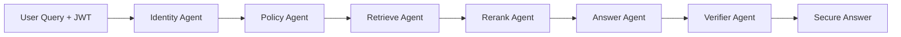

# 🔐 Mastra Governed RAG Template

[](https://nodejs.org/)
[](https://www.typescriptlang.org/)
[](https://nextjs.org/)
[](https://mastra.ai/)
[](LICENSE)

A production-ready template for building **secure, governed RAG (Retrieval-Augmented Generation) applications** using Mastra's multi-agent orchestration framework. This template demonstrates enterprise-grade access control, document classification, and policy enforcement in AI applications.

## 📋 Table of Contents

- [Why Governed RAG?](#-why-governed-rag)
- [Architecture](#-architecture)
- [Quick Start](#-quick-start)
- [Demo Scenarios](#-demo-scenarios)
- [CLI Usage](#-cli-usage)
- [Project Structure](#-project-structure)
- [Security Features](#-security-features)
- [Configuration](#-configuration)
- [How It Works](#-how-it-works)
- [UI Features](#-ui-features)
- [API Reference](#-api-reference)
- [Development](#-development)
- [Testing](#-testing)
- [Deployment](#-deployment)
- [Performance](#-performance)
- [Troubleshooting](#-troubleshooting)
- [Contributing](#-contributing)
- [License](#-license)

## 🎯 Why Governed RAG?

Traditional RAG systems retrieve and use any available document to answer questions. In enterprise settings, this is a **critical security risk**. Our Governed RAG solution ensures:

- 🛡️ **Role-Based Access Control**: Users only see documents they're authorized to access
- 🏷️ **Document Classification**: Automatic enforcement of public/internal/confidential classifications
- 👤 **Identity Verification**: JWT-based authentication with claims validation
- 🔍 **Security-First Retrieval**: Filters applied at the vector database level, not post-retrieval
- ✅ **Answer Verification**: Multi-agent validation ensures no data leakage

## 🏗️ Architecture



### Multi-Agent Pipeline

1. **Identity Agent**: Validates JWT and extracts user claims (roles, tenant, clearance)
2. **Policy Agent**: Converts claims into access filters based on security policies
3. **Retrieve Agent**: Queries vector database with security filters applied
4. **Rerank Agent**: Orders retrieved contexts by relevance
5. **Answer Agent**: Generates response using ONLY authorized contexts
6. **Verifier Agent**: Validates answer hasn't leaked unauthorized information

## 🚀 Quick Start

### Prerequisites

- Node.js 20+
- Docker & Docker Compose
- OpenAI API key

### Setup

1. **Clone the repository**
```bash
git clone <repo-url>
cd mastra-governed-rag-template
npm install
```

2. **Configure environment**
```bash
cp .env.example .env
```

Edit `.env` with your configuration:
```env
# Required
OPENAI_API_KEY=your_openai_api_key_here
JWT_SECRET=your_jwt_secret_here

# Optional - customize as needed
OPENAI_MODEL=gpt-4o-mini
EMBEDDING_MODEL=text-embedding-3-small
QDRANT_URL=http://localhost:6333
QDRANT_COLLECTION=governed_rag
TENANT=acme
```

3. **Start Qdrant vector database**
```bash
docker-compose up -d
```

4. **Verify services are running**
```bash
# Check Qdrant health
curl http://localhost:6333/health

# Check Docker containers
docker ps
```

5. **Index sample documents**
```bash
npm run build-cli
npm run cli index
```

6. **Start the development server**
```bash
npm run dev
# Visit http://localhost:3000
```

## 🎮 Demo Scenarios

### Scenario 1: Finance Employee
```javascript
// JWT Claims: { roles: ["finance.viewer"], tenant: "acme" }
// Can access: Finance policies, public documents
// Cannot access: HR confidential data, engineering details
```

### Scenario 2: Engineering Manager
```javascript
// JWT Claims: { roles: ["engineering.admin"], tenant: "acme" }
// Can access: Engineering handbook, public documents
// Cannot access: Finance policies, HR confidential data
```

### Scenario 3: HR Admin with Step-Up Auth
```javascript
// JWT Claims: { roles: ["hr.admin"], tenant: "acme", stepUp: true }
// Can access: ALL documents including confidential
// Step-up authentication enables confidential access
```

## 🔧 CLI Usage

The template includes a powerful CLI for managing your governed RAG system:

```bash
# Index documents with security tags
npm run cli index

# Query with JWT authentication
npm run cli query "<jwt-token>" "What is the expense policy?"

# Run interactive demo
npm run cli demo

# Show help
npm run cli help
```

## 📁 Project Structure

```
├── src/
│   ├── mastra/
│   │   ├── agents/         # AI agents with specific responsibilities
│   │   ├── tools/          # JWT auth and vector query tools
│   │   ├── workflows/      # Orchestrated pipelines
│   │   ├── schemas/        # Zod validation schemas
│   │   └── config/         # OpenAI and logger configuration
│   ├── app/               # Next.js application
│   └── cli/               # Command-line interface
├── corpus/                # Sample documents with classifications
├── docker-compose.yml     # Qdrant vector database setup
└── .env.example          # Environment configuration template
```

## 🔐 Security Features

### Document Classification
- **Public**: Accessible to all authenticated users
- **Internal**: Requires specific department roles
- **Confidential**: Requires admin role + step-up authentication

### Access Control Tags
- `role:*` - Role-based access (e.g., `role:finance.viewer`)
- `tenant:*` - Multi-tenant isolation (e.g., `tenant:acme`)
- `classification:*` - Document sensitivity level

### JWT Token Structure
```json
{
  "sub": "user@example.com",
  "roles": ["finance.viewer", "engineering.admin"],
  "tenant": "acme",
  "stepUp": false,
  "exp": 1234567890
}
```

## 🛠️ Configuration

### Environment Variables

| Variable | Description | Default |
|----------|-------------|---------|
| `OPENAI_API_KEY` | OpenAI API key | Required |
| `OPENAI_MODEL` | LLM model to use | `gpt-4o-mini` |
| `EMBEDDING_MODEL` | Embedding model | `text-embedding-3-small` |
| `QDRANT_URL` | Qdrant database URL | `http://localhost:6333` |
| `QDRANT_COLLECTION` | Collection name | `governed_rag` |
| `JWT_SECRET` | JWT signing secret | Required |
| `TENANT` | Default tenant ID | `acme` |

## 📊 How It Works

### 1. Document Indexing
Documents are chunked and embedded with security metadata:
```typescript
{
  text: "Expense reports must be submitted within 30 days",
  docId: "finance-policy-001",
  securityTags: ["role:finance.viewer", "tenant:acme", "classification:internal"],
  classification: "internal"
}
```

### 2. Query Processing
When a user queries the system:
1. JWT is verified and claims extracted
2. Claims are converted to security filters
3. Vector search applies filters at database level
4. Only authorized documents are retrieved
5. Answer is generated from filtered contexts
6. Final verification ensures no data leakage

### 3. Security Enforcement
Security is enforced at multiple levels:
- **Database Level**: Qdrant filters prevent unauthorized retrieval
- **Agent Level**: Each agent validates and enforces policies
- **Answer Level**: Verifier ensures response compliance

## 🎨 UI Features

- **Modern Dark Theme**: Clean, professional interface
- **Real-time Streaming**: See answers generated in real-time
- **Security Badges**: Visual indicators for document classification
- **Role Selector**: Demo different access levels easily
- **Citation Display**: Transparent source attribution
- **JWT Authentication**: Built-in token management and role switching
- **Responsive Design**: Works on desktop and mobile devices

## 📚 API Reference

### Chat API

**POST** `/api/chat`

Processes a user query through the governed RAG pipeline.

#### Request Body
```json
{
  "message": "What is the expense policy?",
  "jwt": "eyJhbGciOiJIUzI1NiIsInR5cCI6IkpXVCJ9..."
}
```

#### Response
```json
{
  "message": "The expense policy requires...",
  "citations": [
    {
      "docId": "finance-policy-001",
      "source": "finance-policy.md"
    }
  ]
}
```

#### Status Codes
- `200` - Successful response
- `401` - Invalid or missing JWT
- `403` - Insufficient permissions
- `500` - Internal server error

### Indexing API

**POST** `/api/index`

Indexes documents into the vector database with security metadata.

#### Request Body
```json
{
  "documents": [
    {
      "content": "Document content here...",
      "metadata": {
        "docId": "doc-001",
        "source": "example.md",
        "classification": "internal",
        "securityTags": ["role:finance.viewer", "tenant:acme"]
      }
    }
  ]
}
```

#### Response
```json
{
  "indexed": 1,
  "skipped": 0,
  "errors": []
}
```

## 🛠️ Development

### Code Style

The project uses TypeScript with strict mode enabled. Follow these guidelines:

- Use explicit types, avoid `any`
- Prefer interfaces over types for object shapes
- Use Zod schemas for runtime validation
- Follow existing naming conventions

### Adding New Agents

1. Create agent file in `src/mastra/agents/`
2. Define input/output schemas
3. Implement agent logic with tools
4. Add to workflow in `src/mastra/workflows/`
5. Update tests

Example agent structure:
```typescript
import { createAgent } from "@mastra/core";
import { z } from "zod";

export const myAgentSchema = z.object({
  input: z.string(),
  output: z.string()
});

export const myAgent = createAgent({
  name: "myAgent",
  instructions: "Your agent instructions here",
  model: {
    provider: "openai",
    name: "gpt-4o-mini"
  }
});
```

### Environment Variables

| Variable | Required | Default | Description |
|----------|----------|---------|-------------|
| `OPENAI_API_KEY` | ✅ | - | OpenAI API key |
| `OPENAI_BASE_URL` | ❌ | `https://api.openai.com/v1` | Custom API endpoint |
| `OPENAI_MODEL` | ❌ | `gpt-4o-mini` | LLM model name |
| `EMBEDDING_MODEL` | ❌ | `text-embedding-3-small` | Embedding model |
| `QDRANT_URL` | ❌ | `http://localhost:6333` | Qdrant database URL |
| `QDRANT_COLLECTION` | ❌ | `governed_rag` | Vector collection name |
| `JWT_SECRET` | ✅ | - | JWT signing secret |
| `TENANT` | ❌ | `acme` | Default tenant ID |
| `LOG_LEVEL` | ❌ | `info` | Logging level |

## 🧪 Testing

### Running Tests

Currently, the project doesn't include automated tests. To add testing:

1. **Install testing dependencies**
```bash
npm install --save-dev jest @types/jest ts-jest
```

2. **Create test configuration**
```bash
# jest.config.js
module.exports = {
  preset: 'ts-jest',
  testEnvironment: 'node',
  roots: ['<rootDir>/src', '<rootDir>/tests'],
  testMatch: ['**/__tests__/**/*.ts', '**/?(*.)+(spec|test).ts'],
  collectCoverageFrom: [
    'src/**/*.ts',
    '!src/**/*.d.ts',
  ],
};
```

3. **Add test scripts**
```json
{
  "scripts": {
    "test": "jest",
    "test:watch": "jest --watch",
    "test:coverage": "jest --coverage"
  }
}
```

### Manual Testing

Use the CLI to test different scenarios:

```bash
# Test authentication
npm run cli auth --role finance.viewer

# Test document indexing
npm run cli index --file corpus/finance-policy.md

# Test querying with different roles
npm run cli query --role engineering.admin "What is our git workflow?"
```

### Integration Testing

Test the full pipeline:

1. Start services: `docker-compose up -d`
2. Index documents: `npm run cli index`
3. Test web interface: `npm run dev`
4. Test API endpoints with curl or Postman

## 🚢 Deployment

### Docker Deployment
```bash
docker-compose up --build
```

### Production Considerations
- Use managed Qdrant Cloud or self-host with persistent storage
- Implement proper JWT issuer with your identity provider
- Set up monitoring and audit logging
- Configure rate limiting and DDoS protection
- Use environment-specific secrets management

### Cloud Deployment Options

#### Vercel (Recommended for Next.js)
```bash
# Install Vercel CLI
npm i -g vercel

# Deploy
vercel --prod
```

Set environment variables in Vercel dashboard:
- `OPENAI_API_KEY`
- `JWT_SECRET`
- `QDRANT_URL` (use Qdrant Cloud)

#### AWS/GCP/Azure
Use the provided `docker-compose.yml` with your cloud provider's container services.

#### Self-Hosted
```bash
# Production build
npm run build
npm start

# With PM2 process manager
npm install -g pm2
pm2 start npm --name "governed-rag" -- start
```

## ⚡ Performance

### Optimization Tips

1. **Vector Search Performance**
   - Use HNSW index in Qdrant for faster similarity search
   - Optimize embedding dimensions (1536 for `text-embedding-3-small`)
   - Consider quantization for large datasets

2. **Caching Strategy**
   - Enable Redis for JWT token caching
   - Cache frequently accessed document embeddings
   - Implement query result caching for common questions

3. **Scaling Considerations**
   - Horizontal scaling: Multiple Next.js instances behind load balancer
   - Database: Use Qdrant cluster for high availability
   - Queue: Add message queue for async document indexing

### Performance Metrics

| Operation | Typical Latency | Optimization |
|-----------|----------------|--------------|
| JWT Validation | < 10ms | In-memory cache |
| Vector Search | 50-200ms | HNSW index |
| LLM Generation | 1-3s | Streaming response |
| Document Indexing | 100-500ms per doc | Batch processing |

## 🐛 Troubleshooting

### Common Issues

#### 1. Qdrant Connection Failed
```bash
# Check if Qdrant is running
docker ps | grep qdrant

# Check Qdrant logs
docker logs governed-rag-qdrant

# Restart if needed
docker-compose restart qdrant
```

#### 2. JWT Authentication Errors
```javascript
// Verify JWT secret matches
console.log('JWT_SECRET length:', process.env.JWT_SECRET?.length);

// Check token structure
const decoded = jose.decodeJwt(token);
console.log('JWT claims:', decoded);
```

#### 3. No Documents Retrieved
```bash
# Check if documents are indexed
curl http://localhost:6333/collections/governed_rag/points/count

# Verify security tags
curl http://localhost:6333/collections/governed_rag/points/scroll \
  -H "Content-Type: application/json" \
  -d '{"limit": 5, "with_payload": true}'
```

#### 4. OpenAI API Errors
- Verify API key is valid
- Check rate limits and quotas
- Ensure model name is correct (`gpt-4o-mini`)

### Debug Mode

Enable detailed logging:
```bash
# Set environment variable
export LOG_LEVEL=debug

# Or in .env file
LOG_LEVEL=debug
```

### Performance Issues

1. **Slow Vector Search**
   - Check Qdrant index status
   - Monitor memory usage
   - Consider index optimization

2. **High Memory Usage**
   - Implement batch processing for large document sets
   - Use streaming for large responses
   - Monitor vector storage efficiency

3. **API Timeouts**
   - Increase timeout limits in Next.js config
   - Implement request queuing
   - Add circuit breaker pattern

### Monitoring

Add observability to your deployment:

```typescript
// Example: Custom metrics
const metrics = {
  queries_total: 0,
  auth_failures: 0,
  avg_response_time: 0
};

// Log important events
console.log(JSON.stringify({
  timestamp: new Date().toISOString(),
  event: 'query_processed',
  user_role: claims.roles,
  response_time_ms: Date.now() - startTime,
  documents_retrieved: contexts.length
}));
```

## 🤝 Contributing

We welcome contributions! Here's how you can help:

### Getting Started

1. Fork the repository
2. Create a feature branch: `git checkout -b feature/amazing-feature`
3. Make your changes
4. Add tests if applicable
5. Commit your changes: `git commit -m 'Add amazing feature'`
6. Push to the branch: `git push origin feature/amazing-feature`
7. Open a Pull Request

### Contribution Guidelines

- Follow the existing code style and conventions
- Add documentation for new features
- Include tests for bug fixes and new functionality
- Update the README if needed
- Ensure all CI checks pass

### Areas for Contribution

- **Security Enhancements**: Additional authentication methods, policy engines
- **Performance Optimizations**: Caching, indexing, query optimization
- **New Agents**: Specialized agents for different domains
- **Documentation**: Tutorials, examples, API docs
- **Testing**: Unit tests, integration tests, e2e tests
- **UI/UX**: Interface improvements, accessibility features

### Reporting Issues

Please use GitHub Issues to report bugs or request features. Include:
- Clear description of the issue
- Steps to reproduce
- Expected vs actual behavior
- Environment details (Node.js version, OS, etc.)

### Code of Conduct

This project follows the [Contributor Covenant Code of Conduct](https://www.contributor-covenant.org/version/2/1/code_of_conduct/).

## 📄 License

MIT License - See [LICENSE](LICENSE) for details.

## 🙏 Acknowledgments

Built with:
- [Mastra](https://mastra.ai) - Multi-agent orchestration framework
- [Qdrant](https://qdrant.tech) - Vector database
- [OpenAI](https://openai.com) - Language models
- [Next.js](https://nextjs.org) - React framework
- [Tailwind CSS](https://tailwindcss.com) - Styling

---

## 🌟 Use Cases

This template is perfect for organizations that need secure AI applications:

### Healthcare
- Patient record access control
- HIPAA compliance for medical queries
- Role-based access to sensitive health data

### Financial Services
- Regulatory compliance (SOX, PCI-DSS)
- Customer data protection
- Risk assessment document access

### Legal
- Confidential case file management
- Attorney-client privilege enforcement
- Document privilege classification

### Government
- Classified information handling
- Clearance-level access control
- Multi-agency data sharing

### Enterprise
- HR policy and confidential data
- Intellectual property protection
- Competitive intelligence security

## 🔮 Roadmap

- [ ] **Multi-tenancy improvements**: Better tenant isolation
- [ ] **Advanced policies**: Time-based access, geo-restrictions
- [ ] **Audit trails**: Comprehensive logging and compliance reports
- [ ] **Performance optimizations**: Advanced caching, query optimization
- [ ] **Additional LLM providers**: Anthropic Claude, Azure OpenAI
- [ ] **Fine-grained permissions**: Document-level and field-level access
- [ ] **Real-time updates**: Live document synchronization
- [ ] **Analytics dashboard**: Usage metrics and security insights

## 📞 Support

- **Documentation**: Check this README and CLAUDE.md
- **Issues**: [GitHub Issues](https://github.com/your-org/mastra-governed-rag-template/issues)
- **Discussions**: [GitHub Discussions](https://github.com/your-org/mastra-governed-rag-template/discussions)
- **Discord**: [Mastra Community](https://discord.gg/mastra)

---

**Built for the Mastra Template Hackathon** 🏆

This template showcases how to build secure, enterprise-ready AI applications with proper governance and access control. Perfect for industries requiring strict data security: healthcare, finance, legal, and government.

### Quick Links
- [🚀 Live Demo](https://your-demo-url.com)
- [📖 Documentation](./docs)
- [🎬 Video Tutorial](https://your-video-url.com)
- [🐳 Docker Hub](https://hub.docker.com/r/your-org/governed-rag)