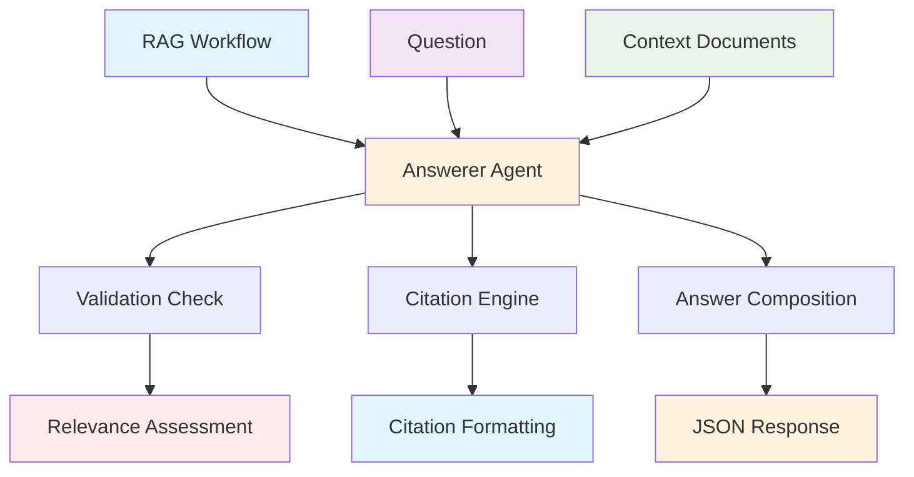
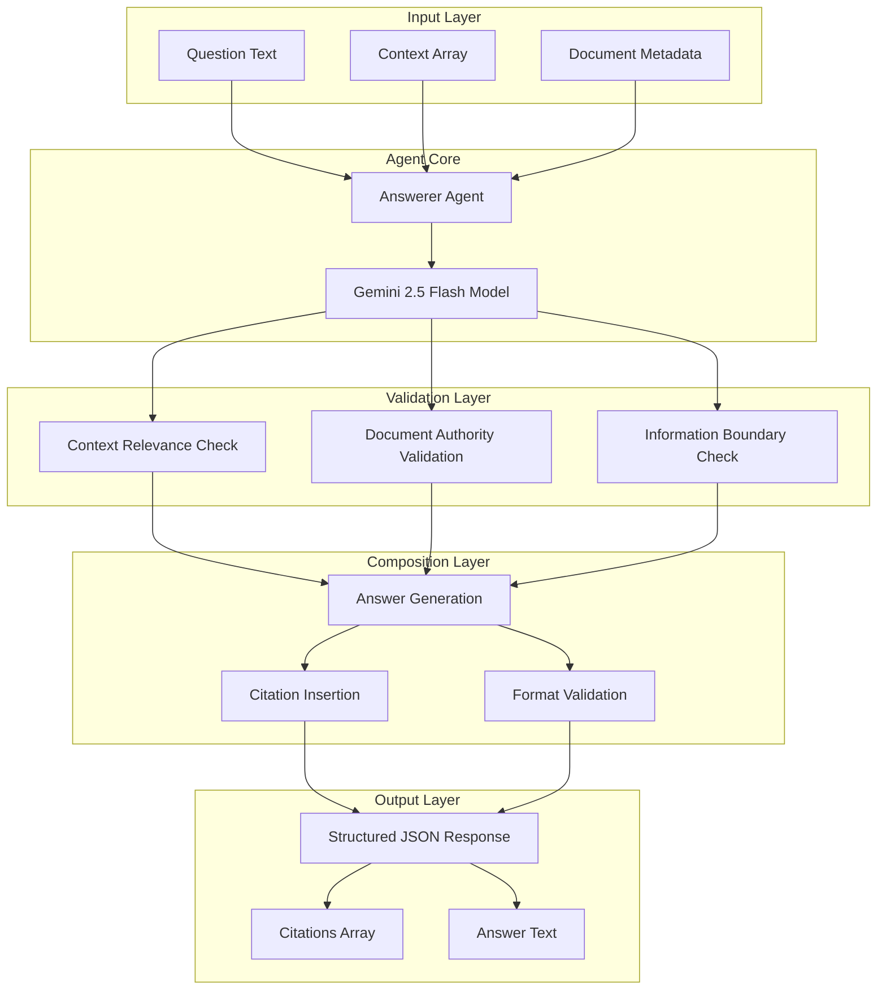

# Answerer Agent Documentation

A STRICT governed RAG answer composer that crafts answers using ONLY provided contexts with mandatory citations.

## 1. Component Overview

### Purpose/Responsibility

- ANS-001: Compose answers using ONLY provided contexts
- ANS-002: Enforce rigorous citation requirements
- ANS-003: Validate context relevance to questions
- ANS-004: Prevent external knowledge contamination
- ANS-005: Ensure governed document corpus compliance

### Key Features

- **Context-Only Responses**: Never uses external knowledge
- **Mandatory Citations**: Every factual statement must be cited
- **Relevance Validation**: Verifies contexts address the specific question
- **Governance Compliance**: Enforces document corpus boundaries
- **Structured Output**: JSON responses with citations array

### Business Value

- Ensures answer accuracy through source verification
- Maintains data governance and compliance
- Provides traceable citations for audit purposes
- Prevents unauthorized information disclosure

## 2. Architecture Section

### C4 Context Diagram



### C4 Container Diagram



### Component Relationships

- **Input Dependencies**: Question text, context documents array
- **Output Consumers**: RAG workflow, verification agents
- **External Systems**: Google Gemini AI model, LibSQL memory storage
- **Internal Components**: Citation engine, relevance validator

## 3. Interface Documentation

### Input Schema

| Property | Type | Required | Description |
|----------|------|----------|-------------|
| `question` | `string` | Yes | The question to answer |
| `contexts` | `array` | Yes | Array of context documents |
| `metadata` | `object` | No | Additional document metadata |

### Output Schema

| Property | Type | Description |
|----------|------|-------------|
| `answer` | `string` | Complete answer with inline citations |
| `citations` | `array` | Array of citation objects with docId and source |

### Public Methods

| Method | Parameters | Return Type | Description |
|--------|------------|-------------|-------------|
| `generate()` | `input: AnswerInput` | `Promise<AnswerOutput>` | Generate cited answer from contexts |

## 4. Usage Examples

### Basic Answer Composition

```typescript
import { answererAgent } from './src/mastra/agents/answerer.agent';

const result = await answererAgent.generate({
  question: "What are the expense reporting requirements?",
  contexts: [
    {
      id: "finance-policy-001",
      content: "Expense reports must be submitted within 30 days of the expense date..."
    }
  ]
});

// Result:
// {
//   "answer": "Expense reports must be submitted within 30 days [finance-policy-001].",
//   "citations": [{"docId": "finance-policy-001", "source": "Finance Policy Manual"}]
// }
```

### Multiple Citations

```typescript
const result = await answererAgent.generate({
  question: "What are approval requirements for expenses?",
  contexts: [
    {
      id: "finance-policy-001",
      content: "Expenses over $1000 require manager approval..."
    },
    {
      id: "hr-policy-002",
      content: "All expense approvals must be documented..."
    }
  ]
});

// Result:
// {
//   "answer": "Expenses over $1000 require manager approval [finance-policy-001]. All approvals must be documented [hr-policy-002].",
//   "citations": [
//     {"docId": "finance-policy-001", "source": "Finance Policy"},
//     {"docId": "hr-policy-002", "source": "HR Policy"}
//   ]
// }
```

### No Relevant Information

```typescript
const result = await answererAgent.generate({
  question: "What are the parking regulations?",
  contexts: [
    {
      id: "finance-policy-001",
      content: "Expense reports must be submitted within 30 days..."
    }
  ]
});

// Result:
// {
//   "answer": "The authorized documents don't contain information about this specific topic.",
//   "citations": []
// }
```

## 5. Quality Attributes

### Security

- **Context Isolation**: Only uses provided document contexts
- **Authority Validation**: Verifies document permissions and classifications
- **Citation Tracking**: Maintains audit trail of information sources

### Performance

- **Response Time**: < 10 seconds for typical answer composition
- **Context Processing**: Efficient handling of multiple document contexts
- **Memory Management**: Streaming processing for large context sets

### Reliability

- **Error Handling**: Graceful handling of invalid contexts or questions
- **Data Consistency**: Atomic answer generation operations
- **Fault Tolerance**: Fallback responses for model failures

### Maintainability

- **Code Structure**: Clean separation between validation and composition
- **Configuration**: Environment-based citation format settings
- **Logging**: Comprehensive operation logging for debugging

### Extensibility

- **Citation Formats**: Configurable citation styling and formats
- **Document Types**: Support for various document formats and metadata
- **Validation Rules**: Pluggable validation modules for different requirements

## 6. Reference Information

### Dependencies

| Package | Version | Purpose |
|---------|---------|---------|
| `@mastra/core` | ^0.1.0 | Agent framework |
| `@ai-sdk/google` | ^0.0.50 | Google Gemini integration |
| `zod` | ^3.22.4 | Schema validation |

### Environment Variables

| Variable | Required | Default | Description |
|----------|----------|---------|-------------|
| `GOOGLE_GENERATIVE_AI_API_KEY` | Yes | - | Google AI API key |

### Testing

```bash
# Run answerer agent tests
npm test -- --grep "answerer"

# Test citation validation
npm run test:citations
```

### Troubleshooting

**Common Issues:**

1. **Citation Format Errors**: Check citation schema compliance
2. **Context Relevance**: Verify contexts actually address the question
3. **Memory Issues**: Reduce context size for large document sets

**Debug Commands:**

```bash
# Enable debug logging
DEBUG=answerer:* npm run dev

# Check agent health
curl http://localhost:3000/api/health/answerer
```

### Related Documentation

- [Agent Schemas](../schemas/agent-schemas.md)
- [RAG Workflow](../workflows/rag-workflow.md)
- [Citation Guidelines](../guides/citation-standards.md)

### Change History

| Version | Date | Changes |
|---------|------|---------|
| 1.0 | 2025-09-23 | Initial implementation with strict governance rules |
| 0.9 | 2025-09-20 | Added context relevance validation |
| 0.8 | 2025-09-15 | Basic answer composition functionality |