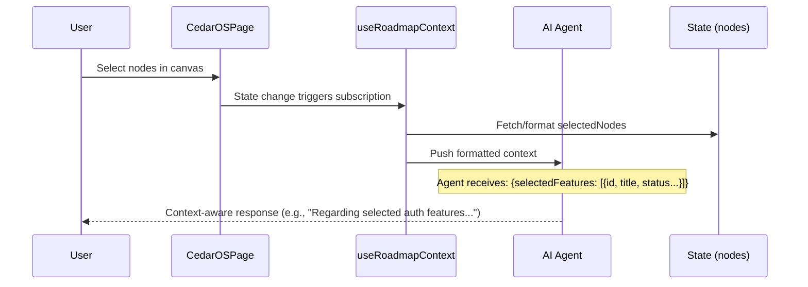

# useRoadmapContext Documentation

A React hook that subscribes application state (selected nodes and all nodes) to the AI agent context using Cedar OS's useSubscribeStateToAgentContext. This makes roadmap data available to agents as contextual information during conversations, enabling the agent to understand and reference current selections and the overall roadmap structure.

## 1. Component Overview

### Purpose/Responsibility

- OVR-001: Automatically expose selected and all roadmap nodes to AI agents as context for more informed responses.

- OVR-002: Scope includes subscribing two state slices (selectedNodes and nodes) with custom transformation functions to format data for agent consumption. Excludes direct state management, which is handled by parent components or other hooks.

- OVR-003: Context: Used in Cedar OS roadmap application to provide agents with awareness of user selections and the full feature set, enabling dynamic responses like "Based on your selection of authentication features..." or "Looking at the planned nodes...".

## 2. Architecture Section

- ARC-001: Design patterns: Hook composition pattern. Leverages Cedar OS's subscription mechanism to bridge React state with agent context without tight coupling.

- ARC-002: Dependencies:
    - React (for hook definition)

    - reactflow (Node<FeatureNodeData> type)

    - cedar-os (useSubscribeStateToAgentContext hook, getCedarState)

    - lucide-react (Box icon for visual representation)

- ARC-003: Interactions: Subscribes to state changes and pushes formatted data to agent context. Agents receive this as structured input during generation, influencing responses based on current roadmap state.

- ARC-004: Decisions: Uses two separate subscriptions for granular control—one for selections (user intent) and one for full nodes (global context). Custom formatters ensure data is concise and agent-friendly.

### Component Structure and Dependencies Diagram

```mermaid
graph TD
    subgraph "React Application"
        R[RoadmapCanvas] --> U[useRoadmapContext Hook]
        R --> S[useRoadmapState]
    end

    subgraph "Cedar OS"
        U --> C[useSubscribeStateToAgentContext]
        C --> A[AI Agent Context]
    end

    subgraph "State"
        N[nodes: Node<FeatureNodeData>[]] --> U
        SN[selectedNodes: Node<FeatureNodeData>[]] --> U
    end

    subgraph "External"
        CO[cedar-os] --> U
        RF[reactflow] --> N
        LR[lucide-react] --> U
    end

    classDiagram
        class useRoadmapContext {
            +useSubscribeStateToAgentContext(key: string, formatter: Function, options: Object)
        }
        class CedarOS {
            <<external>>
            +useSubscribeStateToAgentContext(): void
        }
        class ReactFlowNode {
            <<type>>
            +id: string
            +data: FeatureNodeData
        }

        useRoadmapContext --> CedarOS
        useRoadmapContext --> ReactFlowNode
```

## 3. Interface Documentation

- INT-001: Public interface is the hook itself—no props, called unconditionally in components.

| Hook/Function         | Purpose                                   | Parameters | Return Type | Usage Notes                                                                           |
| --------------------- | ----------------------------------------- | ---------- | ----------- | ------------------------------------------------------------------------------------- |
| `useRoadmapContext()` | Subscribes roadmap state to agent context | None       | `void`      | Call at top-level in Cedar OS page/component. Requires Cedar OS provider in ancestor. |

### Hook Usage

```ts
// No parameters; called directly
useRoadmapContext()
```

Notes:

- INT-003: No events emitted; operates reactively via subscriptions. Ensure cedar-os context is available (e.g., via CedarProvider).

## 4. Implementation Details

- IMP-001: Two calls to useSubscribeStateToAgentContext: one for 'selectedNodes' (user-focused) and one for 'nodes' (global). Each includes a formatter function to shape data (e.g., extracting id, title, status).

- IMP-002: Initialization: None required beyond calling the hook. Relies on external state registration (e.g., via useRoadmapState).

- IMP-003: Key logic: Formatters map Node<FeatureNodeData> to simplified objects (id, title, description, etc.) for efficient agent context. Icons and colors provide visual cues in UI.

- IMP-004: Performance: Lightweight subscriptions; formatters run on state changes. For large roadmaps, consider debouncing or selective subscription.

Corner cases and considerations:

- If no nodes are selected, selectedFeatures array is empty—agents should handle gracefully.

- getCedarState('nodes') fetches current nodes for edge labeling in mentions (though not directly used here).

## 5. Usage Examples

### Basic Usage (in Cedar OS page)

```tsx
import { useRoadmapContext } from './context'

export default function CedarOSPage() {
    // Other hooks (state, mentions)...
    useRoadmapContext() // Subscribe state to agent context

    return <div>{/* Roadmap canvas and chat */}</div>
}
```

### Interaction Sequence (mermaid)



### Advanced Usage (with custom formatter)

```tsx
// Extend formatter for richer context
useSubscribeStateToAgentContext(
    'selectedNodes',
    (nodes) => ({
        selectedFeatures: nodes.map((node) => ({
            ...node.data,
            position: node.position, // Include layout if relevant
            connections: edges.filter(
                (e) => e.source === node.id || e.target === node.id
            ).length,
        })),
    }),
    { icon: BoxIcon, color: '#C06520' }
)
```

Best practices:

- Call early in component tree to ensure subscriptions are active.

- Keep formatters lightweight; avoid heavy computations in subscriptions.

- Use consistent data shapes across subscriptions for agent predictability.

## 6. Quality Attributes

- QUA-001 Security: No sensitive data exposed; formatters select public fields (title, status). Ensure node data doesn't include secrets.

- QUA-002 Performance: Subscriptions are efficient; formatters process arrays (typically small). For 1000+ nodes, paginate or summarize in formatter.

- QUA-003 Reliability: Reactive to state changes; handles empty arrays gracefully. Depends on cedar-os stability.

- QUA-004 Maintainability: Single hook composes multiple subscriptions; easy to extend with new state slices.

- QUA-005 Extensibility: Add more subscriptions (e.g., for edges) by calling useSubscribeStateToAgentContext again. Customize formatters per use case.

## 7. Reference Information

- REF-001: Dependencies (approximate):
    - react (^18) - hook runtime

    - cedar-os (latest) - subscription mechanism

    - reactflow (^11) - Node<FeatureNodeData> type

    - lucide-react (^0.300) - Box icon

- REF-002: Configuration: Requires CedarProvider in app root. No additional setup beyond calling the hook.

- REF-003: Testing guidelines:
    - Unit test: Mock useSubscribeStateToAgentContext and verify calls with correct keys/formatters.

    - Integration: Render in test env with mock state; assert agent context receives formatted data.

- REF-004: Troubleshooting
    - Issue: Context not updating in agent — ensure state is registered (useRoadmapState) and cedar-os provider wraps component.

    - Issue: Large payloads — optimize formatters to include only essential fields.

    - Issue: Icons not rendering — verify lucide-react import and theme compatibility.

- REF-005: Related docs
    - `app/cedar-os/state.ts` — State registration (useRoadmapState)

    - `app/cedar-os/mentions.ts` — Mention providers (useRoadmapMentions)

    - `cedar/FeatureNode.tsx` — FeatureNodeData type definition

- REF-006: Change history
    - 1.0 (2025-09-23) - Initial documentation generated
