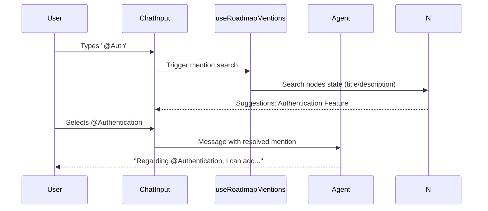

# useRoadmapMentions Documentation

A React hook that configures @mention providers for roadmap elements (nodes and edges) using Cedar OS's useStateBasedMentionProvider. Enables users to reference specific features or relationships in chat (e.g., "@Authentication add dependency") for agent-driven actions.

## 1. Component Overview

### Purpose/Responsibility

- OVR-001: Enable @mention functionality for roadmap nodes and edges, allowing conversational references to UI state.

- OVR-002: Scope: Registers two mention providers—one for nodes (features/bugs) and one for edges (relationships). Uses state-based search and labeling. Excludes mention rendering (handled by Cedar chat UI).

- OVR-003: Context: Integrated in Cedar OS roadmap chat to make UI elements discoverable via @mentions, bridging visual canvas with text-based agent interactions.

## 2. Architecture Section

- ARC-001: Design patterns: Provider registration pattern. Leverages Cedar OS's state-driven mentions for dynamic, searchable references.

- ARC-002: Dependencies:
    - React (hook)

    - reactflow (Node, Edge types)

    - cedar-os (useStateBasedMentionProvider, getCedarState)

    - lucide-react (Box, ArrowRight icons)

    - Local: cedar/FeatureNode (FeatureNodeData)

- ARC-003: Interactions: Registers providers reactively; mentions trigger on @ in chat input. Agents receive resolved mentions as context.

- ARC-004: Decisions: Separate providers for nodes/edges with distinct icons/colors. Node labels from title; edge labels computed from source/target titles.

### Component Structure and Dependencies Diagram

```mermaid
graph TD
    subgraph "Cedar OS Chat"
        Ch[ChatInput] --> M[useRoadmapMentions]
    end

    subgraph "Mentions"
        M --> NP[Node Provider]
        M --> EP[Edge Provider]
        NP --> CO[useStateBasedMentionProvider]
        EP --> CO
    end

    subgraph "State"
        S[getCedarState('nodes')] --> EP
        N[nodes State] --> NP
        E[edges State] --> EP
    end

    subgraph "External"
        CE[cedar-os] --> M
        RF[reactflow] --> NP
        LR[lucide-react] --> M
    end

    CO --> A[AI Agent Context]

    classDiagram
        class useRoadmapMentions {
            +useStateBasedMentionProvider(stateKey, options): void
        }
        class MentionProvider {
            <<external>>
            +searchFields: string[]
            +labelField: Function
        }

        useRoadmapMentions --> MentionProvider
```

## 3. Interface Documentation

- INT-001: Public interface: Hook with no params/return.

| Hook                   | Purpose                                      | Parameters | Return Type | Usage Notes                                                              |
| ---------------------- | -------------------------------------------- | ---------- | ----------- | ------------------------------------------------------------------------ |
| `useRoadmapMentions()` | Registers @mention providers for nodes/edges | None       | `void`      | Call in Cedar OS component; requires registered state (useRoadmapState). |

### Hook Usage

```tsx
import { useRoadmapMentions } from './mentions'

function CedarChat() {
    useRoadmapMentions() // Enable @node and @edge mentions

    return <ChatInput /* ... */ />
}
```

INT notes:

- INT-003: Reactive to state changes via Cedar OS. Icons/colors customize UI appearance.

## 4. Implementation Details

- IMP-001: Two useStateBasedMentionProvider calls: nodes (trigger '@', label from title, search description) and edges (computed label from source/target titles).

- IMP-002: Initialization: Fetches nodes via getCedarState for edge labeling. Icons: Box for nodes, ArrowRight for edges.

- IMP-003: Key logic: Edge label formatter joins source/target titles (e.g., "Auth → Dashboard"). Colors differentiate (blue nodes, green edges).

- IMP-004: Performance: Lightweight registration; search uses state fields. For large states, Cedar handles pagination.

Corner cases and considerations:

- If nodes state empty, edge labels fallback to IDs.

- Duplicate titles: Search includes descriptions for disambiguation.

## 5. Usage Examples

### Basic Usage

```tsx
import { useRoadmapMentions } from './mentions'

export default function CedarOSPage() {
    // Other hooks...
    useRoadmapMentions()

    return (
        <>
            <RoadmapCanvas />
            <ChatInterface /> {/* @mentions work here */}
        </>
    )
}
```

### Interaction Sequence (mermaid)



### Advanced Usage (custom provider)

```tsx
// Extend for custom mentions (e.g., priorities)
useStateBasedMentionProvider({
    stateKey: 'priorities',
    trigger: '@',
    labelField: (p) => p.name,
    description: 'Roadmap priorities',
    icon: PriorityIcon,
    color: '#EF4444',
})
```

Best practices:

- Call after state registration for accurate search.

- Use descriptive labels/search fields for usability.

- Customize icons/colors per provider type.

## 6. Quality Attributes

- QUA-001 Security: Mentions resolve to public state; no sensitive data. Ensure state doesn't expose PII.

- QUA-002 Performance: State-based search is efficient; scales with state size via Cedar optimization.

- QUA-003 Reliability: Handles missing state gracefully. Test with empty/full datasets.

- QUA-004 Maintainability: Two focused providers; easy to add more (e.g., comments).

- QUA-005 Extensibility: Add providers for new state (e.g., @comments) by duplicating pattern.

## 7. Reference Information

- REF-001: Dependencies:
    - react (^18)

    - cedar-os (latest) - mention provider

    - reactflow (^11) - types

    - lucide-react (^0.300) - icons

- REF-002: Configuration: Requires state registration. Trigger '@' fixed.

- REF-003: Testing: Mock provider; assert search returns expected items.

- REF-004: Troubleshooting
    - No suggestions: Verify state registered and searchFields correct.

    - Edge labels wrong: Check getCedarState fetches current nodes.

- REF-005: Related docs
    - `app/cedar-os/state.ts` - State setup

    - `app/cedar-os/context.ts` - Context subscription

- REF-006: Change history
    - 1.0 (2025-09-23) - Initial documentation
