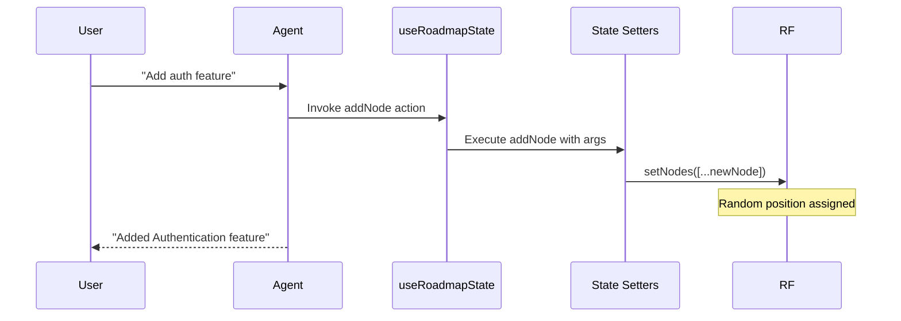

# useRoadmapState Documentation

A React hook that registers roadmap state (nodes, edges, currentDate) with Cedar OS using useCedarState and useRegisterState. Enables AI agents to read and manipulate React Flow state via conversational commands (e.g., "add node", "remove feature").

## 1. Component Overview

### Purpose/Responsibility

- OVR-001: Expose React Flow roadmap state to Cedar OS for agent manipulation.

- OVR-002: Scope: Registers 'nodes' with custom setters (add/remove/change), 'edges' read-only, and 'currentDate' simple value. Includes effect for date logging. Excludes UI rendering.

- OVR-003: Context: Powers agent-driven roadmap editing in Cedar OS, where chat commands trigger state updates (e.g., "@auth change status to done").

## 2. Architecture Section

- ARC-001: Design patterns: State adapter/bridge. Maps React Flow state to Cedar's registration API with custom executors.

- ARC-002: Dependencies:

  - React (useState, useEffect)

  - reactflow (Node, Edge, FeatureNodeData)

  - cedar-os (useCedarState, useRegisterState)

  - uuid (v4 for IDs)

- ARC-003: Interactions: Registers state with setters; agents call via actions. useEffect logs date changes.

- ARC-004: Decisions: Custom setters for nodes (addNode with random position, removeNode cleans edges, changeNode updates data). Simple registration for edges/date.

### Component Structure and Dependencies Diagram

```mermaid
graph TD
    subgraph "Cedar OS Page"
        P[Page] --> U[useRoadmapState]
    end

    subgraph "Registration"
        U --> CS[useCedarState('currentDate')]
        U --> RS[useRegisterState('nodes')]
        U --> RE[useRegisterState('edges')]
    end

    subgraph "Setters"
        RS --> AN[addNode Executor]
        RS --> RN[removeNode Executor]
        RS --> CN[changeNode Executor]
    end

    subgraph "State"
        RF[React Flow] --> U
        U --> A[AI Agent Actions]
    end

    subgraph "External"
        CE[cedar-os] --> U
        UUID[uuid v4] --> AN
    end

    classDiagram
        class useRoadmapState {
            +useCedarState(key, initial): [value, setValue]
            +useRegisterState(key, value, setValue, setters): void
            +useEffect(fn): void
        }
        class NodeExecutor {
            +addNode(nodes, setNodes, args): void
            +removeNode(nodes, setNodes, args): void
            +changeNode(nodes, setNodes, args): void
        }

        useRoadmapState --> NodeExecutor
```

## 3. Interface Documentation

- INT-001: Hook params from React Flow.

| Parameter | Purpose | Type | Required | Usage Notes |
|-----------|---------|------|----------|-------------|
| `nodes` | Roadmap nodes | `Node<FeatureNodeData>[]` | Yes | Current state |
| `setNodes` | Update nodes | `Dispatch<SetStateAction<Node<FeatureNodeData>[]>>` | Yes | Setter |
| `edges` | Roadmap edges | `Edge[]` | Yes | Current state |
| `setEdges` | Update edges | `Dispatch<SetStateAction<Edge[]>>` | Yes | Setter |

### Hook Usage

```tsx
import { useRoadmapState } from './state';
import { useNodesState, useEdgesState } from 'reactflow';

function App() {
  const [nodes, setNodes] = useNodesState(initialNodes);
  const [edges, setEdges] = useEdgesState(initialEdges);

  useRoadmapState(nodes, setNodes, edges, setEdges);

  // Agent can now call addNode etc.
}
```

INT notes:

- INT-003: Side-effect hook; no return. Setters enable agent actions like {type: 'setState', stateKey: 'nodes', setterKey: 'addNode', args: [...]}

## 4. Implementation Details

- IMP-001: useCedarState for 'currentDate' (initial Date.now().toString()); useEffect logs changes.

- IMP-002: useRegisterState for 'nodes' with three setters: addNode (random pos, default data), removeNode (filter + clean edges), changeNode (map update).

- IMP-003: useRegisterState for 'edges' (read-only). uuid.v4 for new node IDs.

- IMP-004: Performance: Setters O(n) for map/filter; suitable for <1000 nodes. Random positioning for new nodes.

Corner cases and considerations:

- addNode: Validates args.node; defaults status='planned', upvotes=0.

- removeNode: Args.id required; cleans connected edges.

- Invalid args: Setters noop gracefully.

## 5. Usage Examples

### Basic Usage

```tsx
// In Cedar page
const [nodes, setNodes] = useNodesState([]);
const [edges, setEdges] = useEdgesState([]);

useRoadmapState(nodes, setNodes, edges, setEdges);
```

### Agent Action Example (received by agent)

```json
{
  "type": "setState",
  "stateKey": "nodes",
  "setterKey": "addNode",
  "args": [{
    "data": {
      "title": "New Feature",
      "description": "AI Integration",
      "status": "planned"
    }
  }],
  "content": "Added new AI feature to roadmap"
}
```

### Interaction Sequence (mermaid)



Best practices:

- Use after React Flow hooks for current state.

- Validate agent args in setters for robustness.

- Log setter calls for debugging.

## 6. Quality Attributes

- QUA-001 Security: Setters mutate UI state only; no backend calls. Validate args to prevent malformed updates.

- QUA-002 Performance: Efficient for typical roadmaps; optimize setters for large n if needed.

- QUA-003 Reliability: Noops on invalid args; cleans edges on remove. Test with edge cases (empty state).

- QUA-004 Maintainability: Setters isolated; easy to extend (e.g., add validateNode).

- QUA-005 Extensibility: Add setters (e.g., duplicateNode) via stateSetters object.

## 7. Reference Information

- REF-001: Dependencies:

  - react (^18), reactflow (^11), cedar-os (latest), uuid (^9)

- REF-002: Configuration: Initial date string; random pos in [100-500,100-400].

- REF-003: Testing: Mock setters; assert state updates correctly.

- REF-004: Troubleshooting

  - No updates: Verify registration before agent calls.

  - Random pos off-screen: Adjust ranges based on canvas size.

- REF-005: Related docs

  - cedar/FeatureNode.tsx (data type)

  - app/cedar-os/hooks.ts (composition)

- REF-006: Change history

  - 1.0 (2025-09-23) - Initial documentation
