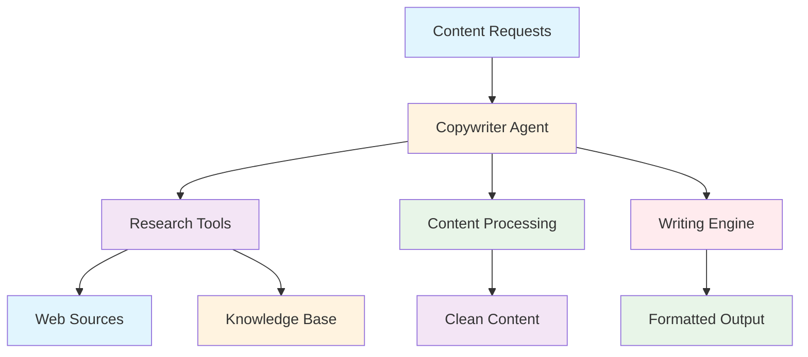
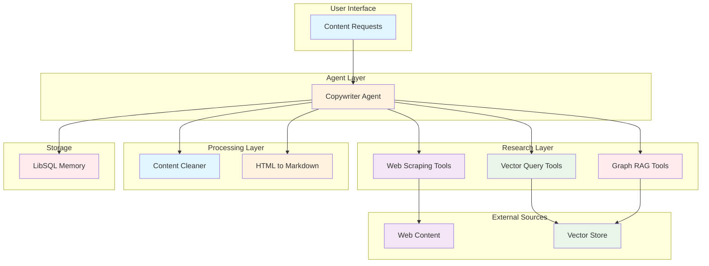
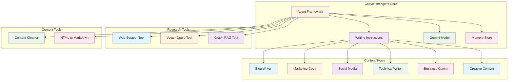

# Copywriter Agent (`src/mastra/agents/copywriterAgent.ts`)

## Overview

The Copywriter Agent is an expert content creation specialist that produces engaging, high-quality content across multiple formats and purposes. It combines research capabilities with professional writing skills to create compelling content for blogs, marketing campaigns, social media, technical documentation, and business communications.

## Architecture

### C4 Context Diagram



### C4 Container Diagram



### C4 Component Diagram



## Agent Configuration

### Agent Properties

#### `id: "copywriter"`
Unique identifier for the agent within the Mastra system.

#### `name: "copywriter-agent"`
Human-readable name for the agent.

#### `description`
"An expert copywriter agent that creates engaging, high-quality content across multiple formats including blog posts, marketing copy, social media content, technical writing, and business communications."

### Content Types Supported

The agent specializes in creating content for multiple categories:

- **blog**: Well-structured, informative blog posts with engaging narratives
- **marketing**: Persuasive copy for campaigns, product descriptions, landing pages
- **social**: Concise, engaging content for social media platforms
- **technical**: Clear, accurate documentation, tutorials, and technical explanations
- **business**: Professional communications, emails, reports, and presentations
- **creative**: Storytelling, articles, and narrative-driven content
- **general**: Versatile content for various purposes and audiences

## Content Creation Approaches

### Blog Content

- Engaging hooks and compelling narratives
- Well-structured with clear headings and sections
- SEO-friendly while maintaining readability
- Call-to-action elements

### Marketing Copy

- Persuasive language focused on benefits
- Clear value propositions
- Compelling calls-to-action
- Target audience awareness

### Social Media Content

- Concise and attention-grabbing
- Platform-appropriate formatting
- Hashtags and engagement elements
- Shareable and relatable

### Technical Writing

- Clear, precise explanations
- Step-by-step instructions where applicable
- Accurate terminology and concepts
- Accessible to target audience level

### Business Communications

- Professional and polished tone
- Clear objectives and outcomes
- Appropriate formality level
- Action-oriented language

### Creative Content

- Engaging storytelling elements
- Vivid and descriptive language
- Emotional resonance
- Narrative flow

## Research and Tool Integration

### Vector Query Tool

**Configuration:**

```typescript
const queryTool = createVectorQueryTool({
  vectorStoreName: "vectorStore",
  indexName: STORAGE_CONFIG.VECTOR_INDEXES.RESEARCH_DOCUMENTS,
  model: google.textEmbedding("gemini-embedding-001"),
  enableFilter: true,
  description: "Search for semantically similar content in the LibSQL vector store using embeddings. Supports filtering, ranking, and context retrieval."
});
```

### Graph RAG Tool

**Configuration:**

```typescript
const graphQueryTool = createGraphRAGTool({
  vectorStoreName: "vectorStore",
  indexName: STORAGE_CONFIG.VECTOR_INDEXES.RESEARCH_DOCUMENTS,
  model: google.textEmbedding("gemini-embedding-001"),
  graphOptions: {
    threshold: 0.7,
    dimension: 3072,
    randomWalkSteps: 15,
    restartProb: 0.3
  },
  enableFilter: true,
  description: "Graph-based search for semantically similar content in the LibSQL vector store using embeddings. Supports filtering, ranking, and context retrieval."
});
```

### Web Scraping Tools

#### `webScraperTool`
Gathers initial information and context from URLs.

#### `htmlToMarkdownTool`
Converts HTML content to clean Markdown format.

#### `contentCleanerTool`
Processes and formats scraped web content.

## Operational Rules

### Content Guidelines

- Adapt writing style and structure based on content type
- Use provided tools to gather up-to-date information
- Ensure factual accuracy through research
- All content must be original and free from plagiarism
- Maintain clear, concise, and engaging style
- Consider target audience and purpose
- Consistent tone and voice throughout content

### Tool Usage Guidelines

- Use `webScraperTool` to gather initial information from URLs
- Use `queryTool` to search relevant information in knowledge base
- Use `contentCleanerTool` and `htmlToMarkdownTool` to process web content
- Leverage LibSQL vector store for semantic search capabilities

## Output Format

### Content Structure

- Well-formatted Markdown with appropriate structure
- Relevant metadata (title, summary, key points)
- Content type-specific formatting and structure
- Professional presentation ready for publication

### Metadata Inclusion

- Title when applicable
- Summary or abstract
- Key points or takeaways
- Publication-ready formatting

## Quality Attributes

### Content Quality

- **Originality:** All content is original and plagiarism-free
- **Engagement:** Compelling and audience-appropriate writing
- **Accuracy:** Factual correctness through research validation
- **Structure:** Well-organized and professionally formatted

### Research Capability

- **Comprehensive Research:** Multi-source information gathering
- **Semantic Search:** Vector and graph-based content retrieval
- **Content Processing:** Clean, formatted research materials
- **Knowledge Integration:** Synthesis of multiple information sources

### Adaptability

- **Format Flexibility:** Multiple content types and styles
- **Audience Awareness:** Tailored content for different audiences
- **Platform Optimization:** Social media and web-appropriate formatting
- **Purpose Alignment:** Content matched to specific objectives

### Technical Excellence

- **Tool Integration:** Seamless research and processing workflow
- **Memory Management:** Persistent conversation context
- **Performance:** Efficient model usage with Gemini 2.5 Flash
- **Scalability:** Handles various content lengths and complexity

### Maintainability

- **Modular Tools:** Separated research and processing capabilities
- **Clear Guidelines:** Explicit content creation rules and approaches
- **Structured Output:** Consistent formatting and metadata standards
- **Documentation:** Comprehensive content type specifications

## Dependencies

### Core Dependencies

- `@mastra/core/agent`: Agent framework
- `@ai-sdk/google`: Google AI SDK for Gemini models
- `@mastra/rag`: RAG tools for vector and graph search
- `@mastra/libsql`: LibSQL integration and prompts

### Tool Dependencies

- `../tools/web-scraper-tool`: Web scraping capabilities
- `../config/libsql-storage`: Memory and storage configuration
- `../config/logger`: Logging infrastructure

## Configuration

### Model Configuration

**Model:** `google('gemini-2.5-flash')`

**Embedding Model:** `google.textEmbedding("gemini-embedding-001")`

### Vector Store Configuration

```typescript
vectorStoreName: "vectorStore"
indexName: STORAGE_CONFIG.VECTOR_INDEXES.RESEARCH_DOCUMENTS
dimension: 3072
```

### Graph RAG Configuration

```typescript
graphOptions: {
  threshold: 0.7,
  dimension: 3072,
  randomWalkSteps: 15,
  restartProb: 0.3
}
```

### Required Environment Variables

```bash
GOOGLE_GENERATIVE_AI_API_KEY=your-api-key
```

## Troubleshooting

### Content Quality Issues

1. **Lack of Engagement**
   - Review content type guidelines
   - Ensure audience-appropriate language
   - Add compelling hooks and narratives

2. **Factual Inaccuracies**
   - Verify research sources
   - Cross-reference information
   - Use multiple research tools

3. **Formatting Problems**
   - Check Markdown syntax
   - Ensure proper heading hierarchy
   - Validate metadata inclusion

### Research Tool Issues

1. **Search Failures**
   - Check vector store connectivity
   - Verify embedding model configuration
   - Ensure proper index names

2. **Web Scraping Errors**
   - Validate URLs and accessibility
   - Check content processing tools
   - Handle different content formats

3. **Content Processing Issues**
   - Verify HTML structure
   - Check Markdown conversion
   - Ensure content cleaning parameters

## References

- [Google Gemini Models](https://ai.google.dev/models/gemini)
- [Mastra RAG Framework](https://mastra.ai/docs/rag)
- [Content Marketing Best Practices](https://contentmarketinginstitute.com)
- [Technical Writing Standards](https://www.iso.org/standard/33963.html)