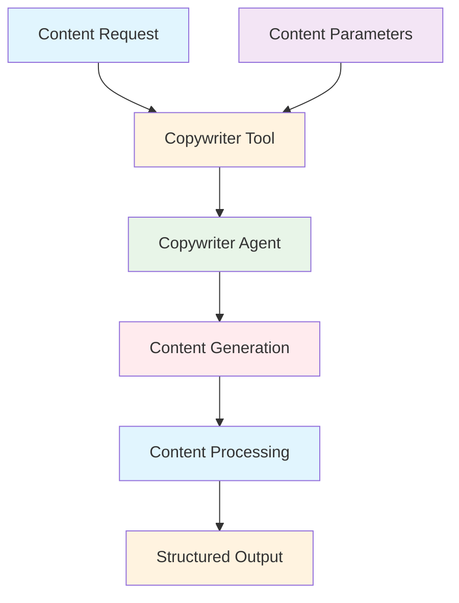
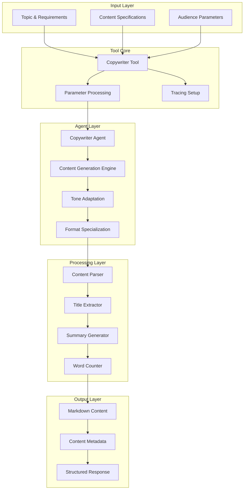

# Copywriter Agent Tool Documentation

A Mastra tool that leverages the copywriter agent to create engaging, high-quality content across multiple formats and tones.

## 1. Component Overview

### Purpose/Responsibility

- CWT-001: Generate engaging content across multiple formats
- CWT-002: Support various content types (blog, marketing, social, technical)
- CWT-003: Adapt content tone and style for target audiences
- CWT-004: Provide structured content output with metadata
- CWT-005: Enable content creation workflows in Mastra agents

### Key Features

- **Multi-Format Support**: Blog posts, marketing copy, social media, technical writing
- **Tone Adaptation**: Professional, casual, formal, engaging, persuasive, educational
- **Audience Targeting**: Customizable content for specific audience segments
- **Content Analysis**: Automatic title extraction, summary generation, word counting
- **Tracing Integration**: AI span tracking for content generation operations

### Business Value

- Enables automated content creation for marketing and communication
- Provides consistent brand voice across different content types
- Supports content marketing workflows and campaigns
- Facilitates rapid content generation for various business needs

## 2. Architecture Section

### C4 Context Diagram



### C4 Container Diagram



### Component Relationships

- **Input Dependencies**: Topic, content type, audience, tone, length requirements
- **Output Consumers**: Content management systems, marketing platforms
- **External Systems**: Copywriter agent, content processing utilities
- **Internal Components**: Content generation engine, format processors

## 3. Interface Documentation

### Input Schema

| Property | Type | Required | Description |
|----------|------|----------|-------------|
| `topic` | `string` | Yes | Main topic or subject for content |
| `contentType` | `enum?` | No | Content type (blog/marketing/social/technical/business/creative/general) |
| `targetAudience` | `string?` | No | Intended audience for the content |
| `tone` | `enum?` | No | Desired tone (professional/casual/formal/engaging/persuasive/educational) |
| `length` | `enum?` | No | Content length (short/medium/long) |
| `specificRequirements` | `string?` | No | Additional guidelines or focus areas |

### Output Schema

| Property | Type | Description |
|----------|------|-------------|
| `content` | `string` | Generated content in markdown format |
| `contentType` | `string` | Type of content created |
| `title` | `string?` | Suggested title for the content |
| `summary` | `string?` | Brief content summary |
| `keyPoints` | `string[]?` | Key points or takeaways |
| `wordCount` | `number?` | Approximate word count |

### Public Methods

| Method | Parameters | Return Type | Description |
|--------|------------|-------------|-------------|
| `execute()` | `context: ContentInput` | `Promise<ContentOutput>` | Generate content using copywriter agent |

## 4. Usage Examples

### Blog Post Creation

```typescript
import { copywriterTool } from './src/mastra/tools/copywriter-agent-tool';

const result = await copywriterTool.execute({
  context: {
    topic: "The Future of AI in Healthcare",
    contentType: "blog",
    targetAudience: "healthcare professionals",
    tone: "educational",
    length: "long",
    specificRequirements: "Include real-world examples and future predictions"
  },
  mastra: mastraInstance,
  tracingContext: tracingContext
});

// Result:
// {
//   "content": "# The Future of AI in Healthcare\n\n## Introduction\n...",
//   "contentType": "blog",
//   "title": "The Future of AI in Healthcare",
//   "summary": "Exploring how artificial intelligence is transforming healthcare...",
//   "keyPoints": [],
//   "wordCount": 1250
// }
```

### Marketing Copy

```typescript
const result = await copywriterTool.execute({
  context: {
    topic: "New SaaS Product Launch",
    contentType: "marketing",
    targetAudience: "small business owners",
    tone: "persuasive",
    length: "medium",
    specificRequirements: "Focus on ROI and ease of use"
  },
  mastra: mastraInstance,
  tracingContext: tracingContext
});

// Generates persuasive marketing copy with calls-to-action
```

### Social Media Content

```typescript
const result = await copywriterTool.execute({
  context: {
    topic: "Company Culture Update",
    contentType: "social",
    targetAudience: "employees and followers",
    tone: "engaging",
    length: "short"
  },
  mastra: mastraInstance,
  tracingContext: tracingContext
});

// Creates concise, shareable social media content
```

### Technical Documentation

```typescript
const result = await copywriterTool.execute({
  context: {
    topic: "API Integration Guide",
    contentType: "technical",
    targetAudience: "developers",
    tone: "professional",
    length: "long",
    specificRequirements: "Include code examples and troubleshooting"
  },
  mastra: mastraInstance,
  tracingContext: tracingContext
});

// Generates clear technical documentation with examples
```

## 5. Quality Attributes

### Security

- **Input Validation**: Schema validation for all input parameters
- **Content Sanitization**: Safe content generation without malicious code
- **Access Control**: Proper agent access through Mastra framework

### Performance

- **Efficient Generation**: Optimized content creation through specialized agent
- **Configurable Length**: Adjustable output size based on requirements
- **Batch Processing**: Support for multiple content generation requests

### Reliability

- **Error Handling**: Comprehensive error catching with detailed logging
- **Fallback Behavior**: Graceful degradation when agent is unavailable
- **Content Validation**: Output validation to ensure quality standards

### Maintainability

- **Modular Design**: Clean separation between tool and agent logic
- **Configuration**: Environment-based agent configuration
- **Logging**: Detailed operation logging for monitoring and debugging

### Extensibility

- **Content Types**: Easy addition of new content formats
- **Tone Options**: Extensible tone and style configurations
- **Agent Integration**: Pluggable agent architecture for different models

## 6. Reference Information

### Dependencies

| Package | Version | Purpose |
|---------|---------|---------|
| `@mastra/core/tools` | ^0.1.0 | Tool framework |
| `@mastra/core/ai-tracing` | ^0.1.0 | AI tracing integration |
| `zod` | ^3.22.4 | Schema validation |

### Environment Variables

| Variable | Required | Default | Description |
|----------|----------|---------|-------------|
| None | - | - | Uses Mastra agent configuration |

### Testing

```bash
# Run copywriter tool tests
npm test -- --grep "copywriter"

# Test content generation
npm run test:content-generation
```

### Troubleshooting

**Common Issues:**

1. **Agent Unavailable**: Check copywriter agent configuration
2. **Content Quality**: Review input parameters and requirements
3. **Schema Validation**: Ensure input matches expected schema

**Debug Commands:**

```bash
# Enable debug logging
DEBUG=copywriter:* npm run dev

# Check tool health
curl http://localhost:3000/api/health/copywriter
```

### Related Documentation

- [Copywriter Agent](../agents/copywriter-agent.md)
- [Content Creation Guidelines](../guides/content-creation.md)
- [Marketing Automation](../guides/marketing-automation.md)

### Change History

| Version | Date | Changes |
|---------|------|---------|
| 1.0 | 2025-09-23 | Initial implementation with multi-format support |
| 0.9 | 2025-09-20 | Added content analysis and metadata extraction |
| 0.8 | 2025-09-15 | Basic content generation functionality |