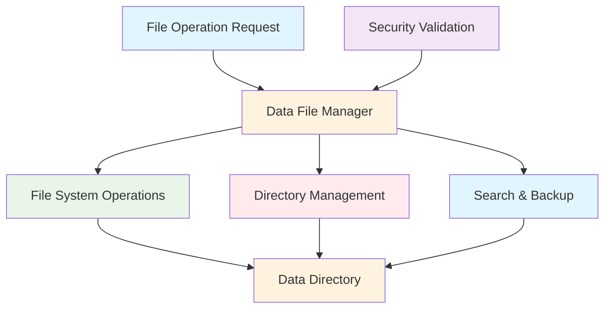
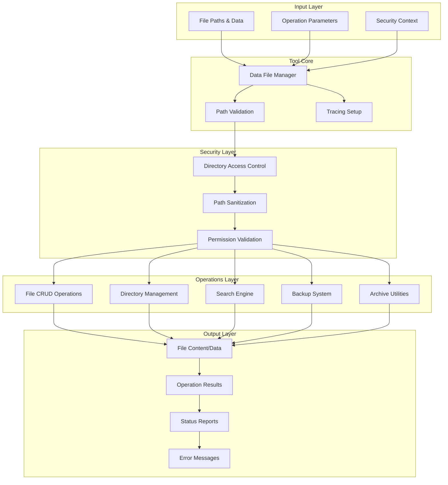

# Data File Manager Tool Documentation

A comprehensive Mastra tool suite for secure file system operations within controlled data directories, providing read, write, search, and management capabilities.

## 1. Component Overview

### Purpose/Responsibility

- DFM-001: Provide secure file operations within approved data directories
- DFM-002: Support comprehensive file management (CRUD operations)
- DFM-003: Enable data backup and archiving functionality
- DFM-004: Implement path validation and security controls
- DFM-005: Facilitate data organization and search capabilities

### Key Features

- **Path Security**: Strict validation to prevent directory traversal attacks
- **File Operations**: Complete CRUD operations (create, read, update, delete)
- **Directory Management**: Folder creation, listing, and removal
- **Search Functionality**: Content and filename search across data files
- **Backup & Archive**: Data protection and compression capabilities
- **Tracing Integration**: AI span tracking for all file operations

### Business Value

- Enables secure data management for research and content workflows
- Provides controlled access to file system operations
- Supports data backup and recovery processes
- Facilitates organized data storage and retrieval

## 2. Architecture Section

### C4 Context Diagram



### C4 Container Diagram



### Component Relationships

- **Input Dependencies**: File paths, operation parameters, security context
- **Output Consumers**: Research workflows, data processing pipelines
- **External Systems**: File system, compression utilities
- **Internal Components**: Security validator, operation handlers

## 3. Interface Documentation

### Available Tools

| Tool | Purpose | Input | Output |
|------|---------|-------|--------|
| `readDataFileTool` | Read file content | `{fileName: string}` | `string` |
| `writeDataFileTool` | Write/create files | `{fileName: string, content: string}` | `{success: boolean, message: string}` |
| `deleteDataFileTool` | Delete files | `{fileName: string}` | `{success: boolean, message: string}` |
| `listDataDirTool` | List directory contents | `{dirPath?: string}` | `FileInfo[]` |
| `copyDataFileTool` | Copy files | `{sourceFile: string, destFile: string}` | `{success: boolean, message: string}` |
| `moveDataFileTool` | Move/rename files | `{sourceFile: string, destFile: string}` | `{success: boolean, message: string}` |
| `searchDataFilesTool` | Search file contents | `{query: string, filePattern?: string}` | `SearchResult[]` |
| `getDataFileInfoTool` | Get file metadata | `{fileName: string}` | `FileInfo` |
| `createDataDirTool` | Create directories | `{dirPath: string}` | `{success: boolean, message: string}` |
| `removeDataDirTool` | Remove directories | `{dirPath: string}` | `{success: boolean, message: string}` |
| `archiveDataTool` | Create archives | `{sourcePath: string, archiveName: string}` | `{success: boolean, archivePath: string}` |
| `backupDataTool` | Create backups | `{sourcePath: string, backupName: string}` | `{success: boolean, backupPath: string}` |

### FileInfo Schema

| Property | Type | Description |
|----------|------|-------------|
| `name` | `string` | File or directory name |
| `path` | `string` | Relative path from data directory |
| `type` | `string` | 'file' or 'directory' |
| `size` | `number?` | File size in bytes |
| `modified` | `Date?` | Last modification date |
| `created` | `Date?` | Creation date |

### SearchResult Schema

| Property | Type | Description |
|----------|------|-------------|
| `fileName` | `string` | Name of the file containing matches |
| `matches` | `string[]` | Array of matching text snippets |
| `lineNumbers` | `number[]` | Line numbers where matches occur |

## 4. Usage Examples

### File Operations

```typescript
import { readDataFileTool, writeDataFileTool } from './src/mastra/tools/data-file-manager';

// Read a file
const content = await readDataFileTool.execute({
  context: { fileName: "research/notes.md" },
  mastra: mastraInstance,
  tracingContext: tracingContext
});

// Write a file
const result = await writeDataFileTool.execute({
  context: {
    fileName: "research/summary.md",
    content: "# Research Summary\n\nKey findings..."
  },
  mastra: mastraInstance,
  tracingContext: tracingContext
});
```

### Directory Management

```typescript
import { listDataDirTool, createDataDirTool } from './src/mastra/tools/data-file-manager';

// List directory contents
const files = await listDataDirTool.execute({
  context: { dirPath: "research" },
  mastra: mastraInstance,
  tracingContext: tracingContext
});

// Create a new directory
const result = await createDataDirTool.execute({
  context: { dirPath: "research/2025" },
  mastra: mastraInstance,
  tracingContext: tracingContext
});
```

### Search Operations

```typescript
import { searchDataFilesTool } from './src/mastra/tools/data-file-manager';

// Search for content
const results = await searchDataFilesTool.execute({
  context: {
    query: "machine learning",
    filePattern: "*.md"
  },
  mastra: mastraInstance,
  tracingContext: tracingContext
});

// Results contain file names, matching snippets, and line numbers
```

### Backup and Archive

```typescript
import { backupDataTool, archiveDataTool } from './src/mastra/tools/data-file-manager';

// Create a backup
const backup = await backupDataTool.execute({
  context: {
    sourcePath: "research",
    backupName: "research-backup-2025"
  },
  mastra: mastraInstance,
  tracingContext: tracingContext
});

// Create a compressed archive
const archive = await archiveDataTool.execute({
  context: {
    sourcePath: "research",
    archiveName: "research-archive"
  },
  mastra: mastraInstance,
  tracingContext: tracingContext
});
```

## 5. Quality Attributes

### Security

- **Path Validation**: Prevents directory traversal and unauthorized access
- **Directory Confinement**: Operations limited to approved data directories
- **Input Sanitization**: Safe file path handling and validation
- **Access Control**: Controlled file system access through tool interface

### Performance

- **Efficient Operations**: Optimized file I/O with streaming support
- **Search Optimization**: Fast content searching with pattern matching
- **Compression**: Efficient archiving with zlib compression
- **Memory Management**: Streaming for large file operations

### Reliability

- **Error Handling**: Comprehensive error catching with detailed messages
- **Atomic Operations**: Safe file operations with rollback capability
- **Validation**: Pre-flight checks for all operations
- **Resource Cleanup**: Proper cleanup of file handles and streams

### Maintainability

- **Modular Design**: Separated tools for different operations
- **Consistent API**: Uniform interface across all tools
- **Comprehensive Logging**: Detailed operation logging for debugging
- **Schema Validation**: Input/output validation with Zod

### Extensibility

- **Tool Expansion**: Easy addition of new file operations
- **Format Support**: Extensible file format and compression support
- **Search Features**: Pluggable search algorithms and filters
- **Integration Points**: Support for additional storage backends

## 6. Reference Information

### Dependencies

| Package | Version | Purpose |
|---------|---------|---------|
| `@mastra/core/tools` | ^0.1.0 | Tool framework |
| `@mastra/core/ai-tracing` | ^0.1.0 | AI tracing integration |
| `zod` | ^3.22.4 | Schema validation |

### Environment Variables

| Variable | Required | Default | Description |
|----------|----------|---------|-------------|
| None | - | - | Uses hardcoded DATA_DIR path |

### Testing

```bash
# Run data file manager tests
npm test -- --grep "data-file"

# Test security validation
npm run test:file-security

# Test backup operations
npm run test:backup-restore
```

### Troubleshooting

**Common Issues:**

1. **Path Validation Errors**: Ensure paths are within allowed directories
2. **Permission Issues**: Check file system permissions for data directory
3. **File Not Found**: Verify file exists and path is correct
4. **Disk Space**: Monitor available space for large operations

**Debug Commands:**

```bash
# Enable debug logging
DEBUG=file-manager:* npm run dev

# Check tool health
curl http://localhost:3000/api/health/data-file-manager
```

### Related Documentation

- [File System Security](../guides/file-security.md)
- [Data Management Patterns](../guides/data-management.md)
- [Backup and Recovery](../guides/backup-recovery.md)

### Change History

| Version | Date | Changes |
|---------|------|---------|
| 1.0 | 2025-09-23 | Initial implementation with comprehensive file operations |
| 0.9 | 2025-09-20 | Added backup and archive functionality |
| 0.8 | 2025-09-15 | Basic file CRUD operations |