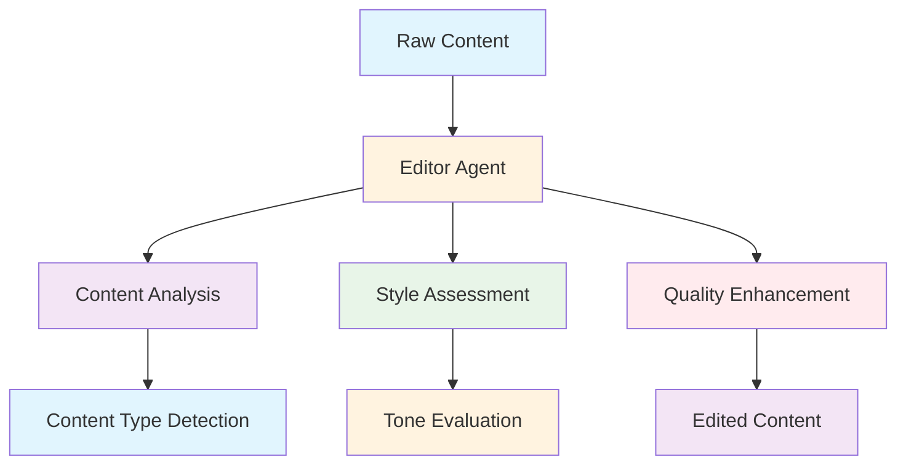
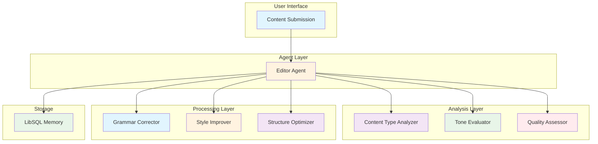
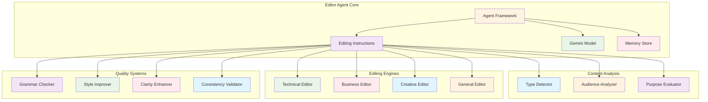

# Editor Agent (`src/mastra/agents/editorAgent.ts`)

## Overview

The Editor Agent is a versatile content editor specializing in refining and improving written content across multiple domains and formats. It enhances clarity, coherence, grammar, style, and overall quality while adapting its editing approach based on content type and target audience.

## Architecture

### C4 Context Diagram



### C4 Container Diagram



### C4 Component Diagram



## Agent Configuration

### Agent Properties

#### `id: "editor"`

Unique identifier for the agent within the Mastra system.

#### `name: "Editor"`

Human-readable name for the agent.

#### `description`

"A versatile content editor that improves clarity, coherence, and quality across various content types including technical writing, documentation, emails, reports, and creative content."

### Supported Content Types

The agent specializes in editing multiple content categories:

- **Technical Writing**: API documentation, user guides, technical specifications, code comments
- **Business Communication**: Emails, reports, memos, presentations, proposals
- **Creative Content**: Blog posts, articles, social media content, marketing copy
- **Academic/Professional**: Research papers, white papers, case studies, training materials
- **General Content**: Any written material requiring clarity and professionalism

## Editing Approaches

### Technical Content

- Ensure accuracy and precision in technical details
- Use consistent terminology throughout
- Improve readability without sacrificing technical accuracy
- Add clarity to complex concepts and processes
- Verify logical flow of technical information

### Business Communication

- Maintain professional tone appropriate for business context
- Ensure clarity and conciseness for business audiences
- Improve structure and organization of business documents
- Enhance persuasiveness where appropriate for business goals
- Adapt formality level based on audience and purpose

### Creative Content

- Preserve author's unique voice and creative style
- Enhance engagement and narrative flow
- Improve readability and pacing of creative pieces
- Strengthen arguments or narratives creatively
- Maintain creative elements while improving overall clarity

### General Content

- Apply universal writing principles across all content
- Improve grammar, style, and clarity comprehensively
- Enhance organization and logical flow
- Ensure appropriate tone and voice for the context

## Editing Style Guidelines

### Core Editing Principles

- Correct grammatical errors, spelling mistakes, and punctuation issues
- Improve sentence structure and flow for better readability
- Ensure consistent tone and voice throughout the content
- Eliminate unnecessary jargon or provide explanations when needed
- Check for clarity, logical consistency, and completeness
- Adapt language level to match target audience capabilities
- Improve formatting and structure where applicable
- Enhance persuasiveness and impact where appropriate

### Quality Enhancement

- **Grammar & Mechanics**: Comprehensive correction of language issues
- **Style & Flow**: Improved readability and narrative coherence
- **Consistency**: Uniform tone, voice, and terminology
- **Clarity**: Enhanced understanding and communication effectiveness
- **Structure**: Better organization and logical progression

## Editing Process

The agent follows a systematic 5-step editing process:

1. **Content Analysis**: Identify content type, purpose, and target audience
2. **Audience Assessment**: Determine appropriate tone and formality level
3. **Type-Specific Editing**: Apply content-type-specific editing principles
4. **Quality Improvements**: Make enhancements while preserving author intent
5. **Professional Standards**: Ensure final content meets professional requirements

## Output Format

### Required JSON Structure

```json
{
    "editedContent": "The full, edited version of the text.",
    "contentType": "Identified content type (e.g., 'technical', 'business', 'creative', 'general')",
    "summaryOfChanges": "A brief, bulleted list of the most significant changes made.",
    "improvementSuggestions": "Optional suggestions for further improvement or structural changes."
}
```

### Output Components

#### `editedContent`

- Complete edited version of the provided text
- All improvements and corrections applied
- Ready for publication or further use

#### `contentType`

- Identified category from supported content types
- Used to determine editing approach and guidelines

#### `summaryOfChanges`

- Brief, bulleted list of significant modifications
- Highlights key improvements made
- Focuses on most impactful changes

#### `improvementSuggestions`

- Optional recommendations for further enhancement
- Structural improvement suggestions
- Additional refinements that could be considered

## Quality Attributes

### Content Quality

- **Accuracy**: Maintains factual correctness and technical precision
- **Clarity**: Enhances understanding and readability
- **Coherence**: Improves logical flow and organization
- **Consistency**: Ensures uniform style and terminology
- **Professionalism**: Meets standards appropriate for content type

### Editing Precision

- **Grammar Excellence**: Comprehensive correction of language issues
- **Style Refinement**: Appropriate improvements to writing style
- **Audience Adaptation**: Tailored editing for target readers
- **Intent Preservation**: Maintains original author voice and purpose
- **Quality Standards**: Professional editing best practices

### Adaptability

- **Content Flexibility**: Handles diverse content types and formats
- **Audience Awareness**: Adapts to different reader levels and needs
- **Purpose Alignment**: Considers content objectives and goals
- **Context Sensitivity**: Appropriate formality and tone adjustments

### Technical Performance

- **Model Efficiency**: Uses Gemini 2.5 Flash for high-quality editing
- **Memory Integration**: Persistent conversation context storage
- **Structured Output**: Consistent JSON response format
- **Processing Speed**: Efficient content analysis and editing

### Maintainability

- **Clear Guidelines**: Explicit editing principles and approaches
- **Modular Processing**: Separated analysis and editing phases
- **Quality Metrics**: Structured evaluation of editing effectiveness
- **Documentation**: Comprehensive content type specifications

## Dependencies

### Core Dependencies

- `@mastra/core/agent`: Agent framework
- `@ai-sdk/google`: Google AI SDK for Gemini models
- `../config/libsql-storage`: Memory storage implementation
- `../config/logger`: Logging infrastructure

## Configuration

### Model Configuration

**Model:** `google('gemini-2.5-flash')`

### Memory Configuration

```typescript
const store = createResearchMemory()
// Uses LibSQL for persistent conversation storage
```

### Required Environment Variables

```bash
GOOGLE_GENERATIVE_AI_API_KEY=your-api-key
```

## Troubleshooting

### Content Quality Issues

1. **Over-Editing Problems**
    - Review content type guidelines
    - Ensure author voice preservation
    - Balance improvements with original intent

2. **Inappropriate Tone**
    - Verify audience analysis
    - Check content type identification
    - Adjust formality level appropriately

3. **Structural Issues**
    - Assess logical flow requirements
    - Ensure content organization
    - Validate formatting consistency

### Technical Issues

1. **Memory Storage Problems**
    - Check LibSQL connectivity
    - Verify storage configuration
    - Ensure proper session management

2. **Model Response Issues**
    - Validate API key configuration
    - Check model availability
    - Monitor response quality and consistency

3. **JSON Format Errors**
    - Ensure all required fields are present
    - Validate JSON structure compliance
    - Check for proper escaping and formatting

## References

- [Google Gemini Models](https://ai.google.dev/models/gemini)
- [Professional Editing Standards](https://www.editors.ca)
- [Technical Writing Guidelines](https://www.iso.org/standard/33963.html)
- [Business Writing Best Practices](https://www.iabc.com)
