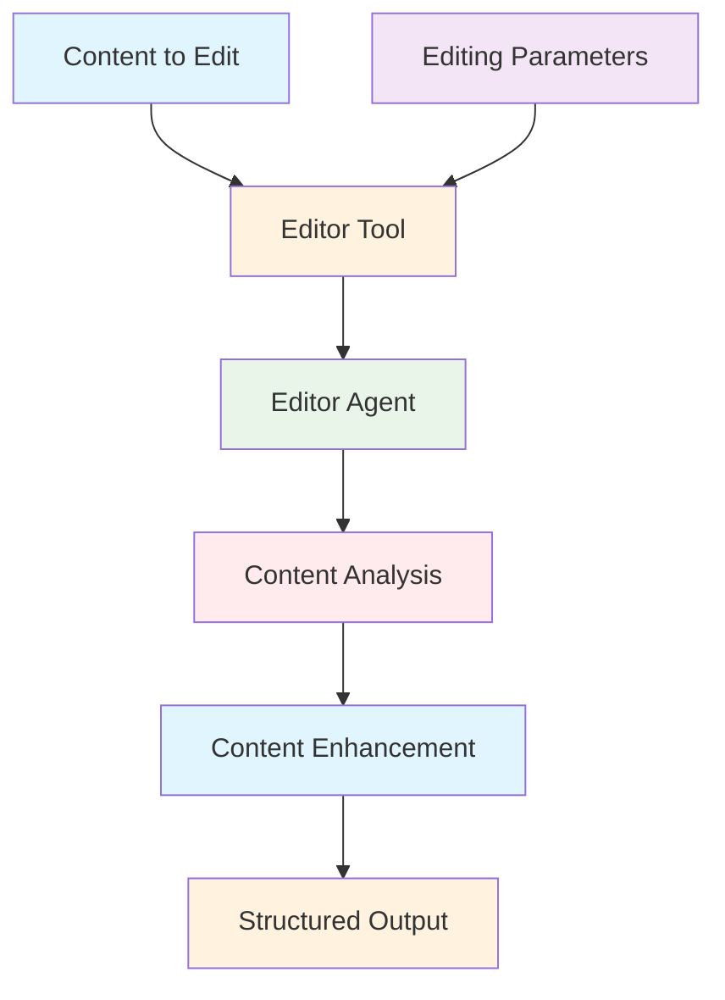
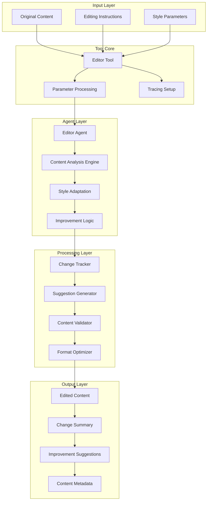

# Editor Agent Tool Documentation

A Mastra tool that leverages the editor agent to edit and improve content across multiple formats and tones.

## 1. Component Overview

### Purpose/Responsibility

- EDT-001: Edit and improve content across multiple formats
- EDT-002: Provide content proofreading and enhancement
- EDT-003: Adapt content tone and style for different audiences
- EDT-004: Generate structured feedback on content changes
- EDT-005: Support content editing workflows in Mastra agents

### Key Features

- **Multi-Format Editing**: Blog posts, technical docs, business communications, creative writing
- **Tone Adaptation**: Professional, casual, formal, engaging, technical tones
- **Structured Feedback**: Detailed change tracking and improvement suggestions
- **Content Analysis**: Automatic content type detection and optimization
- **Tracing Integration**: AI span tracking for editing operations

### Business Value

- Ensures high-quality content output across all formats
- Provides consistent editing standards and style guidelines
- Supports content improvement workflows and quality assurance
- Enables rapid content refinement and enhancement

## 2. Architecture Section

### C4 Context Diagram



### C4 Container Diagram



### Component Relationships

- **Input Dependencies**: Original content, editing instructions, style parameters
- **Output Consumers**: Content management systems, publishing workflows
- **External Systems**: Editor agent, content analysis utilities
- **Internal Components**: Content enhancement engine, feedback generator

## 3. Interface Documentation

### Input Schema

| Property | Type | Required | Description |
|----------|------|----------|-------------|
| `content` | `string` | Yes | The content to be edited |
| `contentType` | `enum?` | No | Content type (blog/technical/business/creative/general) |
| `instructions` | `string?` | No | Specific editing instructions or focus areas |
| `tone` | `enum?` | No | Desired tone (professional/casual/formal/engaging/technical) |

### Output Schema

| Property | Type | Description |
|----------|------|-------------|
| `editedContent` | `string` | The edited and improved content |
| `contentType` | `string` | The identified content type |
| `changes` | `string[]` | List of key changes made |
| `suggestions` | `string[]?` | Additional suggestions for improvement |

### Public Methods

| Method | Parameters | Return Type | Description |
|--------|------------|-------------|-------------|
| `execute()` | `context: EditInput` | `Promise<EditOutput>` | Edit content using editor agent |

## 4. Usage Examples

### Blog Post Editing

```typescript
import { editorTool } from './src/mastra/tools/editor-agent-tool';

const result = await editorTool.execute({
  context: {
    content: "This is a rough draft of my blog post about AI trends...",
    contentType: "blog",
    instructions: "Improve clarity, add transitions, and strengthen the conclusion",
    tone: "engaging"
  },
  mastra: mastraInstance,
  tracingContext: tracingContext
});

// Result:
// {
//   "editedContent": "The rapidly evolving landscape of artificial intelligence...",
//   "contentType": "blog",
//   "changes": ["Improved sentence structure", "Added smooth transitions", "Strengthened conclusion"],
//   "suggestions": ["Consider adding more specific examples", "Include recent statistics"]
// }
```

### Technical Documentation

```typescript
const result = await editorTool.execute({
  context: {
    content: "This API documentation needs better clarity and examples...",
    contentType: "technical",
    instructions: "Add code examples and improve technical accuracy",
    tone: "professional"
  },
  mastra: mastraInstance,
  tracingContext: tracingContext
});

// Enhances technical documentation with better structure and examples
```

### Business Communication

```typescript
const result = await editorTool.execute({
  context: {
    content: "Dear team, we need to discuss the project timeline...",
    contentType: "business",
    instructions: "Make it more concise and action-oriented",
    tone: "professional"
  },
  mastra: mastraInstance,
  tracingContext: tracingContext
});

// Refines business communication for clarity and impact
```

### Creative Writing

```typescript
const result = await editorTool.execute({
  context: {
    content: "The story begins with a mysterious figure in the fog...",
    contentType: "creative",
    instructions: "Enhance descriptive language and build suspense",
    tone: "engaging"
  },
  mastra: mastraInstance,
  tracingContext: tracingContext
});

// Improves creative writing with better imagery and pacing
```

## 5. Quality Attributes

### Security

- **Input Validation**: Schema validation for all input parameters
- **Content Sanitization**: Safe content processing without code execution
- **Access Control**: Proper agent access through Mastra framework

### Performance

- **Efficient Editing**: Optimized content analysis and improvement
- **Scalable Processing**: Handles various content lengths and types
- **Response Optimization**: Structured output for fast processing

### Reliability

- **Error Handling**: Comprehensive error catching with fallback responses
- **Content Preservation**: Maintains original content when parsing fails
- **Validation**: Output validation to ensure quality standards

### Maintainability

- **Modular Design**: Clean separation between tool and agent logic
- **Configuration**: Environment-based agent configuration
- **Logging**: Detailed operation logging for monitoring and debugging

### Extensibility

- **Content Types**: Easy addition of new content formats
- **Editing Rules**: Extensible editing guidelines and rules
- **Feedback Types**: Pluggable feedback and suggestion systems

## 6. Reference Information

### Dependencies

| Package | Version | Purpose |
|---------|---------|---------|
| `@mastra/core/tools` | ^0.1.0 | Tool framework |
| `@mastra/core/ai-tracing` | ^0.1.0 | AI tracing integration |
| `zod` | ^3.22.4 | Schema validation |

### Environment Variables

| Variable | Required | Default | Description |
|----------|----------|---------|-------------|
| None | - | - | Uses Mastra agent configuration |

### Testing

```bash
# Run editor tool tests
npm test -- --grep "editor"

# Test content editing
npm run test:content-editing
```

### Troubleshooting

**Common Issues:**

1. **Agent Unavailable**: Check editor agent configuration
2. **Content Quality**: Review input parameters and instructions
3. **Schema Validation**: Ensure input matches expected schema

**Debug Commands:**

```bash
# Enable debug logging
DEBUG=editor:* npm run dev

# Check tool health
curl http://localhost:3000/api/health/editor
```

### Related Documentation

- [Editor Agent](../agents/editor-agent.md)
- [Content Editing Guidelines](../guides/content-editing.md)
- [Writing Quality Standards](../guides/writing-standards.md)

### Change History

| Version | Date | Changes |
|---------|------|---------|
| 1.0 | 2025-09-23 | Initial implementation with multi-format editing |
| 0.9 | 2025-09-20 | Added structured feedback and change tracking |
| 0.8 | 2025-09-15 | Basic content editing functionality |