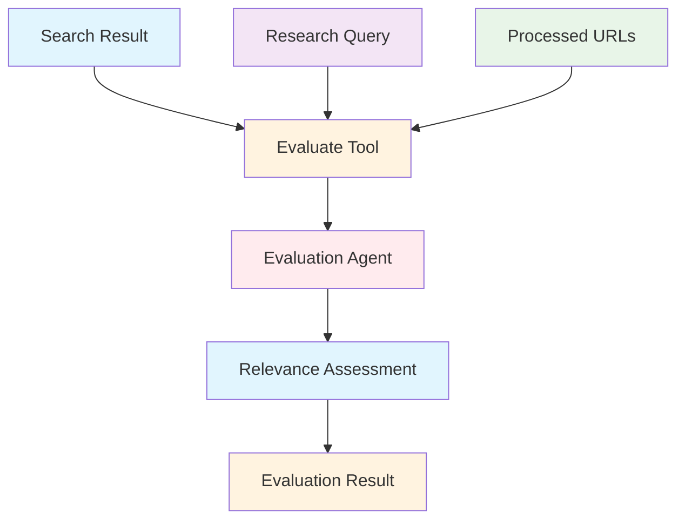
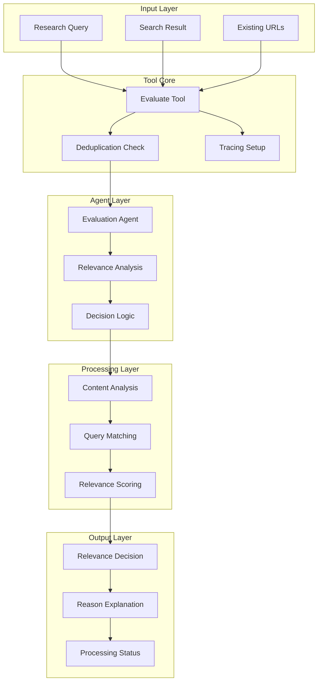

# Evaluate Result Tool Documentation

A Mastra tool for evaluating the relevance of search results to research queries using AI-powered assessment.

## 1. Component Overview

### Purpose/Responsibility

- EVT-001: Evaluate search result relevance to research queries
- EVT-002: Prevent duplicate processing of URLs
- EVT-003: Provide AI-powered relevance assessment
- EVT-004: Support research workflow optimization
- EVT-005: Enable quality filtering of search results

### Key Features

- **Relevance Assessment**: AI-powered evaluation of result usefulness
- **Duplicate Prevention**: URL deduplication to avoid redundant processing
- **Structured Evaluation**: Consistent relevance scoring and reasoning
- **Error Resilience**: Graceful handling of evaluation failures
- **Tracing Integration**: AI span tracking for evaluation operations

### Business Value

- Improves research efficiency by filtering irrelevant results
- Reduces processing overhead through duplicate detection
- Ensures high-quality data for RAG and research applications
- Optimizes search result processing workflows

## 2. Architecture Section

### C4 Context Diagram



### C4 Container Diagram



### Component Relationships

- **Input Dependencies**: Research query, search result, existing URLs list
- **Output Consumers**: Search workflows, content filtering systems
- **External Systems**: Evaluation agent, content analysis utilities
- **Internal Components**: Relevance assessment engine, deduplication logic

## 3. Interface Documentation

### Input Schema

| Property       | Type           | Required | Description                 |
| -------------- | -------------- | -------- | --------------------------- |
| `query`        | `string`       | Yes      | The original research query |
| `result`       | `ResultObject` | Yes      | Search result to evaluate   |
| `existingUrls` | `string[]?`    | No       | URLs already processed      |

### Result Object Schema

| Property  | Type     | Description            |
| --------- | -------- | ---------------------- |
| `title`   | `string` | Result title           |
| `url`     | `string` | Result URL             |
| `content` | `string` | Result content snippet |

### Output Schema

| Property     | Type      | Description                  |
| ------------ | --------- | ---------------------------- |
| `isRelevant` | `boolean` | Relevance decision           |
| `reason`     | `string`  | Explanation for the decision |

### Public Methods

| Method      | Parameters                 | Return Type                 | Description               |
| ----------- | -------------------------- | --------------------------- | ------------------------- |
| `execute()` | `context: EvaluationInput` | `Promise<EvaluationOutput>` | Evaluate result relevance |

## 4. Usage Examples

### Basic Relevance Evaluation

```typescript
import { evaluateResultTool } from './src/mastra/tools/evaluateResultTool'

const result = await evaluateResultTool.execute({
    context: {
        query: 'What are the benefits of renewable energy?',
        result: {
            title: 'Solar Power Advantages',
            url: 'https://example.com/solar-benefits',
            content: 'Solar energy provides clean, renewable power...',
        },
        existingUrls: ['https://example.com/wind-power'],
    },
    mastra: mastraInstance,
    tracingContext: tracingContext,
})

// Result:
// {
//   "isRelevant": true,
//   "reason": "Content directly addresses renewable energy benefits"
// }
```

### Duplicate Detection

```typescript
const result = await evaluateResultTool.execute({
    context: {
        query: 'Machine learning applications',
        result: {
            title: 'ML in Healthcare',
            url: 'https://example.com/ml-healthcare',
            content: 'Machine learning applications in medical diagnosis...',
        },
        existingUrls: ['https://example.com/ml-healthcare'], // Already processed
    },
    mastra: mastraInstance,
    tracingContext: tracingContext,
})

// Result:
// {
//   "isRelevant": false,
//   "reason": "URL already processed"
// }
```

### Research Workflow Integration

```typescript
// Within a research workflow
const searchResults = await performSearch(query)

for (const searchResult of searchResults) {
    const evaluation = await evaluateResultTool.execute({
        context: {
            query,
            result: searchResult,
            existingUrls: processedUrls,
        },
        mastra: mastraInstance,
        tracingContext: tracingContext,
    })

    if (evaluation.isRelevant) {
        // Process relevant result
        await processResult(searchResult)
        processedUrls.push(searchResult.url)
    }
}
```

### Error Handling

```typescript
try {
    const evaluation = await evaluateResultTool.execute({
        context: {
            query: 'Complex research topic',
            result: searchResult,
        },
        mastra: mastraInstance,
        tracingContext: tracingContext,
    })
} catch (error) {
    // Handle evaluation failure
    console.log('Using fallback evaluation logic')
    const isRelevant = fallbackEvaluation(searchResult)
}
```

## 5. Quality Attributes

### Security

- **Input Validation**: Schema validation for all input parameters
- **URL Sanitization**: Safe URL handling and validation
- **Content Filtering**: Appropriate content processing without risks

### Performance

- **Efficient Evaluation**: Fast AI-powered relevance assessment
- **Duplicate Optimization**: Quick URL deduplication checks
- **Batch Processing**: Support for evaluating multiple results

### Reliability

- **Error Handling**: Comprehensive error catching with fallback responses
- **Agent Resilience**: Graceful handling when evaluation agent unavailable
- **Consistent Output**: Standardized evaluation format and reasoning

### Maintainability

- **Clean Architecture**: Separated evaluation logic and deduplication
- **Configuration**: Agent-based evaluation configuration
- **Logging**: Detailed operation logging for debugging

### Extensibility

- **Evaluation Criteria**: Pluggable relevance assessment algorithms
- **Result Types**: Support for different result formats
- **Scoring Systems**: Extensible relevance scoring mechanisms

## 6. Reference Information

### Dependencies

| Package                   | Version | Purpose                |
| ------------------------- | ------- | ---------------------- |
| `@mastra/core/tools`      | ^0.1.0  | Tool framework         |
| `@mastra/core/ai-tracing` | ^0.1.0  | AI tracing integration |
| `zod`                     | ^3.22.4 | Schema validation      |

### Environment Variables

| Variable | Required | Default | Description                     |
| -------- | -------- | ------- | ------------------------------- |
| None     | -        | -       | Uses Mastra agent configuration |

### Testing

```bash
# Run evaluation tool tests
npm test -- --grep "evaluate"

# Test relevance assessment
npm run test:relevance-evaluation
```

### Troubleshooting

**Common Issues:**

1. **Agent Unavailable**: Check evaluation agent configuration
2. **Inconsistent Results**: Review evaluation criteria and training data
3. **Performance Issues**: Monitor evaluation agent response times

**Debug Commands:**

```bash
# Enable debug logging
DEBUG=evaluate:* npm run dev

# Check tool health
curl http://localhost:3000/api/health/evaluate
```

### Related Documentation

- [Evaluation Agent](../agents/evaluation-agent.md)
- [Search Result Processing](../guides/search-processing.md)
- [Relevance Assessment](../guides/relevance-assessment.md)

### Change History

| Version | Date       | Changes                                           |
| ------- | ---------- | ------------------------------------------------- |
| 1.0     | 2025-09-23 | Initial implementation with AI-powered evaluation |
| 0.9     | 2025-09-20 | Added duplicate URL detection                     |
| 0.8     | 2025-09-15 | Basic relevance evaluation functionality          |
