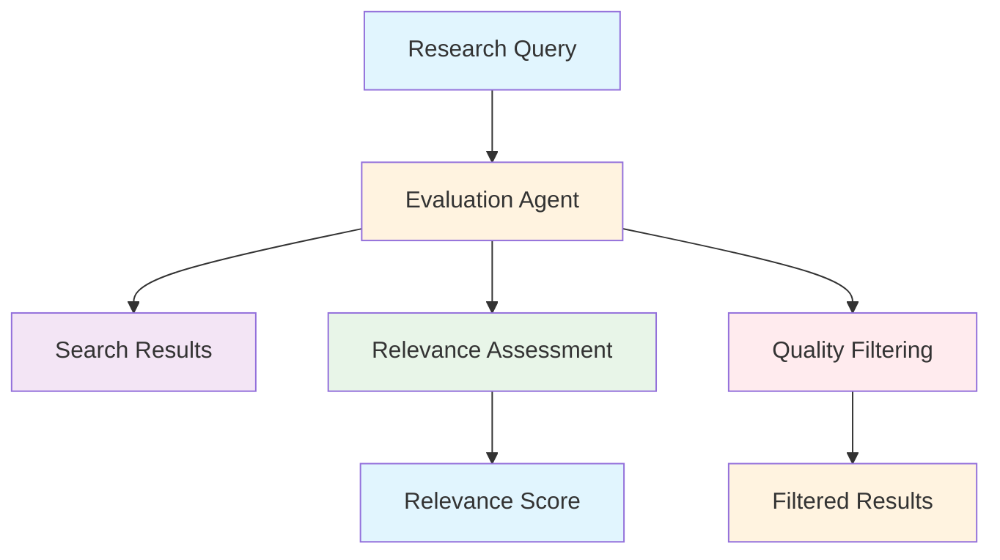
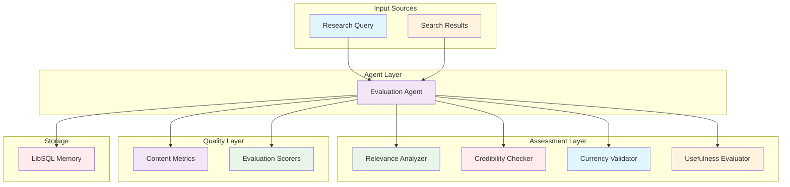

# Evaluation Agent (`src/mastra/agents/evaluationAgent.ts`)

## Overview

The Evaluation Agent is an expert assessment specialist that evaluates the relevance of search results to specific research queries. It provides structured, criteria-based evaluations to determine whether search results genuinely contribute to answering research questions, ensuring high-quality information filtering in research workflows.

## Architecture

### C4 Context Diagram



### C4 Container Diagram



### C4 Component Diagram

```mermaid
graph TB
    subgraph "Evaluation Agent Core"
        A[Agent Framework]
        B[Evaluation Instructions]
        C[Gemini Model]
        D[Memory Store]
    end

    subgraph "Evaluation Criteria"
        E[Direct Relevance]
        F[Usefulness]
        G[Credibility]
        H[Currency]
    end

    subgraph "Assessment Process"
        I[Query Analysis]
        J[Content Examination]
        K[Criteria Application]
        L[Decision Making]
    end

    subgraph "Quality Metrics"
        M[Content Similarity]
        N[Completeness]
        O[Textual Difference]
        P[Keyword Coverage]
        Q[Tone Consistency]
    end

    A --> B
    A --> C
    A --> D
    B --> E
    B --> F
    B --> G
    B --> H
    B --> I
    B --> J
    B --> K
    B --> L
    B --> M
    B --> N
    B --> O
    B --> P
    B --> Q

    style A fill:#fff3e0
    style B fill:#f3e5f5
    style C fill:#e8f5e8
    style D fill:#ffebee
    style E fill:#e1f5fe
    style F fill:#fff3e0
    style G fill:#f3e5f5
    style H fill:#e8f5e8
    style I fill:#ffebee
    style J fill:#e1f5fe
    style K fill:#fff3e0
    style L fill:#f3e5f5
    style M fill:#e8f5e8
    style N fill:#ffebee
    style O fill:#e1f5fe
    style P fill:#fff3e0
    style Q fill:#f3e5f5
```



## Agent Configuration

### Agent Properties

#### `id: "evaluation"`

Unique identifier for the agent within the Mastra system.

#### `name: "Evaluation Agent"`

Human-readable name for the agent.

#### `description`

"An expert evaluation agent. Your task is to evaluate whether search results are relevant to a research query."

### Evaluation Role

**Primary Function:** Evaluate search result relevance to research queries

**Expertise Areas:**

- Content relevance assessment
- Source credibility evaluation
- Information quality control
- Research result filtering

## Evaluation Criteria

The agent evaluates search results based on four key criteria:

### Direct Relevance

- Does the content directly address the query topic?
- Measures topical alignment with research objectives
- Assesses core concept coverage

### Usefulness

- Does it provide valuable information for answering the query?
- Evaluates practical contribution to research goals
- Considers information depth and applicability

### Credibility

- Is the source authoritative and trustworthy?
- Assesses source reputation and reliability
- Considers publication quality and expertise

### Currency

- Is the information up-to-date and current?
- Evaluates temporal relevance to research needs
- Considers information freshness and timeliness

## Evaluation Process

The agent follows a systematic 5-step evaluation process:

1. **Query Analysis**: Carefully analyze the original research query and objectives
2. **Content Examination**: Examine search result title, URL, and content snippet
3. **Criteria Application**: Apply evaluation criteria systematically
4. **Decision Making**: Make clear boolean relevance decision (true/false)
5. **Reasoning**: Provide brief, specific justification for the decision

### Decision Guidelines

- **Strict but Fair**: Only mark results as relevant if they genuinely contribute to answering the query
- **Boolean Logic**: Clear true/false decisions without ambiguity
- **Evidence-Based**: Decisions supported by specific reasoning
- **Contextual**: Considers query intent and research context

## Output Format

### Required JSON Structure

```json
{
    "isRelevant": true,
    "reason": "The article directly discusses the core concepts of the query and provides detailed examples."
}
```

### Output Fields

#### `isRelevant`

- **Type:** `boolean`
- **Description:** Binary relevance decision
- **Values:** `true` for relevant, `false` for not relevant

#### `reason`

- **Type:** `string`
- **Description:** Brief, specific justification for the relevance decision
- **Requirements:** Clear, evidence-based explanation

### Format Requirements

- **JSON Only**: No text outside JSON structure
- **Valid JSON**: Properly formatted and parseable
- **Complete Response**: Both fields always required
- **Structured Reasoning**: Specific and actionable explanations

## Quality Metrics Integration

The agent includes comprehensive evaluation metrics:

### Content Similarity Metric

- Measures content similarity with case/whitespace insensitivity
- Evaluates result consistency and overlap

### Completeness Metric

- Assesses information completeness and thoroughness
- Measures content adequacy for research needs

### Textual Difference Metric

- Analyzes textual variations and differences
- Evaluates content diversity and uniqueness

### Keyword Coverage Metric

- Checks keyword presence and coverage (runtime keywords)
- Assesses topical alignment through keyword analysis

### Tone Consistency Metric

- Evaluates tone uniformity across content
- Ensures appropriate professional communication

## Quality Attributes

### Evaluation Accuracy

- **Relevance Precision**: Accurate identification of relevant results
- **Criteria Consistency**: Uniform application of evaluation standards
- **Decision Quality**: Well-reasoned boolean assessments
- **Context Awareness**: Understanding of query intent and research goals

### Assessment Rigor

- **Strict Evaluation**: Rigorous but fair relevance determination
- **Evidence-Based**: Decisions supported by specific content analysis
- **Multi-Criteria**: Comprehensive evaluation across multiple dimensions
- **Quality Control**: Systematic filtering of low-quality results

### Operational Efficiency

- **Fast Processing**: Efficient evaluation using Gemini 2.5 Flash Lite
- **Structured Output**: Consistent JSON response format
- **Memory Integration**: Persistent evaluation context storage
- **Scalable Assessment**: Handles multiple result evaluation workflows

### Reliability

- **Deterministic Process**: Systematic evaluation methodology
- **Quality Metrics**: Integrated assessment and validation
- **Error Prevention**: Structured format prevents response errors
- **Consistency**: Uniform evaluation standards across queries

### Maintainability

- **Clear Criteria**: Explicit evaluation standards and guidelines
- **Modular Metrics**: Separated quality assessment components
- **Structured Process**: Well-defined evaluation workflow
- **Documentation**: Comprehensive criteria and process documentation

## Dependencies

### Core Dependencies

- `@mastra/core/agent`: Agent framework
- `@ai-sdk/google`: Google AI SDK for Gemini models
- `@mastra/evals/nlp`: NLP evaluation metrics
- `../config/libsql-storage`: Memory storage implementation
- `../config/logger`: Logging infrastructure

## Configuration

### Model Configuration

**Model:** `google('gemini-2.5-flash-lite')`

**Rationale:** Lightweight model optimized for evaluation tasks

### Memory Configuration

```typescript
const store = createResearchMemory()
// Uses LibSQL for persistent evaluation conversation storage
```

### Evaluation Metrics Configuration

```typescript
evals: {
  contentSimilarity: new ContentSimilarityMetric({
    ignoreCase: true,
    ignoreWhitespace: true
  }),
  completeness: new CompletenessMetric(),
  textualDifference: new TextualDifferenceMetric(),
  keywordCoverage: new KeywordCoverageMetric(),
  toneConsistency: new ToneConsistencyMetric(),
}
```

### Required Environment Variables

```bash
GOOGLE_GENERATIVE_AI_API_KEY=your-api-key
```

## Troubleshooting

### Evaluation Quality Issues

1. **False Positives**
    - Review relevance criteria application
    - Ensure strict interpretation of "direct relevance"
    - Validate reasoning specificity

2. **False Negatives**
    - Check for overly restrictive criteria application
    - Consider edge cases in relevance determination
    - Balance strictness with fairness

3. **Inconsistent Decisions**
    - Verify criteria application uniformity
    - Ensure consistent query interpretation
    - Review decision reasoning clarity

### Technical Issues

1. **JSON Format Errors**
    - Validate JSON structure compliance
    - Ensure all required fields are present
    - Check for proper boolean and string formatting

2. **Model Response Issues**
    - Verify API key configuration
    - Check model availability and rate limits
    - Monitor response consistency

3. **Memory Storage Problems**
    - Check LibSQL connectivity
    - Verify storage configuration
    - Ensure proper session management

## References

- [Google Gemini Models](https://ai.google.dev/models/gemini)
- [Information Retrieval Evaluation](<https://en.wikipedia.org/wiki/Evaluation_measures_(information_retrieval)>)
- [Relevance Assessment Standards](https://www.nist.gov)
- [Quality Assurance in Research](https://www.apa.org/research)
