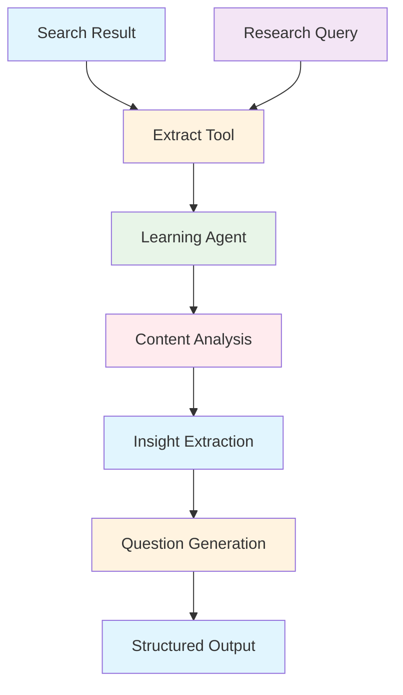
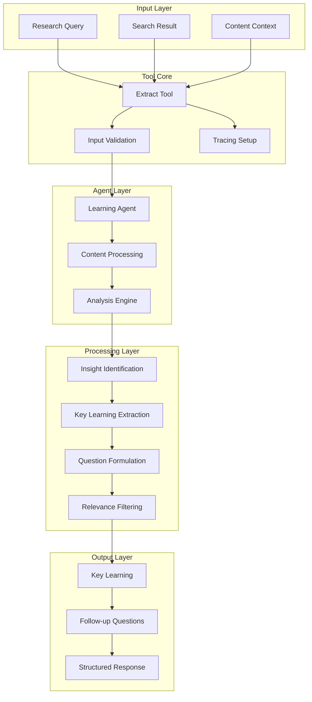

# Extract Learnings Tool Documentation

A Mastra tool for extracting key insights and generating follow-up questions from search results to enhance research depth.

## 1. Component Overview

### Purpose/Responsibility

- ELT-001: Extract key learnings from search result content
- ELT-002: Generate targeted follow-up questions for deeper research
- ELT-003: Support iterative research expansion and discovery
- ELT-004: Provide structured insights from unstructured content
- ELT-005: Enable research workflow optimization through learning extraction

### Key Features

- **Insight Extraction**: AI-powered identification of key learnings
- **Question Generation**: Automatic follow-up question creation
- **Content Analysis**: Deep analysis of search result content
- **Structured Output**: Consistent learning and question format
- **Tracing Integration**: AI span tracking for extraction operations

### Business Value

- Accelerates research discovery through automated insight extraction
- Improves research quality with targeted follow-up questions
- Supports iterative research methodologies
- Enables efficient knowledge synthesis from search results

## 2. Architecture Section

### C4 Context Diagram



### C4 Container Diagram



### Component Relationships

- **Input Dependencies**: Research query, search result with content
- **Output Consumers**: Research workflows, knowledge synthesis systems
- **External Systems**: Learning extraction agent, content analysis utilities
- **Internal Components**: Insight extraction engine, question generation logic

## 3. Interface Documentation

### Input Schema

| Property | Type | Required | Description |
|----------|------|----------|-------------|
| `query` | `string` | Yes | The original research query |
| `result` | `ResultObject` | Yes | Search result to analyze |

### Result Object Schema

| Property | Type | Description |
|----------|------|-------------|
| `title` | `string` | Result title |
| `url` | `string` | Result URL |
| `content` | `string` | Full result content |

### Output Schema

| Property | Type | Description |
|----------|------|-------------|
| `learning` | `string` | Key insight extracted from content |
| `followUpQuestions` | `string[]` | Array of follow-up questions (max 1) |

### Public Methods

| Method | Parameters | Return Type | Description |
|--------|------------|-------------|-------------|
| `execute()` | `context: ExtractionInput` | `Promise<ExtractionOutput>` | Extract learnings and questions |

## 4. Usage Examples

### Basic Learning Extraction

```typescript
import { extractLearningsTool } from './src/mastra/tools/extractLearningsTool';

const result = await extractLearningsTool.execute({
  context: {
    query: "How do renewable energy sources impact climate change?",
    result: {
      title: "Solar Power and Climate Benefits",
      url: "https://example.com/solar-climate",
      content: "Solar energy reduces carbon emissions by 95% compared to fossil fuels..."
    }
  },
  mastra: mastraInstance,
  tracingContext: tracingContext
});

// Result:
// {
//   "learning": "Solar energy can reduce carbon emissions by up to 95% compared to traditional fossil fuels",
//   "followUpQuestions": ["What are the comparative emission reductions for other renewable energy sources?"]
// }
```

### Research Workflow Integration

```typescript
// Within an iterative research process
const searchResults = await performSearch(query);
const learnings = [];

for (const searchResult of searchResults) {
  const extraction = await extractLearningsTool.execute({
    context: { query, result: searchResult },
    mastra: mastraInstance,
    tracingContext: tracingContext
  });

  learnings.push(extraction.learning);

  // Use follow-up questions for next research iteration
  if (extraction.followUpQuestions.length > 0) {
    const nextQuery = extraction.followUpQuestions[0];
    // Continue research with new question
  }
}
```

### Knowledge Synthesis

```typescript
const extractions = await Promise.all(
  searchResults.map(result =>
    extractLearningsTool.execute({
      context: { query: mainQuery, result },
      mastra: mastraInstance,
      tracingContext: tracingContext
    })
  )
);

// Synthesize learnings into comprehensive summary
const synthesis = extractions
  .map(ext => ext.learning)
  .join('\n\n');

const allQuestions = extractions
  .flatMap(ext => ext.followUpQuestions);
```

### Error Handling

```typescript
try {
  const extraction = await extractLearningsTool.execute({
    context: { query, result },
    mastra: mastraInstance,
    tracingContext: tracingContext
  });
} catch (error) {
  // Handle extraction failure
  console.log('Learning extraction failed, using fallback');
  const fallbackLearning = extractFallbackLearning(result);
}
```

## 5. Quality Attributes

### Security

- **Input Validation**: Schema validation for all input parameters
- **Content Sanitization**: Safe processing of search result content
- **Agent Access Control**: Proper agent authentication and authorization

### Performance

- **Efficient Extraction**: Optimized AI-powered content analysis
- **Content Limiting**: Automatic truncation for large content
- **Batch Processing**: Support for multiple extractions

### Reliability

- **Error Handling**: Comprehensive error catching with fallback responses
- **Agent Resilience**: Graceful handling when extraction agent unavailable
- **Consistent Output**: Standardized learning and question format

### Maintainability

- **Clean Architecture**: Separated extraction and question generation logic
- **Configuration**: Agent-based extraction configuration
- **Logging**: Detailed operation logging for debugging

### Extensibility

- **Learning Types**: Pluggable insight extraction algorithms
- **Question Strategies**: Configurable question generation approaches
- **Content Types**: Support for different content formats

## 6. Reference Information

### Dependencies

| Package | Version | Purpose |
|---------|---------|---------|
| `@mastra/core/tools` | ^0.1.0 | Tool framework |
| `@mastra/core/ai-tracing` | ^0.1.0 | AI tracing integration |
| `zod` | ^3.22.4 | Schema validation |

### Environment Variables

| Variable | Required | Default | Description |
|----------|----------|---------|-------------|
| None | - | - | Uses Mastra agent configuration |

### Testing

```bash
# Run extraction tool tests
npm test -- --grep "extract"

# Test learning extraction
npm run test:learning-extraction
```

### Troubleshooting

**Common Issues:**

1. **Agent Unavailable**: Check learning extraction agent configuration
2. **Content Too Large**: Review content length limits and truncation
3. **Quality Issues**: Monitor extraction accuracy and relevance

**Debug Commands:**

```bash
# Enable debug logging
DEBUG=extract:* npm run dev

# Check tool health
curl http://localhost:3000/api/health/extract
```

### Related Documentation

- [Learning Extraction Agent](../agents/learning-extraction-agent.md)
- [Research Methodologies](../guides/research-methods.md)
- [Knowledge Synthesis](../guides/knowledge-synthesis.md)

### Change History

| Version | Date | Changes |
|---------|------|---------|
| 1.0 | 2025-09-23 | Initial implementation with AI-powered extraction |
| 0.9 | 2025-09-20 | Added follow-up question generation |
| 0.8 | 2025-09-15 | Basic learning extraction functionality |