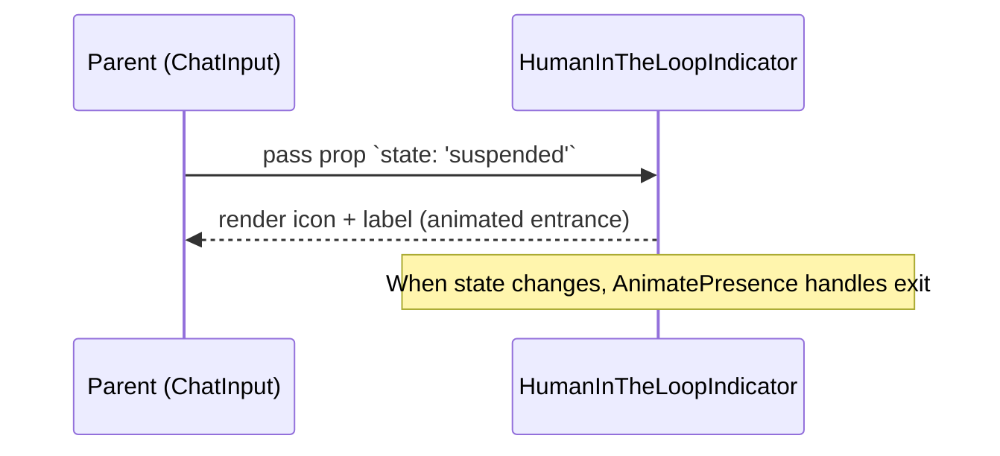

# HumanInTheLoopIndicator Documentation

A small, focused React UI component that displays the current human-in-the-loop workflow state (suspended, resumed, cancelled, timeout) using an icon, color, and short label. It's intended for use inside chat or workflow UI areas to provide clear, animated feedback about workflow state changes.

## 1. Component Overview

### Purpose/Responsibility

- OVR-001: Present a concise visual indicator for workflow/human-in-the-loop states.

- OVR-002: Scope includes rendering state-dependent iconography, color, and text, with an entrance/exit animation. It deliberately excludes state management logic and business rules; it consumes a simple `state` prop.

- OVR-003: Context: used in chat/workflow UI (e.g., near input or status panels) to inform users that a workflow is waiting on human input, was resumed/cancelled, or timed out.

## 2. Architecture Section

- ARC-001: Design patterns: Presentational/functional component pattern. Small single-responsibility component following React functional component best-practices.

- ARC-002: Dependencies:

  - React (functional component, JSX)

  - motion/react (AnimatePresence & motion for enter/exit animations)

  - lucide-react (icon components: Pause, Play, X, Clock)

  - Tailwind CSS utility classes (color and layout classes like `text-orange-500`, `flex`, etc.) — implied by class names used in the component.

- ARC-003: Interactions: Stateless consumer component. Parent components supply the `state` prop; this component renders and animates accordingly.

- ARC-004: Visual/behavioral decisions: Uses animation library `motion/react` for simple fade/slide enter-exit. Icon mapping is centralized in a `getStateConfig` function.

### Component Structure and Dependencies Diagram

```mermaid
graph TD
    subgraph "Component System"
        A[HumanInTheLoopIndicator] --> B[Icon (lucide-react)]
        A --> C[AnimatePresence & motion]
    end

    subgraph "Parent/UI"
        P[ChatInput / WorkflowPanel] --> A
    end

    subgraph "Styling"
        T[Tailwind CSS utility classes]
    end

    A --> T

    classDiagram
        class HumanInTheLoopIndicator {
            +props: HumanInTheLoopIndicatorProps
            +render(): JSX.Element | null
        }
        class Icon {
            <<external>>
            +render(): JSX.Element
        }

        HumanInTheLoopIndicator --> Icon
```

## 3. Interface Documentation

 - INT-001: Public interface is the component's props.

| Method/Property | Purpose | Parameters | Return Type | Usage Notes |
|-----------------|---------|------------|-------------|-------------|
| `state` (prop) | Determines visible indicator and styling | `"suspended" \| "resumed" \| "cancelled" \| "timeout"` | `JSX.Element \| null` | Required. If falsy, component returns `null` and renders nothing. |

### Prop Types

```ts
interface HumanInTheLoopIndicatorProps {
  state: 'suspended' | 'resumed' | 'cancelled' | 'timeout';
}
```

Notes:

- INT-003: No events/callbacks are emitted by this component; it is purely presentational.

## 4. Implementation Details

- IMP-001: The component is a React Functional Component that uses a small helper `getStateConfig()` to map the `state` prop to an icon component, color class, and label string.
- IMP-002: Initialization: none required. Styling and animation depend on project having Tailwind CSS and the `motion/react` package configured.
- IMP-003: Key logic: switch/case in `getStateConfig()` maps state to presentation values.
- IMP-004: Performance: tiny render and trivial computation. Animation introduces negligible overhead. No memoization is required unless rendered very frequently in a large list — in that case `React.memo` could be applied.

Corner cases and considerations:

- If an unknown state is passed, the component falls back to a default icon (Pause) and 'Unknown state' label. Consider validating input at the parent layer.

- The component checks for falsy `state` and returns `null` — ensures it doesn't render while state is undefined.

## 5. Usage Examples

### Basic Usage

```tsx
import { HumanInTheLoopIndicator } from 'cedar/components/chatInput/HumanInTheLoopIndicator';

function ChatStatus({ workflowState }: { workflowState: string }) {
  // Ensure type-safety at usage site
  const state = (['suspended','resumed','cancelled','timeout'] as const).includes(
    workflowState as any
  )
    ? (workflowState as 'suspended'|'resumed'|'cancelled'|'timeout')
    : undefined;

  return <HumanInTheLoopIndicator state={state} />;
}
```

### Interaction Sequence (mermaid)



### Example: Using inside ChatInput component

```tsx
function ChatInputWithState({ state }: { state?: string }) {
  return (
    <div className="chat-input-panel">
      <HumanInTheLoopIndicator state={state as any} />
      {/* ...other chat input UI... */}
    </div>
  );
}
```

### Advanced Usage (with conditional rendering and memoization)

```tsx
import React from 'react';
import { HumanInTheLoopIndicator } from 'cedar/components/chatInput/HumanInTheLoopIndicator';

const MemoHumanIndicator = React.memo(HumanInTheLoopIndicator);

function WorkflowHeader({ state }: { state?: string }) {
  if (!state) return null;
  return <MemoHumanIndicator state={state as any} />;
}
```

Best practices:

- Provide a typed `state` value from parent logic (avoid passing arbitrary strings).

- Keep this component pure; don't add side-effects. Let parent components handle business logic and state transitions.

## 6. Quality Attributes

- QUA-001 Security: No sensitive data handling. Safe to render in UI. Ensure icons and labels do not leak internal workflow identifiers in production.
- QUA-002 Performance: Lightweight render. If used in many places or in a list, wrap with `React.memo` to avoid unnecessary re-renders.
- QUA-003 Reliability: Deterministic rendering based on prop. Fallback for unknown states prevents crashes.
- QUA-004 Maintainability: Small, single-purpose file. Easy to extend with additional states by updating `getStateConfig()`.
- QUA-005 Extensibility: To add more states, extend the union type in props and add corresponding case in `getStateConfig`.

## 7. Reference Information

- REF-001: Dependencies (approximate):
  - react (>=17 / 18) - runtime
  - motion/react - animation utilities
  - lucide-react - icons
  - tailwindcss - utility classes for styling (project-level)

- REF-002: Configuration
  - Ensure `motion/react` is installed and imported correctly. No explicit initialization required.
  - Tailwind classes used; ensure Tailwind is configured or adapt classes to project CSS methodology.

- REF-003: Testing guidelines
  - Unit test: shallow render the component with each state and assert the label and icon presence.
  - Snapshot tests are useful for catching visual regressions when changing icon or layout.

- REF-004: Troubleshooting
  - Issue: component renders nothing — ensure `state` prop is passed and not falsy.
  - Issue: icons not found — verify `lucide-react` is installed and icons imported correctly.
  - Issue: animation not working — ensure `motion/react` is present and compatible with React version.

- REF-005: Related docs
  - `cedar/components/chatInput/` directory for related input and status components.

- REF-006: Change history
  - 1.0 (2025-09-23) - Initial documentation generated
