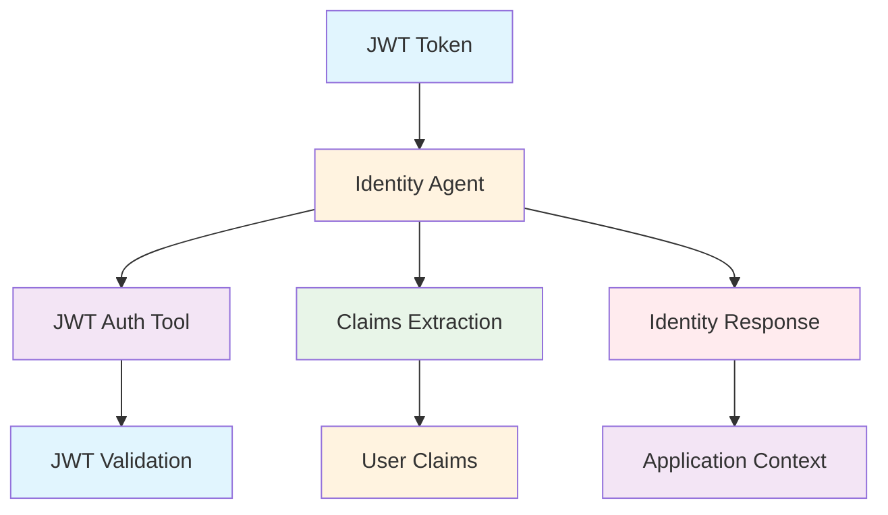
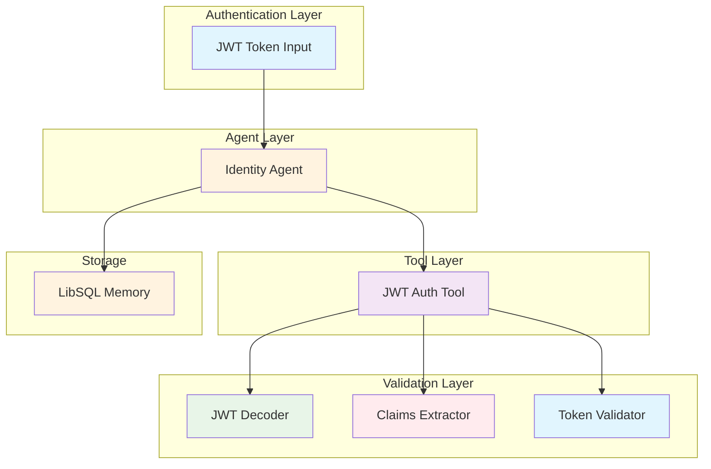
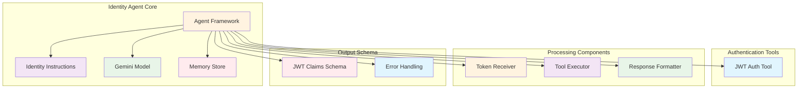

# Identity Agent (`src/mastra/agents/identity.agent.ts`)

## Overview

The Identity Agent is a specialized authentication and identity extraction agent that securely extracts user claims from JWT tokens. It serves as a secure interface between JWT authentication and application identity management, ensuring proper user context and access control.

## Architecture

### C4 Context Diagram



### C4 Container Diagram



### C4 Component Diagram



## Agent Configuration

### Agent Properties

#### `id: "identity"`
Unique identifier for the agent within the Mastra system.

#### `name: "identity"`
Human-readable name for the agent.

#### `description`
"An identity extraction agent that extracts user claims from a JWT token."

### Core Functionality

**Primary Task:** Extract user identity claims from JWT tokens

**Security Approach:** Uses dedicated JWT authentication tool for secure processing

**Error Handling:** Graceful handling of invalid or expired tokens

## Operational Instructions

The agent follows a strict 3-step process:

1. **Tool Execution**: Call the jwt-auth tool with the provided JWT token
2. **Claims Return**: Return extracted claims in exact received format
3. **Error Handling**: Return error message for invalid/expired JWTs

### Security Principles

- **Tool-Only Processing**: Never attempts manual JWT decoding
- **Secure Delegation**: Relies on specialized jwt-auth tool for all cryptographic operations
- **Format Preservation**: Returns claims exactly as received from validation tool

## Tool Integration

### JWT Authentication Tool

**Tool:** `jwtAuthTool`

**Purpose:** Secure JWT token validation and claims extraction

**Integration:** Mandatory tool usage for all identity operations

**Security:** Handles all cryptographic operations and token validation

## Output Schema

### Success Response Schema

```typescript
jwtClaimsSchema.extend({
  error: z.string().optional()
})
```

The output includes all JWT claims fields plus optional error handling.

### Error Response Schema

```typescript
{
  error: "Error message describing the JWT validation failure"
}
```

### Claims Structure

Based on `jwtClaimsSchema` from agent schemas, including:

- User identification fields
- Role and permission claims
- Token metadata
- Custom application claims

## Quality Attributes

### Security

- **Cryptographic Security**: Uses secure JWT validation tools
- **No Manual Decoding**: Prevents insecure token handling
- **Tool-Based Processing**: Centralized security through dedicated tools
- **Error Isolation**: Secure error messages without token exposure

### Reliability

- **Deterministic Processing**: Consistent claims extraction
- **Tool Dependency**: Reliable operation through proven tools
- **Error Handling**: Graceful failure management
- **Format Consistency**: Standardized output structure

### Performance

- **Lightweight Model**: Uses Gemini 2.5 Flash Lite for efficiency
- **Tool Optimization**: Fast cryptographic operations
- **Memory Efficiency**: Minimal resource usage
- **Quick Validation**: Rapid token processing

### Maintainability

- **Simple Logic**: Clear, focused functionality
- **Tool Abstraction**: Security logic isolated in tools
- **Schema Validation**: Type-safe input/output handling
- **Clear Instructions**: Explicit operational guidelines

## Dependencies

### Core Dependencies

- `@mastra/core`: Agent framework
- `@ai-sdk/google`: Google AI SDK for Gemini models
- `zod`: Schema validation
- `../schemas/agent-schemas`: JWT claims schema definition
- `../tools/jwt-auth.tool`: JWT authentication tool
- `../config/libsql-storage`: Memory storage implementation
- `../config/logger`: Logging infrastructure

## Configuration

### Model Configuration

**Model:** `google('gemini-2.5-flash-lite')`

**Rationale:** Lightweight model suitable for identity extraction tasks

### Memory Configuration

```typescript
const store = createResearchMemory();
// Uses LibSQL for persistent identity conversation storage
```

### Tool Configuration

```typescript
tools: { jwtAuth: jwtAuthTool }
```

### Required Environment Variables

```bash
GOOGLE_GENERATIVE_AI_API_KEY=your-api-key
```

## Troubleshooting

### Authentication Issues

1. **Invalid JWT Tokens**
   - Verify token format and structure
   - Check token expiration
   - Validate signing and issuer

2. **Tool Execution Failures**
   - Ensure jwt-auth tool is properly configured
   - Check tool dependencies and imports
   - Verify tool initialization

3. **Schema Validation Errors**
   - Confirm JWT claims match expected schema
   - Check for required vs optional fields
   - Validate claim data types

### Technical Issues

1. **Model Response Problems**
   - Verify API key configuration
   - Check model availability
   - Monitor response parsing

2. **Memory Storage Issues**
   - Check LibSQL connectivity
   - Verify storage configuration
   - Ensure proper session handling

3. **Import/Dependency Errors**
   - Validate all required imports
   - Check schema file locations
   - Ensure tool availability

## References

- [JWT RFC 7519](https://tools.ietf.org/html/rfc7519)
- [Google Gemini Models](https://ai.google.dev/models/gemini)
- [Mastra Agent Framework](https://mastra.ai/docs/agents)
- [OAuth 2.0 Token Standards](https://tools.ietf.org/html/rfc6749)