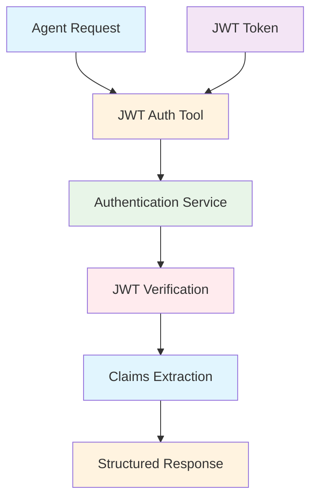
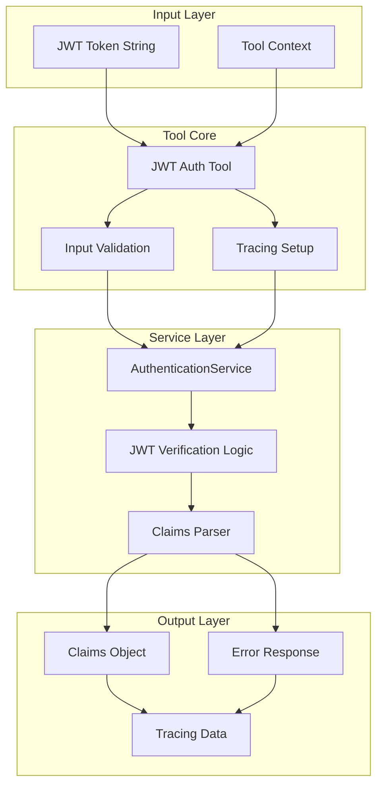

# JWT Auth Tool Documentation

A Mastra tool for JWT token verification and claims extraction with tracing support.

## 1. Component Overview

### Purpose/Responsibility

- JWT-001: Verify JWT tokens and extract claims
- JWT-002: Return structured authentication data (roles, tenant, stepUp)
- JWT-003: Provide tracing integration for security monitoring
- JWT-004: Handle JWT verification errors gracefully
- JWT-005: Support authentication workflows in Mastra agents

### Key Features

- **JWT Verification**: Validates JWT tokens using AuthenticationService
- **Claims Extraction**: Returns structured user claims and permissions
- **Tracing Integration**: AI span tracking for security monitoring
- **Error Handling**: Comprehensive error handling with logging
- **Schema Validation**: Input/output validation with Zod schemas

### Business Value

- Enables secure authentication in agent workflows
- Provides role-based access control data
- Supports multi-tenant authentication
- Facilitates step-up authentication flows

## 2. Architecture Section

### C4 Context Diagram



### C4 Container Diagram



### Component Relationships

- **Input Dependencies**: JWT token string, tool execution context
- **Output Consumers**: Agent workflows, authentication middleware
- **External Systems**: AuthenticationService, logging system
- **Internal Components**: JWT verification logic, claims extraction

## 3. Interface Documentation

### Input Schema

| Property | Type | Required | Description |
|----------|------|----------|-------------|
| `jwt` | `string` | Yes | JWT token to verify |

### Output Schema

| Property | Type | Description |
|----------|------|-------------|
| `sub` | `string` | User subject identifier |
| `roles` | `string[]` | Array of user roles |
| `tenant` | `string?` | Optional tenant identifier |
| `stepUp` | `boolean?` | Optional step-up authentication flag |
| `exp` | `number?` | Optional token expiration timestamp |
| `iat` | `number?` | Optional token issued-at timestamp |

### Public Methods

| Method | Parameters | Return Type | Description |
|--------|------------|-------------|-------------|
| `execute()` | `context: { jwt: string }` | `Promise<ClaimsObject>` | Execute JWT verification and return claims |

## 4. Usage Examples

### Basic JWT Verification

```typescript
import { jwtAuthTool } from './src/mastra/tools/jwt-auth.tool';

const result = await jwtAuthTool.execute({
  context: { jwt: "eyJhbGciOiJIUzI1NiIsInR5cCI6IkpXVCJ9..." },
  mastra: mastraInstance,
  tracingContext: tracingContext
});

// Result:
// {
//   "sub": "user123",
//   "roles": ["reader", "writer"],
//   "tenant": "engineering",
//   "stepUp": false,
//   "exp": 1634567890,
//   "iat": 1634564290
// }
```

### Agent Integration

```typescript
// Within a Mastra agent
const claims = await jwtAuthTool.execute({
  context: { jwt: tokenFromRequest },
  mastra: this.mastra,
  tracingContext: this.tracingContext
});

// Use claims for authorization
if (claims.roles.includes('admin')) {
  // Allow admin operations
}
```

### Error Handling

```typescript
try {
  const claims = await jwtAuthTool.execute({
    context: { jwt: invalidToken },
    mastra: mastraInstance,
    tracingContext: tracingContext
  });
} catch (error) {
  // Handle authentication failure
  console.error('JWT verification failed:', error.message);
}
```

## 5. Quality Attributes

### Security

- **Token Validation**: Proper JWT signature verification
- **Claims Sanitization**: Safe extraction of user claims
- **Tracing Security**: Secure logging without exposing sensitive data
- **Error Handling**: Prevents information leakage in error responses

### Performance

- **Fast Verification**: Efficient JWT parsing and validation
- **Minimal Overhead**: Lightweight claims extraction
- **Tracing Impact**: Minimal performance impact from AI tracing

### Reliability

- **Error Recovery**: Graceful handling of invalid tokens
- **Logging**: Comprehensive error logging for debugging
- **Schema Validation**: Input/output validation prevents runtime errors

### Maintainability

- **Clean Code**: Well-structured tool implementation
- **Documentation**: Comprehensive inline and external documentation
- **Testing**: Unit tests for verification scenarios

### Extensibility

- **Claims Extension**: Easy addition of new claim types
- **Service Integration**: Pluggable authentication service
- **Tracing Customization**: Configurable tracing behavior

## 6. Reference Information

### Dependencies

| Package | Version | Purpose |
|---------|---------|---------|
| `@mastra/core/tools` | ^0.1.0 | Tool framework |
| `@mastra/core/ai-tracing` | ^0.1.0 | AI tracing integration |
| `zod` | ^3.22.4 | Schema validation |

### Environment Variables

| Variable | Required | Default | Description |
|----------|----------|---------|-------------|
| None | - | - | Uses AuthenticationService configuration |

### Testing

```bash
# Run JWT auth tool tests
npm test -- --grep "jwt-auth"

# Test with mock tokens
npm run test:jwt-mock
```

### Troubleshooting

**Common Issues:**

1. **Invalid Token**: Check JWT format and signature
2. **Expired Token**: Verify token expiration time
3. **Schema Errors**: Ensure input matches expected schema

**Debug Commands:**

```bash
# Enable debug logging
DEBUG=jwt:* npm run dev

# Check tool health
curl http://localhost:3000/api/health/jwt-auth
```

### Related Documentation

- [AuthenticationService](../services/AuthenticationService.md)
- [JWT Utils](../lib/jwt-utils.md)
- [Security Guidelines](../guides/security.md)

### Change History

| Version | Date | Changes |
|---------|------|---------|
| 1.0 | 2025-09-23 | Initial implementation with tracing support |
| 0.9 | 2025-09-20 | Added comprehensive error handling |
| 0.8 | 2025-09-15 | Basic JWT verification functionality |