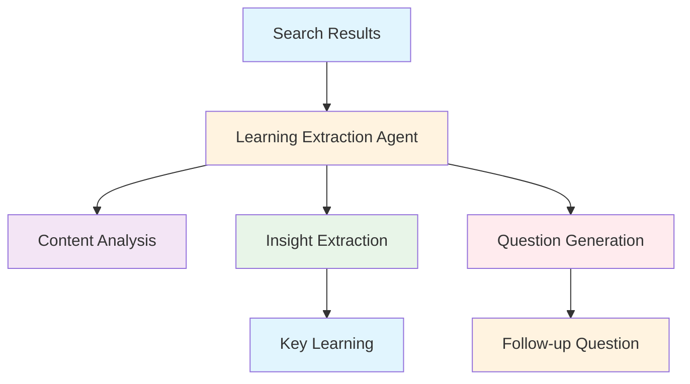
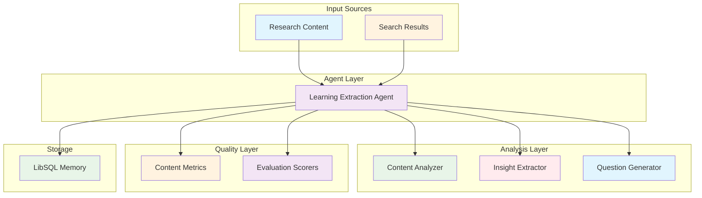
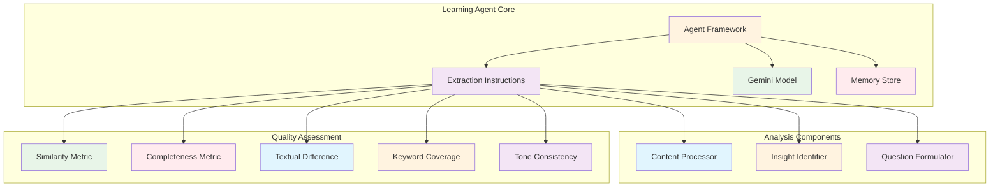

# Learning Extraction Agent (`src/mastra/agents/learningExtractionAgent.ts`)

## Overview

The Learning Extraction Agent is an expert research analyst that analyzes search results to extract the most valuable insights and generates targeted follow-up questions. It specializes in deepening research understanding by identifying critical information and formulating questions that lead to more comprehensive knowledge acquisition.

## Architecture

### C4 Context Diagram



### C4 Container Diagram



### C4 Component Diagram



## Agent Configuration

### Agent Properties

#### `id: "learning"`
Unique identifier for the agent within the Mastra system.

#### `name: "Learning Extraction Agent"`
Human-readable name for the agent.

#### `description`
"An expert at analyzing search results and extracting key insights to deepen research understanding."

### Core Expertise

**Primary Function:** Extract single most important learning from content and generate relevant follow-up questions

**Analysis Focus:** Actionable insights and specific information over general observations

**Research Enhancement:** Deepens understanding through targeted question generation

## Extraction Rules

The agent operates under strict guidelines for insight extraction:

### Content Focus

- **Actionable Insights**: Prioritizes specific, usable information
- **Critical Information**: Identifies the most valuable piece of content
- **Context Awareness**: Considers original research query context

### Learning Criteria

- **Most Valuable**: Extracts single most important learning
- **Specific Information**: Focuses on concrete details, not generalities
- **Research-Relevant**: Aligns with research objectives and goals

### Question Generation

- **Focused Questions**: Creates targeted follow-up questions
- **Depth Enhancement**: Designed to lead to deeper understanding
- **Research-Driven**: Advances the research agenda

## Output Format

### Required JSON Structure

```json
{
  "learning": "The most critical factor for success is X, as it directly impacts Y.",
  "followUpQuestion": "What are the specific metrics to measure the impact of X on Y?"
}
```

### Output Fields

#### `learning`

- **Type:** `string`
- **Description:** The single most important learning extracted from the content
- **Requirements:** Most valuable, actionable insight from the analyzed material

#### `followUpQuestion`

- **Type:** `string`
- **Description:** One relevant follow-up question for deeper research
- **Requirements:** Focused, designed to enhance understanding of the topic

### Format Requirements

- **JSON Only**: No text outside JSON structure
- **Valid JSON**: Properly formatted and parseable
- **Complete Response**: Both fields always required
- **Single Learning**: Only one key learning per content analysis

## Quality Metrics Integration

The agent includes comprehensive evaluation metrics:

### Content Similarity Metric

- Measures content similarity with case/whitespace insensitivity
- Evaluates insight consistency and overlap

### Completeness Metric

- Assesses learning completeness and thoroughness
- Measures insight adequacy for research needs

### Textual Difference Metric

- Analyzes textual variations in extracted learnings
- Evaluates insight diversity and uniqueness

### Keyword Coverage Metric

- Checks keyword presence in extracted insights (runtime keywords)
- Assesses topical alignment through keyword analysis

### Tone Consistency Metric

- Evaluates tone uniformity in learning extraction
- Ensures appropriate analytical communication

## Quality Attributes

### Analytical Precision

- **Insight Accuracy**: Accurate identification of most valuable information
- **Learning Quality**: High-value, actionable insights extraction
- **Context Relevance**: Appropriate consideration of research context
- **Focus Clarity**: Clear distinction between critical and peripheral information

### Research Enhancement

- **Question Quality**: Effective follow-up questions for deeper research
- **Knowledge Advancement**: Contributions to research understanding
- **Insight Depth**: Extraction of meaningful, non-obvious learnings
- **Research Alignment**: Questions aligned with research objectives

### Operational Efficiency

- **Single Learning Focus**: Efficient extraction of one key insight
- **Structured Output**: Consistent JSON response format
- **Model Optimization**: Uses Gemini 2.5 Flash for quality analysis
- **Memory Integration**: Persistent learning context storage

### Reliability

- **Deterministic Extraction**: Systematic insight identification process
- **Quality Validation**: Integrated evaluation metrics
- **Format Compliance**: Strict adherence to JSON output requirements
- **Consistency**: Uniform extraction standards across content

### Maintainability

- **Clear Rules**: Explicit extraction guidelines and criteria
- **Modular Metrics**: Separated quality assessment components
- **Structured Process**: Well-defined analysis workflow
- **Documentation**: Comprehensive extraction rules and examples

## Dependencies

### Core Dependencies

- `@mastra/core/agent`: Agent framework
- `@ai-sdk/google`: Google AI SDK for Gemini models
- `@mastra/evals/nlp`: NLP evaluation metrics
- `../config/libsql-storage`: Memory storage implementation
- `../config/logger`: Logging infrastructure

## Configuration

### Model Configuration

**Model:** `google('gemini-2.5-flash')`

**Rationale:** High-quality model for complex insight extraction and analysis

### Memory Configuration

```typescript
const store = createResearchMemory();
// Uses LibSQL for persistent learning extraction conversation storage
```

### Evaluation Metrics Configuration

```typescript
evals: {
  contentSimilarity: new ContentSimilarityMetric({
    ignoreCase: true,
    ignoreWhitespace: true
  }),
  completeness: new CompletenessMetric(),
  textualDifference: new TextualDifferenceMetric(),
  keywordCoverage: new KeywordCoverageMetric(),
  toneConsistency: new ToneConsistencyMetric(),
}
```

### Required Environment Variables

```bash
GOOGLE_GENERATIVE_AI_API_KEY=your-api-key
```

## Troubleshooting

### Extraction Quality Issues

1. **Poor Insight Selection**
   - Review extraction rules for actionable insights
   - Ensure focus on most valuable information
   - Validate research context consideration

2. **Irrelevant Questions**
   - Check question focus and depth requirements
   - Ensure alignment with extracted learning
   - Verify research advancement potential

3. **Inconsistent Quality**
   - Validate application of extraction criteria
   - Check for rule adherence
   - Review quality metric results

### Technical Issues

1. **JSON Format Errors**
   - Validate JSON structure compliance
   - Ensure both required fields are present
   - Check for proper string formatting

2. **Model Response Issues**
   - Verify API key configuration
   - Check model availability and performance
   - Monitor extraction quality consistency

3. **Memory Storage Problems**
   - Check LibSQL connectivity
   - Verify storage configuration
   - Ensure proper session management

## References

- [Google Gemini Models](https://ai.google.dev/models/gemini)
- [Learning Analytics Standards](https://www.ieee.org)
- [Research Methodology](https://www.apa.org/research)
- [Knowledge Extraction Techniques](https://en.wikipedia.org/wiki/Knowledge_extraction)