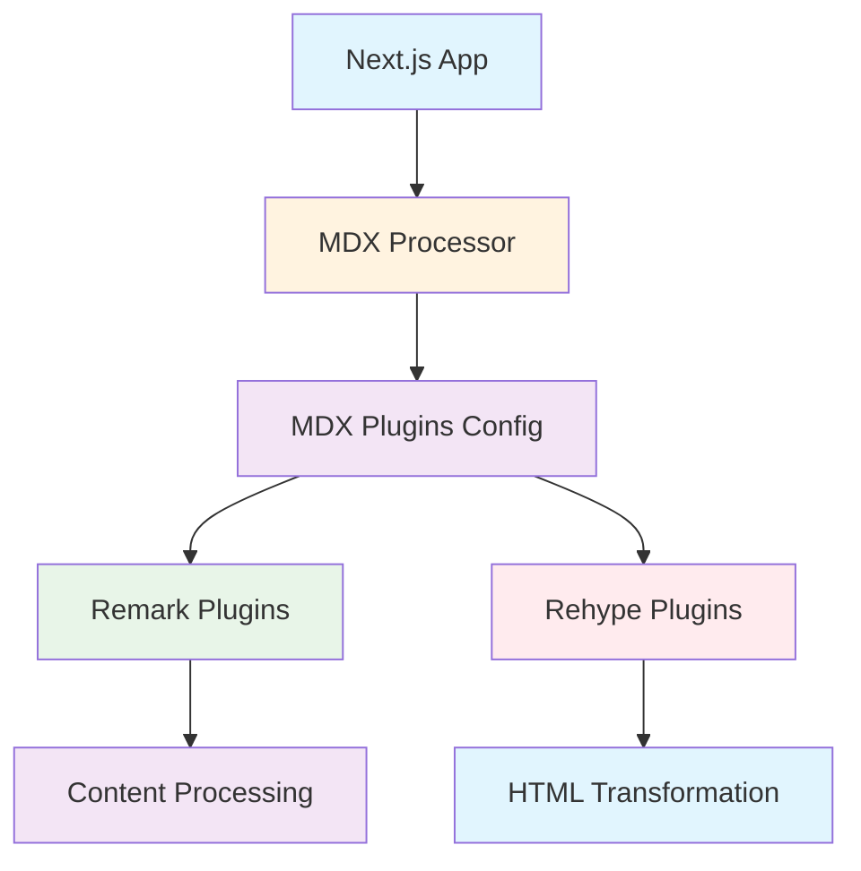
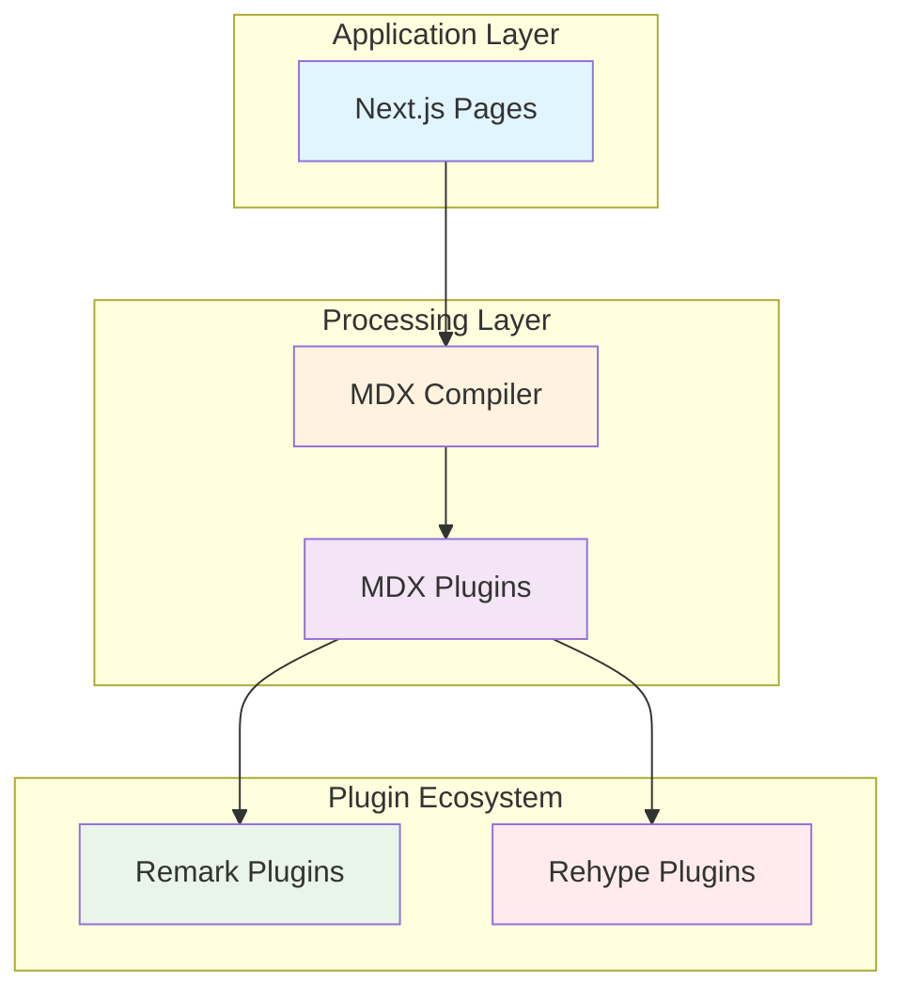
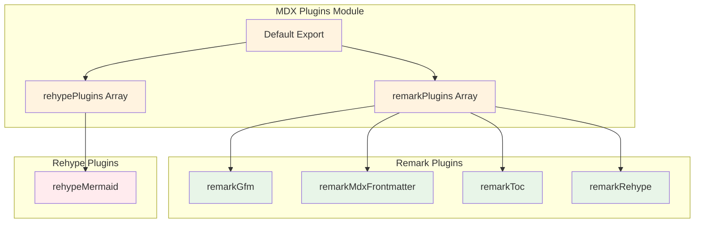

# MDX Processing Plugins (`lib/mdx-plugins.ts`)

## Overview

The MDX Processing Plugins module provides a centralized configuration for remark and rehype plugins used in MDX content processing. This module enables rich markdown features including GitHub Flavored Markdown, frontmatter extraction, table of contents generation, and Mermaid diagram rendering.

## Architecture

### C4 Context Diagram



### C4 Container Diagram



### C4 Component Diagram



## Interfaces and Exports

### Exports

#### `remarkPlugins: Array`

An array of remark plugins for markdown processing.

**Type:** `Array<Plugin>`

**Contents:**

- `remarkGfm`: GitHub Flavored Markdown support
- `remarkMdxFrontmatter`: Frontmatter extraction for MDX
- `remarkToc`: Table of contents generation
- `remarkRehype`: Markdown to HTML transformation

#### `rehypePlugins: Array`

An array of rehype plugins for HTML processing.

**Type:** `Array<Plugin>`

**Contents:**

- `rehypeMermaid`: Mermaid diagram rendering in HTML

#### `default: Object`

Default export containing both plugin arrays.

**Type:** `{ remarkPlugins: Array, rehypePlugins: Array }`

## Usage Examples

### Basic MDX Configuration

```typescript
import { remarkPlugins, rehypePlugins } from '@/lib/mdx-plugins'

// Use in Next.js MDX configuration
const mdxOptions = {
    remarkPlugins: remarkPlugins,
    rehypePlugins: rehypePlugins,
}
```

### Next.js MDX Remote Integration

```typescript
import { MDXRemote } from 'next-mdx-remote';
import { remarkPlugins, rehypePlugins } from '@/lib/mdx-plugins';

const components = { /* custom components */ };

export default function MDXPage({ source }) {
  return (
    <MDXRemote
      {...source}
      components={components}
      options={{
        remarkPlugins: remarkPlugins,
        rehypePlugins: rehypePlugins,
      }}
    />
  );
}
```

### Custom Plugin Extension

```typescript
import { remarkPlugins, rehypePlugins } from '@/lib/mdx-plugins'
import remarkCustom from 'remark-custom-plugin'

// Extend with additional plugins
const extendedRemarkPlugins = [...remarkPlugins, remarkCustom]

const extendedRehypePlugins = [
    ...rehypePlugins,
    // Add more rehype plugins
]
```

## Plugin Details

### Remark Plugins

#### remark-gfm

- **Purpose**: Enables GitHub Flavored Markdown features
- **Features**: Tables, strikethrough, task lists, autolinks
- **Documentation**: [remark-gfm](https://github.com/remarkjs/remark-gfm)

#### remark-mdx-frontmatter

- **Purpose**: Extracts frontmatter from MDX files
- **Features**: YAML/TOML frontmatter parsing
- **Documentation**: [remark-mdx-frontmatter](https://github.com/remcohaszing/remark-mdx-frontmatter)

#### remark-toc

- **Purpose**: Generates table of contents
- **Features**: Automatic heading-based TOC generation
- **Documentation**: [remark-toc](https://github.com/remarkjs/remark-toc)

#### remark-rehype

- **Purpose**: Converts markdown to HTML AST
- **Features**: Core markdown to HTML transformation
- **Documentation**: [remark-rehype](https://github.com/remarkjs/remark-rehype)

### Rehype Plugins

#### rehype-mermaid

- **Purpose**: Renders Mermaid diagrams in HTML
- **Features**: Flowcharts, sequence diagrams, Gantt charts
- **Documentation**: [rehype-mermaid](https://github.com/remcohaszing/rehype-mermaid)

## Quality Attributes

### Functionality

- **Feature Rich**: Supports comprehensive markdown features
- **Diagram Support**: Mermaid diagram rendering capabilities
- **Frontmatter Processing**: Metadata extraction from documents
- **TOC Generation**: Automatic table of contents creation

### Reliability

- **Plugin Stability**: Uses well-maintained, stable plugins
- **Error Handling**: Plugins handle malformed content gracefully
- **Type Safety**: Full TypeScript support with proper typing

### Performance

- **Efficient Processing**: Lightweight plugin composition
- **Streaming Compatible**: Works with streaming MDX processing
- **Memory Efficient**: Minimal memory footprint

### Maintainability

- **Modular Design**: Easy to extend with additional plugins
- **Clear Separation**: Separate remark and rehype plugin arrays
- **Documentation**: Comprehensive plugin documentation and examples

## Configuration

### Dependencies

```json
{
    "remark-gfm": "^4.x.x",
    "remark-mdx-frontmatter": "^4.x.x",
    "remark-toc": "^9.x.x",
    "remark-rehype": "^11.x.x",
    "rehype-mermaid": "^2.x.x"
}
```

### Next.js Integration

Add to `next.config.mjs`:

```javascript
import { remarkPlugins, rehypePlugins } from './lib/mdx-plugins.js'

/** @type {import('next').NextConfig} */
const nextConfig = {
    // ... other config
    experimental: {
        mdxRs: {
            remarkPlugins: remarkPlugins,
            rehypePlugins: rehypePlugins,
        },
    },
}

export default nextConfig
```

## Troubleshooting

### Common Issues

1. **Plugin Loading Errors**
    - Ensure all dependencies are installed
    - Check plugin version compatibility
    - Verify import paths are correct

2. **Mermaid Rendering Issues**
    - Ensure `rehype-mermaid` is properly configured
    - Check for valid Mermaid syntax in markdown
    - Verify CSS styles are loaded for diagrams

3. **Frontmatter Parsing Problems**
    - Use valid YAML/TOML syntax
    - Ensure frontmatter is at the top of the file
    - Check for syntax errors in metadata

4. **TOC Generation Issues**
    - Ensure headings have proper hierarchy
    - Check for duplicate heading IDs
    - Verify TOC placement in document

## References

- [MDX Documentation](https://mdxjs.com/)
- [Remark Ecosystem](https://github.com/remarkjs/remark)
- [Rehype Ecosystem](https://github.com/rehypejs/rehype)
- [Mermaid Diagrams](https://mermaid.js.org/)
- [Next.js MDX Guide](https://nextjs.org/docs/advanced-features/using-mdx)
