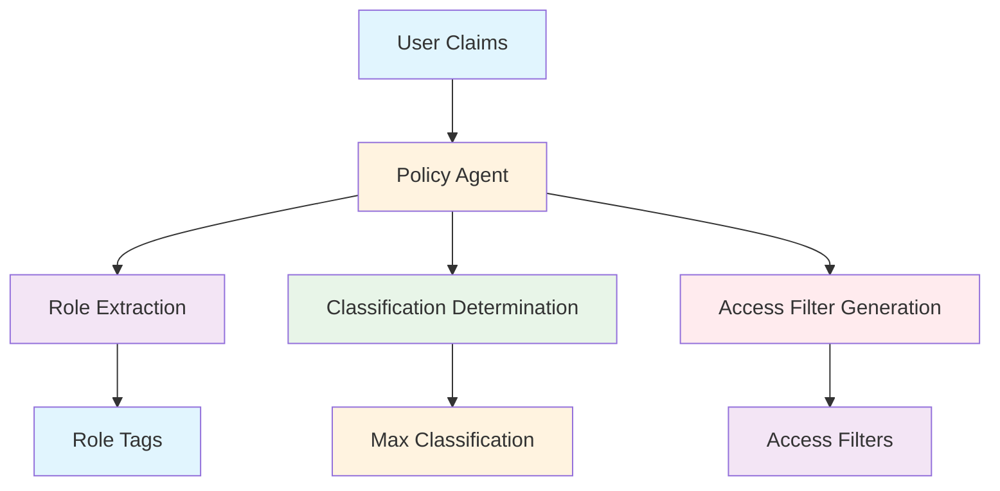

# Policy Agent (`src/mastra/agents/policy.agent.ts`)

## Overview

The Policy Agent is a security-focused policy enforcement agent that generates access filters based on user JWT claims. It implements role-based access control (RBAC) rules to determine appropriate data access levels and classification restrictions, ensuring secure and compliant information access.

## Architecture

### C4 Context Diagram



### C4 Container Diagram


### C4 Component Diagram


## Agent Configuration

### Agent Properties

#### `id: "policy"`
Unique identifier for the agent within the Mastra system.

#### `name: "policy"`
Human-readable name for the agent.

#### `description`
"A policy enforcement agent that generates access filters based on user claims."

### Core Functionality

**Primary Task:** Generate access filters from user JWT claims

**Security Focus:** Implement RBAC and data classification policies

**Compliance:** Ensure appropriate access levels based on user roles and privileges

## Policy Rules

The agent operates under strict security rules:

### Role Processing

1. **Role Extraction**: Extract roles from claims and create "role:<role>" tags
2. **Tenant Processing**: Add "tenant:<tenant>" tag if tenant is provided
3. **No Invention**: Never create roles or tenants not present in claims

### Classification Determination

**Maximum Classification Levels:**
- **stepUp == true**: Allow up to "confidential"
- **HR roles** (hr.admin, hr.viewer): Allow up to "confidential"
- **Other sensitive roles** without stepUp: Cap at "internal"
- **No sensitive roles**: Cap at "public"

### Security Principles

- **Conservative Access**: Default to most restrictive access level
- **Explicit Permissions**: Only grant access explicitly defined in claims
- **Hierarchical Security**: Respect classification level hierarchies

## Access Filter Generation

### Output Schema

```typescript
accessFilterSchema.extend({
  maxClassification: z.enum(["public", "internal", "confidential"])
})
```

### Filter Structure

```json
{
  "allowTags": ["role:finance.viewer", "tenant:acme"],
  "maxClassification": "internal"
}
```

### Tag Generation

- **Role Tags**: `role:<role_name>` for each role in claims
- **Tenant Tags**: `tenant:<tenant_name>` if tenant provided
- **Security Tags**: Automatically applied based on role permissions

## Classification Matrix

### Public Classification

- **Access Level**: Basic public information
- **User Types**: Standard users without sensitive roles
- **Content Types**: Non-sensitive, publicly available information

### Internal Classification

- **Access Level**: Internal company information
- **User Types**: Standard business users with department roles
- **Content Types**: Internal policies, procedures, and business data

### Confidential Classification

- **Access Level**: Highly sensitive information
- **User Types**: HR personnel and users with step-up authentication
- **Content Types**: Personnel data, financial information, strategic plans

## Usage Examples

### Finance User Example

**Input Claims:**

```json
{
  "roles": ["finance.viewer"],
  "tenant": "acme",
  "stepUp": false
}
```

**Generated Filter:**

```json
{
  "allowTags": ["role:finance.viewer", "tenant:acme"],
  "maxClassification": "internal"
}
```

### HR User Example

**Input Claims:**

```json
{
  "roles": ["hr.viewer"],
  "tenant": "acme",
  "stepUp": false
}
```

**Generated Filter:**

```json
{
  "allowTags": ["role:hr.viewer", "tenant:acme"],
  "maxClassification": "confidential"
}
```

## Quality Attributes

### Security

- **Access Control**: Strict enforcement of RBAC policies
- **Classification Integrity**: Proper data classification level assignment
- **Claim Validation**: Verification of user claims authenticity
- **Conservative Defaults**: Secure default access restrictions

### Compliance

- **Policy Adherence**: Strict compliance with organizational security policies
- **Audit Trail**: Clear decision-making process for access control
- **Regulatory Compliance**: Support for data protection and privacy requirements
- **Role Consistency**: Uniform role-based access across the system

### Reliability

- **Deterministic Processing**: Consistent filter generation from identical claims
- **Schema Validation**: Type-safe input and output validation
- **Error Prevention**: Validation prevents invalid access configurations
- **Memory Persistence**: Reliable policy decision storage

### Performance

- **Lightweight Model**: Uses Gemini 2.5 Flash Lite for efficient processing
- **Fast Processing**: Quick policy evaluation and filter generation
- **Memory Efficiency**: Minimal resource usage for policy decisions
- **Scalable Rules**: Efficient rule evaluation for various role combinations

### Maintainability

- **Clear Rules**: Explicit policy rules and classification logic
- **Modular Design**: Separated role processing and classification components
- **Schema-Driven**: Type-safe policy configuration
- **Documentation**: Comprehensive security rule documentation

## Dependencies

### Core Dependencies

- `@mastra/core`: Agent framework
- `@ai-sdk/google`: Google AI SDK for Gemini models
- `zod`: Schema validation
- `../schemas/agent-schemas`: Access filter and claims schemas
- `../config/libsql-storage`: Memory storage implementation
- `../config/logger`: Logging infrastructure

## Configuration

### Model Configuration

**Model:** `google('gemini-2.5-flash-lite')`

**Rationale:** Lightweight model suitable for policy evaluation tasks

### Memory Configuration

```typescript
const store = createResearchMemory();
// Uses LibSQL for persistent policy conversation storage
```

### Required Environment Variables

```bash
GOOGLE_GENERATIVE_AI_API_KEY=your-api-key
```

## Troubleshooting

### Policy Generation Issues

1. **Incorrect Classification Levels**
   - Verify role definitions and stepUp status
   - Check classification matrix application
   - Validate HR role identification

2. **Missing Tags**
   - Ensure all roles are extracted from claims
   - Verify tenant inclusion when provided
   - Check tag format compliance

3. **Access Filter Errors**
   - Validate schema compliance
   - Check enum value restrictions
   - Ensure proper JSON formatting

### Security Issues

1. **Over-Permissive Access**
   - Review classification determination logic
   - Verify conservative default application
   - Check role privilege escalation prevention

2. **Under-Restrictive Access**
   - Validate classification caps for non-sensitive roles
   - Ensure stepUp requirement enforcement
   - Check tenant isolation implementation

### Technical Issues

1. **Schema Validation Errors**
   - Verify input claims structure
   - Check output schema compliance
   - Validate enum restrictions

2. **Model Response Problems**
   - Verify API key configuration
   - Check model availability
   - Monitor policy generation consistency

## References

- [Role-Based Access Control (RBAC)](https://en.wikipedia.org/wiki/Role-based_access_control)
- [Google Gemini Models](https://ai.google.dev/models/gemini)
- [Data Classification Standards](https://www.iso.org/standard/63447.html)
- [JWT RFC 7519](https://tools.ietf.org/html/rfc7519)