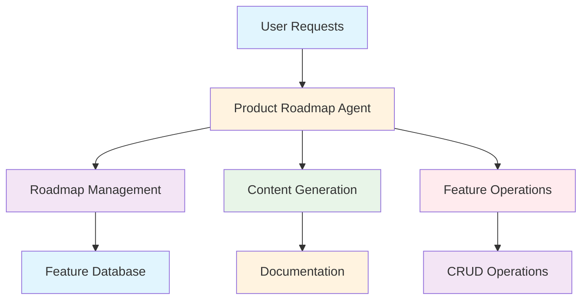
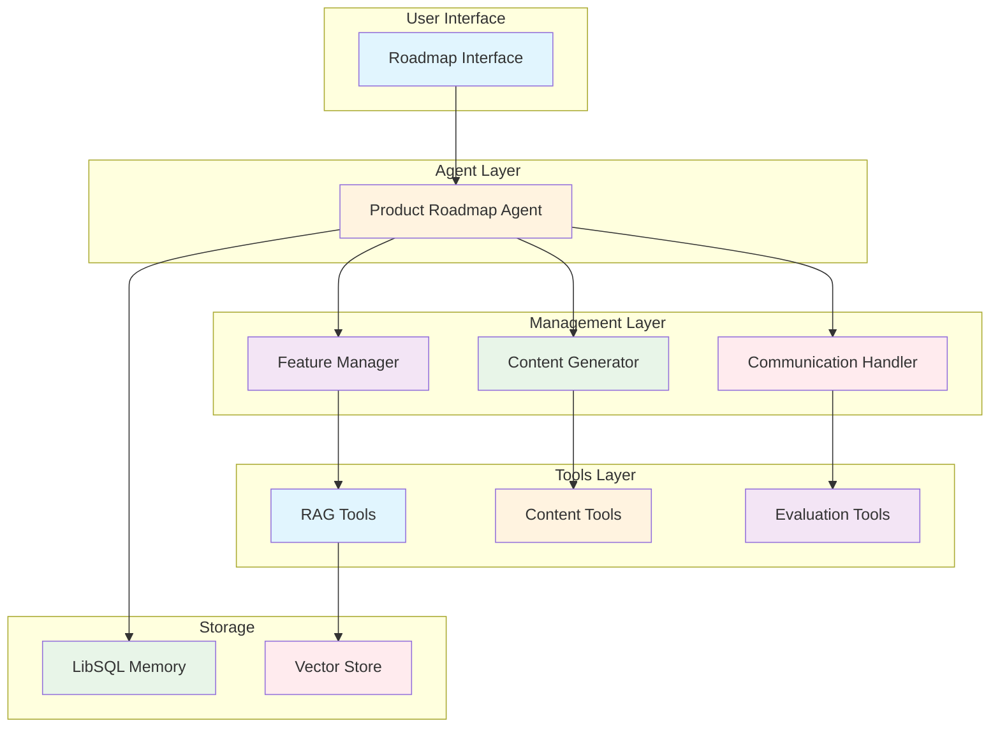
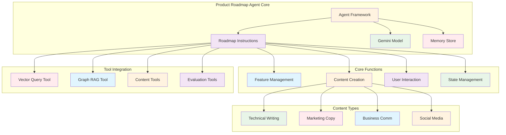

# Product Roadmap Agent (`src/mastra/agents/productRoadmapAgent.ts`)

## Overview

The Product Roadmap Agent is a comprehensive product management assistant for the Cedar open source project. It manages feature roadmaps, handles user requests, and provides content generation capabilities for documentation, communications, and feature descriptions. Cedar is a JavaScript library that provides tools for building interactive AI applications.

## Architecture

### C4 Context Diagram



### C4 Container Diagram



### C4 Component Diagram



## Agent Configuration

### Agent Properties

#### `id: "productRoadmap"`
Unique identifier for the agent within the Mastra system.

#### `name: "Product Roadmap Agent"`
Human-readable name for the agent.

#### `description`
"Manages the product roadmap for the Cedar project, including features, priorities, and requests with enhanced content generation capabilities."

### Project Context

**Project**: Cedar - JavaScript library for building interactive AI applications

**Domain**: Open source project management and product development

**Capabilities**: Feature management, content generation, user interaction

## Core Functions

### Feature Management

- **Roadmap Navigation**: Help users understand feature priorities and status
- **Feature Requests**: Assist with creating new feature requests
- **Voting System**: Allow users to vote on important features
- **Comments**: Enable user comments on features
- **Relationships**: Show parent/child feature relationships

### Content Generation

- **Feature Documentation**: Technical specifications and user guides
- **Communications**: Release announcements and status updates
- **Marketing Content**: Feature descriptions and promotional materials
- **Social Media**: Platform-appropriate content creation

### User Interaction

- **Information Retrieval**: Find specific feature information
- **Status Updates**: Provide feature status and priority details
- **Relationship Mapping**: Show feature dependencies and hierarchies
- **Content Improvement**: Edit and enhance existing content

## Roadmap Structure

### Feature Hierarchy

The roadmap uses a tree structure with parent-child feature relationships:

- **Parent Features**: High-level capabilities or epics
- **Child Features**: Specific implementations or sub-features
- **Dependencies**: Feature relationships and prerequisites

### Feature Properties

Each feature includes:

- **ID**: Unique identifier
- **Title**: Feature name
- **Description**: Detailed feature explanation
- **Status**: Current development state
- **Priority**: Business importance level
- **Votes**: User interest indicators
- **Comments**: User feedback and discussions

## Feature Statuses

### Available Statuses

- **planned**: Features planned but not yet started
- **in-progress**: Features currently being developed
- **completed**: Features that have been finished
- **cancelled**: Features that were planned but later cancelled

### Status Transitions

Features progress through statuses based on development workflow and priorities.

## Feature Priorities

### Priority Levels

- **low**: Nice-to-have features with minimal impact
- **medium**: Important features that add value but are not urgent
- **high**: Important features that should be prioritized
- **critical**: Must-have features that are top priority

### Priority Assignment

Priorities are assigned based on business value, user impact, and strategic importance.

## Content Generation Capabilities

### Content Types

#### Technical Content
- API documentation and technical specifications
- Implementation guides and developer resources
- Code examples and integration instructions

#### Marketing Content
- Feature announcements and promotional materials
- User-facing descriptions and value propositions
- Release notes and product updates

#### Business Communications
- Status updates and progress reports
- Stakeholder communications and presentations
- Professional correspondence and documentation

#### Social Media Content
- Platform-optimized posts and updates
- Community engagement content
- Shareable feature highlights

### Content Creation Tools

#### Copywriter Tool Integration

- Creates various content types based on specified format
- Adapts tone and style for different audiences
- Generates professional, engaging content

#### Editor Tool Integration

- Improves existing content clarity and quality
- Enhances readability and professional presentation
- Polishes communications before publication

## Tool Integration

### Research Tools

#### Vector Query Tool
Semantic search for relevant information in the knowledge base.

#### Graph RAG Tool
Graph-based search for complex relationships and context.

### Content Tools

#### Extract Learning Tool
Analyzes content to extract key insights and learnings.

#### Copywriter Tool
Generates content across multiple formats and purposes.

#### Editor Tool
Refines and improves written content quality.

#### Evaluate Result Tool
Assesses content quality and relevance.

## Action Handling

### State Modification Actions

The agent can perform roadmap modifications through structured actions:

#### Add Node Action

```json
{
  "type": "setState",
  "stateKey": "nodes",
  "setterKey": "addNode",
  "args": [{"data": {"title": "...", "description": "...", "status": "...", "nodeType": "feature", "upvotes": 0, "comments": []}}],
  "content": "Added new feature to roadmap"
}
```

#### Remove Node Action

```json
{
  "type": "setState",
  "stateKey": "nodes",
  "setterKey": "removeNode",
  "args": ["nodeId"],
  "content": "Removed feature from roadmap"
}
```

#### Change Node Action

```json
{
  "type": "setState",
  "stateKey": "nodes",
  "setterKey": "changeNode",
  "args": [{"id": "nodeId", "data": {"status": "completed"}}],
  "content": "Updated feature status"
}
```

## Response Format

### Standard Response

```json
{
  "content": "Your informative response"
}
```

### Action Response

```json
{
  "content": "Action description",
  "object": {
    "type": "setState",
    "stateKey": "nodes",
    "setterKey": "addNode|removeNode|changeNode",
    "args": [...],
    "content": "Human-readable action description"
  }
}
```

## Quality Attributes

### Product Management

- **Feature Organization**: Clear hierarchy and relationship management
- **Status Tracking**: Accurate feature lifecycle management
- **Priority Management**: Effective prioritization based on business value
- **User Engagement**: Voting and commenting capabilities

### Content Quality

- **Generation Capability**: High-quality content across multiple formats
- **Editing Excellence**: Professional content improvement and polishing
- **Audience Adaptation**: Appropriate tone and style for different contexts
- **Technical Accuracy**: Precise technical documentation and specifications

### User Experience

- **Information Access**: Easy feature information retrieval
- **Interaction Design**: Intuitive roadmap navigation and management
- **Communication Clarity**: Clear, informative responses and updates
- **Content Value**: Useful, actionable content for all stakeholders

### Operational Excellence

- **Tool Integration**: Seamless integration of research and content tools
- **State Management**: Reliable roadmap state modifications
- **Memory Persistence**: Consistent conversation context across sessions
- **Performance**: Efficient processing with Gemini 2.5 Flash model

### Maintainability

- **Structured Actions**: Clear, consistent action handling patterns
- **Modular Tools**: Separated concerns across tool categories
- **Clear Guidelines**: Explicit content generation and management rules
- **Documentation**: Comprehensive feature and content specifications

## Dependencies

### Core Dependencies

- `@mastra/core/agent`: Agent framework
- `@ai-sdk/google`: Google AI SDK for Gemini models
- `@mastra/rag`: RAG tools for vector and graph search
- `@mastra/libsql`: LibSQL integration and prompts
- `../config/libsql-storage`: Memory storage implementation
- `../config/logger`: Logging infrastructure

### Tool Dependencies

- `../tools/extractLearningsTool`: Learning extraction capabilities
- `../tools/editor-agent-tool`: Content editing tools
- `../tools/copywriter-agent-tool`: Content generation tools
- `../tools/evaluateResultTool`: Content evaluation tools

## Configuration

### Model Configuration

**Model:** `google('gemini-2.5-flash')`

**Rationale:** High-quality model for complex product management and content generation

### Vector Store Configuration

```typescript
vectorStoreName: "vectorStore"
indexName: STORAGE_CONFIG.VECTOR_INDEXES.RESEARCH_DOCUMENTS
dimension: 3072
```

### Graph RAG Configuration

```typescript
graphOptions: {
  threshold: 0.7,
  dimension: 3072,
  randomWalkSteps: 15,
  restartProb: 0.3
}
```

### Memory Configuration

```typescript
const store = createResearchMemory();
// Uses LibSQL for persistent product roadmap conversation storage
```

### Required Environment Variables

```bash
GOOGLE_GENERATIVE_AI_API_KEY=your-api-key
```

## Troubleshooting

### Feature Management Issues

1. **Action Format Errors**
   - Ensure correct JSON structure for state modifications
   - Validate action types and required fields
   - Check argument formatting for each action type

2. **Feature Relationship Problems**
   - Verify parent/child relationship specifications
   - Check feature ID consistency
   - Validate hierarchy constraints

3. **Status Transition Issues**
   - Ensure valid status transitions
   - Check workflow compliance
   - Verify permission requirements

### Content Generation Issues

1. **Content Type Mismatches**
   - Specify correct contentType for intended audience
   - Match tone with content purpose
   - Verify tool selection appropriateness

2. **Quality Issues**
   - Use editor tool for content improvement
   - Apply evaluation tools for quality assessment
   - Review content against style guidelines

3. **Tool Integration Problems**
   - Check tool availability and configuration
   - Verify tool parameter specifications
   - Ensure proper tool chaining

## References

- [Cedar Project](https://cedar.ai)
- [Product Roadmap Management](https://www.productplan.com/glossary/product-roadmap/)
- [Content Strategy Best Practices](https://contentmarketinginstitute.com)
- [Agile Product Management](https://www.agilealliance.org/agile-product-management/)
