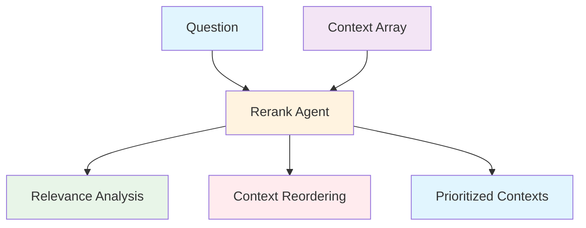
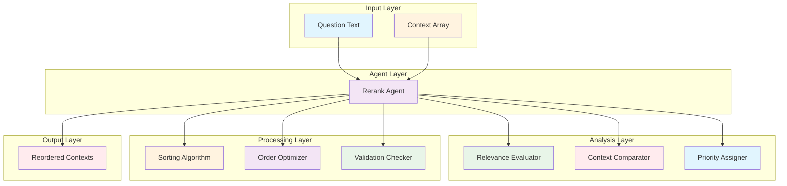
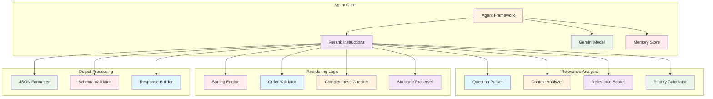

# Rerank Agent (`src/mastra/agents/rerank.agent.ts`)

## Overview

The Rerank Agent is a specialized context analysis and prioritization agent that evaluates and reorders document contexts based on their relevance to a specific question. It uses intelligent ranking algorithms to ensure that the most pertinent information appears first, improving the quality and efficiency of downstream processing in the RAG pipeline.

## Architecture

### C4 Context Diagram



### C4 Container Diagram



### C4 Component Diagram



## Agent Configuration

### Agent Properties

#### `id: "rerank"`
Unique identifier for the agent within the Mastra system.

#### `name: "rerank"`
Human-readable name for the agent.

#### `description`
"A context reranking agent that reorders provided contexts based on their relevance to the question."

### Core Expertise

**Primary Function:** Analyze and reorder document contexts by relevance

**Specialization:** Information prioritization and context optimization

**Output Format:** Reordered array of context objects with preserved properties

## Input Data Structure

The agent processes question-context pairs in the following format:

### Question Input

- **Type:** String
- **Description:** The question or query for which contexts need to be ranked
- **Example:** "What are the benefits of renewable energy?"

### Context Array Input

```json
[
  {
    "id": "context-1",
    "content": "Document content text...",
    "metadata": {
      "source": "document.pdf",
      "page": 1,
      "score": 0.85
    }
  },
  {
    "id": "context-2",
    "content": "Another document content...",
    "metadata": {
      "source": "article.html",
      "author": "John Doe",
      "score": 0.72
    }
  }
]
```

### Context Object Properties

#### `id`

- Unique identifier for the context
- Preserved exactly in output

#### `content`

- The actual text content of the context
- Primary source for relevance analysis

#### `metadata`

- Additional information about the context
- May include source, score, author, etc.
- Preserved exactly in output

## Relevance Ranking Criteria

The agent uses a hierarchical relevance evaluation system:

### Priority Level 1: Direct Answer

- Content that directly answers the question
- Explicit information matching query intent
- Highest relevance priority

### Priority Level 2: Related Information

- Content providing relevant context
- Supporting information for the question
- Information that helps understand the answer

### Priority Level 3: Background Information

- General knowledge related to the topic
- Foundational concepts and definitions
- Lower priority but still relevant

### Priority Level 4: Tangential Content

- Indirectly related information
- Content with loose connections to the topic
- Lowest priority, may be least relevant

## Processing Workflow

### 1. Question Analysis

- Parse and understand the question intent
- Identify key concepts and requirements
- Determine evaluation criteria

### 2. Context Evaluation

- Analyze each context individually
- Score relevance against question criteria
- Preserve all original context properties

### 3. Reordering Logic

- Sort contexts from highest to lowest relevance
- Maintain stable sort for equal relevance scores
- Ensure all contexts are included in output

### 4. Output Validation

- Verify complete context preservation
- Validate JSON structure compliance
- Confirm proper ordering logic

## Output Data Structure

The agent returns a JSON object with the following structure:

```json
{
  "contexts": [
    {
      "id": "most-relevant-context",
      "content": "Most relevant content...",
      "metadata": {
        "source": "primary-source.pdf",
        "relevance_score": 0.95
      }
    },
    {
      "id": "second-relevant-context",
      "content": "Second most relevant content...",
      "metadata": {
        "source": "secondary-source.html",
        "relevance_score": 0.87
      }
    }
  ]
}
```

### Output Schema Validation

```typescript
export const rerankOutputSchema = z.object({
  contexts: z.array(documentContextSchema)
});
```

### Key Output Properties

#### `contexts`

- Array of reordered context objects
- Sorted from most to least relevant
- All original contexts included

#### Context Preservation

- All original properties maintained exactly
- No filtering or content modification
- Only order is changed

## Quality Attributes

### Relevance Accuracy

- **Precision**: Correct identification of relevant contexts
- **Ranking Quality**: Appropriate ordering by relevance
- **Context Understanding**: Accurate interpretation of question intent
- **Content Analysis**: Thorough evaluation of context content

### Data Integrity

- **Completeness**: All input contexts preserved in output
- **Property Preservation**: Exact maintenance of context properties
- **Structure Consistency**: Consistent input/output format
- **Data Validation**: Schema compliance verification

### Processing Efficiency

- **Performance**: Fast relevance evaluation and sorting
- **Scalability**: Handles large context arrays effectively
- **Memory Usage**: Efficient processing of context data
- **Response Time**: Quick reordering operations

### Technical Excellence

- **Model Utilization**: Effective Gemini 2.5 Flash usage
- **Instruction Clarity**: Clear reranking guidelines
- **Error Handling**: Robust processing of edge cases
- **Output Consistency**: Reliable JSON structure generation

### Maintainability

- **Code Clarity**: Well-documented ranking logic
- **Configuration Flexibility**: Adaptable relevance criteria
- **Schema Evolution**: Extensible input/output structures
- **Testing Coverage**: Comprehensive validation scenarios

## Dependencies

### Core Dependencies

- `@mastra/core/agent`: Agent framework
- `@ai-sdk/google`: Google AI SDK for Gemini models
- `zod`: Schema validation
- `../schemas/agent-schemas`: Document context schema
- `../config/libsql-storage`: Memory storage
- `../config/logger`: Logging infrastructure

## Configuration

### Model Configuration

**Model:** `google('gemini-2.5-flash')`

**Rationale:** Advanced language understanding for nuanced relevance analysis

### Memory Configuration

```typescript
const store = createResearchMemory();
// Uses LibSQL for persistent reranking conversation storage
```

### Evaluation Configuration

```typescript
evals: {
  // Add any evaluation metrics if needed
}
```

### Required Environment Variables

```bash
GOOGLE_GENERATIVE_AI_API_KEY=your-api-key
```

## Usage Examples

### Basic Reranking

```typescript
const result = await rerankAgent.generate({
  question: "What are the benefits of renewable energy?",
  contexts: [
    {
      id: "ctx-1",
      content: "Solar power reduces carbon emissions by 95% compared to coal.",
      metadata: { source: "energy-report.pdf" }
    },
    {
      id: "ctx-2",
      content: "The weather today is sunny with temperatures around 75°F.",
      metadata: { source: "weather-forecast.html" }
    }
  ]
});

// Result: contexts reordered with energy content first
```

### Advanced Context Analysis

```typescript
const result = await rerankAgent.generate({
  question: "How does machine learning work?",
  contexts: [
    {
      id: "ctx-1",
      content: "Machine learning algorithms learn patterns from data through training.",
      metadata: { source: "ml-basics.pdf", page: 1 }
    },
    {
      id: "ctx-2",
      content: "Neural networks consist of interconnected nodes called neurons.",
      metadata: { source: "neural-nets.pdf", page: 15 }
    },
    {
      id: "ctx-3",
      content: "The best restaurants in downtown serve Italian cuisine.",
      metadata: { source: "restaurant-guide.html" }
    }
  ]
});

// Result: ML contexts prioritized over unrelated restaurant content
```

## Troubleshooting

### Relevance Ranking Issues

1. **Poor Ranking Quality**
   - Review question clarity and specificity
   - Check context content quality and relevance
   - Validate ranking criteria application

2. **Inconsistent Results**
   - Ensure stable sorting implementation
   - Check for equal relevance score handling
   - Verify context content consistency

3. **Missing Contexts**
   - Confirm all input contexts are processed
   - Check for processing errors or timeouts
   - Validate output array completeness

### Data Processing Issues

1. **Schema Validation Errors**
   - Verify input JSON structure compliance
   - Check required field presence
   - Ensure proper data type formatting

2. **Context Property Loss**
   - Review property preservation logic
   - Check for metadata handling issues
   - Validate output structure integrity

3. **Performance Problems**
   - Monitor context array size limits
   - Check processing time for large inputs
   - Optimize relevance evaluation logic

### Model and Configuration Issues

1. **Model Response Errors**
   - Verify API key configuration
   - Check model availability and quotas
   - Review error handling for API failures

2. **Memory Storage Problems**
   - Validate LibSQL connection configuration
   - Check memory store initialization
   - Monitor storage performance

## References

- [Context Re-ranking in Information Retrieval](https://arxiv.org/abs/1704.03805)
- [Learning to Rank for Information Retrieval](https://www.microsoft.com/en-us/research/publication/learning-to-rank/)
- [Neural Information Retrieval](https://arxiv.org/abs/1705.01509)
- [Relevance Assessment in IR](https://sigir.org/)