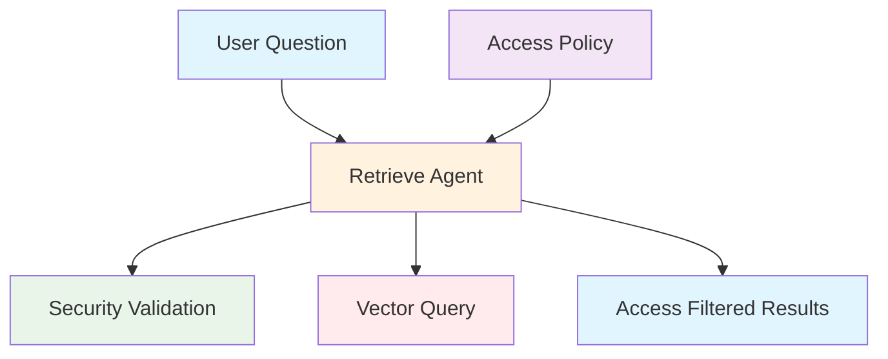
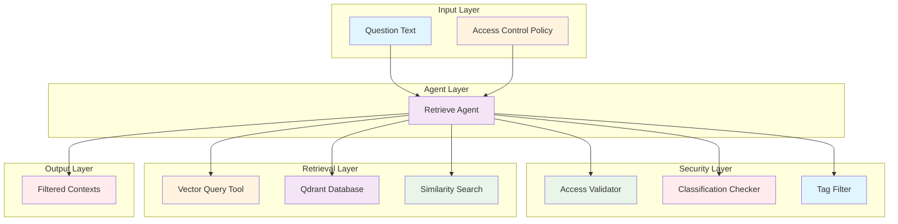
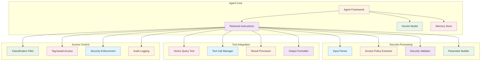

# Retrieve Agent (`src/mastra/agents/retrieve.agent.ts`)

## Overview

The Retrieve Agent is a security-focused document retrieval specialist that queries vectorized document collections to find relevant information while strictly enforcing access control policies. It serves as the secure gateway between user queries and the document corpus, ensuring users only receive information they are authorized to access based on their role-based access control (RBAC) permissions.

## Architecture

### C4 Context Diagram



### C4 Container Diagram



### C4 Component Diagram



## Agent Configuration

### Agent Properties

#### `id: "retrieve"`

Unique identifier for the agent within the Mastra system.

#### `name: "retrieve"`

Human-readable name for the agent.

#### `description`

"A document retrieval agent that retrieves relevant documents based on a user's question and access level."

### Core Expertise

**Primary Function:** Secure document retrieval with access control

**Specialization:** Vector similarity search with RBAC enforcement

**Output Format:** Filtered array of relevant document contexts

## Security Model

### Access Control Requirements

The agent enforces strict security policies:

#### Required Caller Claims

- **Roles**: Must include `role:reader`
- **Tenant**: Must be `global`
- **Classification Level**: Determined by user access policy

#### Access Policy Structure

```json
{
    "allowTags": ["tag1", "tag2"],
    "maxClassification": "confidential"
}
```

#### Security Enforcement Rules

- **Single Tool Call**: Makes exactly one vector query tool call
- **Parameter Preservation**: Never modifies security parameters
- **Access Filtering**: Only returns authorized content
- **Audit Compliance**: Logs all access attempts

## Input Data Structure

The agent processes secure retrieval requests with the following structure:

```json
{
    "question": "What are the company policies on remote work?",
    "access": {
        "allowTags": ["hr", "policies"],
        "maxClassification": "internal"
    }
}
```

### Input Components

#### `question`

- The user's query text
- Used for semantic similarity matching
- Supports natural language questions

#### `access`

- Security policy object defining user permissions
- Contains tag-based and classification-based filters

#### `access.allowTags`

- Array of permitted content tags
- Documents must match at least one allowed tag
- Empty array allows all tags (admin access)

#### `access.maxClassification`

- Maximum classification level user can access
- Values: "public", "internal", "confidential"
- **CRITICAL**: Never modified by the agent

## Retrieval Process

### 1. Input Validation

- Parse question and access policy
- Validate required fields presence
- Verify security claim compliance

### 2. Security Parameter Extraction

- Extract allowTags array from access policy
- Preserve maxClassification exactly as provided
- Build secure query parameters

### 3. Vector Query Execution

- Call vectorQueryTool exactly once
- Pass question, allowTags, maxClassification, and topK=8
- Execute similarity search against Qdrant database

### 4. Result Processing

- Receive filtered document contexts
- Validate security compliance
- Return results without modification

## Vector Query Tool Integration

### Tool Call Specification

```typescript
vectorQueryTool({
    question: input.question,
    allowTags: input.access.allowTags,
    maxClassification: input.access.maxClassification,
    topK: 8,
})
```

### Tool Parameters

#### `query`

- User query for semantic matching
- Passed directly from input

#### `allowTags`

- Array of permitted content tags
- Used for tag-based filtering

#### `maxClassification`

- Maximum security classification level
- **MANDATORY**: Never altered by agent

#### `topK`

- Number of results to retrieve
- Fixed at 8 for optimal balance

## Output Data Structure

The agent returns an array of filtered document contexts:

```json
{
    "contexts": [
        {
            "id": "doc-123",
            "content": "Remote work policy states that employees may work from home up to 3 days per week...",
            "metadata": {
                "source": "hr-policies.pdf",
                "classification": "internal",
                "tags": ["hr", "policies"],
                "score": 0.92
            }
        }
    ]
}
```

### Output Schema Validation

```typescript
export const retrieveOutputSchema = z.object({
    contexts: z.array(documentContextSchema),
})
```

### Context Object Properties

#### `id`

- Unique document identifier
- Used for tracking and deduplication

#### `content`

- Relevant document text excerpt
- Filtered by security and relevance

#### `metadata`

- Document metadata including source, classification, tags
- Includes similarity score from vector search

## Security Constraints

### Mandatory Rules

1. **Single Tool Call**: Makes exactly one vectorQueryTool call
2. **Parameter Integrity**: Never modifies maxClassification or allowTags
3. **Access Enforcement**: Only returns authorized content
4. **No Content Generation**: Never creates or modifies document content
5. **No External Knowledge**: Only uses tool-returned results

### Forbidden Actions

- Multiple tool calls with different parameters
- Classification level escalation (confidential → internal)
- Fake document creation or citation
- Direct question answering without tool usage
- Security parameter manipulation

## Quality Attributes

### Security & Compliance

- **Access Control**: Strict RBAC enforcement
- **Data Protection**: Classification-based filtering
- **Audit Trail**: Complete access logging
- **Policy Adherence**: Zero tolerance for security violations

### Retrieval Quality

- **Relevance**: Semantic similarity matching
- **Precision**: Tag-based content filtering
- **Recall**: Comprehensive result coverage
- **Ranking**: Similarity score-based ordering

### Performance & Efficiency

- **Query Speed**: Optimized vector search operations
- **Resource Usage**: Efficient memory and CPU utilization
- **Scalability**: Handles concurrent retrieval requests
- **Response Time**: Fast security validation and querying

### Technical Excellence

- **Model Selection**: Gemini 2.5 Flash Lite for efficiency
- **Tool Integration**: Seamless vector query tool usage
- **Error Handling**: Robust failure recovery
- **Schema Validation**: Strict input/output compliance

### Maintainability

- **Code Clarity**: Explicit security instructions
- **Configuration Management**: Environment-based setup
- **Monitoring**: Comprehensive logging and metrics
- **Documentation**: Detailed security and operational guides

## Dependencies

### Core Dependencies

- `@mastra/core/agent`: Agent framework
- `@ai-sdk/google`: Google AI SDK for Gemini models
- `zod`: Schema validation
- `../schemas/agent-schemas`: Document context schema
- `../tools/vector-query.tool`: Vector search tool
- `../config/libsql-storage`: Memory storage
- `../config/logger`: Logging infrastructure
- `@mastra/libsql`: LibSQL integration

## Configuration

### Model Configuration

**Model:** `google('gemini-2.5-flash-lite')`

**Rationale:** Cost-effective model for retrieval tasks with security focus

### Memory Configuration

```typescript
const memory = createResearchMemory()
// Uses LibSQL for persistent retrieval conversation storage
```

### Tool Configuration

```typescript
tools: {
    vectorQueryTool
}
```

### Required Environment Variables

```bash
GOOGLE_GENERATIVE_AI_API_KEY=your-api-key
QDRANT_URL=http://localhost:6333
DATABASE_URL=file:deep-research.db
```

## Usage Examples

### Basic Document Retrieval

```typescript
const result = await retrieveAgent.generate({
    question: 'What is the company vacation policy?',
    access: {
        allowTags: ['hr', 'policies'],
        maxClassification: 'internal',
    },
})

// Returns: Array of relevant HR policy contexts
```

### Restricted Access Query

```typescript
const result = await retrieveAgent.generate({
    question: 'What are the executive compensation details?',
    access: {
        allowTags: ['finance'],
        maxClassification: 'confidential',
    },
})

// Returns: Only confidential finance documents user is authorized to access
```

### Tag-Filtered Search

```typescript
const result = await retrieveAgent.generate({
    question: 'How do I submit expense reports?',
    access: {
        allowTags: ['finance', 'procedures'],
        maxClassification: 'internal',
    },
})

// Returns: Documents tagged with finance or procedures
```

## Troubleshooting

### Security & Access Issues

1. **Access Denied Errors**
    - Verify user has required `role:reader` claim
    - Check tenant is set to `global`
    - Validate access policy structure

2. **Empty Results**
    - Confirm allowTags array is not empty or properly configured
    - Check maxClassification level permissions
    - Verify documents exist with matching tags and classification

3. **Classification Level Problems**
    - Ensure maxClassification is never modified by agent
    - Check user has appropriate clearance level
    - Validate classification hierarchy (public < internal < confidential)

### Retrieval Performance Issues

1. **Slow Query Response**
    - Check Qdrant database connectivity
    - Monitor vector index performance
    - Verify network latency to vector database

2. **Low Relevance Results**
    - Review question clarity and specificity
    - Check document content quality in vector store
    - Validate embedding model consistency

3. **Missing Expected Documents**
    - Confirm documents are properly indexed in Qdrant
    - Check document classification and tagging
    - Verify access policy allows document retrieval

### Tool Integration Issues

1. **Tool Call Failures**
    - Verify vectorQueryTool is properly configured
    - Check tool dependencies and imports
    - Validate tool call parameters

2. **Schema Validation Errors**
    - Ensure input JSON matches expected structure
    - Check required fields are present
    - Validate data types and formats

3. **Memory Storage Problems**
    - Verify LibSQL database connection
    - Check memory store initialization
    - Monitor storage space and performance

## References

- [Role-Based Access Control](https://en.wikipedia.org/wiki/Role-based_access_control)
- [Vector Similarity Search](https://arxiv.org/abs/1603.09320)
- [Information Retrieval Security](https://www.nist.gov/publications/security-information-retrieval)
- [Document Classification Standards](https://www.iso.org/standard/54532.html)
