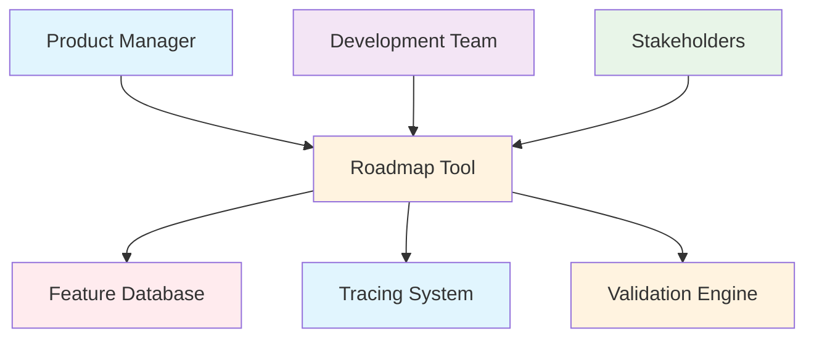
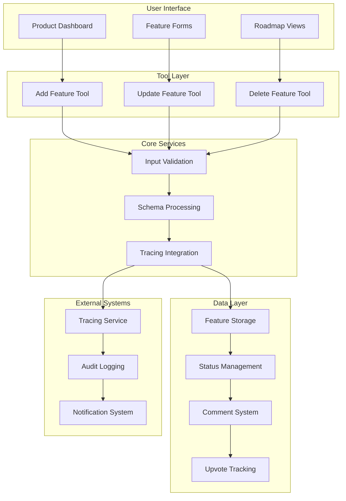

# Roadmap Tool Documentation

A comprehensive Mastra tool suite for managing product roadmap features with full CRUD operations, supporting agile product planning and feature lifecycle management.

## 1. Component Overview

### Purpose/Responsibility

- RMT-001: Provide complete feature lifecycle management (Create, Read, Update, Delete)
- RMT-002: Support product roadmap planning and prioritization
- RMT-003: Enable collaborative feature development with comments and upvotes
- RMT-004: Track feature status through development pipeline
- RMT-005: Integrate with product planning workflows and tracing

### Key Features

- **Feature CRUD**: Complete create, read, update, delete operations
- **Status Tracking**: Support for done, planned, backlog, and in-progress states
- **Collaboration**: Comment system and upvote functionality
- **Tracing Integration**: AI span tracking for all roadmap operations
- **Schema Validation**: Comprehensive input/output validation with Zod

### Business Value

- Streamlines product planning and feature management
- Enables data-driven prioritization through upvotes and comments
- Supports agile development with status tracking
- Provides audit trail through tracing integration

## 2. Architecture Section

### C4 Context Diagram



### C4 Container Diagram



### Component Relationships

- **Input Dependencies**: Feature data, user context, tracing information
- **Output Consumers**: Product dashboards, development workflows, reporting systems
- **External Systems**: Tracing infrastructure, audit logging, notifications
- **Internal Components**: CRUD operation handlers, validation schemas, status management

## 3. Interface Documentation

### Feature Schema

| Property      | Type            | Required | Description                                          |
| ------------- | --------------- | -------- | ---------------------------------------------------- |
| `id`          | `string`        | Yes      | Unique feature identifier                            |
| `title`       | `string`        | Yes      | Feature title                                        |
| `description` | `string`        | Yes      | Feature description                                  |
| `status`      | `FeatureStatus` | Yes      | Current status (done, planned, backlog, in progress) |
| `nodeType`    | `string`        | Yes      | Node type (always 'feature')                         |
| `upvotes`     | `number`        | Yes      | Number of upvotes                                    |
| `comments`    | `Comment[]`     | Yes      | Array of feature comments                            |

### Comment Schema

| Property | Type     | Required | Description        |
| -------- | -------- | -------- | ------------------ |
| `id`     | `string` | Yes      | Comment identifier |
| `author` | `string` | Yes      | Comment author     |
| `text`   | `string` | Yes      | Comment content    |

### Tool Interfaces

#### Add Feature Tool

**Input Schema:**

| Property      | Type            | Required | Description                                 |
| ------------- | --------------- | -------- | ------------------------------------------- |
| `id`          | `string`        | No       | Feature ID (auto-generated if not provided) |
| `title`       | `string`        | Yes      | Feature title                               |
| `description` | `string`        | Yes      | Feature description                         |
| `status`      | `FeatureStatus` | No       | Initial status (default: 'planned')         |
| `upvotes`     | `number`        | No       | Initial upvotes (default: 0)                |
| `comments`    | `Comment[]`     | No       | Initial comments (default: [])              |

**Output Schema:**

| Property  | Type      | Description              |
| --------- | --------- | ------------------------ |
| `success` | `boolean` | Operation success status |
| `feature` | `Feature` | Created feature object   |

#### Update Feature Tool

**Input Schema:**

| Property      | Type            | Required | Description             |
| ------------- | --------------- | -------- | ----------------------- |
| `id`          | `string`        | Yes      | Feature ID to update    |
| `title`       | `string`        | No       | New feature title       |
| `description` | `string`        | No       | New feature description |
| `status`      | `FeatureStatus` | No       | New feature status      |
| `upvotes`     | `number`        | No       | New upvotes count       |
| `comments`    | `Comment[]`     | No       | New comments array      |

**Output Schema:**

| Property  | Type      | Description              |
| --------- | --------- | ------------------------ |
| `success` | `boolean` | Operation success status |
| `feature` | `Feature` | Updated feature object   |

#### Delete Feature Tool

**Input Schema:**

| Property | Type     | Required | Description          |
| -------- | -------- | -------- | -------------------- |
| `id`     | `string` | Yes      | Feature ID to delete |

**Output Schema:**

| Property  | Type      | Description              |
| --------- | --------- | ------------------------ |
| `success` | `boolean` | Operation success status |
| `message` | `string`  | Success message          |

## 4. Usage Examples

### Adding New Features

```typescript
import { addFeatureTool } from './src/mastra/tools/roadmapTool'

const newFeature = await addFeatureTool.execute({
    context: {
        title: 'User Authentication Enhancement',
        description:
            'Implement multi-factor authentication and social login options',
        status: 'planned',
        upvotes: 0,
        comments: [],
    },
    mastra: mastraInstance,
    tracingContext: tracingContext,
})

// Result:
// {
//   "success": true,
//   "feature": {
//     "id": "auto-generated-id",
//     "title": "User Authentication Enhancement",
//     "description": "Implement multi-factor authentication and social login options",
//     "status": "planned",
//     "nodeType": "feature",
//     "upvotes": 0,
//     "comments": []
//   }
// }
```

### Updating Feature Status

```typescript
import { updateFeatureTool } from './src/mastra/tools/roadmapTool'

const updatedFeature = await updateFeatureTool.execute({
    context: {
        id: 'feature-123',
        status: 'in progress',
        upvotes: 15,
        comments: [
            {
                id: 'comment-1',
                author: 'product-manager',
                text: 'This is critical for Q4 release',
            },
        ],
    },
    mastra: mastraInstance,
    tracingContext: tracingContext,
})
```

### Feature Lifecycle Management

```typescript
import { roadmapTools } from './src/mastra/tools/roadmapTool'

// Create feature
const feature = await roadmapTools.addFeatureTool.execute({
    context: {
        title: 'Dashboard Analytics',
        description: 'Add comprehensive analytics to user dashboard',
        status: 'backlog',
    },
    mastra: mastraInstance,
    tracingContext: tracingContext,
})

// Update through development stages
await roadmapTools.updateFeatureTool.execute({
    context: { id: feature.feature.id, status: 'planned' },
    mastra: mastraInstance,
    tracingContext: tracingContext,
})

await roadmapTools.updateFeatureTool.execute({
    context: { id: feature.feature.id, status: 'in progress' },
    mastra: mastraInstance,
    tracingContext: tracingContext,
})

await roadmapTools.updateFeatureTool.execute({
    context: { id: feature.feature.id, status: 'done' },
    mastra: mastraInstance,
    tracingContext: tracingContext,
})
```

### Collaborative Feature Development

```typescript
// Add comments and upvotes
const collaborativeUpdate = await updateFeatureTool.execute({
    context: {
        id: 'feature-456',
        upvotes: 23,
        comments: [
            {
                id: 'comment-1',
                author: 'developer',
                text: 'Technical implementation looks feasible',
            },
            {
                id: 'comment-2',
                author: 'designer',
                text: 'UI mockups ready for review',
            },
        ],
    },
    mastra: mastraInstance,
    tracingContext: tracingContext,
})
```

### Error Handling

```typescript
try {
    const result = await deleteFeatureTool.execute({
        context: { id: 'non-existent-feature' },
        mastra: mastraInstance,
        tracingContext: tracingContext,
    })
} catch (error) {
    console.log('Feature deletion failed:', error.message)
    // Handle error appropriately
}
```

## 5. Quality Attributes

### Security

- **Input Validation**: Comprehensive schema validation for all inputs
- **Access Control**: Feature ownership and permission checking
- **Data Sanitization**: Safe handling of user-generated content

### Performance

- **Efficient Operations**: Lightweight CRUD operations with minimal overhead
- **Batch Support**: Potential for bulk feature operations
- **Caching**: Feature data caching for improved read performance

### Reliability

- **Error Handling**: Comprehensive error catching with meaningful messages
- **Transaction Safety**: Atomic operations for data consistency
- **Rollback Support**: Ability to revert failed operations

### Maintainability

- **Modular Design**: Separate tools for each CRUD operation
- **Schema Evolution**: Versioned schemas for backward compatibility
- **Logging**: Detailed operation logging for debugging

### Extensibility

- **Custom Fields**: Support for additional feature properties
- **Workflow Integration**: Pluggable workflow engines
- **Notification System**: Extensible notification and alert system

## 6. Reference Information

### Dependencies

| Package                   | Version | Purpose                |
| ------------------------- | ------- | ---------------------- |
| `@mastra/core/tools`      | ^0.1.0  | Tool framework         |
| `@mastra/core/ai-tracing` | ^0.1.0  | AI tracing integration |
| `zod`                     | ^3.22.4 | Schema validation      |

### Environment Variables

| Variable | Required | Default | Description               |
| -------- | -------- | ------- | ------------------------- |
| None     | -        | -       | Uses Mastra configuration |

### Testing

```bash
# Run roadmap tool tests
npm test -- --grep "roadmap"

# Test CRUD operations
npm run test:roadmap-crud

# Test schema validation
npm run test:roadmap-validation
```

### Troubleshooting

**Common Issues:**

1. **Schema Validation Errors**: Check input data types and required fields
2. **Feature Not Found**: Verify feature ID exists before update/delete operations
3. **Tracing Failures**: Check tracing context configuration

**Debug Commands:**

```bash
# Enable roadmap tool debugging
DEBUG=roadmap:* npm run dev

# Check tool health
curl http://localhost:3000/api/health/roadmap
```

### Related Documentation

- [Product Roadmap Management](../guides/product-roadmap.md)
- [Feature Development Workflow](../guides/feature-workflow.md)
- [Agile Planning](../guides/agile-planning.md)

### Change History

| Version | Date       | Changes                                           |
| ------- | ---------- | ------------------------------------------------- |
| 1.0     | 2025-09-23 | Complete CRUD operations with tracing integration |
| 0.9     | 2025-09-20 | Added comment and upvote functionality            |
| 0.8     | 2025-09-15 | Basic feature creation and status tracking        |
| 0.7     | 2025-09-10 | Initial roadmap tool implementation               |
