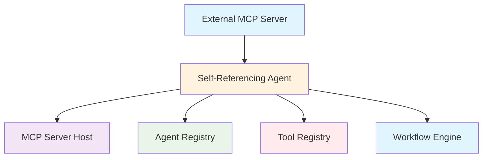
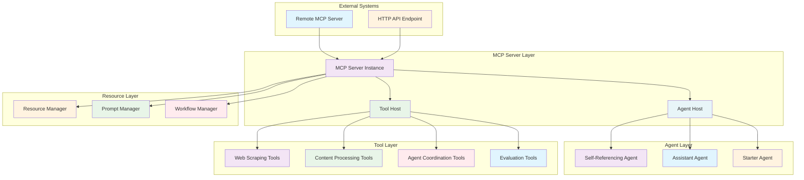
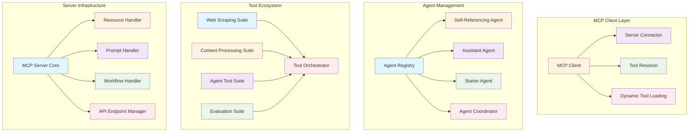

# Self-Referencing Agent (`src/mastra/agents/selfReferencingAgent.ts`)

## Overview

The Self-Referencing Agent is a sophisticated MCP (Model Context Protocol) server implementation that creates a distributed, self-referencing architecture. It hosts multiple specialized agents and tools while maintaining the ability to connect to external MCP servers, enabling complex multi-agent workflows and tool orchestration across distributed systems.

## Architecture

### C4 Context Diagram



### C4 Container Diagram



### C4 Component Diagram



## Agent Configuration

### Agent Properties

#### `id: 'selfReferencing'`

Unique identifier for the agent within the Mastra system.

#### `name: "selfReferencingAgent"`

Human-readable name for the agent.

#### `description`

"An agent that can use tools from an http MCP server"

### Core Expertise

**Primary Function:** MCP server hosting and distributed tool orchestration

**Specialization:** Self-referencing agent architecture and multi-agent coordination

**Output Format:** Dynamic tool resolution and agent orchestration

## MCP Server Architecture

### Server Configuration

```typescript
export const mcp = new MCPServer({
    id: 'mcpServer',
    description:
        'A self-referencing MCP server that hosts an agent capable of using tools from another MCP server.',
    name: 'My MCP Server',
    version: '1.0.0',
    // ... configuration
})
```

### Server Components

#### Agent Registry

- **selfReferencingAgent**: Primary self-referencing agent
- **assistantAgent**: Research and analysis agent
- **starterAgent**: Workflow initiation agent

#### Tool Registry

- **Web Scraping Tools**: `siteMapExtractorTool`, `linkExtractorTool`, `htmlToMarkdownTool`, `contentCleanerTool`, `webScraperTool`
- **Content Processing Tools**: `editorTool`, `copywriterTool`
- **Agent Coordination Tools**: `starterAgentTool`
- **Evaluation Tools**: `evaluateResultTool`, `extractLearningsTool`
- **Utility Tools**: `weatherTool`

## Dynamic Tool Resolution

### MCP Client Integration

The agent uses dynamic tool resolution through MCP client:

```typescript
tools: async () => {
    const mcpClient = new MCPClient({
        servers: {
            myServer: {
                url: new URL('http://localhost:4111/api/mcp/mcpServer/mcp'),
            },
        },
    })
    return await mcpClient.getTools()
}
```

### Tool Resolution Process

1. **Client Initialization**: Creates MCP client connection
2. **Server Discovery**: Connects to remote MCP server
3. **Tool Discovery**: Dynamically retrieves available tools
4. **Tool Loading**: Loads tools into agent context

## Hosted Agents

### Self-Referencing Agent

- **Purpose**: Primary agent for MCP server interactions
- **Model**: Gemini 2.5 Flash
- **Tools**: Dynamically resolved from external MCP server
- **Instructions**: "You can use remote calculation tools."

### Assistant Agent

- **Purpose**: Research and analysis coordination
- **Integration**: Imported from assistant agent module
- **Capabilities**: Web scraping and data management

### Starter Agent

- **Purpose**: Workflow initiation and orchestration
- **Integration**: Imported from starter agent module
- **Capabilities**: Process initialization and coordination

## Tool Ecosystem

### Web Scraping Suite

#### `siteMapExtractorTool`

- Extracts site maps from web pages
- Identifies page structure and navigation

#### `linkExtractorTool`

- Extracts and analyzes hyperlinks
- Identifies internal and external links

#### `htmlToMarkdownTool`

- Converts HTML content to Markdown format
- Preserves structure and formatting

#### `contentCleanerTool`

- Cleans and sanitizes web content
- Removes unwanted elements and noise

#### `webScraperTool`

- Comprehensive web scraping functionality
- Handles dynamic content and JavaScript

### Content Processing Suite

#### `editorTool`

- Content editing and improvement
- Grammar, clarity, and style enhancement

#### `copywriterTool`

- Professional content creation
- Marketing and communication copy

### Agent Coordination Suite

#### `starterAgentTool`

- Initiates agent workflows
- Coordinates multi-agent processes

### Evaluation Suite

#### `evaluateResultTool`

- Evaluates process and content quality
- Provides feedback and scoring

#### `extractLearningsTool`

- Extracts insights and learnings
- Knowledge synthesis and summarization

### Utility Suite

#### `weatherTool`

- Weather information retrieval
- Location-based weather data

## Resource Management

### Resource Handler

```typescript
resources: {
  listResources(): Promise<Resource[]> {
    throw new Error("Function not implemented.");
  },
  getResourceContent: async (params: { uri: string; }): Promise<MCPServerResourceContent | MCPServerResourceContent[]> => {
    throw new Error(`Function not implemented for URI: ${params.uri}`);
  }
}
```

### Prompt Management

```typescript
prompts: {
  listPrompts: () => Promise.resolve([]),
}
```

### Workflow Management

```typescript
workflows: {},
```

## Quality Attributes

### Distributed Architecture

- **Self-Referencing**: Agent can reference itself through MCP protocol
- **Scalability**: Distributed tool and agent hosting
- **Interoperability**: MCP protocol compliance
- **Dynamic Loading**: Runtime tool discovery and loading

### Tool Orchestration

- **Multi-Agent Coordination**: Simultaneous agent execution
- **Tool Chaining**: Sequential tool execution workflows
- **Resource Management**: Efficient tool lifecycle management
- **Error Handling**: Robust failure recovery across distributed components

### Performance & Efficiency

- **Lazy Loading**: Tools resolved on-demand, not at initialization
- **Asynchronous Processing**: Non-blocking tool resolution
- **Resource Optimization**: Efficient memory and network usage
- **Concurrent Execution**: Parallel agent and tool operations

### Technical Excellence

- **Protocol Compliance**: Full MCP specification adherence
- **Type Safety**: TypeScript integration with MCP types
- **Modular Design**: Separated concerns for agents, tools, and resources
- **Extensibility**: Plugin architecture for additional capabilities

### Maintainability

- **Configuration Management**: Centralized server configuration
- **Dependency Management**: Clear import and dependency structure
- **Documentation**: Comprehensive component documentation
- **Testing**: Isolated testing for individual components

## Dependencies

### Core Dependencies

- `@mastra/core/agent`: Agent framework
- `@mastra/mcp`: MCP server and client libraries
- `@ai-sdk/google`: Google AI SDK for Gemini models
- `./assistant`: Assistant agent integration
- `./starterAgent`: Starter agent integration
- `../tools/*`: Various tool implementations

## Configuration

### Model Configuration

**Model:** `google("gemini-2.5-flash")`

**Rationale:** Advanced model for complex multi-agent coordination

### MCP Server Configuration

```typescript
const mcp = new MCPServer({
    id: 'mcpServer',
    name: 'My MCP Server',
    version: '1.0.0',
    // ... full configuration
})
```

### MCP Client Configuration

```typescript
const mcpClient = new MCPClient({
    servers: {
        myServer: {
            url: new URL('http://localhost:4111/api/mcp/mcpServer/mcp'),
        },
    },
})
```

### Required Environment Variables

```bash
GOOGLE_GENERATIVE_AI_API_KEY=your-api-key
```

## Usage Examples

### Basic MCP Server Startup

```typescript
// Server automatically starts and hosts agents/tools
// Accessible via HTTP API at localhost:4111/api/mcp/mcpServer/mcp
```

### Dynamic Tool Usage

```typescript
// Tools are resolved dynamically from external MCP server
const tools = await mcpClient.getTools()
// Returns available tools from connected MCP server
```

### Multi-Agent Coordination

```typescript
// Agents can coordinate through MCP protocol
// selfReferencingAgent can call assistantAgent or starterAgent
// Tools can be shared across agents
```

## Troubleshooting

### MCP Server Issues

1. **Server Startup Failures**
    - Verify port 4111 availability
    - Check network configuration
    - Validate MCP server dependencies

2. **Connection Problems**
    - Confirm external MCP server URL correctness
    - Check network connectivity
    - Verify authentication credentials

3. **Tool Resolution Errors**
    - Ensure external server is running
    - Check tool availability on remote server
    - Validate MCP protocol compatibility

### Agent Coordination Issues

1. **Agent Communication Problems**
    - Verify agent imports and dependencies
    - Check agent initialization order
    - Validate inter-agent communication protocols

2. **Tool Loading Failures**
    - Confirm tool module imports
    - Check tool dependencies
    - Verify tool registration in server

3. **Resource Management Errors**
    - Implement resource handlers if needed
    - Check resource URI formats
    - Validate resource access permissions

### Performance Issues

1. **Slow Tool Resolution**
    - Check network latency to external servers
    - Monitor tool loading performance
    - Optimize dynamic loading strategy

2. **Memory Usage Problems**
    - Monitor agent and tool memory consumption
    - Implement resource cleanup
    - Check for memory leaks in long-running processes

3. **Concurrent Access Issues**
    - Implement proper locking mechanisms
    - Check thread safety of shared resources
    - Monitor concurrent agent execution

## References

- [Model Context Protocol Specification](https://modelcontextprotocol.io/)
- [MCP Server Implementation Guide](https://github.com/modelcontextprotocol)
- [Distributed Agent Systems](https://arxiv.org/abs/2003.10432)
- [Tool Orchestration Patterns](https://www.patterns.dev/)
