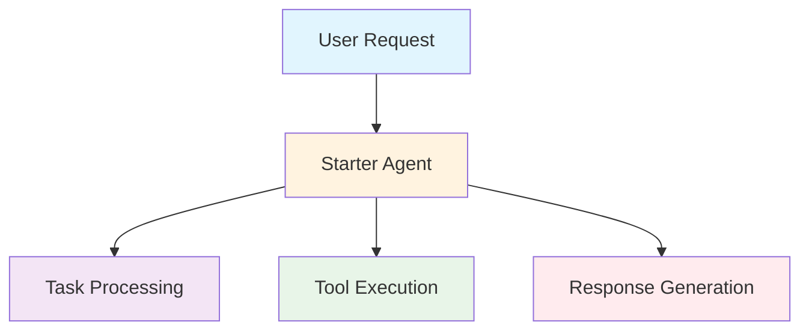
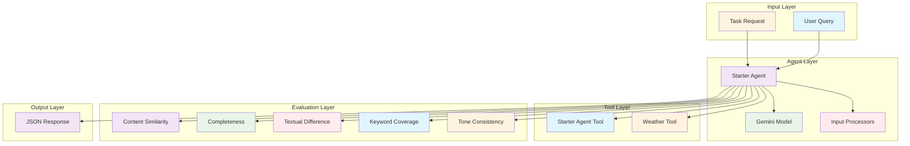

# Starter Agent (`src/mastra/agents/starterAgent.ts`)

## Overview

The Starter Agent is a foundational template agent designed for Cedar-OS + Mastra applications. It provides a basic framework for building specialized agents that assist users with product roadmap navigation, feature priority management, and general task assistance. This agent serves as a starting point for developing more complex agent behaviors while demonstrating best practices for agent configuration, tool integration, and evaluation metrics.

## Architecture

### C4 Context Diagram



### C4 Container Diagram



### C4 Component Diagram

```mermaid
graph TB
    subgraph "Agent Core"
        A[Agent Framework]
        B[Starter Instructions]
        C[Gemini 2.5 Pro Model]
        D[Configuration Manager]
    end

    subgraph "Input Processing"
        E[Unicode Normalizer]
        F[Text Preprocessing]
        G[Input Validation]
    end

    subgraph "Tool Integration"
        H[Starter Agent Tool]
        I[Weather Tool]
        J[Tool Orchestrator]
    end

    subgraph "Quality Evaluation"
        K[Content Similarity Metric]
        L[Completeness Metric]
        M[Textual Difference Metric]
        N[Keyword Coverage Metric]
        O[Tone Consistency Metric]
        P[Evaluation Engine]
    end

    subgraph "Response Generation"
        Q[JSON Formatter]
        R[Content Generator]
        S[Response Validator]
    end

    A --> B
    A --> C
    A --> D
    B --> E
    B --> F
    B --> G
    B --> H
    B --> I
    B --> J
    B --> K
    B --> L
    B --> M
    B --> N
    B --> O
    B --> P
    B --> Q
    B --> R
    B --> S

    style A fill:#fff3e0
    style B fill:#f3e5f5
    style C fill:#e8f5e8
    style D fill:#ffebee
    style E fill:#e1f5fe
    style F fill:#fff3e0
    style G fill:#f3e5f5
    style H fill:#e8f5e8
    style I fill:#ffebee
    style J fill:#e1f5fe
    style K fill:#fff3e0
    style L fill:#f3e5f5
    style M fill:#e8f5e8
    style N fill:#ffebee
    style O fill:#e1f5fe
    style P fill:#fff3e0
    style Q fill:#f3e5f5
    style R fill:#e8f5e8
    style S fill:#ffebee
```



## Agent Configuration

### Agent Properties

#### `id: 'starter'`

Unique identifier for the agent within the Mastra system.

#### `name: 'Starter Agent'`

Human-readable name for the agent.

#### `description`

'A basic starter agent that assists users with general questions and tasks.'

### Core Expertise

**Primary Function:** Product roadmap navigation and feature management assistance

**Specialization:** General task assistance with structured JSON responses

**Output Format:** JSON response with content field

## Role Definition

### Primary Role

**Helpful AI Assistant**: The agent serves as a helpful AI assistant focused on assisting users with questions and tasks.

### Primary Function

**Product Roadmap Management**: The agent's primary function is to help users navigate the product roadmap, understand feature priorities, and manage feature requests.

### Response Guidelines

- **Helpfulness**: Be helpful, accurate, and concise
- **Clarity**: Format responses in a clear, readable way
- **Tool Usage**: Use available tools when appropriate

## Response Format

The agent responds in a structured JSON format:

```json
{
    "content": "The response to the user's question or task"
}
```

### Response Structure

#### `content`

- Main response content
- Contains the agent's answer or assistance
- Formatted for readability and clarity

## Model Configuration

### Gemini 2.5 Pro Model

```typescript
model: gemini('gemini-2.5-pro', {
    temperature: 0.7, // Balanced creativity and consistency
    maxOutputTokens: 65536, // Large output capacity
    topP: 0.95, // Nucleus sampling for quality
})
```

### Model Parameters

#### `temperature: 0.7`

- Controls response randomness
- 0.7 provides balanced creativity and consistency
- Allows for varied but reliable responses

#### `maxOutputTokens: 65536`

- Maximum response length
- Accommodates detailed roadmap and feature explanations
- Sufficient for comprehensive task assistance

#### `topP: 0.95`

- Nucleus sampling threshold
- Focuses on high-probability tokens
- Ensures response quality and coherence

## Tool Integration

### Available Tools

#### `starterAgentTool`

- Primary tool for agent coordination
- Handles starter agent specific functionality
- Integrated for general task assistance

#### `weatherTool`

- Weather information retrieval
- Provides location-based weather data
- Demonstrates external API integration

### Tool Orchestration

- Tools are available for use when appropriate
- Agent can call tools to enhance responses
- Tool usage follows response guidelines

## Input Processing

### Unicode Normalizer

```typescript
inputProcessors: [
    new UnicodeNormalizer({
        stripControlChars: true,
        collapseWhitespace: true,
        preserveEmojis: true,
        trim: true,
    }),
]
```

### Processing Features

#### `stripControlChars: true`

- Removes control characters from input
- Ensures clean text processing

#### `collapseWhitespace: true`

- Normalizes multiple whitespace characters
- Improves text consistency

#### `preserveEmojis: true`

- Maintains emoji characters in input
- Supports expressive user communication

#### `trim: true`

- Removes leading and trailing whitespace
- Standardizes input formatting

## Quality Evaluation Metrics

### Content Similarity Metric

```typescript
contentSimilarity: new ContentSimilarityMetric({
    ignoreCase: true,
    ignoreWhitespace: true,
})
```

- Measures consistency across responses
- Case and whitespace insensitive comparison

### Completeness Metric

```typescript
completeness: new CompletenessMetric()
```

- Evaluates response thoroughness
- Assesses coverage of user requirements

### Textual Difference Metric

```typescript
textualDifference: new TextualDifferenceMetric()
```

- Analyzes response variation
- Measures diversity in generated content

### Keyword Coverage Metric

```typescript
keywordCoverage: new KeywordCoverageMetric()
```

- Evaluates keyword inclusion
- Keywords provided at runtime for evaluation

### Tone Consistency Metric

```typescript
toneConsistency: new ToneConsistencyMetric()
```

- Assesses consistent tone throughout responses
- Ensures professional and appropriate communication

## Quality Attributes

### Response Quality

- **Helpfulness**: Provides accurate and useful assistance
- **Clarity**: Clear, readable response formatting
- **Conciseness**: Focused and to-the-point responses
- **Accuracy**: Reliable and correct information

### Technical Excellence

- **Model Selection**: Gemini 2.5 Pro for advanced capabilities
- **Parameter Tuning**: Optimized temperature and sampling settings
- **Output Control**: Large token limit for comprehensive responses
- **Input Processing**: Robust text normalization and cleaning

### Tool Usage Quality

- **Selective Usage**: Tools used appropriately for tasks
- **Seamless Integration**: Natural tool incorporation in responses
- **Error Handling**: Graceful tool failure management
- **Performance**: Efficient tool execution and response times

### Evaluation & Monitoring

- **Comprehensive Metrics**: Multiple evaluation dimensions
- **Quality Assurance**: Automated response quality assessment
- **Continuous Improvement**: Metric-driven optimization
- **Performance Tracking**: Response quality monitoring

### Maintainability

- **Template Design**: Serves as a foundation for custom agents
- **Modular Configuration**: Separated concerns for easy modification
- **Documentation**: Comprehensive inline and external documentation
- **Extensibility**: Easy addition of new tools and capabilities

## Dependencies

### Core Dependencies

- `@mastra/core/agent`: Agent framework
- `@mastra/core/processors`: Input processing utilities
- `@mastra/evals/nlp`: NLP evaluation metrics
- `@ai-sdk/google`: Google AI SDK for Gemini models
- `../config/gemini-cli`: Gemini configuration
- `../tools/starter-agent-tool`: Starter agent tool
- `../tools/weather-tool`: Weather information tool
- `../config/logger`: Logging infrastructure

## Configuration

### Required Environment Variables

```bash
GOOGLE_GENERATIVE_AI_API_KEY=your-api-key
```

### Optional Environment Variables

```bash
# Weather API configuration (if using weather tool)
WEATHER_API_KEY=your-weather-api-key
```

## Usage Examples

### Basic Task Assistance

```typescript
const result = await starterAgent.generate({
    question: 'How do I navigate the product roadmap?',
})

// Returns: JSON response with roadmap navigation guidance
```

### Feature Priority Inquiry

```typescript
const result = await starterAgent.generate({
    question: 'What are the current feature priorities?',
})

// Returns: JSON response with priority information
```

### General Question

```typescript
const result = await starterAgent.generate({
    question: 'Can you help me with this task?',
})

// Returns: JSON response with assistance content
```

## Customization Guidelines

### Modifying Instructions

1. **Update Role Definition**: Modify the `<role>` section for different agent personas
2. **Change Primary Function**: Update `<primary_function>` for different specialties
3. **Adjust Response Guidelines**: Modify guidelines for different interaction styles
4. **Customize Response Format**: Change JSON structure for different output requirements

### Adding Tools

1. **Import New Tools**: Add tool imports at the top of the file
2. **Register Tools**: Include tools in the `tools` object
3. **Update Instructions**: Modify instructions to reference new tool capabilities

### Configuring Evaluation

1. **Add Metrics**: Include additional evaluation metrics in `evals`
2. **Remove Metrics**: Comment out or remove unwanted metrics
3. **Customize Parameters**: Adjust metric configuration parameters

### Model Tuning

1. **Change Temperature**: Adjust for more/less creativity
2. **Modify Token Limits**: Increase/decrease for different response lengths
3. **Update Sampling**: Change topP for different generation styles

## Troubleshooting

### Response Quality Issues

1. **Inconsistent Responses**
    - Check temperature setting (lower for consistency)
    - Review evaluation metrics for quality feedback
    - Validate input processing configuration

2. **Poor Response Quality**
    - Adjust model parameters (temperature, topP)
    - Review and update instructions for clarity
    - Check evaluation metrics for specific issues

3. **Incorrect Response Format**
    - Verify response format specifications in instructions
    - Check JSON structure compliance
    - Validate response validation logic

### Tool Integration Problems

1. **Tool Execution Failures**
    - Verify tool imports and registration
    - Check tool dependencies and configuration
    - Validate tool call parameters

2. **Tool Response Issues**
    - Review tool output processing
    - Check error handling for tool failures
    - Validate tool response integration

3. **Performance Issues**
    - Monitor tool execution times
    - Check for tool bottlenecks
    - Optimize tool usage patterns

### Input Processing Issues

1. **Text Normalization Problems**
    - Verify Unicode normalizer configuration
    - Check input text encoding
    - Validate processing parameter settings

2. **Input Validation Errors**
    - Review input schema requirements
    - Check input format compliance
    - Validate preprocessing logic

### Evaluation Metric Issues

1. **Metric Calculation Errors**
    - Verify metric configuration parameters
    - Check metric dependencies
    - Validate evaluation runtime setup

2. **Inconsistent Evaluations**
    - Review metric implementation consistency
    - Check evaluation context and parameters
    - Validate metric result interpretation

## References

- [Gemini Model Documentation](https://ai.google.dev/docs)
- [Mastra Agent Framework](https://mastra.ai/docs)
- [Cedar-OS Documentation](https://cedar-os.dev)
- [NLP Evaluation Metrics](https://aclanthology.org/)
