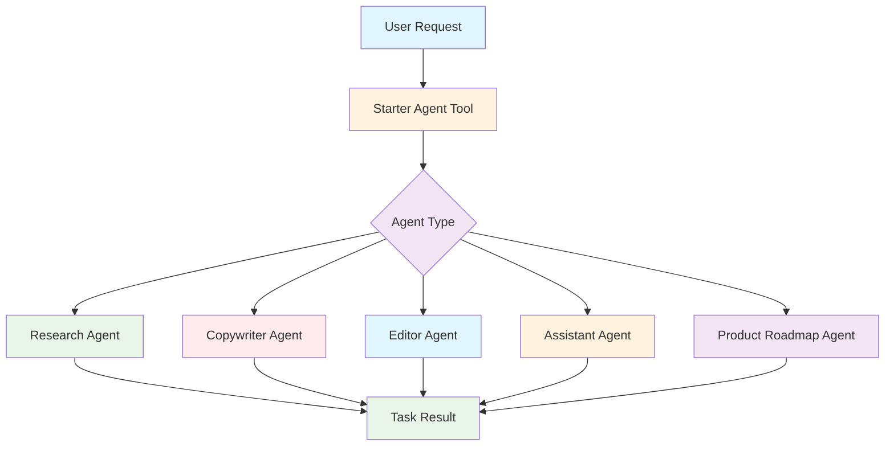
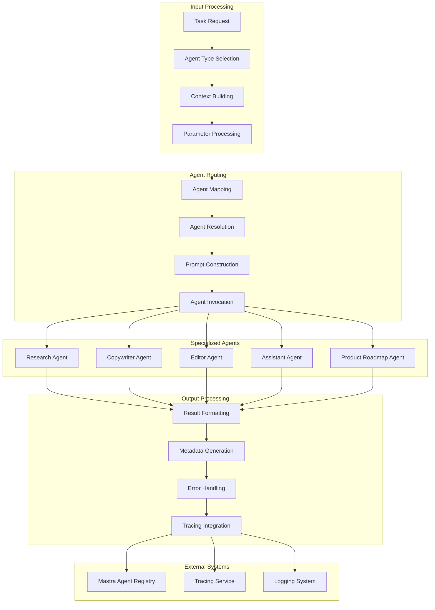

# Starter Agent Tool Documentation

A dynamic agent orchestration tool that intelligently routes tasks to specialized agents based on context and requirements, enabling flexible multi-agent workflows within the Mastra framework.

## 1. Component Overview

### Purpose/Responsibility

- SAT-001: Provide dynamic agent invocation based on task requirements
- SAT-002: Route tasks to appropriate specialized agents (research, copywriter, editor, etc.)
- SAT-003: Support flexible multi-agent orchestration patterns
- SAT-004: Enable context-aware agent selection and task execution
- SAT-005: Provide unified interface for diverse agent capabilities

### Key Features

- **Dynamic Routing**: Intelligent agent selection based on agent type
- **Context Enhancement**: Automatic prompt building with context and parameters
- **Error Handling**: Comprehensive error management with fallback responses
- **Tracing Integration**: Full AI span tracking for agent invocations
- **Flexible Parameters**: Support for agent-specific configuration

### Business Value

- Simplifies multi-agent system interactions through single entry point
- Enables dynamic task routing without hardcoded agent dependencies
- Supports complex workflows requiring multiple agent types
- Provides consistent interface for diverse agent capabilities

## 2. Architecture Section

### C4 Context Diagram



### C4 Container Diagram



### Component Relationships

- **Input Dependencies**: Task description, agent type, optional context and parameters
- **Output Consumers**: Workflow orchestrators, agent coordination systems
- **External Systems**: Mastra agent registry, specialized agent implementations
- **Internal Components**: Agent mapping logic, prompt builders, result processors

## 3. Interface Documentation

### Input Schema

| Property         | Type     | Required | Description                                                                       |
| ---------------- | -------- | -------- | --------------------------------------------------------------------------------- |
| `agentType`      | `enum`   | Yes      | Type of agent to invoke (research, copywriter, editor, assistant, productRoadmap) |
| `task`           | `string` | Yes      | Specific task or request description                                              |
| `context`        | `string` | No       | Additional background information                                                 |
| `parameters`     | `any`    | No       | Agent-specific configuration parameters                                           |
| `expectedOutput` | `string` | No       | Description of desired output format                                              |

### Output Schema

| Property      | Type      | Description                      |
| ------------- | --------- | -------------------------------- |
| `agentCalled` | `string`  | Name/ID of the invoked agent     |
| `result`      | `string`  | Generated result from the agent  |
| `success`     | `boolean` | Whether the agent call succeeded |
| `metadata`    | `object`  | Additional execution metadata    |

### Agent Types

| Agent Type       | Description                        | Use Case                                    |
| ---------------- | ---------------------------------- | ------------------------------------------- |
| `research`       | Research and information gathering | Data analysis, fact-finding, investigation  |
| `copywriter`     | Content creation and writing       | Marketing copy, articles, creative writing  |
| `editor`         | Content editing and improvement    | Proofreading, content enhancement, feedback |
| `assistant`      | General assistance                 | Task help, guidance, general queries        |
| `productRoadmap` | Product planning and roadmapping   | Feature planning, product strategy          |

### Public Methods

| Method      | Parameters                      | Return Type                      | Description              |
| ----------- | ------------------------------- | -------------------------------- | ------------------------ |
| `execute()` | `context: AgentInvocationInput` | `Promise<AgentInvocationOutput>` | Execute agent invocation |

## 4. Usage Examples

### Basic Agent Invocation

```typescript
import { starterAgentTool } from './src/mastra/tools/starter-agent-tool'

const researchResult = await starterAgentTool.execute({
    context: {
        agentType: 'research',
        task: 'Analyze the impact of renewable energy on global carbon emissions',
        context: 'Focus on solar and wind power technologies',
        expectedOutput: 'Summary with key statistics and trends',
    },
    mastra: mastraInstance,
    tracingContext: tracingContext,
})

// Result:
// {
//   "agentCalled": "researchAgent",
//   "result": "Research findings on renewable energy impact...",
//   "success": true,
//   "metadata": {
//     "agentType": "research",
//     "taskLength": 68,
//     "resultLength": 1250,
//     "timestamp": "2025-09-23T10:30:00.000Z"
//   }
// }
```

### Content Creation Workflow

```typescript
// Create marketing copy
const copyResult = await starterAgentTool.execute({
    context: {
        agentType: 'copywriter',
        task: 'Write a product description for our new AI assistant',
        context:
            'Target audience: small business owners, tone: professional yet approachable',
        parameters: {
            wordCount: 150,
            includeCallToAction: true,
        },
    },
    mastra: mastraInstance,
    tracingContext: tracingContext,
})

// Edit the content
const editResult = await starterAgentTool.execute({
    context: {
        agentType: 'editor',
        task: 'Review and improve this product description',
        context: copyResult.result,
        expectedOutput: 'Polished, error-free version with improved clarity',
    },
    mastra: mastraInstance,
    tracingContext: tracingContext,
})
```

### Multi-Agent Research Pipeline

```typescript
const researchPipeline = [
    {
        agentType: 'research' as const,
        task: 'Gather data on electric vehicle market trends',
        context: 'Focus on 2024-2025 projections',
    },
    {
        agentType: 'copywriter' as const,
        task: 'Create a market analysis report',
        context: 'Use the research data to create an executive summary',
    },
    {
        agentType: 'editor' as const,
        task: 'Polish the market analysis report',
        context: 'Ensure professional tone and accurate data presentation',
    },
]

const results = []
for (const step of researchPipeline) {
    const result = await starterAgentTool.execute({
        context: step,
        mastra: mastraInstance,
        tracingContext: tracingContext,
    })
    results.push(result)
}
```

### Product Roadmap Planning

```typescript
const roadmapPlanning = await starterAgentTool.execute({
    context: {
        agentType: 'productRoadmap',
        task: 'Plan Q4 feature development for our analytics dashboard',
        context:
            'Priority features: real-time data visualization, custom reporting, user segmentation',
        parameters: {
            timeline: '3 months',
            teamSize: 5,
            dependencies: ['data pipeline', 'UI framework'],
        },
        expectedOutput:
            'Detailed roadmap with milestones and resource allocation',
    },
    mastra: mastraInstance,
    tracingContext: tracingContext,
})
```

### Error Handling

```typescript
try {
    const result = await starterAgentTool.execute({
        context: {
            agentType: 'unknownAgent', // Invalid agent type
            task: 'Some task',
        },
        mastra: mastraInstance,
        tracingContext: tracingContext,
    })

    if (!result.success) {
        console.log('Agent invocation failed:', result.result)
        // Handle failure appropriately
    }
} catch (error) {
    console.log('Tool execution error:', error)
    // Handle unexpected errors
}
```

## 5. Quality Attributes

### Security

- **Agent Validation**: Strict agent type validation and mapping
- **Input Sanitization**: Safe parameter processing and prompt building
- **Access Control**: Agent availability checking before invocation

### Performance

- **Efficient Routing**: Direct agent mapping without complex decision logic
- **Minimal Overhead**: Lightweight orchestration with direct agent calls
- **Result Caching**: Potential for caching frequently used agent results

### Reliability

- **Error Recovery**: Comprehensive error handling with meaningful messages
- **Agent Availability**: Graceful handling when requested agents are unavailable
- **Fallback Responses**: Structured error responses with metadata

### Maintainability

- **Modular Mapping**: Clean agent type to agent ID mapping
- **Configuration**: Easy addition of new agent types
- **Logging**: Detailed execution logging for debugging

### Extensibility

- **Agent Types**: Pluggable agent type definitions
- **Prompt Builders**: Customizable prompt construction logic
- **Parameter Handling**: Flexible parameter processing for different agents

## 6. Reference Information

### Dependencies

| Package                   | Version | Purpose                |
| ------------------------- | ------- | ---------------------- |
| `@mastra/core/tools`      | ^0.1.0  | Tool framework         |
| `@mastra/core/ai-tracing` | ^0.1.0  | AI tracing integration |
| `zod`                     | ^3.22.4 | Schema validation      |

### Environment Variables

| Variable | Required | Default | Description                     |
| -------- | -------- | ------- | ------------------------------- |
| None     | -        | -       | Uses Mastra agent configuration |

### Testing

```bash
# Run starter agent tool tests
npm test -- --grep "starter-agent"

# Test agent routing
npm run test:agent-routing

# Test error handling
npm run test:starter-agent-errors
```

### Troubleshooting

**Common Issues:**

1. **Unknown Agent Type**: Verify agent type is in the supported list
2. **Agent Not Found**: Check agent registration in Mastra configuration
3. **Prompt Building Issues**: Review context and parameter formatting

**Debug Commands:**

```bash
# Enable starter agent debugging
DEBUG=starter-agent:* npm run dev

# Check agent availability
curl http://localhost:3000/api/agents

# View tool execution logs
tail -f logs/starter-agent.log
```

### Related Documentation

- [Agent Architecture](../architecture/agents.md)
- [Multi-Agent Orchestration](../guides/multi-agent-workflows.md)
- [Agent Registry](../api/agent-registry.md)

### Change History

| Version | Date       | Changes                                                |
| ------- | ---------- | ------------------------------------------------------ |
| 1.0     | 2025-09-23 | Complete multi-agent orchestration with error handling |
| 0.9     | 2025-09-20 | Added product roadmap agent support                    |
| 0.8     | 2025-09-15 | Enhanced prompt building and parameter handling        |
| 0.7     | 2025-09-10 | Basic agent routing functionality                      |
| 0.6     | 2025-09-05 | Initial agent mapping and invocation logic             |
