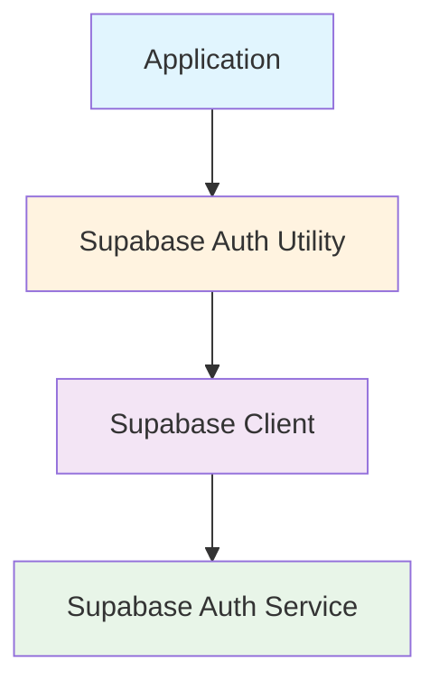
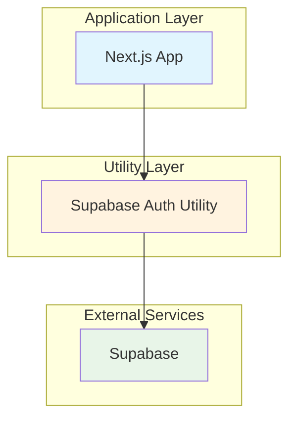
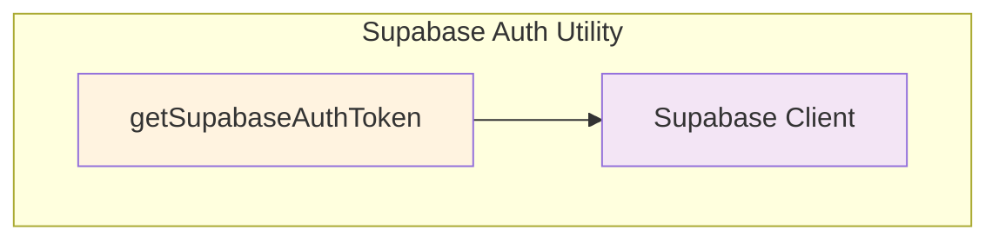

# Supabase Authentication Utility (`lib/auth.ts`)

## Overview

The Supabase Authentication Utility provides a simple interface for obtaining authentication tokens from Supabase using email and password credentials. This utility is designed for server-side authentication flows where programmatic access to Supabase services is required.

## Architecture

### C4 Context Diagram



### C4 Container Diagram



### C4 Component Diagram



## Interfaces and Functions

### Functions

#### `getSupabaseAuthToken(): Promise<string | undefined>`

Retrieves an access token from Supabase using email/password authentication.

**Parameters:** None

**Returns:**

- `Promise<string | undefined>`: The access token if authentication succeeds, `undefined` if it fails

**Throws:**

- No explicit throws, but may propagate Supabase client errors

**Dependencies:**

- `@supabase/supabase-js`: Supabase JavaScript client library
- Environment variables: `NEXT_PUBLIC_SUPABASE_URL`, `NEXT_PUBLIC_SUPABASE_ANON_KEY`, `USER_EMAIL`, `USER_PASSWORD`

## Usage Examples

### Basic Authentication

```typescript
import { getSupabaseAuthToken } from '@/lib/auth';

// Get authentication token
const token = await getSupabaseAuthToken();

if (token) {
  console.log('Authentication successful');
  // Use token for API calls
} else {
  console.error('Authentication failed');
}
```

### Integration with API Routes

```typescript
// In Next.js API route
import { getSupabaseAuthToken } from '@/lib/auth';

export async function GET() {
  const token = await getSupabaseAuthToken();

  if (!token) {
    return Response.json({ error: 'Authentication failed' }, { status: 401 });
  }

  // Use token for authenticated requests
  return Response.json({ token });
}
```

## Quality Attributes

### Security

- **Authentication Method**: Uses secure email/password authentication
- **Token Handling**: Returns access tokens for programmatic use
- **Environment Variables**: Credentials stored securely in environment variables
- **Error Handling**: Graceful failure handling without exposing sensitive information

### Reliability

- **Error Resilience**: Handles authentication failures gracefully
- **Async Operations**: Proper async/await pattern for non-blocking operations
- **Type Safety**: Full TypeScript support with proper return types

### Performance

- **Connection Reuse**: Reuses Supabase client instance
- **Minimal Overhead**: Lightweight utility with single responsibility

### Maintainability

- **Single Responsibility**: Focused on authentication token retrieval
- **Clear Interface**: Simple function signature
- **Documentation**: Comprehensive inline and external documentation

## Configuration

### Required Environment Variables

```bash
NEXT_PUBLIC_SUPABASE_URL=https://your-project.supabase.co
NEXT_PUBLIC_SUPABASE_ANON_KEY=your-anon-key
USER_EMAIL=user@example.com
USER_PASSWORD=secure-password
```

### Dependencies

```json
{
  "@supabase/supabase-js": "^2.x.x"
}
```

## Troubleshooting

### Common Issues

1. **Authentication Failure**
   - Check environment variables are set correctly
   - Verify Supabase project credentials
   - Ensure user account exists and is active

2. **Missing Dependencies**
   - Install `@supabase/supabase-js` package
   - Update package.json with correct version

3. **Environment Variable Issues**
   - Ensure variables are prefixed correctly (`NEXT_PUBLIC_` for client-side)
   - Check variable loading in deployment environment

## References

- [Supabase Documentation](https://supabase.com/docs)
- [Supabase JavaScript Client](https://supabase.com/docs/reference/javascript)
- [Next.js Environment Variables](https://nextjs.org/docs/basic-features/environment-variables)