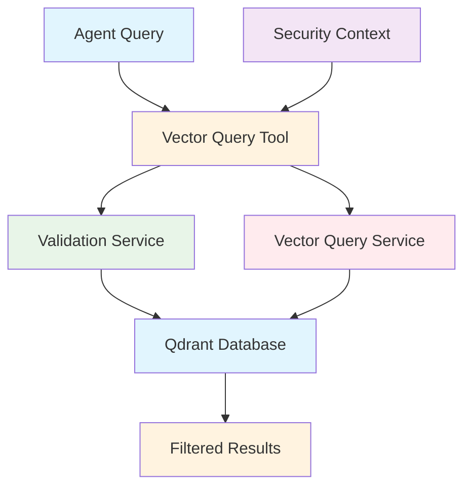
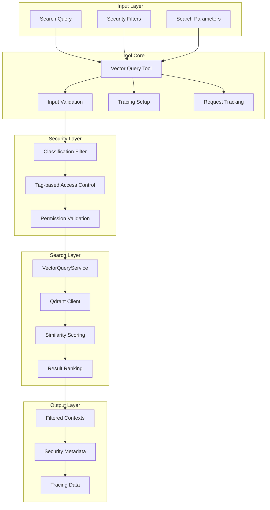

# Vector Query Tool Documentation

A Mastra tool for secure vector similarity search with classification-based filtering and role-based access control.

## 1. Component Overview

### Purpose/Responsibility

- VQT-001: Perform vector similarity search against Qdrant database
- VQT-002: Apply security filtering based on document classification
- VQT-003: Enforce role-based access control with allowTags
- VQT-004: Provide configurable similarity thresholds and result limits
- VQT-005: Support tracing and monitoring for search operations

### Key Features

- **Security Filtering**: Classification-based access control (public/internal/confidential)
- **Tag-based Permissions**: AllowTags system for granular access control
- **Similarity Search**: Configurable similarity thresholds for result quality
- **Tracing Integration**: AI span tracking for performance monitoring
- **Request Tracking**: Tool call counting and request ID correlation

### Business Value

- Enables secure document retrieval for RAG applications
- Provides fine-grained access control for sensitive information
- Supports scalable vector search with performance monitoring
- Facilitates compliance with data governance requirements

## 2. Architecture Section

### C4 Context Diagram



### C4 Container Diagram



### Component Relationships

- **Input Dependencies**: Search query, security filters, search parameters
- **Output Consumers**: RAG agents, document retrieval workflows
- **External Systems**: Qdrant vector database, validation services
- **Internal Components**: Security filtering, similarity search engine

## 3. Interface Documentation

### Input Schema

| Property | Type | Required | Description |
|----------|------|----------|-------------|
| `question` | `string` | Yes | Search query for similarity matching |
| `allowTags` | `string[]` | Yes | Array of allowed security tags |
| `maxClassification` | `enum` | Yes | Maximum classification level (public/internal/confidential) |
| `topK` | `number` | Yes | Number of results to return |

### Output Schema

| Property | Type | Description |
|----------|------|-------------|
| `contexts` | `ContextObject[]` | Array of matching document contexts |

### Context Object Schema

| Property | Type | Description |
|----------|------|-------------|
| `text` | `string` | Document text content |
| `docId` | `string` | Unique document identifier |
| `versionId` | `string` | Document version identifier |
| `source` | `string` | Document source description |
| `score` | `number` | Similarity score |
| `securityTags` | `string[]` | Document security tags |
| `classification` | `enum` | Document classification level |

### Public Methods

| Method | Parameters | Return Type | Description |
|--------|------------|-------------|-------------|
| `execute()` | `context: SearchInput` | `Promise<SearchOutput>` | Execute vector search with security filtering |

## 4. Usage Examples

### Basic Vector Search

```typescript
import { vectorQueryTool } from './src/mastra/tools/vector-query.tool';

const result = await vectorQueryTool.execute({
  context: {
    question: "What are the company policies on remote work?",
    allowTags: ["hr", "policies"],
    maxClassification: "internal",
    topK: 5
  },
  mastra: mastraInstance,
  tracingContext: tracingContext
});

// Result:
// {
//   "contexts": [
//     {
//       "text": "Remote work policy allows flexible scheduling...",
//       "docId": "hr-policy-001",
//       "versionId": "v1.2",
//       "source": "HR Policy Manual",
//       "score": 0.87,
//       "securityTags": ["hr", "policies"],
//       "classification": "internal"
//     }
//   ]
// }
```

### Advanced Security Filtering

```typescript
const result = await vectorQueryTool.execute({
  context: {
    question: "Financial projections for Q4",
    allowTags: ["finance", "executive"],
    maxClassification: "confidential",
    topK: 3
  },
  mastra: mastraInstance,
  tracingContext: tracingContext
});

// Only returns documents user has access to based on tags and classification
```

### Agent Integration

```typescript
// Within a Mastra agent
const searchResults = await vectorQueryTool.execute({
  context: {
    question: userQuestion,
    allowTags: userAllowedTags,
    maxClassification: userMaxClassification,
    topK: 8
  },
  mastra: this.mastra,
  tracingContext: this.tracingContext
});

// Use results for answer generation
const contexts = searchResults.contexts;
```

## 5. Quality Attributes

### Security

- **Classification Filtering**: Strict enforcement of document classification levels
- **Tag-based Access**: Granular permission control through security tags
- **Input Validation**: Comprehensive validation of search parameters
- **Audit Trail**: Request tracking and logging for compliance

### Performance

- **Efficient Search**: Optimized vector similarity search in Qdrant
- **Configurable Limits**: Adjustable result counts and similarity thresholds
- **Request Tracking**: Tool call counting with automatic cleanup
- **Tracing Overhead**: Minimal performance impact from monitoring

### Reliability

- **Error Handling**: Graceful failure handling with detailed error messages
- **Service Validation**: Pre-flight checks for Qdrant connectivity
- **Fallback Behavior**: Safe degradation when services are unavailable
- **Resource Cleanup**: Automatic cleanup of tracking data

### Maintainability

- **Modular Design**: Separated concerns for search, security, and tracing
- **Configuration**: Environment-based configuration for thresholds and limits
- **Logging**: Comprehensive logging for debugging and monitoring
- **Testing**: Unit tests for search scenarios and security rules

### Extensibility

- **Similarity Algorithms**: Pluggable similarity scoring mechanisms
- **Security Rules**: Configurable access control policies
- **Result Processing**: Extensible result filtering and ranking
- **Integration Points**: Support for additional vector databases

## 6. Reference Information

### Dependencies

| Package | Version | Purpose |
|---------|---------|---------|
| `@mastra/core/tools` | ^0.1.0 | Tool framework |
| `@mastra/core/ai-tracing` | ^0.1.0 | AI tracing integration |
| `zod` | ^3.22.4 | Schema validation |

### Environment Variables

| Variable | Required | Default | Description |
|----------|----------|---------|-------------|
| `QDRANT_URL` | Yes | - | Qdrant database URL |
| `QDRANT_COLLECTION` | No | governed_rag | Qdrant collection name |
| `VECTOR_SIMILARITY_THRESHOLD` | No | 0.4 | Minimum similarity score |

### Testing

```bash
# Run vector query tool tests
npm test -- --grep "vector-query"

# Test security filtering
npm run test:vector-security
```

### Troubleshooting

**Common Issues:**

1. **No Results**: Check similarity threshold and security permissions
2. **Connection Errors**: Verify Qdrant URL and connectivity
3. **Permission Denied**: Review allowTags and classification settings

**Debug Commands:**

```bash
# Enable debug logging
DEBUG=vector:* npm run dev

# Check tool health
curl http://localhost:3000/api/health/vector-query
```

### Related Documentation

- [VectorQueryService](../services/VectorQueryService.md)
- [Security Guidelines](../guides/security.md)
- [Qdrant Integration](../guides/qdrant-setup.md)

### Change History

| Version | Date | Changes |
|---------|------|---------|
| 1.0 | 2025-09-23 | Initial implementation with security filtering |
| 0.9 | 2025-09-20 | Added request tracking and tracing |
| 0.8 | 2025-09-15 | Basic vector search functionality |