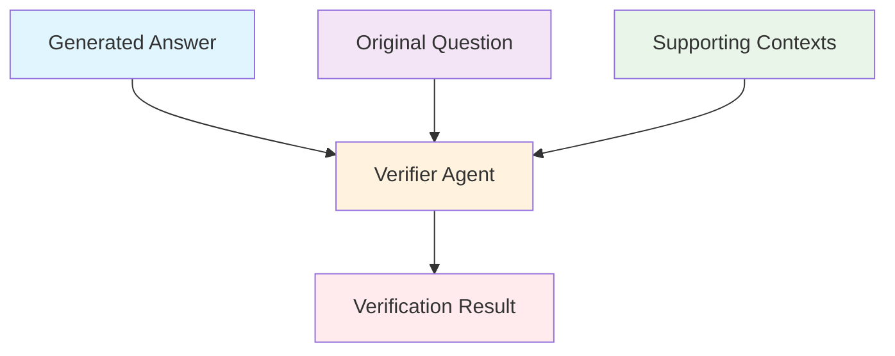
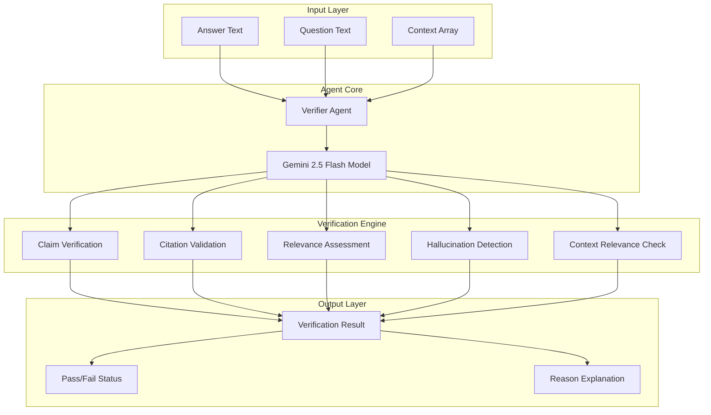

# Verifier Agent Documentation

A strict answer verification agent that ensures provided answers are fully supported by given contexts, properly cited, and relevant to the original question.

## 1. Component Overview

### Purpose/Responsibility

- OVR-001: Perform comprehensive answer verification against source contexts
- OVR-002: Validate factual accuracy and citation correctness
- OVR-003: Detect hallucinations and external knowledge contamination
- OVR-004: Ensure answer relevance to original question
- OVR-005: Provide quality assurance for RAG-generated responses

### Key Features

- **Context Validation**: Every claim must be traceable to provided contexts
- **Citation Verification**: Citations must match actual document IDs
- **Hallucination Detection**: Prevents external knowledge contamination
- **Relevance Assessment**: Ensures answers address the original question
- **Topic Drift Prevention**: Validates context relevance to question topics

### Business Value

- Ensures factual accuracy in RAG responses
- Prevents dissemination of unsupported information
- Maintains data governance compliance
- Provides quality assurance for critical business information

## 2. Architecture Section

### C4 Context Diagram



### C4 Container Diagram



### Component Relationships

- **Input Dependencies**: Answer text, question text, context array
- **Output Consumers**: Answer workflow, quality assurance pipeline
- **External Systems**: Google Gemini AI model, LibSQL memory storage
- **Internal Components**: Verification engine, validation logic

## 3. Interface Documentation

### Input Schema

| Property | Type | Required | Description |
|----------|------|----------|-------------|
| `answer` | `string \| object` | Yes | The answer to verify (text or structured with citations) |
| `question` | `string` | Yes | The original question being answered |
| `contexts` | `array` | Yes | Array of context documents for verification |

### Output Schema

| Property | Type | Description |
|----------|------|-------------|
| `ok` | `boolean` | Verification pass/fail status |
| `reason` | `string` | Explanation of verification result |
| `answer` | `string \| object` | Verified answer or failure explanation |

### Public Methods

| Method | Parameters | Return Type | Description |
|--------|------------|-------------|-------------|
| `execute()` | `input: VerificationInput` | `Promise<VerificationResult>` | Execute verification process |

## 4. Usage Examples

### Basic Verification

```typescript
import { verifierAgent } from './src/mastra/agents/verifier.agent';

const result = await verifierAgent.generate({
  answer: "According to policy, termination requires written notice.",
  question: "What are termination procedures?",
  contexts: [
    {
      id: "hr-policy-001",
      content: "Termination procedures require written notice and follow HR guidelines..."
    }
  ]
});

// Result: { ok: true, reason: "All claims verified", answer: "..." }
```

### Citation Validation

```typescript
const result = await verifierAgent.generate({
  answer: {
    text: "Benefits include health insurance and PTO.",
    citations: [{ docId: "hr-policy-001", source: "Employee Handbook" }]
  },
  question: "What employee benefits are available?",
  contexts: [
    {
      id: "hr-policy-001",
      content: "Employee benefits include health insurance, dental coverage, and PTO..."
    }
  ]
});
```

### Failure Case - Irrelevant Context

```typescript
const result = await verifierAgent.generate({
  answer: "Termination fees are $50.",
  question: "What are termination procedures?",
  contexts: [
    {
      id: "billing-001",
      content: "Service termination fees are $50 for early cancellation..."
    }
  ]
});

// Result: { ok: false, reason: "Context is not relevant to the question", answer: "No relevant information found" }
```

## 5. Quality Attributes

### Security

- **Input Validation**: All inputs validated against schemas
- **Context Isolation**: No external knowledge allowed in verification
- **Output Sanitization**: Results sanitized before return

### Performance

- **Response Time**: < 5 seconds for typical verification tasks
- **Memory Usage**: Efficient context processing with streaming
- **Scalability**: Stateless design supports horizontal scaling

### Reliability

- **Error Handling**: Comprehensive error catching with fallback responses
- **Data Consistency**: Atomic verification operations
- **Fault Tolerance**: Graceful degradation on model failures

### Maintainability

- **Code Structure**: Clean separation of concerns
- **Documentation**: Comprehensive inline and external docs
- **Testing**: Unit tests for all verification scenarios

### Extensibility

- **Modular Design**: Easy addition of new verification rules
- **Plugin Architecture**: Support for custom verification modules
- **Configuration**: Environment-based rule customization

## 6. Reference Information

### Dependencies

| Package | Version | Purpose |
|---------|---------|---------|
| `@mastra/core` | ^0.1.0 | Agent framework |
| `@ai-sdk/google` | ^0.0.50 | Google Gemini integration |
| `zod` | ^3.22.4 | Schema validation |

### Environment Variables

| Variable | Required | Default | Description |
|----------|----------|---------|-------------|
| `GOOGLE_GENERATIVE_AI_API_KEY` | Yes | - | Google AI API key |

### Testing

```bash
# Run verifier agent tests
npm test -- --grep "verifier"

# Run integration tests
npm run test:integration
```

### Troubleshooting

**Common Issues:**

1. **Model Timeout**: Increase timeout settings for complex verifications
2. **Memory Issues**: Reduce context size or implement pagination
3. **Schema Validation Errors**: Check input format matches expected schema

**Debug Commands:**

```bash
# Enable debug logging
DEBUG=verifier:* npm run dev

# Check agent health
curl http://localhost:3000/api/health/verifier
```

### Related Documentation

- [Agent Schemas](../schemas/agent-schemas.md)
- [Verification Workflows](../workflows/verification-workflow.md)
- [Quality Assurance Guide](../guides/quality-assurance.md)

### Change History

| Version | Date | Changes |
|---------|------|---------|
| 1.0 | 2025-09-23 | Initial implementation with comprehensive verification rules |
| 0.9 | 2025-09-20 | Added context relevance checking |
| 0.8 | 2025-09-15 | Basic verification functionality |