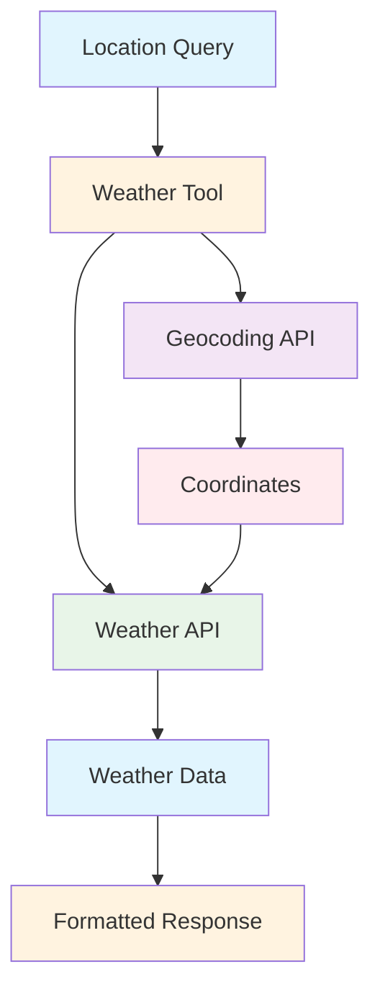
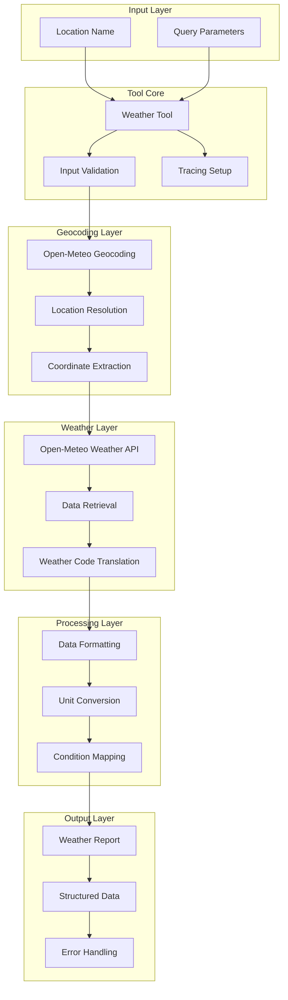

# Weather Tool Documentation

A Mastra tool for retrieving current weather information using Open-Meteo APIs with geocoding support.

## 1. Component Overview

### Purpose/Responsibility

- WTH-001: Retrieve current weather data for any location
- WTH-002: Provide geocoding services for location resolution
- WTH-003: Convert weather codes to human-readable conditions
- WTH-004: Support comprehensive weather metrics and measurements
- WTH-005: Enable weather data integration in research and planning workflows

### Key Features

- **Location Geocoding**: Automatic latitude/longitude resolution from city names
- **Comprehensive Weather Data**: Temperature, humidity, wind speed, and conditions
- **Weather Code Translation**: Human-readable weather condition descriptions
- **API Integration**: Open-Meteo weather and geocoding APIs
- **Tracing Support**: AI span tracking for weather data operations

### Business Value

- Enables location-based weather information for research and planning
- Supports travel and event planning workflows
- Provides environmental data for various business applications
- Facilitates weather-dependent decision making

## 2. Architecture Section

### C4 Context Diagram



### C4 Container Diagram



### Component Relationships

- **Input Dependencies**: Location name or city identifier
- **Output Consumers**: Research workflows, planning applications
- **External Systems**: Open-Meteo geocoding and weather APIs
- **Internal Components**: Weather data processor, condition mapper

## 3. Interface Documentation

### Input Schema

| Property | Type | Required | Description |
|----------|------|----------|-------------|
| `location` | `string` | Yes | City name or location identifier |

### Output Schema

| Property | Type | Description |
|----------|------|-------------|
| `temperature` | `number` | Current temperature in Celsius |
| `feelsLike` | `number` | Apparent temperature (wind chill effect) |
| `humidity` | `number` | Relative humidity percentage |
| `windSpeed` | `number` | Wind speed in km/h |
| `windGust` | `number` | Wind gust speed in km/h |
| `conditions` | `string` | Human-readable weather condition |
| `location` | `string` | Resolved location name |

### Public Methods

| Method | Parameters | Return Type | Description |
|--------|------------|-------------|-------------|
| `execute()` | `context: { location: string }` | `Promise<WeatherData>` | Retrieve current weather for location |

## 4. Usage Examples

### Basic Weather Query

```typescript
import { weatherTool } from './src/mastra/tools/weather-tool';

const result = await weatherTool.execute({
  context: { location: "New York" },
  mastra: mastraInstance,
  tracingContext: tracingContext
});

// Result:
// {
//   "temperature": 22.5,
//   "feelsLike": 24.1,
//   "humidity": 65,
//   "windSpeed": 12.5,
//   "windGust": 18.2,
//   "conditions": "Partly cloudy",
//   "location": "New York"
// }
```

### Research Integration

```typescript
// Within a research workflow
const weather = await weatherTool.execute({
  context: { location: "Tokyo" },
  mastra: mastraInstance,
  tracingContext: tracingContext
});

// Use weather data in research analysis
const report = `Weather conditions in ${weather.location}: ${weather.conditions} with ${weather.temperature}°C`;
```

### Travel Planning

```typescript
const destinations = ["Paris", "London", "Berlin"];

for (const city of destinations) {
  const weather = await weatherTool.execute({
    context: { location: city },
    mastra: mastraInstance,
    tracingContext: tracingContext
  });

  console.log(`${city}: ${weather.conditions}, ${weather.temperature}°C`);
}
```

### Error Handling

```typescript
try {
  const weather = await weatherTool.execute({
    context: { location: "InvalidCity123" },
    mastra: mastraInstance,
    tracingContext: tracingContext
  });
} catch (error) {
  // Handle location not found
  console.error('Weather lookup failed:', error.message);
}
```

## 5. Quality Attributes

### Security

- **Input Validation**: Location name validation and sanitization
- **API Security**: Safe external API communication
- **Data Sanitization**: Clean data processing without injection risks

### Performance

- **Fast Geocoding**: Efficient location resolution
- **Optimized API Calls**: Minimal requests with batch potential
- **Response Caching**: Potential for caching frequent locations
- **Lightweight Processing**: Fast data transformation and formatting

### Reliability

- **Error Handling**: Comprehensive error catching with detailed messages
- **API Resilience**: Graceful handling of API failures
- **Data Validation**: Response validation from external APIs
- **Fallback Behavior**: Safe degradation when services unavailable

### Maintainability

- **Clean Code Structure**: Well-organized API integration
- **Configuration**: Environment-based API endpoint configuration
- **Logging**: Comprehensive operation logging for debugging
- **Modular Design**: Separated geocoding and weather logic

### Extensibility

- **Weather Metrics**: Easy addition of new weather data points
- **API Providers**: Support for alternative weather APIs
- **Location Formats**: Extended location input formats
- **Forecast Support**: Potential for weather forecast integration

## 6. Reference Information

### Dependencies

| Package | Version | Purpose |
|---------|---------|---------|
| `@mastra/core/tools` | ^0.1.0 | Tool framework |
| `@mastra/core/ai-tracing` | ^0.1.0 | AI tracing integration |
| `zod` | ^3.22.4 | Schema validation |

### Environment Variables

| Variable | Required | Default | Description |
|----------|----------|---------|-------------|
| None | - | - | Uses hardcoded Open-Meteo API endpoints |

### Testing

```bash
# Run weather tool tests
npm test -- --grep "weather"

# Test geocoding functionality
npm run test:geocoding
```

### Troubleshooting

**Common Issues:**

1. **Location Not Found**: Check spelling and try alternative city names
2. **API Rate Limits**: Open-Meteo has generous limits, but monitor usage
3. **Network Issues**: Verify internet connectivity for API calls

**Debug Commands:**

```bash
# Enable debug logging
DEBUG=weather:* npm run dev

# Check tool health
curl http://localhost:3000/api/health/weather
```

### Related Documentation

- [Weather APIs](../guides/weather-apis.md)
- [Location Services](../guides/geocoding.md)
- [Research Data Sources](../guides/data-sources.md)

### Change History

| Version | Date | Changes |
|---------|------|---------|
| 1.0 | 2025-09-23 | Initial implementation with Open-Meteo integration |
| 0.9 | 2025-09-20 | Added comprehensive weather condition mapping |
| 0.8 | 2025-09-15 | Basic weather retrieval functionality |