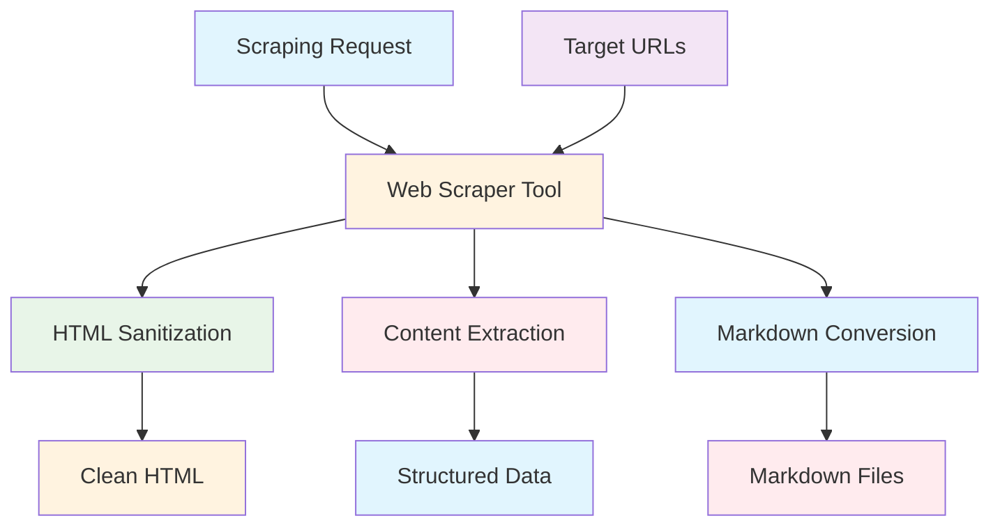
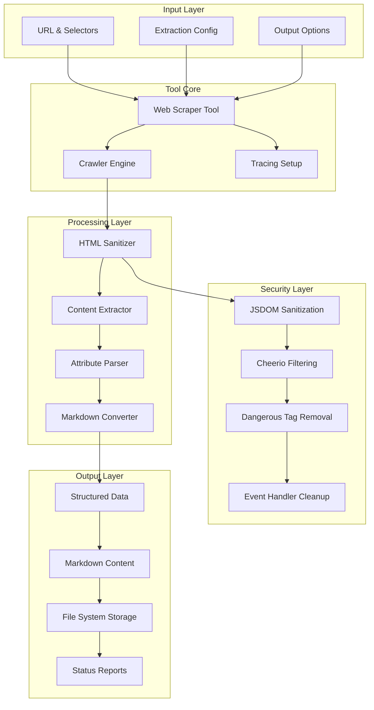

# Web Scraper Tool Documentation

A comprehensive Mastra tool for secure web content extraction using JSDOM and Cheerio with advanced HTML sanitization and structured data processing.

## 1. Component Overview

### Purpose/Responsibility

- WST-001: Extract structured data from web pages with CSS selectors
- WST-002: Provide HTML sanitization and security filtering
- WST-003: Convert HTML content to markdown format
- WST-004: Support batch web scraping operations
- WST-005: Enable content cleaning and processing workflows

### Key Features

- **HTML Sanitization**: Advanced security filtering using JSDOM and Cheerio
- **CSS Selector Support**: Targeted content extraction with selectors
- **Markdown Conversion**: HTML to markdown transformation
- **Batch Processing**: Multiple URL scraping capabilities
- **File System Integration**: Save scraped content to data directory
- **Tracing Support**: AI span tracking for scraping operations

### Business Value

- Enables automated content extraction for research and analysis
- Provides secure web scraping with built-in sanitization
- Supports content processing pipelines for RAG applications
- Facilitates data collection workflows with structured output

## 2. Architecture Section

### C4 Context Diagram



### C4 Container Diagram



### Component Relationships

- **Input Dependencies**: URLs, CSS selectors, extraction configuration
- **Output Consumers**: Research workflows, content processing pipelines
- **External Systems**: Target websites, file system, CheerioCrawler
- **Internal Components**: HTML processor, content extractor, security filters

## 3. Interface Documentation

### Input Schema

| Property | Type | Required | Description |
|----------|------|----------|-------------|
| `url` | `string` | Yes | Target URL to scrape (must be valid URL) |
| `selector` | `string?` | No | CSS selector for content extraction |
| `extractAttributes` | `string[]?` | No | HTML attributes to extract from elements |
| `saveMarkdown` | `boolean?` | No | Save content as markdown file |
| `markdownFileName` | `string?` | No | Custom filename for markdown output |

### Output Schema

| Property | Type | Description |
|----------|------|-------------|
| `url` | `string` | Scraped URL |
| `extractedData` | `Record[]` | Array of extracted element data |
| `rawContent` | `string?` | Full HTML content (if no selector) |
| `markdownContent` | `string?` | Converted markdown content |
| `savedFilePath` | `string?` | Path to saved markdown file |
| `status` | `string` | Operation status (success/failed) |
| `errorMessage` | `string?` | Error details if failed |

### Public Methods

| Method | Parameters | Return Type | Description |
|--------|------------|-------------|-------------|
| `execute()` | `context: ScraperInput` | `Promise<ScraperOutput>` | Execute web scraping operation |

## 4. Usage Examples

### Basic Content Extraction

```typescript
import { webScraperTool } from './src/mastra/tools/web-scraper-tool';

const result = await webScraperTool.execute({
  context: {
    url: "https://example.com/article",
    selector: "article h1, article p",
    extractAttributes: ["href", "src"]
  },
  mastra: mastraInstance,
  tracingContext: tracingContext
});

// Result:
// {
//   "url": "https://example.com/article",
//   "extractedData": [
//     {"text": "Article Title", "attr_href": "#", "attr_src": ""},
//     {"text": "Article content paragraph...", "attr_href": "", "attr_src": ""}
//   ],
//   "status": "success"
// }
```

### Full Page Scraping with Markdown

```typescript
const result = await webScraperTool.execute({
  context: {
    url: "https://example.com/docs",
    saveMarkdown: true,
    markdownFileName: "documentation.md"
  },
  mastra: mastraInstance,
  tracingContext: tracingContext
});

// Saves full page as markdown and returns structured data
```

### Batch Scraping

```typescript
import { batchWebScraperTool } from './src/mastra/tools/web-scraper-tool';

const result = await batchWebScraperTool.execute({
  context: {
    urls: [
      "https://example.com/page1",
      "https://example.com/page2"
    ],
    selector: "h1, h2, p"
  },
  mastra: mastraInstance,
  tracingContext: tracingContext
});

// Scrapes multiple URLs in batch
```

### Content Processing Pipeline

```typescript
// Extract links first
const links = await linkExtractorTool.execute({...});

// Then scrape content
const content = await webScraperTool.execute({...});

// Convert to markdown
const markdown = await htmlToMarkdownTool.execute({...});

// Clean and process
const cleanContent = await contentCleanerTool.execute({...});
```

## 5. Quality Attributes

### Security

- **HTML Sanitization**: Removes dangerous tags and event handlers
- **Input Validation**: URL validation and schema enforcement
- **Content Filtering**: Prevents XSS through attribute sanitization
- **Safe Parsing**: JSDOM isolation for secure HTML processing

### Performance

- **Concurrent Processing**: Configurable concurrency limits
- **Timeout Handling**: Request timeout protection
- **Efficient Parsing**: Optimized DOM manipulation
- **Batch Operations**: Multiple URL processing support

### Reliability

- **Error Recovery**: Graceful failure handling with detailed errors
- **Fallback Processing**: Cheerio fallback when JSDOM fails
- **Status Reporting**: Comprehensive operation status tracking
- **Resource Cleanup**: Proper cleanup of DOM resources

### Maintainability

- **Modular Design**: Separated concerns for scraping, processing, security
- **Comprehensive Logging**: Detailed operation logging for debugging
- **Schema Validation**: Input/output validation with Zod
- **Error Classification**: Structured error types and messages

### Extensibility

- **Multiple Tools**: Suite of related scraping and processing tools
- **Configurable Selectors**: Flexible CSS selector support
- **Custom Processing**: Extensible content processing pipeline
- **File System Integration**: Configurable output destinations

## 6. Reference Information

### Dependencies

| Package | Version | Purpose |
|---------|---------|---------|
| `@mastra/core/tools` | ^0.1.0 | Tool framework |
| `@mastra/core/ai-tracing` | ^0.1.0 | AI tracing integration |
| `cheerio` | ^1.0.0 | HTML parsing and manipulation |
| `crawlee` | ^3.8.0 | Web crawling framework |
| `jsdom` | ^23.0.0 | DOM implementation for Node.js |
| `marked` | ^12.0.0 | Markdown parsing and conversion |
| `zod` | ^3.22.4 | Schema validation |

### Environment Variables

| Variable | Required | Default | Description |
|----------|----------|---------|-------------|
| None | - | - | No environment variables required |

### Testing

```bash
# Run web scraper tool tests
npm test -- --grep "web-scraper"

# Test HTML sanitization
npm run test:sanitization

# Test batch scraping
npm run test:batch-scraping
```

### Troubleshooting

**Common Issues:**

1. **Scraping Failures**: Check URL validity and website accessibility
2. **Selector Issues**: Verify CSS selectors match page structure
3. **Sanitization Errors**: Review HTML content for complex structures
4. **File System Errors**: Check write permissions for data directory

**Debug Commands:**

```bash
# Enable debug logging
DEBUG=scraper:* npm run dev

# Check tool health
curl http://localhost:3000/api/health/web-scraper
```

### Related Documentation

- [HTML Processing Guide](../guides/html-processing.md)
- [Content Extraction Patterns](../guides/content-extraction.md)
- [Security Guidelines](../guides/security.md)

### Change History

| Version | Date | Changes |
|---------|------|---------|
| 1.0 | 2025-09-23 | Initial implementation with comprehensive scraping tools |
| 0.9 | 2025-09-20 | Added HTML sanitization and security features |
| 0.8 | 2025-09-15 | Basic web scraping functionality |