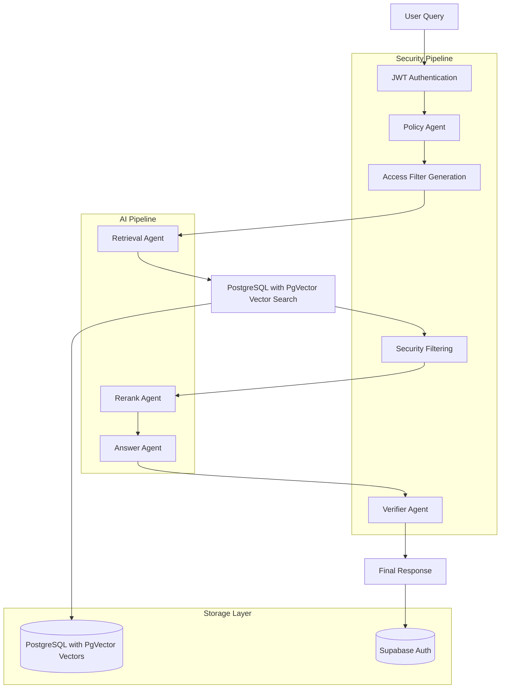

# Mastra Governed RAG Documentation

<div align="center">
  
  
  
  
  
</div>

## 🚀 Overview

**Mastra Governed RAG** is a production-ready, enterprise-grade Retrieval-Augmented Generation (RAG) system that combines cutting-edge AI capabilities with robust security controls. Built on the [Mastra AI orchestration framework](https://mastra.ai), this system provides secure, role-based access to sensitive corporate knowledge bases while maintaining compliance with organizational security policies.

### 🎯 What Makes It Special

Unlike traditional RAG systems that treat all users equally, **Mastra Governed RAG** implements a **zero-trust security model** where:

- **Every query is authenticated and authorized** at multiple pipeline stages
- **Document access is filtered** based on user roles and document classifications
- **Security policies are enforced** by dedicated AI agents
- **Audit trails** track all access and decisions
- **Multi-agent orchestration** ensures no single point of failure

### 🏗️ Core Architecture



## ✨ Key Features

### 🔐 Security-First Design

- **Hierarchical Role-Based Access Control (RBAC)** with inheritance
- **Document Classification System** (Public → Internal → Confidential)
- **Multi-Agent Security Pipeline** with policy enforcement
- **JWT-based Authentication** with role claims
- **Audit Logging** for compliance and monitoring

### 🤖 AI-Powered Intelligence

- **Multi-Agent Orchestration** using Mastra framework
- **Contextual Retrieval** with security-aware filtering
- **Intelligent Reranking** for relevance optimization
- **Citation Tracking** with source attribution
- **Streaming Responses** for real-time interaction

### 🛠️ Developer Experience

- **TypeScript First** with full type safety
- **Next.js 15** with App Router and Server Components
- **Modular Architecture** with clear separation of concerns
- **CLI Tools** for indexing and management
- **Docker Support** for easy deployment

### 📊 Enterprise Ready

- **Production Deployment** guides and best practices
- **Monitoring & Observability** with comprehensive logging
- **Scalable Architecture** supporting multiple tenants
- **Database Integration** with PostgreSQL with PgVector and Supabase
- **API-First Design** with RESTful endpoints

## 🏢 Use Cases

### Corporate Knowledge Management

- **Secure Employee Assistants** with department-specific access
- **Compliance Chatbots** that respect data classification policies
- **Executive Dashboards** with cross-department insights
- **HR Support Systems** with confidential data protection

### Industry Applications

- **Financial Services**: Secure access to trading policies and compliance documents
- **Healthcare**: HIPAA-compliant medical knowledge bases
- **Legal Firms**: Privilege-aware document retrieval
- **Government**: Classified information management

### Technical Scenarios

- **Multi-Tenant SaaS**: Isolated knowledge bases per organization
- **Regulatory Compliance**: Audit trails and access logging
- **Content Moderation**: Automated security classification
- **Knowledge Discovery**: Intelligent document relationship mapping

## 🚀 Quick Start

Get up and running in under 5 minutes:

```bash
# 1. Clone and install
git clone https://github.com/ssdeanx/governed-rag-ai.git
cd governed-rag-ai
npm install

# 2. Configure environment
cp .env.example .env
# Edit .env with your OpenAI API key

# 3. Start services
docker-compose up -d
npm run dev

# 4. Index sample documents
npm run build-cli
npm run cli index

# 5. Open http://localhost:3000
```

> 📖 **Detailed Setup**: See [Quick Start Guide](./quick-start.md) for comprehensive installation instructions.

## 📚 Documentation Structure

### 🏁 Getting Started

- **[Quick Start](./quick-start.md)**: Installation, configuration, and first run
- **[Demo Roles](./demo-roles.md)**: Interactive examples with different user roles

### 🔐 Security & Governance

- **[Security Model](./security.md)**: Roles, classifications, and access policies
- **[Architecture](./architecture.md)**: System design and agent workflows

### 🛠️ Developer Resources

- **[API Reference](./api-reference.md)**: Complete endpoint documentation
- **[Advanced Configuration](./advanced.md)**: Multi-LLM setup and custom agents
- **[Deployment](./deployment.md)**: Production deployment guides

### 🐛 Troubleshooting

- **[Troubleshooting](./troubleshooting.md)**: Common issues and solutions
- **[Contributing](../README.md#contributing)**: Development guidelines

## 🔧 System Requirements

| Component   | Minimum | Recommended |
| ----------- | ------- | ----------- |
| **Node.js** | 20.9.0  | 20.15.0+    |
| **Memory**  | 4GB RAM | 8GB RAM     |
| **Storage** | 10GB    | 50GB SSD    |
| **Docker**  | 24.0+   | 25.0+       |

### Supported Platforms

- ✅ **Linux** (Ubuntu 20.04+, CentOS 8+)
- ✅ **macOS** (12.0+ with Apple Silicon/Intel)
- ✅ **Windows** (WSL2 recommended)
- ✅ **Docker** (all platforms)

## 🌟 Sample Interactions

### Finance Team Member

```bash
User: "What's our expense reimbursement policy?"

System: [Authenticates as finance.viewer]
       [Filters documents: classification ≤ internal, roles include finance.*]
       [Retrieves: finance-policy.md, expense-guidelines.pdf]
       [Generates answer with citations]
```

### HR Administrator

```bash
User: "Show me the salary ranges for senior engineers"

System: [Authenticates as hr.admin]
       [Filters documents: classification ≤ confidential, roles include hr.admin]
       [Retrieves: compensation-plan-2025.pdf, salary-bands.xlsx]
       [Applies step-up authentication for confidential data]
```

## 🤝 Contributing

We welcome contributions! Please see our [Contributing Guide](../README.md#contributing) for:

- Development setup and workflow
- Code standards and testing
- Pull request guidelines
- Issue reporting templates

### Development Commands

```bash
# Install dependencies
npm install

# Start development servers
npm run dev

# Run tests
npm test

# Build for production
npm run build

# CLI tools
npm run cli -- --help
```

## 📞 Support & Community

- **📖 Documentation**: You're reading it! 🎉
- **🐛 Issues**: [GitHub Issues](https://github.com/ssdeanx/governed-rag-ai/issues)
- **💬 Discussions**: [GitHub Discussions](https://github.com/ssdeanx/governed-rag-ai/discussions)
- **📧 Email**: For security issues, email security@governed-rag.dev

### Community Resources

- **Discord**: Join our community for real-time support
- **Blog**: Technical deep-dives and best practices
- **Newsletter**: Monthly updates and new features

## 📄 License

This project is licensed under the MIT License - see the [LICENSE](../LICENSE) file for details.

---

<div align="center">
  <p><strong>Built with ❤️ using Mastra AI Framework</strong></p>
  <p>
    <a href="https://mastra.ai">Mastra.ai</a> •
    <a href="https://nextjs.org">Next.js</a> •
    <a href="https://postgresql.org">PostgreSQL with PgVector</a> •
    <a href="https://openai.com">OpenAI</a>
  </p>
</div>
