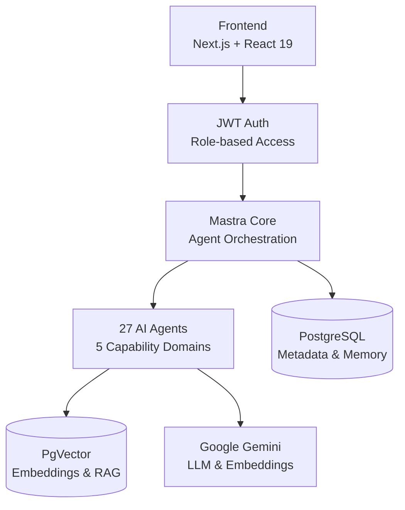

import {
    Badge,
    Button,
    Card,
    CardContent,
    CardDescription,
    CardHeader,
    CardTitle,
    Alert,
    AlertDescription,
    AlertTitle,
    Tabs,
    TabsContent,
    TabsList,
    TabsTrigger,
    Mermaid,
    Shield,
    Users,
    Code,
    Layers,
    BookOpen,
    Play,
    Github,
    CheckCircle,
    ArrowRight,
    Bolt,
    Psychology,
    Storage,
    Typography,
    Box,
} from '@/components/docs/mdx-bridge.joy'

# Multi-Domain AI Orchestration Platform Documentation

<Box
    sx={{
        display: 'flex',
        flexWrap: 'wrap',
        justifyContent: 'center',
        gap: 2,
        mb: 3,
    }}
>
    <Badge color="neutral" variant="soft" sx={{ px: 1.5, py: 0.5 }}>
        <Shield sx={{ fontSize: 14, mr: 0.5 }} />
        Mastra Framework v0.21.1
    </Badge>
    <Badge color="neutral" variant="soft" sx={{ px: 1.5, py: 0.5 }}>
        <Code sx={{ fontSize: 14, mr: 0.5 }} />
        Next.js 15.5.6
    </Badge>
    <Badge color="neutral" variant="soft" sx={{ px: 1.5, py: 0.5 }}>
        <Storage sx={{ fontSize: 14, mr: 0.5 }} />
        TypeScript ES2022
    </Badge>
    <Badge color="neutral" variant="soft" sx={{ px: 1.5, py: 0.5 }}>
        <Psychology sx={{ fontSize: 14, mr: 0.5 }} />
        Google Gemini 2.5 Flash
    </Badge>
    <Badge color="neutral" variant="soft" sx={{ px: 1.5, py: 0.5 }}>
        <Layers sx={{ fontSize: 14, mr: 0.5 }} />
        PostgreSQL + PgVector
    </Badge>
</Box>

<!-- toc -->

## System Overview

This is a **Multi-Domain AI Orchestration Platform** built with Mastra, featuring a comprehensive multi-agent architecture with 27 specialized agents across 5 capability domains: Governed RAG (secure knowledge access), Deep Research (academic & financial intelligence), Financial Intelligence (real-time market analysis), Content Generation (multi-agent synthesis), and Interactive State Management (Cedar OS integration).

## Cedar OS Integration

**Cedar OS** is the advanced UI framework powering interactive features and 3D visualizations. It provides a comprehensive suite of components for building sophisticated user interfaces:

### Core Components

- **Chat Systems**: CedarCaptionChat, EmbeddedCedarChat, FloatingCedarChat, SidePanelCedarChat
- **3D Containers**: Container3D, Flat3dContainer, GlassyPaneContainer, Flat3dButton
- **UI Primitives**: Command bars, debugger panels, diff viewers, voice indicators
- **Roadmap Features**: RoadmapCanvas, RoadmapNode, SmartRelationshipRoadmap, FeatureNode

### Advanced Features

- **Visual Effects**: GlowingMesh, GradientMesh, InsetGlow for 3D styling
- **Interactive Spells**: QuestioningSpell, RadialMenuSpell, RangeSliderSpell, TooltipMenuSpell
- **Text Effects**: PhantomText, ShimmerText, TypewriterText for dynamic content
- **Thread Management**: ChatThreadController for conversation threading
- **Input Systems**: Advanced chat inputs with context badges and human-in-the-loop indicators

### Developer Tools

- **Debugger Suite**: CollapsibleSection, DebuggerPanel, MessagesTab, NetworkTab, StatesTab
- **Diff Visualization**: DiffContainer, DiffText for comparing content
- **Settings Management**: SettingsPanel for user preferences
- **Voice Integration**: VoiceIndicator for audio features

Cedar OS seamlessly integrates with Mastra agents to provide rich, interactive experiences for complex workflows and data visualization.

### Component Categories

<Box sx={{ display: 'grid', gridTemplateColumns: { xs: '1fr', md: 'repeat(3, 1fr)' }, gap: 2, mb: 3 }}>
  <Card variant="outlined">
    <CardHeader>
      <CardTitle sx={{ fontSize: '1rem' }}>Chat & Communication</CardTitle>
    </CardHeader>
    <CardContent>
      <Typography level="body-sm">
        • Multi-modal chat interfaces 
        • Thread management 
        • Voice indicators 
        • Context badges
      </Typography>
    </CardContent>
  </Card>

<Card variant="outlined">
    <CardHeader>
        <CardTitle sx={{ fontSize: '1rem' }}>3D & Visual Effects</CardTitle>
    </CardHeader>
    <CardContent>
        <Typography level="body-sm">
            • 3D containers & buttons
             
            • Glowing mesh effects
             
            • Gradient overlays
             • Interactive spells
        </Typography>
    </CardContent>
</Card>

  <Card variant="outlined">
    <CardHeader>
      <CardTitle sx={{ fontSize: '1rem' }}>Developer Tools</CardTitle>
    </CardHeader>
    <CardContent>
      <Typography level="body-sm">
        • Debugger panels 
        • Diff viewers 
        • Settings management 
        • Roadmap canvas
      </Typography>
    </CardContent>
  </Card>
</Box>

## Features

<Box sx={{ display: 'grid', gridTemplateColumns: { xs: '1fr', md: 'repeat(2, 1fr)' }, gap: 2, mb: 3 }}>
  <Card variant="outlined">
    <CardHeader>
      <CardTitle sx={{ display: 'flex', alignItems: 'center', gap: 1 }}>
        <Shield sx={{ fontSize: 20, color: 'success.main' }} />
        Security First
      </CardTitle>
    </CardHeader>
    <CardContent>
      <CardDescription>
        Enterprise-grade security with role-based access control, document classification, and audit trails.
      </CardDescription>
    </CardContent>
  </Card>

<Card variant="outlined">
    <CardHeader>
        <CardTitle sx={{ display: 'flex', alignItems: 'center', gap: 1 }}>
            <Bolt sx={{ fontSize: 20, color: 'primary.main' }} />
            High Performance
        </CardTitle>
    </CardHeader>
    <CardContent>
        <CardDescription>
            Optimized vector search with PostgreSQL + PgVector, Supabase
            storage, and efficient document processing workflows.
        </CardDescription>
    </CardContent>
</Card>

<Card variant="outlined">
    <CardHeader>
        <CardTitle sx={{ display: 'flex', alignItems: 'center', gap: 1 }}>
            <Psychology sx={{ fontSize: 20, color: 'secondary.main' }} />
            AI-Powered
        </CardTitle>
    </CardHeader>
    <CardContent>
        <CardDescription>
            Leverages Google Gemini 2.5 Flash for intelligent document analysis
            and conversational responses.
        </CardDescription>
    </CardContent>
</Card>

  <Card variant="outlined">
    <CardHeader>
      <CardTitle sx={{ display: 'flex', alignItems: 'center', gap: 1 }}>
        <Layers sx={{ fontSize: 20, color: 'warning.main' }} />
        Cedar OS
      </CardTitle>
    </CardHeader>
    <CardContent>
      <CardDescription>
        Advanced UI framework with 40+ components including 3D containers, multi-modal chat interfaces, interactive roadmaps, debugger tools, and visual effects.
      </CardDescription>
    </CardContent>
  </Card>
</Box>

## 🚀 Overview

**Mastra Governed RAG** is a production-ready, enterprise-grade Retrieval-Augmented Generation (RAG) system that combines cutting-edge AI capabilities with robust security controls. Built on the [Mastra AI orchestration framework](https://mastra.ai), this system provides secure, role-based access to sensitive corporate knowledge bases while maintaining compliance with organizational security policies.

<Alert className="mb-6">
    <Shield className="h-4 w-4" />
    <AlertTitle>Zero-Trust Security Model</AlertTitle>
    <AlertDescription>
        Unlike traditional RAG systems, every query is authenticated and
        authorized at multiple pipeline stages with document access filtered
        based on user roles and classifications.
    </AlertDescription>
</Alert>

### Architecture

```mermaid
graph LR
    A[User Query] --> B[JWT Auth]
    B --> C[Policy Agent]
    C --> D[Access Filter]
    D --> E[Retrieval Agent]
    E --> F[PgVector Search]
    F --> G[Security Filter]
    G --> H[Rerank Agent]
    H --> I[Answer Agent]
    I --> J[Verifier Agent]
    J --> K[Final Response]

    classDef security fill:#fee2e2,stroke:#dc2626
    classDef ai fill:#dbeafe,stroke:#2563eb
    class B,C,D,G,J security
    class E,H,I ai
```

<Box sx={{ display: 'grid', gridTemplateColumns: { xs: '1fr', md: 'repeat(2, 1fr)' }, gap: 2, mb: 3 }}>
  <Card variant="outlined">
    <CardHeader>
      <CardTitle sx={{ fontSize: '1rem' }}>Hierarchical RBAC</CardTitle>
      <CardDescription>Role-based access with inheritance</CardDescription>
    </CardHeader>
    <CardContent>
      <Typography level="body-sm">
        Users inherit permissions from parent roles, creating a flexible hierarchy.
      </Typography>
    </CardContent>
  </Card>

<Card variant="outlined">
    <CardHeader>
        <CardTitle sx={{ fontSize: '1rem' }}>Document Classification</CardTitle>
        <CardDescription>Public → Internal → Confidential</CardDescription>
    </CardHeader>
    <CardContent>
        <Typography level="body-sm">
            Three-tier classification system ensures sensitive information is
            only accessible to authorized personnel.
        </Typography>
    </CardContent>
</Card>

<Card variant="outlined">
    <CardHeader>
        <CardTitle sx={{ fontSize: '1rem' }}>Multi-Agent Security</CardTitle>
        <CardDescription>Policy enforcement pipeline</CardDescription>
    </CardHeader>
    <CardContent>
        <Typography level="body-sm">
            Dedicated AI agents enforce security policies at every stage of the
            query processing pipeline.
        </Typography>
    </CardContent>
</Card>

  <Card variant="outlined">
    <CardHeader>
      <CardTitle sx={{ fontSize: '1rem' }}>Audit Logging</CardTitle>
      <CardDescription>Complete compliance tracking</CardDescription>
    </CardHeader>
    <CardContent>
      <Typography level="body-sm">
        Every access attempt and decision is logged for compliance, monitoring, and forensic analysis.
      </Typography>
    </CardContent>
  </Card>
</Box>

## Use Cases

<Box sx={{ display: 'grid', gridTemplateColumns: { xs: '1fr', md: 'repeat(2, 1fr)' }, gap: 2, mb: 3 }}>
  <Card variant="outlined">
    <CardHeader>
      <CardTitle sx={{ fontSize: '1.1rem' }}>Secure Employee Assistants</CardTitle>
      <CardDescription>Department-specific access control</CardDescription>
    </CardHeader>
    <CardContent>
      <Typography level="body-sm">
        AI assistants that respect organizational boundaries and data classification policies.
      </Typography>
    </CardContent>
  </Card>

<Card variant="outlined">
    <CardHeader>
        <CardTitle sx={{ fontSize: '1.1rem' }}>Compliance Chatbots</CardTitle>
        <CardDescription>Regulatory compliance automation</CardDescription>
    </CardHeader>
    <CardContent>
        <Typography level="body-sm">
            Automated compliance checking and policy enforcement through
            conversational interfaces.
        </Typography>
    </CardContent>
</Card>

<Card variant="outlined">
    <CardHeader>
        <CardTitle sx={{ fontSize: '1.1rem' }}>Executive Dashboards</CardTitle>
        <CardDescription>Cross-department insights</CardDescription>
    </CardHeader>
    <CardContent>
        <Typography level="body-sm">
            Aggregated intelligence from multiple departments with appropriate
            access controls.
        </Typography>
    </CardContent>
</Card>

  <Card variant="outlined">
    <CardHeader>
      <CardTitle sx={{ fontSize: '1.1rem' }}>HR Support Systems</CardTitle>
      <CardDescription>Confidential data protection</CardDescription>
    </CardHeader>
    <CardContent>
      <Typography level="body-sm">
        Human resources assistants with built-in privacy and confidentiality safeguards.
      </Typography>
    </CardContent>
  </Card>
</Box>

### Industries

<Box sx={{ display: 'grid', gridTemplateColumns: { xs: 'repeat(2, 1fr)', md: 'repeat(4, 1fr)' }, gap: 2, mb: 3 }}>
  <Card variant="outlined">
    <CardHeader>
      <CardTitle sx={{ fontSize: '0.9rem' }}>Financial Services</CardTitle>
    </CardHeader>
    <CardContent>
      <Typography level="body-xs">
        Secure access to trading policies and compliance documents
      </Typography>
    </CardContent>
  </Card>

<Card variant="outlined">
    <CardHeader>
        <CardTitle sx={{ fontSize: '0.9rem' }}>Healthcare</CardTitle>
    </CardHeader>
    <CardContent>
        <Typography level="body-xs">
            HIPAA-compliant medical knowledge bases
        </Typography>
    </CardContent>
</Card>

<Card variant="outlined">
    <CardHeader>
        <CardTitle sx={{ fontSize: '0.9rem' }}>Legal Firms</CardTitle>
    </CardHeader>
    <CardContent>
        <Typography level="body-xs">
            Privilege-aware document retrieval
        </Typography>
    </CardContent>
</Card>

  <Card variant="outlined">
    <CardHeader>
      <CardTitle sx={{ fontSize: '0.9rem' }}>Government</CardTitle>
    </CardHeader>
    <CardContent>
      <Typography level="body-xs">
        Classified information management
      </Typography>
    </CardContent>
  </Card>
</Box>

## Quick Start

<Box sx={{ bgcolor: 'background.surface', p: 2, borderRadius: 1, mb: 3 }}>
  <Typography component="pre" sx={{ fontSize: '0.875rem', overflow: 'auto', m: 0 }}>
    {`# 1. Clone and install
git clone https://github.com/ssdeanx/governed-rag-ai.git
cd governed-rag-ai
npm install

# 2. Configure environment

cp .env.example .env

# Edit .env with your Google Gemini API key and PostgreSQL settings

# 3. Start services

docker-compose up -d
npm run dev

# 4. Index sample documents

npm run build-cli
npm run cli index

# 5. Open http://localhost:3000`}

  </Typography>
</Box>

<Box sx={{ display: 'flex', gap: 2, mb: 3 }}>
    <Button
        component="a"
        href="/docs/quick-start"
        startDecorator={<Play />}
        endDecorator={<ArrowRight />}
    >
        Detailed Setup Guide
    </Button>
    <Button
        variant="soft"
        component="a"
        href="/docs/demo-roles"
        startDecorator={<Users />}
    >
        Try Demo Roles
    </Button>
</Box>

## Documentation Structure

<Box sx={{ display: 'grid', gridTemplateColumns: { xs: '1fr', md: 'repeat(2, 1fr)' }, gap: 2, mb: 3 }}>
  <Card variant="outlined">
    <CardHeader>
      <CardTitle>Cedar OS & UI</CardTitle>
    </CardHeader>
    <CardContent>
      <Box component="ul" sx={{ m: 0, pl: 2 }}>
        <li><a href="/docs/onboarding-cedar-mastra">Cedar OS Integration</a> - Framework setup & usage</li>
        <li><a href="/docs/joy-components">Joy Components</a> - UI component library</li>
        <li><a href="/docs/component-mapping">Component Mapping</a> - Migration guides</li>
        <li><a href="/docs/spikes/mastra-cedar">Cedar Architecture</a> - Technical deep-dive</li>
      </Box>
    </CardContent>
  </Card>

<Card variant="outlined">
    <CardHeader>
        <CardTitle>Security & Architecture</CardTitle>
    </CardHeader>
    <CardContent>
        <Box component="ul" sx={{ m: 0, pl: 2 }}>
            <li>
                <a href="/docs/security">Security Model</a> - Roles & policies
            </li>
            <li>
                <a href="/docs/architecture">Architecture</a> - System design
            </li>
        </Box>
    </CardContent>
</Card>

<Card variant="outlined">
    <CardHeader>
        <CardTitle>Cedar OS & UI</CardTitle>
    </CardHeader>
    <CardContent>
        <Box component="ul" sx={{ m: 0, pl: 2 }}>
            <li>
                <a href="/docs/cedar-os">Cedar OS</a> - Advanced UI framework
            </li>
            <li>
                <a href="/docs/joy-components">Joy Components</a> - UI component
                library
            </li>
        </Box>
    </CardContent>
</Card>

  <Card variant="outlined">
    <CardHeader>
      <CardTitle>Developer Resources</CardTitle>
    </CardHeader>
    <CardContent>
      <Box component="ul" sx={{ m: 0, pl: 2 }}>
        <li><a href="/docs/api-reference">API Reference</a> - Complete endpoints</li>
        <li><a href="/docs/mastra">Mastra Framework</a> - Core concepts</li>
      </Box>
    </CardContent>
  </Card>
</Box>

## 🤝 Contributing
