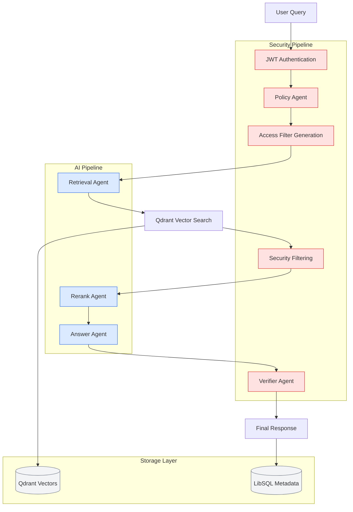

import { Badge } from '@/components/ui/badge'
import { Button } from '@/components/ui/button'
import {
    Card,
    CardContent,
    CardDescription,
    CardHeader,
    CardTitle,
} from '@/components/ui/card'
import { Tabs, TabsContent, TabsList, TabsTrigger } from '@/components/ui/tabs'
import { Alert, AlertDescription, AlertTitle } from '@/components/ui/alert'
import { Mermaid } from '@/components/Mermaid'
import {
    Shield,
    Zap,
    Users,
    Code,
    Layers,
    BookOpen,
    Play,
    Github,
    ExternalLink,
    CheckCircle,
    Star,
    ArrowRight,
    Database,
    Lock,
    Brain,
} from 'lucide-react'

# Mastra Governed RAG Documentation

    <Badge variant="secondary" className="px-3 py-1">
        <Shield className="h-3 w-3 mr-1" />
        Mastra Framework
    </Badge>
    <Badge variant="secondary" className="px-3 py-1">
        <Code className="h-3 w-3 mr-1" />
        Next.js 15.5.3
    </Badge>
    <Badge variant="secondary" className="px-3 py-1">
        <Database className="h-3 w-3 mr-1" />
        TypeScript 5.9.2
    </Badge>
    <Badge variant="secondary" className="px-3 py-1">
        <Brain className="h-3 w-3 mr-1" />
        OpenAI GPT-4o-mini
    </Badge>
    <Badge variant="secondary" className="px-3 py-1">
        <Layers className="h-3 w-3 mr-1" />
        Qdrant Vector DB
    </Badge>

<!-- toc -->

## System Overview

<Mermaid chart={`graph TB
    subgraph "User Interface"
        UI[Next.js Frontend React + TypeScript]
        Auth[Authentication JWT + Mastra]
        Chat[Chat Interface Real-time messaging]
    end

    subgraph "Mastra Backend"
        Agent[Mastra Agent Orchestration]
        Workflow[Workflow Engine Document processing]
        Security[Security Layer RBAC + Policies]
    end

    subgraph "Data Layer"
        VectorDB[(Qdrant Vector Database)]
        DocStore[(Document Store Indexed content)]
        Cache[(Redis Cache Session data)]
    end

    subgraph "External Services"
        LLM[OpenAI GPT-4o-mini Text generation]
        Embed[OpenAI Embeddings Vector creation]
    end

    UI --> Auth
    UI --> Chat
    Auth --> Security
    Chat --> Agent
    Agent --> Workflow
    Agent --> Security
    Workflow --> VectorDB
    Workflow --> DocStore
    VectorDB --> Embed
    Agent --> LLM
    Security --> Cache

    classDef frontend fill:#e1f5fe,stroke:#01579b,stroke-width:2px
    classDef backend fill:#f3e5f5,stroke:#4a148c,stroke-width:2px
    classDef data fill:#e8f5e8,stroke:#1b5e20,stroke-width:2px
    classDef external fill:#fff3e0,stroke:#e65100,stroke-width:2px

    class UI,Auth,Chat frontend
    class Agent,Workflow,Security backend
    class VectorDB,DocStore,Cache data
    class LLM,Embed external

`} />

  <Card>
    <CardHeader>
      <CardTitle className="flex items-center gap-2">
        <Shield className="h-5 w-5 text-green-600" />
        Security First
      </CardTitle>
    </CardHeader>
    <CardContent>
      <CardDescription>
        Enterprise-grade security with role-based access control, document classification, and audit trails.
      </CardDescription>
    </CardContent>
  </Card>

<Card>
    <CardHeader>
        <CardTitle className="flex items-center gap-2">
            <Zap className="h-5 w-5 text-blue-600" />
            High Performance
        </CardTitle>
    </CardHeader>
    <CardContent>
        <CardDescription>
            Optimized vector search with Qdrant, Redis caching, and efficient
            document processing workflows.
        </CardDescription>
    </CardContent>
</Card>

  <Card>
    <CardHeader>
      <CardTitle className="flex items-center gap-2">
        <Brain className="h-5 w-5 text-purple-600" />
        AI-Powered
      </CardTitle>
    </CardHeader>
    <CardContent>
      <CardDescription>
        Leverages OpenAI GPT-4o-mini for intelligent document analysis and conversational responses.
      </CardDescription>
    </CardContent>
  </Card>

## 🚀 Overview

**Mastra Governed RAG** is a production-ready, enterprise-grade Retrieval-Augmented Generation (RAG) system that combines cutting-edge AI capabilities with robust security controls. Built on the [Mastra AI orchestration framework](https://mastra.ai), this system provides secure, role-based access to sensitive corporate knowledge bases while maintaining compliance with organizational security policies.

<Alert className="mb-6">
    <Shield className="h-4 w-4" />
    <AlertTitle>Zero-Trust Security Model</AlertTitle>
    <AlertDescription>
        Unlike traditional RAG systems, every query is authenticated and
        authorized at multiple pipeline stages with document access filtered
        based on user roles and classifications.
    </AlertDescription>
</Alert>

### 🎯 What Makes It Special

  <Card>
    <CardHeader className="pb-3">
      <CardTitle className="text-lg flex items-center">
        <Lock className="h-5 w-5 mr-2 text-primary" />
        Security First
      </CardTitle>
    </CardHeader>
    <CardContent>
      <ul className="space-y-2 text-sm">
        <li className="flex items-center">
          <CheckCircle className="h-4 w-4 mr-2 text-green-500" />
          Multi-stage authentication
        </li>
        <li className="flex items-center">
          <CheckCircle className="h-4 w-4 mr-2 text-green-500" />
          Role-based document filtering
        </li>
        <li className="flex items-center">
          <CheckCircle className="h-4 w-4 mr-2 text-green-500" />
          Audit trail tracking
        </li>
      </ul>
    </CardContent>
  </Card>

<Card>
    <CardHeader className="pb-3">
        <CardTitle className="text-lg flex items-center">
            <Brain className="h-5 w-5 mr-2 text-primary" />
            AI-Powered
        </CardTitle>
    </CardHeader>
    <CardContent>
        <ul className="space-y-2 text-sm">
            <li className="flex items-center">
                <CheckCircle className="h-4 w-4 mr-2 text-green-500" />
                Multi-agent orchestration
            </li>
            <li className="flex items-center">
                <CheckCircle className="h-4 w-4 mr-2 text-green-500" />
                Intelligent reranking
            </li>
            <li className="flex items-center">
                <CheckCircle className="h-4 w-4 mr-2 text-green-500" />
                Citation tracking
            </li>
        </ul>
    </CardContent>
</Card>

  <Card>
    <CardHeader className="pb-3">
      <CardTitle className="text-lg flex items-center">
        <Zap className="h-5 w-5 mr-2 text-primary" />
        Enterprise Ready
      </CardTitle>
    </CardHeader>
    <CardContent>
      <ul className="space-y-2 text-sm">
        <li className="flex items-center">
          <CheckCircle className="h-4 w-4 mr-2 text-green-500" />
          Production deployment
        </li>
        <li className="flex items-center">
          <CheckCircle className="h-4 w-4 mr-2 text-green-500" />
          Scalable architecture
        </li>
        <li className="flex items-center">
          <CheckCircle className="h-4 w-4 mr-2 text-green-500" />
          Comprehensive monitoring
        </li>
      </ul>
    </CardContent>
  </Card>

### 🏗️ Core Architecture

## ✨ Key Features

<Tabs defaultValue="security" className="mb-8">
  <TabsList className="grid w-full grid-cols-3">
    <TabsTrigger value="security">🔐 Security</TabsTrigger>
    <TabsTrigger value="ai">🤖 AI Intelligence</TabsTrigger>
    <TabsTrigger value="dev">🛠️ Developer Experience</TabsTrigger>
  </TabsList>

  <TabsContent value="security" className="space-y-4">
    

      <Card>
        <CardHeader>
          <CardTitle className="text-lg">Hierarchical RBAC</CardTitle>
          <CardDescription>Role-based access with inheritance</CardDescription>
        </CardHeader>
        <CardContent>
          
Users inherit permissions from parent roles, creating a flexible hierarchy that scales with your organization.

        </CardContent>
      </Card>

      <Card>
        <CardHeader>
          <CardTitle className="text-lg">Document Classification</CardTitle>
          <CardDescription>Public → Internal → Confidential</CardDescription>
        </CardHeader>
        <CardContent>
          
Three-tier classification system ensures sensitive information is only accessible to authorized personnel.

        </CardContent>
      </Card>

      <Card>
        <CardHeader>
          <CardTitle className="text-lg">Multi-Agent Security</CardTitle>
          <CardDescription>Policy enforcement pipeline</CardDescription>
        </CardHeader>
        <CardContent>
          
Dedicated AI agents enforce security policies at every stage of the query processing pipeline.

        </CardContent>
      </Card>

      <Card>
        <CardHeader>
          <CardTitle className="text-lg">Audit Logging</CardTitle>
          <CardDescription>Complete compliance tracking</CardDescription>
        </CardHeader>
        <CardContent>
          
Every access attempt and decision is logged for compliance, monitoring, and forensic analysis.

        </CardContent>
      </Card>
    

  </TabsContent>

  <TabsContent value="ai" className="space-y-4">
    

      <Card>
        <CardHeader>
          <CardTitle className="text-lg">Multi-Agent Orchestration</CardTitle>
          <CardDescription>Mastra framework integration</CardDescription>
        </CardHeader>
        <CardContent>
          
Specialized AI agents work together to process queries, retrieve information, and generate responses.

        </CardContent>
      </Card>

      <Card>
        <CardHeader>
          <CardTitle className="text-lg">Contextual Retrieval</CardTitle>
          <CardDescription>Security-aware filtering</CardDescription>
        </CardHeader>
        <CardContent>
          
Documents are retrieved and filtered based on both relevance and user access permissions.

        </CardContent>
      </Card>

      <Card>
        <CardHeader>
          <CardTitle className="text-lg">Intelligent Reranking</CardTitle>
          <CardDescription>Relevance optimization</CardDescription>
        </CardHeader>
        <CardContent>
          
Results are reordered based on contextual relevance and user-specific preferences.

        </CardContent>
      </Card>

      <Card>
        <CardHeader>
          <CardTitle className="text-lg">Citation Tracking</CardTitle>
          <CardDescription>Source attribution</CardDescription>
        </CardHeader>
        <CardContent>
          
Every response includes citations linking back to source documents with access verification.

        </CardContent>
      </Card>
    

  </TabsContent>

  <TabsContent value="dev" className="space-y-4">
    

      <Card>
        <CardHeader>
          <CardTitle className="text-lg">TypeScript First</CardTitle>
          <CardDescription>Full type safety</CardDescription>
        </CardHeader>
        <CardContent>
          
Complete TypeScript coverage with strict typing for all components and APIs.

        </CardContent>
      </Card>

      <Card>
        <CardHeader>
          <CardTitle className="text-lg">Next.js 15</CardTitle>
          <CardDescription>App Router & Server Components</CardDescription>
        </CardHeader>
        <CardContent>
          
Latest Next.js features with optimal performance and developer experience.

        </CardContent>
      </Card>

      <Card>
        <CardHeader>
          <CardTitle className="text-lg">Modular Architecture</CardTitle>
          <CardDescription>Clear separation of concerns</CardDescription>
        </CardHeader>
        <CardContent>
          
Well-structured codebase with independent modules for security, AI, and UI components.

        </CardContent>
      </Card>

      <Card>
        <CardHeader>
          <CardTitle className="text-lg">CLI Tools</CardTitle>
          <CardDescription>Indexing and management</CardDescription>
        </CardHeader>
        <CardContent>
          
Command-line utilities for document indexing, user management, and system administration.

        </CardContent>
      </Card>
    

  </TabsContent>
</Tabs>

## 🏢 Use Cases

### Corporate Knowledge Management

  <Card>
    <CardHeader>
      <CardTitle className="text-lg">Secure Employee Assistants</CardTitle>
      <CardDescription>Department-specific access control</CardDescription>
    </CardHeader>
    <CardContent>
      
AI assistants that respect organizational boundaries and data classification policies.

    </CardContent>
  </Card>

<Card>
    <CardHeader>
        <CardTitle className="text-lg">Compliance Chatbots</CardTitle>
        <CardDescription>Regulatory compliance automation</CardDescription>
    </CardHeader>
    <CardContent>
        

            Automated compliance checking and policy enforcement through
            conversational interfaces.
        

    </CardContent>
</Card>

<Card>
    <CardHeader>
        <CardTitle className="text-lg">Executive Dashboards</CardTitle>
        <CardDescription>Cross-department insights</CardDescription>
    </CardHeader>
    <CardContent>
        

            Aggregated intelligence from multiple departments with appropriate
            access controls.
        

    </CardContent>
</Card>

  <Card>
    <CardHeader>
      <CardTitle className="text-lg">HR Support Systems</CardTitle>
      <CardDescription>Confidential data protection</CardDescription>
    </CardHeader>
    <CardContent>
      
Human resources assistants with built-in privacy and confidentiality safeguards.

    </CardContent>
  </Card>

### Industry Applications

  <Card>
    <CardHeader>
      <CardTitle className="text-sm">Financial Services</CardTitle>
    </CardHeader>
    <CardContent>
      
Secure access to trading policies and compliance documents

    </CardContent>
  </Card>

<Card>
    <CardHeader>
        <CardTitle className="text-sm">Healthcare</CardTitle>
    </CardHeader>
    <CardContent>
        
HIPAA-compliant medical knowledge bases

    </CardContent>
</Card>

<Card>
    <CardHeader>
        <CardTitle className="text-sm">Legal Firms</CardTitle>
    </CardHeader>
    <CardContent>
        
Privilege-aware document retrieval

    </CardContent>
</Card>

  <Card>
    <CardHeader>
      <CardTitle className="text-sm">Government</CardTitle>
    </CardHeader>
    <CardContent>
      
Classified information management

    </CardContent>
  </Card>

## 🚀 Quick Start

Get up and running in under 5 minutes:

  <pre className="text-sm overflow-x-auto">
    <code>{`# 1. Clone and install
git clone https://github.com/ssdeanx/governed-rag-ai.git
cd governed-rag-ai
npm install

# 2. Configure environment

cp .env.example .env

# Edit .env with your OpenAI API key

# 3. Start services

docker-compose up -d
npm run dev

# 4. Index sample documents

npm run build-cli
npm run cli index

# 5. Open <http://localhost:3000>`}</code>

  </pre>

    <Button asChild>
        <a href="/docs/quick-start">
            <Play className="h-4 w-4 mr-2" />
            Detailed Setup Guide
            <ArrowRight className="h-4 w-4 ml-2" />
        </a>
    </Button>
    <Button variant="outline" asChild>
        <a href="/docs/demo-roles">
            <Users className="h-4 w-4 mr-2" />
            Try Demo Roles
        </a>
    </Button>

## 📚 Documentation Structure

### 🏁 Getting Started

- **[Quick Start](/docs/quick-start)**: Installation, configuration, and first run
- **[Demo Roles](/docs/demo-roles)**: Interactive examples with different user roles

### 🔐 Security & Governance

- **[Security Model](/docs/security)**: Roles, classifications, and access policies
- **[Architecture](/docs/architecture)**: System design and agent workflows

### 🛠️ Developer Resources

- **[API Reference](/docs/api-reference)**: Complete endpoint documentation

### 🐛 Troubleshooting

- **[Troubleshooting](/docs/troubleshooting)**: Common issues and solutions

## 🔧 System Requirements

    <table className="w-full border-collapse border border-border">
        <thead>
            <tr className="bg-muted">
                <th className="border border-border p-3 text-left">
                    Component
                </th>
                <th className="border border-border p-3 text-left">Minimum</th>
                <th className="border border-border p-3 text-left">
                    Recommended
                </th>
            </tr>
        </thead>
        <tbody>
            <tr>
                <td className="border border-border p-3 font-medium">
                    Node.js
                </td>
                <td className="border border-border p-3">20.9.0</td>
                <td className="border border-border p-3">20.15.0+</td>
            </tr>
            <tr>
                <td className="border border-border p-3 font-medium">Memory</td>
                <td className="border border-border p-3">4GB RAM</td>
                <td className="border border-border p-3">8GB RAM</td>
            </tr>
            <tr>
                <td className="border border-border p-3 font-medium">
                    Storage
                </td>
                <td className="border border-border p-3">10GB</td>
                <td className="border border-border p-3">50GB SSD</td>
            </tr>
            <tr>
                <td className="border border-border p-3 font-medium">Docker</td>
                <td className="border border-border p-3">24.0+</td>
                <td className="border border-border p-3">25.0+</td>
            </tr>
        </tbody>
    </table>

### Supported Platforms

    

        <CheckCircle className="h-5 w-5 mr-2 text-green-500" />
        Linux (Ubuntu 20.04+)
    

    

        <CheckCircle className="h-5 w-5 mr-2 text-green-500" />
        macOS (12.0+)
    

    

        <CheckCircle className="h-5 w-5 mr-2 text-green-500" />
        Windows (WSL2)
    

    

        <CheckCircle className="h-5 w-5 mr-2 text-green-500" />
        Docker (all platforms)
    

## 🌟 Sample Interactions

<Tabs defaultValue="finance" className="mb-8">
  <TabsList>
    <TabsTrigger value="finance">Finance Team</TabsTrigger>
    <TabsTrigger value="hr">HR Admin</TabsTrigger>
  </TabsList>

<TabsContent value="finance">
    <Card>
        <CardHeader>
            <CardTitle>Finance Team Member Query</CardTitle>
            <CardDescription>
                Expense reimbursement policy inquiry
            </CardDescription>
        </CardHeader>
        <CardContent>
            

                

                    User: "What's our expense reimbursement policy?"
                

                

                    System: [Authenticates as finance.viewer]
                     
                    &nbsp;&nbsp;&nbsp;&nbsp;&nbsp;&nbsp;&nbsp;[Filters
                    documents: classification ≤ internal, roles include
                    finance.*]
                     
                    &nbsp;&nbsp;&nbsp;&nbsp;&nbsp;&nbsp;&nbsp;[Retrieves:
                    finance-policy.md, expense-guidelines.pdf]
                     
                    &nbsp;&nbsp;&nbsp;&nbsp;&nbsp;&nbsp;&nbsp;[Generates answer
                    with citations]
                

            

        </CardContent>
    </Card>
</TabsContent>

  <TabsContent value="hr">
    <Card>
      <CardHeader>
        <CardTitle>HR Administrator Query</CardTitle>
        <CardDescription>Salary ranges for senior engineers</CardDescription>
      </CardHeader>
      <CardContent>
        

          
User: "Show me the salary ranges for senior engineers"

          

            System: [Authenticates as hr.admin] 
            &nbsp;&nbsp;&nbsp;&nbsp;&nbsp;&nbsp;&nbsp;[Filters documents: classification ≤ confidential, roles include hr.admin] 
            &nbsp;&nbsp;&nbsp;&nbsp;&nbsp;&nbsp;&nbsp;[Retrieves: compensation-plan-2025.pdf, salary-bands.xlsx] 
            &nbsp;&nbsp;&nbsp;&nbsp;&nbsp;&nbsp;&nbsp;[Applies step-up authentication for confidential data]
          

        

      </CardContent>
    </Card>
  </TabsContent>
</Tabs>

## 🤝 Contributing

We welcome contributions! Please see our [Contributing Guide](../README.md#contributing) for:

- Development setup and workflow
- Code standards and testing
- Pull request guidelines
- Issue reporting templates

### Development Commands

  <pre className="text-sm overflow-x-auto">
    <code>{`# Install dependencies
npm install

# Start development servers

npm run dev

# Run tests

npm test

# Build for production

npm run build

# CLI tools

npm run cli -- --help`}</code>

  </pre>

## 📞 Support & Community

  <Card>
    <CardHeader>
      <CardTitle className="text-lg flex items-center">
        <BookOpen className="h-5 w-5 mr-2" />
        Documentation
      </CardTitle>
    </CardHeader>
    <CardContent>
      
You're reading it! Complete guides and API references.

    </CardContent>
  </Card>

<Card>
    <CardHeader>
        <CardTitle className="text-lg flex items-center">
            <Github className="h-5 w-5 mr-2" />
            GitHub
        </CardTitle>
    </CardHeader>
    <CardContent>
        

            Issues, discussions, and source code repository.
        

    </CardContent>
</Card>

  <Card>
    <CardHeader>
      <CardTitle className="text-lg flex items-center">
        <Users className="h-5 w-5 mr-2" />
        Community
      </CardTitle>
    </CardHeader>
    <CardContent>
      
Discord community, blog posts, and monthly newsletter.

    </CardContent>
  </Card>

---

    

        Built with ❤️ using Mastra AI Framework
    

    

        <a
            href="https://mastra.ai"
            className="hover:text-primary transition-colors"
        >
            Mastra.ai
        </a>
        •
        <a
            href="https://nextjs.org"
            className="hover:text-primary transition-colors"
        >
            Next.js
        </a>
        •
        <a
            href="https://qdrant.tech"
            className="hover:text-primary transition-colors"
        >
            Qdrant
        </a>
        •
        <a
            href="https://openai.com"
            className="hover:text-primary transition-colors"
        >
            OpenAI
        </a>
    

