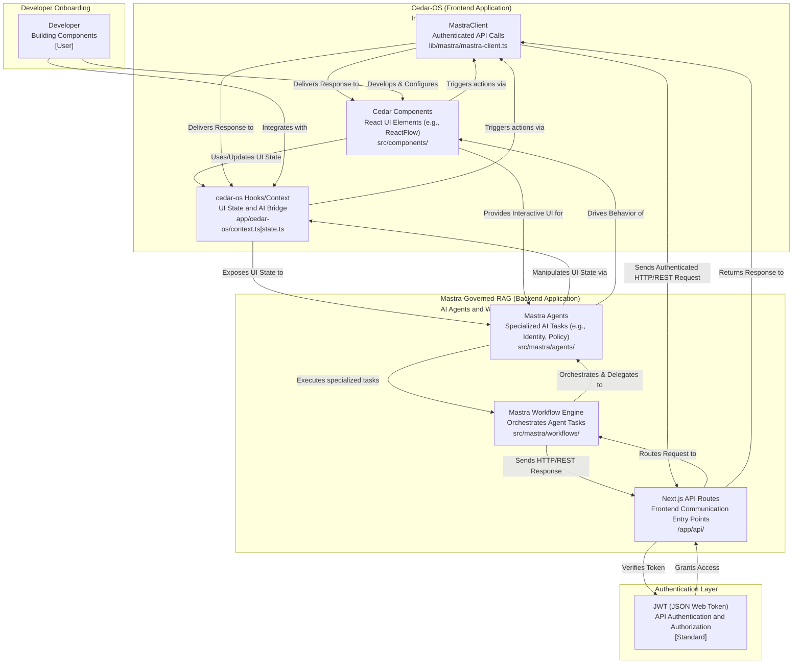

import { Card, CardContent, CardDescription, CardHeader, CardTitle } from "@/components/ui/card"

# Onboarding to Cedar Component Development with Mastra Integration

This guide provides a detailed onboarding process for developers looking to build interactive UI components within `cedar-os` and integrate them with the powerful AI-driven, governance-focused capabilities of `mastra-governed-rag`.

## 1. Overall Architecture and Interaction Flow

At a high level, the system consists of a frontend built with `cedar-os` (a React-based framework) and a backend powered by `mastra-governed-rag` (a Next.js application leveraging a sophisticated agentic workflow engine). They communicate primarily via HTTP/REST APIs, secured by JWTs.

### Architectural Components

- **Cedar-OS (Frontend)**:
  - **Purpose**: Provides the interactive user interface, often leveraging `ReactFlow` for canvas-based interactions.
  - **Cedar Components**: Standard React components whose visual representation and behavior are driven by `data` props. Located in `src/components/` and `cedar/components/`.
  - **`cedar-os` Hooks/Context**: A bridge (`app/cedar-os/context.ts`, `app/cedar-os/state.ts`) that exposes UI state to AI agents and allows AI agents to manipulate UI state.
  - **`MastraClient`**: A client-side utility (`lib/mastra/mastra-client.ts`) for making authenticated requests to the `mastra-governed-rag` backend.

- **Mastra-Governed-RAG (Backend)**:
  - **Purpose**: Securely processes natural language queries, retrieves relevant information, generates responses, and enforces access control.
  - **Next.js API Routes**: Entry points (`/app/api/`) for frontend communication (e.g., `/api/chat`, `/api/index`, `/api/auth`).
  - **Mastra Workflow Engine**: Orchestrates complex sequences of operations using specialized agents and tools (`src/mastra/workflows/`).
  - **Mastra Agents**: Specialized AI components (`src/mastra/agents/`) performing distinct tasks (e.g., Identity, Policy, Retrieve, Answerer, Verifier), ensuring governance, security, and traceability in all interactions.

### High-Level System Diagram

```mermaid
graph TD
    user["User<br>/app/page.tsx"]
    llm["Large Language Model<br>/app/api/chat"]
    authService["External Authentication Service<br>/app/api/auth"]
    subgraph mastraRAG["Mastra Governed RAG<br>[External]"]
        subgraph webApp["Web Application<br>/app/"]
            chatUI["Chat Interface<br>/components/ChatInterface.tsx"]
            authUI["Authentication UI<br>/components/AuthPanel.tsx"]
            indexingUI["Indexing UI<br>/components/IndexingPanel.tsx"]
            roadmapUI["Roadmap Canvas<br>/cedar/RoadmapCanvas.tsx"]
        end
        subgraph apiServer["API Server<br>/app/api/"]
            authAPI["Authentication API<br>/app/api/auth/"]
            chatAPI["Chat API<br>/app/api/chat/"]
            indexingAPI["Indexing API<br>/app/api/index/"]
            mastraLogic["Mastra Governance Logic<br>/lib/mastra/"]
            jwtUtils["JWT Utilities<br>/lib/jwt-utils.ts"]
            chatAPI -->|"Applies governance via"| mastraLogic
            authAPI -->|"Uses"| jwtUtils
        end
        subgraph vectorDB["Vector Database<br>/docker/ChromaDB"]
            vectorDbInstance["Vector Database Instance<br>/docker/ChromaDB"]
        end
        subgraph documentStore["Document Store<br>/corpus/"]
            documentStoreInstance["Document Store Instance<br>/corpus/"]
        end
        chatUI -->|"Sends chat messages to | API Call"| apiServer
        authUI -->|"Authenticates via | API Call"| apiServer
        indexingUI -->|"Triggers indexing via | API Call"| apiServer
        roadmapUI -->|"Fetches roadmap data from | API Call"| apiServer
        chatAPI -->|"Queries | Client Library"| vectorDB
        chatAPI -->|"Retrieves from | Client Library"| documentStore
        indexingAPI -->|"Writes to | Client Library"| vectorDB
        indexingAPI -->|"Reads from | Client Library"| documentStore
        webApp -->|"Makes API calls to | HTTPS/JSON"| apiServer
        apiServer -->|"Queries | API/Client Library"| vectorDB
        apiServer -->|"Retrieves from | API/Client Library"| documentStore
    end
    user -->|"Interacts with"| chatUI
    user -->|"Interacts with"| authUI
    user -->|"Interacts with"| indexingUI
    user -->|"Interacts with"| roadmapUI
    authAPI -->|"Delegates authentication to | HTTPS/API"| authService
    chatAPI -->|"Sends prompt to | HTTPS/API"| llm
    apiServer -->|"Sends prompts to | HTTPS/API"| llm
    apiServer -->|"Authenticates with | HTTPS/API"| authService
    llm -->|"Returns generated text to | HTTPS/API"| apiServer
```



### Developer Onboarding Flow Diagram



## 2. Setting Up Your Development Environment

### Prerequisites
- Node.js (v18+)
- Yarn or pnpm for package management
- Docker for vector DB and other services
- VS Code with recommended extensions (ESLint, Prettier, TypeScript)

### Installation Steps
1. Clone the repository:
   ```
   git clone https://github.com/your-org/mastra-governed-rag.git
   cd mastra-governed-rag
   ```

2. Install dependencies:
   ```
   pnpm install
   ```

3. Set up environment variables:
   - Copy `.env.example` to `.env.local`
   - Fill in required secrets (API keys for LLMs, vector store credentials)
   - Generate JWT secrets using `scripts/make-jwt.js`

4. Start services:
   ```
   docker-compose up -d  # Starts vector DB, etc.
   pnpm dev
   ```

5. Verify setup:
   - Visit `http://localhost:3000`
   - Test authentication at `/login`
   - Check chat interface at `/cedar-os/chat`

## 3. Building Cedar Components

Cedar components are React-based UI elements that integrate seamlessly with the Mastra backend. Focus on declarative props and state management via hooks.

### Key Principles
- **Data-Driven**: Components render based on `data` props; AI agents update these props.
- **State Exposure**: Use `cedar-os` context to share state with agents.
- **Event Handling**: Trigger API calls via `MastraClient` on user interactions.

### Example: Creating a Simple Canvas Component
Create `cedar/components/custom/CanvasNode.tsx`:

```tsx
import React from 'react';
import { Handle, Position } from 'reactflow';

interface CanvasNodeProps {
  data: { label: string; color: string };
}

export const CanvasNode: React.FC<CanvasNodeProps> = ({ data }) => {
  return (
    <div style={{ background: data.color, padding: 10, borderRadius: 5 }}>
      <Handle type="target" position={Position.Top} />
      <div>{data.label}</div>
      <Handle type="source" position={Position.Bottom} />
    </div>
  );
};
```

### Integrating with cedar-os Hooks
In `app/cedar-os/state.ts`, expose node data:

```ts
import { create } from 'zustand';

interface CedarState {
  nodes: Array<{ id: string; data: { label: string; color: string } }>;
  updateNode: (id: string, updates: Partial<any>) => void;
}

export const useCedarStore = create<CedarState>((set) => ({
  nodes: [],
  updateNode: (id, updates) => set((state) => ({
    nodes: state.nodes.map(node => node.id === id ? { ...node, data: { ...node.data, ...updates } } : node)
  }))
}));
```

Agents can now manipulate nodes via API responses that call `updateNode`.

## 4. Integrating with Mastra Backend

### Using MastraClient
All API interactions go through `lib/mastra/mastra-client.ts`. Example chat request:

```ts
import { MastraClient } from '@/lib/mastra/mastra-client';

const client = new MastraClient({ token: getJwtToken() });

const response = await client.chat({
  message: 'Update canvas node',
  context: { component: 'CanvasNode', action: 'update' }
});
```

### Workflow Orchestration
Backend workflows (`src/mastra/workflows/chatWorkflow.ts`) route requests to agents. For example, a "Canvas Update" workflow:

1. **Identity Agent**: Verifies user permissions.
2. **Policy Agent**: Checks data classification.
3. **Retrieve Agent**: Fetches relevant context from vector store.
4. **Answerer Agent**: Generates update logic.
5. **Verifier Agent**: Validates the response.

Responses include structured updates for UI state.

### Security Considerations
- All requests include JWT with role/tenant claims.
- Agents enforce ACL from `src/mastra/policy/acl.yaml`.
- Sensitive data is filtered by `RoleService`.

## 5. Testing and Debugging

### Unit Testing Components
Use Vitest for Cedar components:

```ts
import { render, screen } from '@testing-library/react';
import { CanvasNode } from './CanvasNode';

test('renders node label', () => {
  render(<CanvasNode data={{ label: 'Test', color: 'blue' }} />);
  expect(screen.getByText('Test')).toBeInTheDocument();
});
```

### E2E Testing with Mastra
- Mock API responses in Cypress/Playwright.
- Test full flow: User interaction → API call → Agent response → UI update.

### Debugging Tools
- Use `cedar/components/debugger/DebuggerPanel.tsx` for state inspection.
- Monitor backend traces in `logs/mastra.log`.
- Vector queries logged via `src/mastra/ai-tracing.ts`.

## 6. Best Practices and Governance

- **Follow Kilocode Rules**: Adhere to rules in `.kilocode/rules/` for security and maintainability.
- **Data Classification**: Ensure components handle public/internal/confidential data appropriately.
- **Performance**: Use React.memo for canvas nodes; lazy-load heavy components.
- **Accessibility**: Add ARIA labels to interactive elements.
- **Version Control**: Update ACL for new components if they access classified data.

## Next Steps
1. Build a sample component and integrate it into `/cedar-os/research`.
2. Test the full flow with a simple agent task.
3. Review the [Mastra Docs](/docs/mastra) for advanced workflows.
4. Contribute your component via PR, including reviewer checklists.

For questions, refer to [Quick Start](/docs/quick-start) or open an issue.

---
*Updated: September 23, 2025*