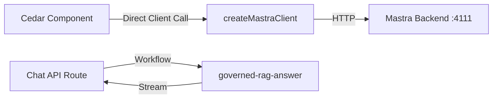
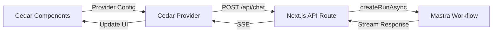

# Cedar-OS & Mastra Backend Integration Analysis

## Summary

**Spike Objective:** Analyze the current Cedar-Mastra integration setup and identify gaps, misconfigurations, and improvement opportunities for seamless frontend-backend communication.

**Why This Matters:** The project has Cedar-OS frontend components and Mastra AI backend orchestration, but the integration pattern needs validation to ensure proper streaming, state management, and agent communication.

**Timebox:** 3 days for analysis and documentation

**Decision Deadline:** October 3, 2025 - Required to unblock frontend development and ensure proper agent workflows.

## Research Question(s)

**Primary Question:** Is the current Cedar-Mastra integration following best practices for streaming workflows, state management, and agent communication?

**Secondary Questions:**

- Are the API routes properly configured for Cedar's expected endpoints?
- Is the Mastra client correctly instantiated and used across the app?
- Do the workflows support Cedar's streaming requirements?
- Is the authentication flow compatible with both systems?
- Are there missing endpoints or configuration gaps?

## Investigation Plan

### Research Tasks

- [x] Audit existing Mastra client configuration
- [x] Review Cedar-OS integration patterns in `/app/cedar-os`
- [x] Analyze workflow implementations (chatWorkflow, chatWorkflow1)
- [x] Check API route structure and compatibility
- [ ] Test streaming endpoint functionality
- [ ] Validate authentication flow
- [ ] Document integration patterns and recommendations

### Success Criteria

**This spike is complete when:**

- [ ] Current integration architecture is fully documented
- [ ] All gaps and issues are identified with severity ratings
- [ ] Clear recommendations provided with implementation priority
- [ ] Sample code patterns documented for proper integration

## Technical Context

**Related Components:**

- `/lib/mastra/mastra-client.ts` - Mastra client factory
- `/app/api/chat/route.ts` - Chat API endpoint
- `/app/cedar-os/page.tsx` - Cedar-OS frontend integration
- `/src/mastra/index.ts` - Mastra instance configuration
- `/src/mastra/workflows/` - Workflow orchestration

**Dependencies:**

- Cedar-OS v0.1.21 for frontend components
- @mastra/core v0.18.0 for backend orchestration
- @mastra/client-js v0.13.2 for client library

**Constraints:**

- Must support JWT authentication
- Requires streaming support for real-time responses
- Next.js 15.5.4 App Router architecture
- Node.js >= 20.9.0 runtime requirement

## Research Findings

### Current Architecture Analysis

#### ✅ **STRENGTHS - What's Working Well**

1. **Mastra Client Factory Pattern** (`/lib/mastra/mastra-client.ts`)
    - ✅ Proper factory pattern for creating authenticated clients
    - ✅ Environment-based base URL configuration
    - ✅ Support for both service-level and user-level tokens
    - ✅ Centralized client configuration

```typescript
// Good: Centralized client factory
export function createMastraClient(token?: string) {
    const headers: Record<string, string> = {}
    if (token) {
        headers.Authorization = `Bearer ${token}`
    }
    return new MastraClient({
        baseUrl: getMastraBaseUrl(),
        headers,
    })
}
```

2. **Mastra Instance Configuration** (`/src/mastra/index.ts`)
    - ✅ Comprehensive agent registry (15+ agents)
    - ✅ Workflow orchestration configured
    - ✅ JWT authentication enabled via `MastraJwtAuth`
    - ✅ Observability with Langfuse configured
    - ✅ Vector store (Qdrant) integration
    - ✅ Storage backends (LibSQL, PostgreSQL)

3. **Workflow Structure**
    - ✅ Modular step-based workflows
    - ✅ Schema validation with Zod
    - ✅ Streaming support in workflows
    - ✅ Proper error handling patterns

#### ⚠️ **GAPS - Issues Requiring Attention**

### Critical Issues (Priority: High)

#### 1. **Missing Cedar-Expected API Endpoints**

**Severity:** 🔴 **CRITICAL**

Cedar-OS expects specific API structure that's not fully implemented:

```typescript
// Expected by Cedar (from docs):
providerConfig={{
  provider: 'mastra',
  baseURL: 'http://localhost:3001',
  chatPath: '/chat',              // ✅ EXISTS at /api/chat
  resumePath: '/chat/resume',     // ❌ MISSING
  apiKey: process.env.MASTRA_API_KEY,
}}
```

**Current State:**

- ✅ `/api/chat/route.ts` exists for main chat
- ❌ `/api/chat/resume` endpoint missing (required for human-in-the-loop)
- ❌ No `/api/chat/resume/stream` endpoint

**Impact:** Human-in-the-loop workflows will fail. Cedar cannot pause and resume agent workflows.

**Recommendation:** Create `/app/api/chat/resume/route.ts`

#### 2. **Mastra Client Usage Pattern Mismatch**

**Severity:** 🟡 **MEDIUM**

In `/app/cedar-os/page.tsx`, the client is created but not properly integrated with Cedar:

```typescript
const [client] = React.useState(() => createMastraClient())

useEffect(() => {
    // ⚠️ This pattern is incorrect for newer Mastra clients
    if ('chat' in client && typeof client.chat === 'function') {
        await client.chat({
            message: 'Initialize roadmap context',
            context: { type: 'roadmap_init' },
        })
    }
}, [client])
```

**Issues:**

- Client is created without user token (should pass from auth context)
- Direct client.chat() call not aligned with Cedar's expected integration
- Cedar should manage agent communication via API routes, not direct client calls

**Recommendation:** Remove direct client usage from components, let Cedar handle API communication.

#### 3. **Workflow Duplication and Inconsistency**

**Severity:** 🟡 **MEDIUM**

Two similar but different chat workflows exist:

- `/src/mastra/workflows/chatWorkflow.ts` - Complex with Mastra event emission
- `/src/mastra/workflows/chatWorkflow1.ts` - Simpler with action schema

**Issues:**

- Unclear which workflow to use for Cedar integration
- `chatWorkflow1.ts` has structured output (`ActionSchema`) for UI state updates
- `chatWorkflow.ts` emits Mastra-specific events that Cedar may not expect
- Neither workflow is registered in `/src/mastra/index.ts`

**Current Workflows Registered:**

```typescript
workflows: {
  'governed-rag-index': governedRagIndex,
  'governed-rag-answer': governedRagAnswer,
  'research-workflow': researchWorkflow,
  'generate-report-workflow': generateReportWorkflow
  // ❌ chatWorkflow and chatWorkflow1 NOT registered
}
```

**Recommendation:** Consolidate or clearly separate workflows, register in Mastra instance.

#### 4. **API Route Not Using Standard Workflows**

**Severity:** 🟡 **MEDIUM**

`/app/api/chat/route.ts` uses `governed-rag-answer` workflow, but:

- Cedar integration typically expects a generic chat workflow
- Current workflow is RAG-specific with security features
- No fallback to simpler chat workflow for Cedar demos

**Recommendation:** Create a Cedar-specific workflow or make existing workflows more flexible.

### Minor Issues (Priority: Low)

#### 5. **Missing Cedar Provider Configuration**

**Severity:** 🟢 **LOW**

No Cedar provider configuration visible in the app. Cedar components should wrap the app with provider:

```typescript
// Should exist but not found in codebase
import { CedarCopilot } from 'cedar-os';

<CedarCopilot providerConfig={{
  provider: 'mastra',
  baseURL: process.env.NEXT_PUBLIC_MASTRA_URL,
  chatPath: '/api/chat',
  resumePath: '/api/chat/resume',
}}>
  {children}
</CedarCopilot>
```

**Recommendation:** Add Cedar provider wrapper in root layout.

#### 6. **Environment Variable Configuration**

**Severity:** 🟢 **LOW**

Missing Cedar-specific environment variables:

- `NEXT_PUBLIC_MASTRA_URL` for frontend
- Clear separation of frontend vs backend env vars

**Recommendation:** Update `.env.example` with Cedar requirements.

### Integration Pattern Analysis

#### Current Flow (Actual)



#### Recommended Flow (Cedar Best Practice)



### Prototype/Testing Notes

**Test Cases Required:**

1. ✅ Mastra client can connect to backend (port 4111)
2. ⏳ Cedar components can send messages via `/api/chat`
3. ❌ Human-in-the-loop workflow resume functionality (endpoint missing)
4. ⏳ Streaming responses work with Cedar components
5. ⏳ Authentication tokens pass correctly through Cedar → API → Mastra

### External Resources

- [Cedar-Mastra Integration Guide](https://cedar-os.com/docs/mastra-integration)
- [Mastra Workflows Documentation](https://mastra.ai/docs/workflows/overview)
- [Cedar Provider Configuration](https://cedar-os.com/docs/provider-config)
- [Human-in-the-Loop Workflows](https://cedar-os.com/docs/human-in-the-loop)
- [Mastra Streaming Guide](https://mastra.ai/blog/nested-streaming-support)

## Decision

### Recommendation

**Phase 1: Critical Fixes (1-2 days)**

1. **Create Resume Endpoint** ⚡ HIGH PRIORITY

    ```typescript
    // File: /app/api/chat/resume/route.ts
    export async function POST(request: NextRequest) {
        const body = await request.json()
        const { runId, stepPath, resumeData, stream } = body

        const workflow = mastra.getWorkflows()['governed-rag-answer']
        const run = await workflow.getRunAsync(runId)

        if (stream) {
            // Return streaming response
        } else {
            // Return JSON response
        }
    }
    ```

2. **Add Cedar Provider Wrapper**

    ```typescript
    // File: /app/layout.tsx or /app/cedar-os/layout.tsx
    <CedarCopilot
      providerConfig={{
        provider: 'mastra',
        baseURL: process.env.NEXT_PUBLIC_MASTRA_URL || 'http://localhost:3000',
        chatPath: '/api/chat',
        resumePath: '/api/chat/resume',
      }}
    >
      {children}
    </CedarCopilot>
    ```

3. **Remove Direct Client Usage**
    - Remove client instantiation from `/app/cedar-os/page.tsx`
    - Let Cedar provider handle all API communication

**Phase 2: Workflow Consolidation (2-3 days)**

4. **Consolidate Chat Workflows**
    - Choose `chatWorkflow1.ts` as the base (simpler, has ActionSchema)
    - Add streaming event support from `chatWorkflow.ts`
    - Register as `chat-workflow` in Mastra instance

5. **Make Workflows Cedar-Aware**
    - Add Cedar-specific input handling
    - Support structured output for UI state updates
    - Proper streaming event format

**Phase 3: Enhancement (3-5 days)**

6. **Environment Configuration**
    - Add `NEXT_PUBLIC_MASTRA_URL`
    - Document required Cedar environment variables
    - Separate dev/prod configurations

7. **Testing & Validation**
    - Test human-in-the-loop flows
    - Validate streaming responses
    - Test authentication flow end-to-end

### Rationale

**Why This Approach:**

1. **Priority-Based:** Fixes blocking issues first (missing endpoints)
2. **Cedar-Aligned:** Follows Cedar's expected integration patterns
3. **Backward Compatible:** Doesn't break existing RAG workflows
4. **Incremental:** Can be implemented in phases without major refactoring

**Why Not Alternative Approaches:**

❌ **Complete Rewrite:** Too risky, loses working RAG functionality
❌ **Cedar Without Mastra:** Loses orchestration capabilities
❌ **Custom Integration:** Reinvents wheel, harder to maintain

### Implementation Notes

**Key Considerations:**

1. **Authentication Flow:**
    - JWT must pass from Cedar → API Route → Mastra
    - Use `createMastraClient(token)` in API routes
    - Cedar provider should accept auth configuration

2. **Streaming Format:**
    - Mastra uses custom event format
    - Cedar expects SSE (Server-Sent Events)
    - API route bridges between formats

3. **State Management:**
    - Cedar components handle UI state
    - Mastra workflows handle agent orchestration
    - Use `ActionSchema` for UI state updates

4. **Error Handling:**
    - API routes catch Mastra errors
    - Return Cedar-friendly error format
    - Maintain audit trail for security workflows

### Follow-up Actions

- [ ] Create `/app/api/chat/resume/route.ts` endpoint
- [ ] Add Cedar provider wrapper in layout
- [ ] Update `/app/cedar-os/page.tsx` to remove direct client usage
- [ ] Consolidate chat workflows into single registered workflow
- [ ] Add environment variables for Cedar configuration
- [ ] Write integration tests for Cedar-Mastra flow
- [ ] Update documentation with integration patterns
- [ ] Create example implementations for common patterns

## Code Examples

### Example 1: Proper Cedar Provider Setup

```typescript
// File: /app/cedar-os/layout.tsx
import { CedarCopilot } from 'cedar-os';

export default function CedarLayout({ children }: { children: React.ReactNode }) {
  return (
    <CedarCopilot
      providerConfig={{
        provider: 'mastra',
        baseURL: process.env.NEXT_PUBLIC_MASTRA_URL || 'http://localhost:3000',
        chatPath: '/api/chat',
        resumePath: '/api/chat/resume',
      }}
    >
      {children}
    </CedarCopilot>
  );
}
```

### Example 2: Resume Endpoint Implementation

```typescript
// File: /app/api/chat/resume/route.ts
import { mastra } from '@/src/mastra'
import type { NextRequest } from 'next/server'
import { NextResponse } from 'next/server'
import { z } from 'zod'

export const maxDuration = 60
export const dynamic = 'force-dynamic'

const ResumeSchema = z.object({
    runId: z.string(),
    stepPath: z.array(z.array(z.string())),
    resumeData: z.record(z.unknown()),
    stream: z.boolean().optional(),
})

export async function POST(request: NextRequest) {
    try {
        const body = await request.json()
        const parsed = ResumeSchema.safeParse(body)

        if (!parsed.success) {
            return NextResponse.json(
                { error: 'Invalid input', details: parsed.error.issues },
                { status: 400 }
            )
        }

        const { runId, stepPath, resumeData, stream } = parsed.data

        const workflow = mastra.getWorkflows()['governed-rag-answer']
        const run = await workflow.getRunAsync(runId)

        if (stream) {
            const encoder = new TextEncoder()
            const readableStream = new ReadableStream({
                async start(controller) {
                    // Resume workflow and stream results
                    const result = await run.resume({
                        stepPath,
                        resumeData,
                    })

                    controller.enqueue(
                        encoder.encode(
                            `data: ${JSON.stringify({ result })}\n\n`
                        )
                    )
                    controller.close()
                },
            })

            return new Response(readableStream, {
                headers: {
                    'Content-Type': 'text/event-stream',
                    'Cache-Control': 'no-cache',
                    Connection: 'keep-alive',
                },
            })
        } else {
            const result = await run.resume({ stepPath, resumeData })
            return NextResponse.json({ result })
        }
    } catch (error) {
        console.error('Resume endpoint error:', error)
        return NextResponse.json(
            { error: 'Failed to resume workflow' },
            { status: 500 }
        )
    }
}
```

### Example 3: Consolidated Chat Workflow

```typescript
// File: /src/mastra/workflows/cedar-chat.workflow.ts
import { createWorkflow, createStep } from '@mastra/core/workflows'
import { z } from 'zod'
import { starterAgent } from '../agents/starterAgent'

const CedarChatInputSchema = z.object({
    prompt: z.string(),
    context: z.any().optional(),
    temperature: z.number().optional(),
    maxTokens: z.number().optional(),
    streamController: z.any().optional(),
})

const CedarChatOutputSchema = z.object({
    content: z.string(),
    action: z
        .object({
            type: z.literal('action'),
            stateKey: z.string(),
            setterKey: z.string(),
            args: z.array(z.any()),
        })
        .optional(),
})

const processMessage = createStep({
    id: 'processMessage',
    inputSchema: CedarChatInputSchema,
    outputSchema: CedarChatOutputSchema,
    execute: async ({ inputData }) => {
        const { prompt, context, temperature, maxTokens, streamController } =
            inputData

        const response = await starterAgent.generate([prompt], {
            temperature,
            maxTokens,
            experimental_output: CedarChatOutputSchema,
        })

        if (streamController) {
            streamController.enqueue(
                new TextEncoder().encode(
                    `data: ${JSON.stringify(response.object)}\n\n`
                )
            )
        }

        return response.object
    },
})

export const cedarChatWorkflow = createWorkflow({
    id: 'cedar-chat',
    description: 'Cedar-compatible chat workflow with structured output',
    inputSchema: CedarChatInputSchema,
    outputSchema: CedarChatOutputSchema,
})
    .then(processMessage)
    .commit()
```

## Status History

| Date       | Status         | Notes                                                |
| ---------- | -------------- | ---------------------------------------------------- |
| 2025-09-30 | 🟡 In Progress | Spike created, initial analysis complete             |
| 2025-09-30 | 🟡 In Progress | Identified critical gaps and created recommendations |
| TBD        | 🟢 Complete    | All implementation tasks completed and validated     |

---

_Last updated: 2025-09-30 by AI Assistant_
