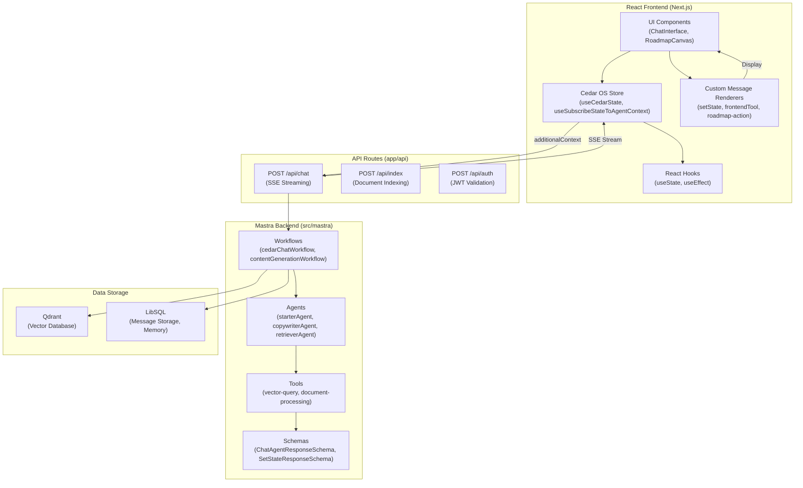
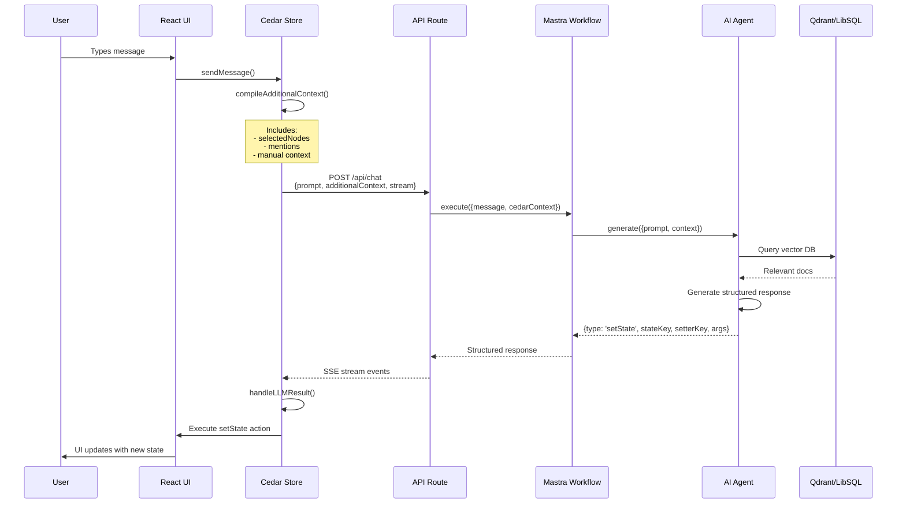
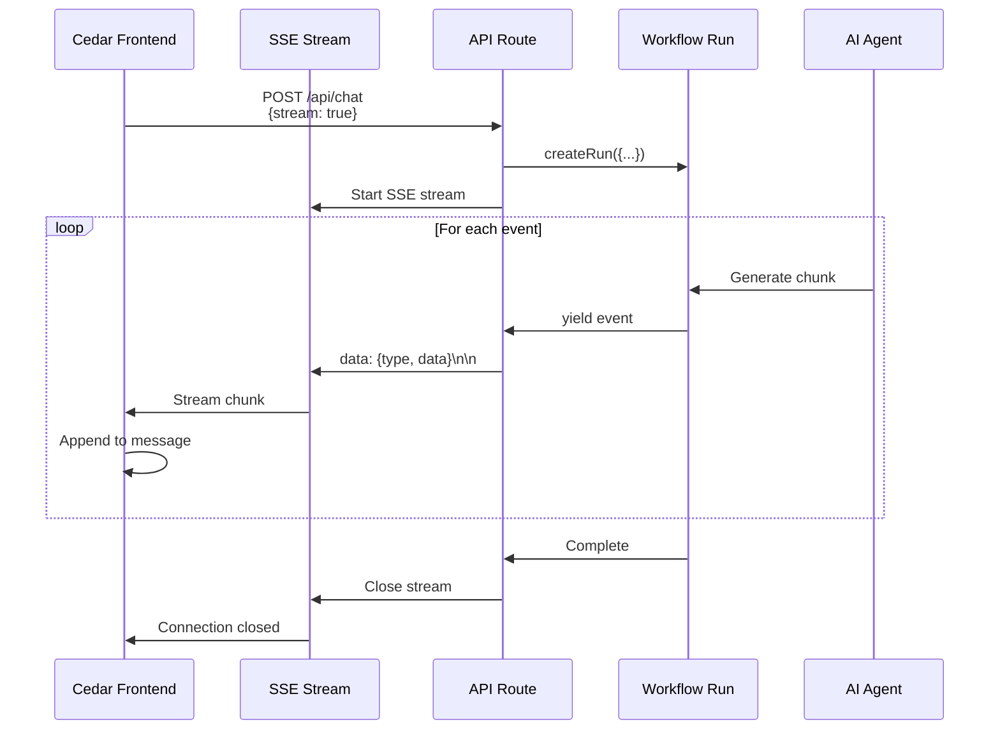
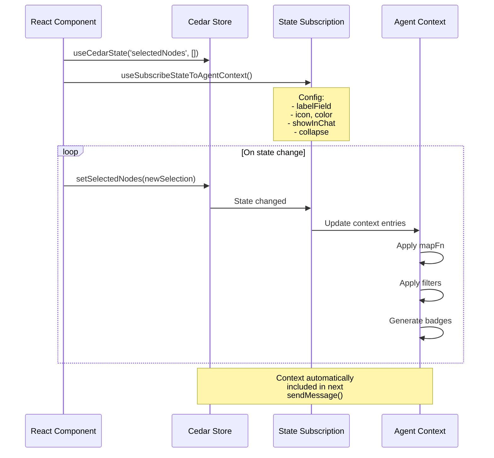

# [DESIGN001] - Cedar OS Integration Architecture

**Status:** Approved
**Added:** 2025-10-06, 14:50 EST
**Updated:** 2025-10-06, 14:55 EST
**Priority:** High
**Complexity:** Complex
**Completion Percentage:** 30

## Design Overview

This design defines a three-layer integration between Cedar OS (frontend), Next.js API routes, and Mastra workflows to enable type-safe, streaming, and interactive chat experiences with structured actions (setState, frontendTool, roadmap-action).

## Technical Specification

- Frontend: Cedar hooks (`useCedarState`, `useSubscribeStateToAgentContext`), message renderers, state registration
- API Layer: SSE streaming, `additionalContext` parsing, Zod validation, JWT extraction middleware
- Backend: Mastra workflows consume `cedarContext`, return structured responses (SetStateResponse, FrontendToolResponse)

## Validation Criteria

- Functional: End-to-end chat with setState action executed in UI
- Integration: API returns data-only SSE stream with JSON objects
- Performance: Context processing < 50ms, API response < 2s

## Related Tasks

- TASK004 - Cedar OS Types Integration for Mastra Workflows

## Progress Log

### 2025-10-06 14:55

- Design approved and added to `designs/_index.md`. Types and TASK004 documented and completed.

# [DESIGN001] - Cedar OS Frontend-Backend Integration Architecture

**Status:** Approved
**Added:** 2025-10-06, 14:50 EST
**Updated:** 2025-10-06, 14:50 EST
**Priority:** High
**Complexity:** Complex
**Completion Percentage:** 30%
**Related Requirements:** REQ001 (TBD - Frontend State Management), REQ002 (TBD - Backend Context Handling)
**Related Tasks:** TASK004 (Cedar OS Types Integration)

## Design Overview

This design specifies the complete architecture for integrating Cedar OS v0.1.11+ with Mastra workflows to enable intelligent frontend-backend communication. The system provides type-safe, bidirectional data flow between React components and AI agents with features including custom message rendering, state subscriptions, mentions, streaming, and state diff management.

**Key Design Goals:**

1. Type-safe communication between frontend and backend
2. Automatic context gathering from frontend state
3. Structured agent responses (setState, frontendTool, custom messages)
4. Real-time streaming with SSE
5. Thread management and message persistence
6. State diff tracking with accept/reject workflows

## Requirements Analysis

This design addresses the need for:

- **Frontend State Management**: Registering UI state (roadmap nodes, selections) with Cedar OS
- **Context Subscriptions**: Automatically sending relevant state to AI agents
- **Agent Responses**: Handling structured responses that can manipulate frontend state
- **Custom Messages**: Rendering specialized message types (roadmap actions, tool results)
- **Streaming**: Real-time SSE responses from Mastra backend
- **Persistence**: Thread management and message storage
- **Type Safety**: End-to-end TypeScript types with Zod validation

## Technical Specification

### Architecture Diagram



### Component Architecture

#### 1. Frontend Layer (React + Cedar OS)

**State Registration:**

```typescript
// Register roadmap state in Cedar OS
const [nodes, setNodes] = useCedarState(
    'nodes',
    initialNodes,
    'Roadmap feature nodes'
)

const [selectedNodes, setSelectedNodes] = useCedarState(
    'selectedNodes',
    [],
    'Currently selected nodes'
)
```

**State Subscription:**

```typescript
// Subscribe selectedNodes to agent context
useSubscribeStateToAgentContext(
  'selectedNodes',
  (nodes) => ({ selectedNodes: nodes }),
  {
    icon: <Box />,
    color: '#8B5CF6',
    labelField: (node) => node.data.title,
    order: 5,
    showInChat: (entry) => entry.data.priority === 'high',
    collapse: {
      threshold: 5,
      label: '{count} Selected Features',
      icon: <Box />
    }
  }
);
```

**Message Sending:**

```typescript
// Send message with automatic context inclusion
const { sendMessage, compileAdditionalContext } = useCedarStore()

await sendMessage({
    content: 'Add a new feature to Q2 2025',
    // additionalContext automatically includes:
    // - selectedNodes (from subscription)
    // - mentions (from @references)
    // - manual context entries
})
```

**Custom Message Rendering:**

```typescript
// Define custom message type
type RoadmapActionMessage = CustomMessage<'roadmap-action', {
  action: 'addNode' | 'removeNode' | 'changeNode';
  nodeId?: string;
  nodeData?: Record<string, unknown>;
}>;

// Create renderer
const RoadmapActionRenderer = createMessageRenderer<RoadmapActionMessage>({
  type: 'roadmap-action',
  namespace: 'roadmap',
  render: (message) => (
    <div className="roadmap-action">
      <span>✨ {message.content}</span>
      {message.action === 'addNode' && (
        <button onClick={() => handleAddNode(message.nodeData)}>
          Apply Changes
        </button>
      )}
    </div>
  ),
  validateMessage: (msg): msg is RoadmapActionMessage => {
    return msg.type === 'roadmap-action' && 'action' in msg;
  }
});

// Register with CedarCopilot
<CedarCopilot
  messageRenderers={[RoadmapActionRenderer]}
  {...otherProps}
>
  {children}
</CedarCopilot>
```

#### 2. API Layer (Next.js Route Handlers)

**Chat Endpoint with SSE Streaming:**

```typescript
// app/api/chat/route.ts
import { cedarChatWorkflow } from '@/src/mastra'
import type { AgentContext } from '@/src/mastra/workflows/chatWorkflowSharedTypes'

export async function POST(req: Request) {
    const { prompt, additionalContext, stream = true } = await req.json()

    if (stream) {
        // SSE Streaming response
        return new Response(
            new ReadableStream({
                async start(controller) {
                    try {
                        const run = await cedarChatWorkflow.createRun({
                            message: prompt,
                            cedarContext: additionalContext as AgentContext,
                        })

                        for await (const event of run.streamVNext()) {
                            // Send data-only SSE events
                            const data = JSON.stringify(event)
                            controller.enqueue(`data: ${data}\n\n`)
                        }

                        controller.close()
                    } catch (error) {
                        const errorData = JSON.stringify({
                            type: 'error',
                            error: error.message,
                        })
                        controller.enqueue(`data: ${errorData}\n\n`)
                        controller.close()
                    }
                },
            }),
            {
                headers: {
                    'Content-Type': 'text/event-stream',
                    'Cache-Control': 'no-cache',
                    Connection: 'keep-alive',
                },
            }
        )
    }

    // Non-streaming response
    const result = await cedarChatWorkflow.execute({
        message: prompt,
        cedarContext: additionalContext,
    })

    return Response.json(result)
}
```

#### 3. Backend Layer (Mastra Workflows)

**Workflow with Cedar Context:**

```typescript
// src/mastra/workflows/chatWorkflow.ts
import { createWorkflow } from '@mastra/core'
import type { AgentContext, SetStateResponse } from './chatWorkflowSharedTypes'

const CedarContextSchema = z.object({
    selectedNodes: z.array(z.any()).optional(),
    nodes: z.array(z.any()).optional(),
    currentDate: z.string().optional(),
})

export const cedarChatWorkflow = createWorkflow({
    id: 'cedar-chat-workflow',
    inputSchema: z.object({
        message: z.string(),
        cedarContext: CedarContextSchema.optional(),
    }),
    outputSchema: z.union([
        MessageResponseSchema,
        SetStateResponseSchema,
        FrontendToolResponseSchema,
    ]),
    steps: [
        createStep({
            id: 'process-with-context',
            inputSchema: z.object({
                message: z.string(),
                cedarContext: CedarContextSchema.optional(),
            }),
            outputSchema: z.union([
                MessageResponseSchema,
                SetStateResponseSchema,
            ]),
            execute: async ({ inputData }) => {
                const { message, cedarContext } = inputData

                // Build agent context from Cedar state
                const contextPrompt = buildContextPrompt(cedarContext)

                // Generate response with structured output
                const result = await starterAgent.generate({
                    prompt: `${contextPrompt}\n\nUser: ${message}`,
                    maxSteps: 3,
                    structuredOutput: {
                        schema: z.union([
                            MessageResponseSchema,
                            SetStateResponseSchema,
                        ]),
                    },
                })

                return (
                    result.object || { type: 'message', content: result.text }
                )
            },
        }),
    ],
})

// Helper function to build context prompt
function buildContextPrompt(cedarContext?: AgentContext): string {
    if (!cedarContext) return ''

    let contextParts: string[] = []

    if (cedarContext.selectedNodes?.length) {
        const selectedTitles = cedarContext.selectedNodes
            .map((node: any) => node.data?.title)
            .filter(Boolean)
        contextParts.push(`Selected nodes: ${selectedTitles.join(', ')}`)
    }

    if (cedarContext.nodes?.length) {
        contextParts.push(`Total nodes: ${cedarContext.nodes.length}`)
    }

    return contextParts.length ? `Context:\n${contextParts.join('\n')}\n\n` : ''
}
```

**Agent with setState Response:**

```typescript
// src/mastra/agents/roadmap-agent.ts
import { Agent } from '@mastra/core/agent'
import { z } from 'zod'

const SetStateResponseSchema = z.object({
    type: z.literal('setState'),
    stateKey: z.string(),
    setterKey: z.string(),
    args: z.record(z.unknown()),
})

export const roadmapAgent = new Agent({
    id: 'roadmap-agent',
    name: 'Roadmap Assistant',
    instructions: `
You are a product roadmap assistant. When users want to add, modify, or remove roadmap features, respond with setState actions.

Available actions:
- addNode: Add a new feature node
- removeNode: Remove an existing node
- updateNode: Modify node properties

Response format:
{
  "type": "setState",
  "stateKey": "nodes",
  "setterKey": "addNode",
  "args": {
    "node": {
      "id": "generated-id",
      "data": { "title": "Feature Name", "status": "planned" }
    }
  }
}
  `,
    model: {
        provider: 'GOOGLE',
        name: 'gemini-2.0-flash-exp',
        toolChoice: 'auto',
    },
    enableTrace: true,
})
```

### Data Flow Diagrams

#### Message Flow (User → Agent → Response)



#### Streaming Flow



#### State Subscription Flow



## Implementation Considerations

### Type Safety

1. **End-to-End Types**: All communication uses TypeScript types from `chatWorkflowSharedTypes.ts`
2. **Zod Validation**: Runtime validation at API boundaries
3. **Type Narrowing**: Message renderers receive narrowly-typed messages
4. **Generic Support**: `CustomMessage<T, P>` for type-safe custom messages

### Performance

1. **Selective Context**: Only send relevant state to backend
2. **Context Filtering**: Use `showInChat` function to filter entries
3. **Context Collapsing**: Group multiple entries with `collapse` option
4. **Streaming**: Use SSE for real-time responses, reduce latency
5. **Memoization**: Cedar uses shallow equality checks to prevent re-renders

### Security

1. **JWT Validation**: Authenticate all API requests
2. **Context Sanitization**: Filter sensitive data before sending to backend
3. **Role-Based Access**: Apply security filters to context entries
4. **Input Validation**: Validate all user inputs with Zod schemas

### Error Handling

1. **API Errors**: Return structured error responses
2. **Streaming Errors**: Send error events in SSE stream
3. **Validation Errors**: Catch and log Zod validation failures
4. **Fallback Rendering**: Default renderer for unknown message types

## Validation Criteria

### Functional Validation

- [ ] Frontend state successfully registered with Cedar OS
- [ ] State subscriptions update agent context automatically
- [ ] API routes receive and parse `additionalContext` correctly
- [ ] Workflows generate setState/frontendTool responses
- [ ] Custom message renderers display correctly
- [ ] SSE streaming works for real-time responses
- [ ] Thread management persists message history

### Integration Validation

- [ ] Type imports work across frontend/backend boundary
- [ ] Zod schemas validate at runtime
- [ ] Message types match between frontend/backend
- [ ] Context structure matches Cedar documentation
- [ ] Streaming events follow SSE format

### Performance Validation

- [ ] Context compilation < 50ms
- [ ] API response time < 2s for non-streaming
- [ ] Streaming latency < 500ms for first chunk
- [ ] UI updates < 100ms after state change
- [ ] Message rendering < 50ms

## Progress Tracking

**Overall Status:** In Progress - 30%

### Sub-components

| ID   | Description                               | Status      | Updated               | Notes                                          |
| ---- | ----------------------------------------- | ----------- | --------------------- | ---------------------------------------------- |
| 1.1  | Type system in chatWorkflowSharedTypes.ts | Complete    | 2025-10-06, 14:45 EST | All Cedar types defined                        |
| 1.2  | Frontend Cedar hooks integration          | Not Started | -                     | useCedarState, useSubscribeStateToAgentContext |
| 1.3  | Custom message renderers                  | Not Started | -                     | setState, frontendTool, roadmap-action         |
| 1.4  | API route context handling                | Not Started | -                     | additionalContext parsing                      |
| 1.5  | SSE streaming implementation              | Not Started | -                     | Data-only SSE format                           |
| 1.6  | Workflow Cedar context support            | In Progress | 2025-10-06, 14:00 EST | Basic context parsing done                     |
| 1.7  | Agent structured responses                | Not Started | -                     | setState and frontendTool                      |
| 1.8  | Message storage adapter                   | Not Started | -                     | LibSQL persistence                             |
| 1.9  | Thread management UI                      | Not Started | -                     | Thread switching, creation                     |
| 1.10 | Integration testing                       | Not Started | -                     | End-to-end tests                               |

## Design Log

### 2025-10-06, 14:50 EST

- Created comprehensive Cedar OS integration design document
- Defined complete architecture with component diagrams
- Documented data flow for messages, streaming, and subscriptions
- Specified implementation patterns for all layers (frontend, API, backend)
- Added validation criteria and progress tracking structure
- Design ready for implementation phase
