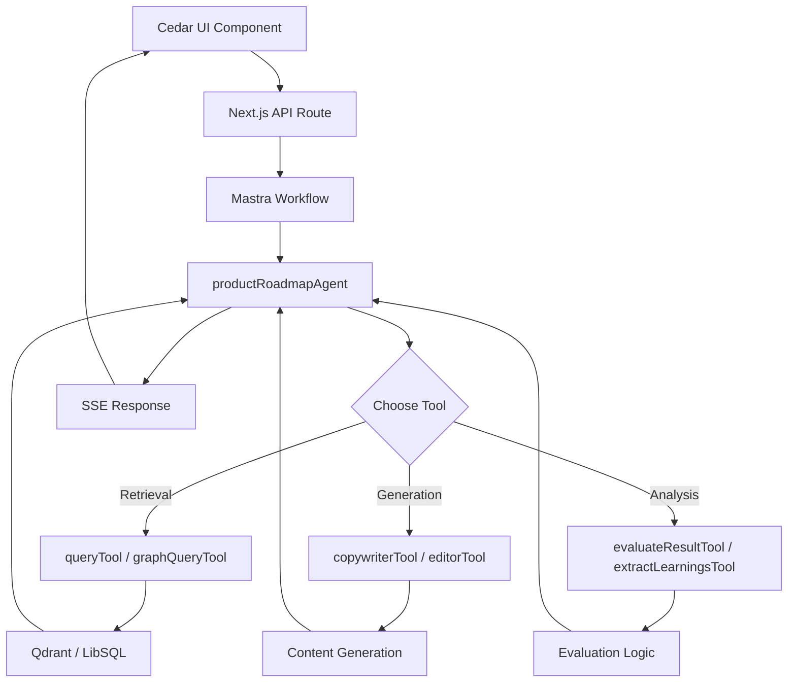

# Cedar-Mastra Integration Architecture Specification

## Overview

This specification documents the architecture for integrating Cedar OS (an interactive AI UI library) with Mastra (an AI orchestration framework) in the governed RAG system. The integration enables dynamic, agent-managed user interfaces for product roadmap visualization and management, leveraging Mastra's multi-agent capabilities with Cedar's interactive components.

The primary implementation is the **Product Roadmap Agent**, which orchestrates AI-driven roadmap features using Cedar OS for UI rendering and Mastra for backend agent execution.

## Key Components

### 1. Mastra Backend (Agent Orchestration)

- **Framework**: Mastra Core (`@mastra/core`)
- **Agents**: Specialized agents for roadmap management, including the `productRoadmapAgent`
- **Tools**: Custom tools for data retrieval, content generation, and evaluation
- **Memory**: LibSQL-based persistent memory (`createResearchMemory`)
- **Models**: Google Gemini (`gemini-2.5-flash` for reasoning, `gemini-embedding-001` for vectors)
- **Storage**: Qdrant for vector search, LibSQL for structured data

### 2. Cedar OS Frontend (Interactive UI)

- **Library**: Cedar OS (`cedar-os`)
- **Components**: Dynamic roadmap canvas (`RoadmapCanvas.tsx`), feature nodes (`FeatureNode.tsx`), relationship graphs (`SmartRelationshipRoadmap.tsx`)
- **Hooks**: Custom hooks for state management (`useRoadmapData.ts`)
- **Integration**: React-based UI that consumes Mastra agent outputs via API routes

### 3. Integration Layer

- **API Routes**: Next.js API endpoints (`/api/roadmap/*`) that trigger Mastra workflows
- **State Synchronization**: Real-time updates between Cedar UI and Mastra agent state using Server-Sent Events (SSE)
- **Authentication**: JWT-based RBAC integrated with Mastra's identity agent
- **Data Flow**: User interactions in Cedar UI → API call to Mastra → Agent execution → Updated UI state

## Product Roadmap Agent Integration

The `productRoadmapAgent` serves as the central orchestrator for Cedar's roadmap features. It integrates Mastra tools with Cedar's UI components to enable interactive roadmap management.

### Agent Configuration

```typescript
export const productRoadmapAgent = new Agent({
  id: 'productRoadmap',
  name: 'Product Roadmap Agent',
  description: 'Manages the product roadmap for the Cedar project...',
  instructions: 'Detailed instructions for roadmap navigation, feature management...',
  model: google('gemini-2.5-flash'),
  memory: store, // LibSQL research memory
  tools: {
    queryTool,        // Vector search for roadmap documents
    graphQueryTool,   // Graph-based RAG for feature relationships
    extractLearningsTool, // Extract insights from roadmap data
    editorTool,       // Edit feature descriptions/content
    copywriterTool,   // Generate marketing/technical content
    evaluateResultTool // Evaluate roadmap changes
  },
  // ... evals, scorers, workflows
});
```

### Integrated Tools

#### 1. Data Retrieval Tools
- **queryTool**: Semantic search in LibSQL vector store for roadmap documents. Filters by classification and role.
- **graphQueryTool**: Graph RAG for exploring feature relationships (parent-child, dependencies). Uses HNSW indexing with threshold 0.7.

#### 2. Content Generation Tools
- **copywriterTool**: Generates feature descriptions, announcements, and documentation. Supports content types: blog, marketing, technical, business, social, creative, general.
- **editorTool**: Improves existing content with specified tone and type. Integrates with Cedar's editing UI.

#### 3. Analysis Tools
- **extractLearningsTool**: Identifies patterns and insights from roadmap history and user interactions.
- **evaluateResultTool**: Scores proposed roadmap changes for priority, feasibility, and alignment.

### Workflow Integration

Roadmap interactions follow this Mastra workflow:

1. **User Input** (Cedar UI): Select feature, request update, or generate content.
2. **API Trigger**: `/api/roadmap/query` → Mastra workflow execution.
3. **Agent Execution**:
   - Retrieve relevant data (queryTool/graphQueryTool)
   - Process request (copywriterTool/editorTool)
   - Evaluate (evaluateResultTool)
   - Update state (LibSQL memory)
4. **Response**: SSE stream updates to Cedar UI for real-time rendering.

### UI-Backend Synchronization

- **Cedar Components**:
  - `RoadmapCanvas.tsx`: Renders agent-updated graph using React Flow.
  - `FeatureNode.tsx`: Displays feature details with editable fields linked to editorTool.
  - `SmartRelationshipRoadmap.tsx`: Visualizes dependencies using graphQueryTool results.

- **State Management**:
  - Cedar hooks (`useRoadmapData.ts`) poll or subscribe to Mastra API for updates.
  - Agent actions return structured JSON for direct UI state injection.

## Security and Governance

- **RBAC Integration**: Product roadmap access filtered by user roles (e.g., public views only, admins edit).
- **Data Classification**: Roadmap documents classified (internal/confidential) and filtered via Mastra policy agent.
- **Audit Logging**: All agent tool calls logged with Langfuse tracing.
- **Step-Up Auth**: Required for sensitive edits (e.g., priority changes).

## Data Flow Diagram



## Implementation Details

### Tool Descriptions in Agent Instructions

The agent's instructions explicitly reference tools for usability:

- **Tool Usage Section**: Guides when to use each tool (e.g., copywriterTool for marketing content).
- **Action Handling**: Structured JSON for UI updates (addNode, removeNode, changeNode).
- **Return Format**: Ensures responses are parseable by Cedar UI.

### Error Handling

- Agent retries on tool failures (Mastra built-in).
- UI fallbacks in Cedar components for offline/disconnected states.
- Logging: All errors traced to `logs/mastra.log`.

## Future Enhancements

- **Multi-Agent Collaboration**: Integrate additional agents for prioritization and stakeholder feedback.
- **Real-Time Collaboration**: WebSocket integration for multi-user roadmap editing.
- **Advanced Analytics**: Agent-driven roadmap simulations and what-if scenarios.
- **Export/Import**: Tools for roadmap serialization to JSON/YAML.

This specification ensures seamless integration between Cedar OS's interactive UI and Mastra's powerful agent orchestration, enabling sophisticated product roadmap management in the governed RAG system.
