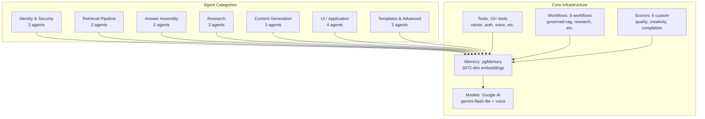
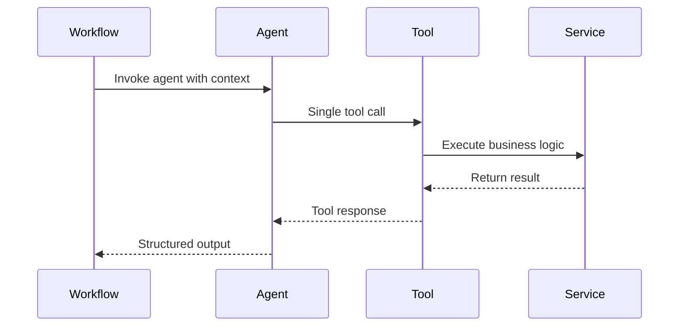

<!-- AGENTS-META {"title":"Mastra Agents Directory","version":"2.2.0","last_updated":"2025-10-18T00:00:00Z","applies_to":"/src/mastra/agents","tags":["layer:backend","domain:rag","type:agents","status:stable"],"status":"stable"} -->

# 🤖 Mastra Agents Directory (`/src/mastra/agents`)

## 🎭 AI Assistant Knowledge Base

**Complete reference for all 19 agent implementations with visual architecture, dependencies, custom scorers, and integration patterns.**

---

## 📊 System Overview



## 📁 Complete File Inventory

| Agent File | Size | Purpose | Tools | Memory | Model | Category |
|------------|------|---------|-------|--------|-------|----------|
| `identity.agent.ts` | 1.7KB | JWT token parsing & user identity extraction | `jwt-auth.tool` | ✅ | Gemini Flash | Identity & Security |
| `policy.agent.ts` | 3.5KB | Access control policy derivation from user roles | `policy-filter` | ✅ | Gemini Flash | Identity & Security |
| `retrieve.agent.ts` | 3.0KB | Secure vector similarity search with role filtering | `vector-query.tool` | ✅ | Gemini Flash | Retrieval Pipeline |
| `rerank.agent.ts` | 2.5KB | Relevance scoring and result ranking | `rerank-service` | ✅ | Gemini Flash | Retrieval Pipeline |
| `answerer.agent.ts` | 2.7KB | Context synthesis and answer generation | `citation-builder` | ✅ | Gemini Flash | Answer Assembly |
| `verifier.agent.ts` | 3.4KB | Response verification and compliance checking | `verification-service` | ✅ | Gemini Flash | Answer Assembly |
| `researchAgent.ts` | 5.1KB | Multi-source research and information gathering | `web-scraper`, `research-tools` | ✅ | Gemini Flash | Research |
| `evaluationAgent.ts` | 2.9KB | Research result evaluation and quality scoring | `evaluation-service` | ✅ | Gemini Flash | Research |
| `learningExtractionAgent.ts` | 2.5KB | Insight extraction and pattern recognition | `extraction-tools` | ✅ | Gemini Flash | Research |
| `copywriterAgent.ts` | 4.8KB | Creative content drafting and copy generation | `writing-tools` | ✅ | Gemini Flash | Content Generation |
| `editorAgent.ts` | 4.4KB | Content refinement and quality improvement | `editing-tools` | ✅ | Gemini Flash | Content Generation |
| `reportAgent.ts` | 3.4KB | Structured report compilation and formatting | `report-tools` | ✅ | Gemini Flash | Content Generation |
| `productRoadmapAgent.ts` | 7.7KB | Product roadmap management and UI state bridging | `roadmap-tools` | ✅ | Gemini Flash | UI / Application |
| `assistant.ts` | 5.8KB | General assistance and task coordination | `assistant-tools` | ✅ | Gemini Flash | UI / Application |
| `mcpAgent.ts` | 2.0KB | External service integration via MCP protocol | `mcp-client` | ✅ | Gemini Flash | UI / Application |
| `voiceAgent.ts` | 4.3KB | Voice-enabled research and interaction | `voice-tools`, `web-scraper` | ✅ | Gemini Flash + Voice | UI / Application |
| `starterAgent.ts` | 3.4KB | Minimal agent scaffold and reference implementation | `basic-tools` | ✅ | Gemini Flash | Templates & Advanced |
| `selfReferencingAgent.ts` | 3.6KB | Advanced agent patterns and self-modification | `advanced-tools` | ✅ | Gemini Flash | Templates & Advanced |
| `cryptoAnalysisAgent.ts` | 4.2KB | Cryptocurrency market analysis and trading strategies | `polygon-crypto`, `alpha-vantage`, `google-news` | ✅ | Gemini Flash | Research |
| `marketEducationAgent.ts` | 4.8KB | Financial education and investment teaching | `web-scraper`, `google-scholar`, `extract-learns` | ✅ | Gemini Flash | Content Generation |
| `stockAnalysisAgent.ts` | 4.9KB | Stock market technical and fundamental analysis | `polygon-stock`, `finnhub`, `alpha-vantage` | ✅ | Gemini Flash | Research |

## 🔧 Technical Architecture

### Agent Definition Pattern

```typescript
export const exampleAgent = new Agent({
    id: 'example',
    name: 'Example Agent',
    description: 'Purpose and capabilities',
    model: geminiFlashLite, // Google AI model
    instructions: ({ runtimeContext }) => `
        # ROLE
        You are a specialized agent...

        # RULES
        1. Always follow single tool call policy
        2. Use only provided context
        3. Return structured output

        # OUTPUT
        JSON format with specific schema
    `,
    tools: [tool1, tool2], // Array of available tools
    memory: pgMemory, // 3072-dimension vector memory
    scorers: {
        responseQuality: {
            scorer: responseQualityScorer,
            sampling: { type: 'ratio', rate: 0.8 }
        },
        taskCompletion: {
            scorer: taskCompletionScorer,
            sampling: { type: 'ratio', rate: 0.7 }
        }
    } // Custom evaluation scorers
})
```

### Custom Scorer System

All agents now include custom scorers for automated evaluation:

- **responseQualityScorer**: Evaluates response accuracy, clarity, and usefulness
- **taskCompletionScorer**: Measures successful task execution and goal achievement
- **creativityScorer**: Assesses creative content generation and originality
- **researchCompletenessScorer**: Evaluates thoroughness of research coverage
- **summaryQualityScorer**: Measures quality of insights and summarization
- **sourceDiversityScorer**: Assesses variety and reliability of information sources

Sampling rates range from 0.6-0.8 for balanced evaluation coverage.

## 🔗 Integration Patterns

### Workflow Integration



## 📋 Usage Patterns

### Common Agent Invocation

```typescript
// In workflow step
const result = await identityAgent.execute({
    runtimeContext: { userId, requestId },
    input: { jwtToken }
})

// Result: Structured output with user claims
```

## 🚨 Common Issues & Solutions

### Issue: Agent Memory Overflow
**Problem**: Large conversation threads causing memory issues
**Solution**: Implement memory cleanup and compression strategies

### Issue: Tool Call Timeouts
**Problem**: External API calls exceeding timeout limits
**Solution**: Implement retry logic with exponential backoff

## 🔍 Debugging Guide

### Agent Inspection

```typescript
// Check agent configuration
console.log(agent.id, agent.tools.length, agent.memory.config)

// Monitor tool calls
agent.on('toolCall', (call) => {
    console.log('Tool called:', call.tool.id, call.input)
})
```

## 📚 Related Files

- **`/src/mastra/tools/`** - Tool implementations used by agents
- **`/src/mastra/workflows/`** - Workflow orchestration patterns
- **`/src/mastra/services/`** - Business logic services
- **`/src/mastra/config/pg-storage.ts`** - Memory and vector configuration

---

## 📈 Version History

| Version | Date | Changes |
|---------|------|---------|
| 2.2.0 | 2025-10-18 | Added cryptoAnalysisAgent.ts, stockAnalysisAgent.ts, and marketEducationAgent.ts |
| 2.1.1 | 2025-10-17 | Updated memory dimensions from 1568 to 3072 for improved vector embeddings |
| 2.1.0 | 2025-10-17 | Added voiceAgent.ts, updated file sizes after custom scorer integration, added scorer infrastructure to system overview |
| 2.0.0 | 2025-10-15 | Complete rewrite with comprehensive AI-focused documentation, visual diagrams, and technical details |
| 1.2.0 | 2025-10-15 | Added missing agents and updated metadata |
| 1.1.0 | 2025-10-08 | Content verification and accuracy updates |
| 1.0.0 | 2025-09-24 | Initial standardized documentation |

**Total Agents:** 22 | **Total Lines:** ~48K | **Memory Usage:** 3072-dim vectors | **Custom Scorers:** 6 per agent

## 🔗 Agent Networks (`/network/`)

The `network/` subdirectory contains Mastra vNext Agent Network implementations for dynamic, non-deterministic multi-agent orchestration:

- **`financial-team-network.ts`** - Financial analysis network coordinating stock/crypto agents
- **`governed-rag-network.ts`** - RAG pipeline network with identity/policy/retrieval agents  
- **`research-content-network.ts`** - Research and content generation network

Agent Networks provide LLM-based routing that automatically selects appropriate agents/workflows based on task requirements, enabling more flexible and adaptive multi-agent collaboration.
