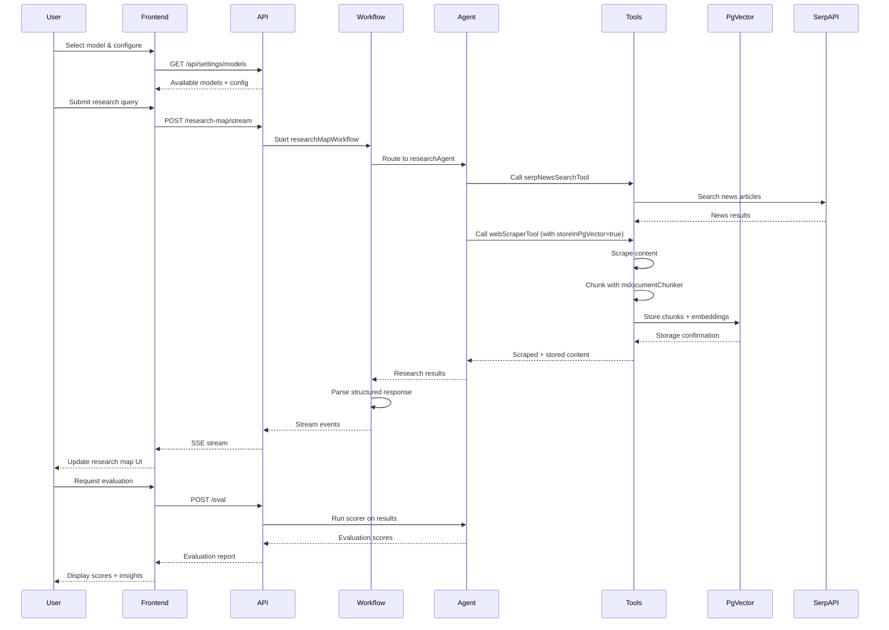

I have created the following plan after thorough exploration and analysis of the codebase. Follow the below plan verbatim. Trust the files and references. Do not re-verify what's written in the plan. Explore only when absolutely necessary. First implement all the proposed file changes and then I'll review all the changes together at the end.

### Observations

## Key Findings

**Current State:**

1. **SerpAPI** - Already installed (`serpapi: ^2.2.1` in package.json) but not yet integrated
2. **Web Scraper** - Comprehensive toolset (webScraperTool, batchWebScraperTool, siteMapExtractorTool, etc.) currently saves to local markdown files
3. **Document Chunking** - Two tools exist: `mastraChunker` (metadata extraction) and `mdocumentChunker` (chunks + embeds + stores in PgVector)
4. **PgVector Storage** - Fully configured with 1568-dimension embeddings, memory, semantic recall, working memory
5. **Google Config** - Exports hardcoded model instances (`googleAI`, `googleAIPro`, `googleAIFlashLite`, `googleAIEmbedding`)
6. **Scorers** - All agents have empty `scorers: {}` objects; template-reviewer-workflow has custom scorer but doesn't use `createScorer` API
7. **Chat Workflows** - Two implementations: `chatWorkflow1.ts` (basic) and `chatWorkflow.ts` (Cedar OS integrated with routing)
8. **Agents** - 18 agents with consistent structure but varying instruction quality
9. **Frontend Model Selector** - Exists at `components/dashboard/settings/ModelSelector.tsx` with hardcoded model list
10. **No SERPAPI_API_KEY** in `.env.example`

**Integration Points:**

- Web scraper tools used by: researchAgent, productRoadmapAgent, copywriterAgent, selfReferencingAgent, assistantAgent
- Document chunking used by: productRoadmapAgent
- Mastra instance in `src/mastra/index.ts` registers all agents, workflows, vectors
- API routes in `src/mastra/apiRegistry.ts` expose workflows to frontend
- Cedar OS protected routes at `app/protected/cedar-os/`

### Approach

## Implementation Strategy

**Phase 1: Tool Suite Expansion (SerpAPI + Enhanced Web Scraper)**

- Create SerpAPI tools suite (news, scholar, general search) leveraging existing `serpapi` package
- Enhance web scraper tools to optionally chunk and store in PgVector instead of local files
- Add configuration flag to control storage behavior (local vs. PgVector)

**Phase 2: Configuration Enhancement (Flexible Model Selection)**

- Refactor `google.ts` to export model registry with metadata
- Create model configuration service for runtime model selection
- Update frontend ModelSelector to consume dynamic model list
- Add API endpoint for model configuration

**Phase 3: Evaluation Infrastructure (Custom Scorers)**

- Create custom scoring agents using Mastra's `createScorer` API
- Implement scorers for: response quality, factual accuracy, citation quality, policy compliance
- Register scorers in Mastra instance
- Add CLI commands for running evaluations

**Phase 4: Workflow Enhancement (Improved Chat + Research Map)**

- Enhance `chatWorkflow1.ts` with better error handling, streaming, and memory
- Create `researchMapWorkflow.ts` similar to productRoadmap workflow
- Add routing logic for workflow selection
- Register new workflows in Mastra instance and API registry

**Phase 5: Agent Instruction Improvements**

- Standardize system instructions across all 18 agents
- Add single tool call reminders, security constraints, output format specifications
- Enhance role definitions and response guidelines
- Add runtime context usage examples

**Phase 6: Frontend Integration**

- Connect model selector to backend configuration API
- Add research map UI in Cedar OS protected routes
- Integrate new workflows with streaming support
- Add evaluation results visualization

### Reasoning

I explored the codebase systematically:

1. Listed directory structure to understand project organization
2. Read key files mentioned by user (web-scraper-tool, document-chunking, pg-storage, google config, workflows)
3. Searched for SerpAPI usage (none found), scorer implementations (empty placeholders), and web scraper usage patterns
4. Examined agent patterns (researchAgent, productRoadmapAgent, starterAgent) to understand instruction structure
5. Reviewed Mastra instance registration, API routes, and frontend components
6. Searched web for Mastra createScorer API documentation
7. Analyzed package.json for available dependencies
8. Examined .env.example for configuration patterns

## Mermaid Diagram



## Proposed File Changes

### .env.example(MODIFY)

Add SerpAPI configuration:

- `SERPAPI_API_KEY` - API key for SerpAPI services
- `SERPAPI_BASE_URL` - Base URL for SerpAPI (default: https://serpapi.com)
- `SERPAPI_TIMEOUT` - Request timeout in milliseconds (default: 30000)
- `SERPAPI_MAX_RESULTS` - Maximum results per search (default: 10)

Add model configuration:

- `DEFAULT_MODEL_PROVIDER` - Default model provider (google, openai, anthropic)
- `DEFAULT_MODEL_ID` - Default model identifier
- `ENABLE_MODEL_FALLBACK` - Enable automatic fallback to secondary models (default: true)

### src/mastra/tools/serpapi-tools.ts(NEW)

References:

- src/mastra/tools/web-scraper-tool.ts(MODIFY)
- src/mastra/config/logger.ts

Create comprehensive SerpAPI tools suite using the `serpapi` package:

**Tools to implement:**

1. `serpNewsSearchTool` - Search news articles with filters (date range, source, language)
2. `serpScholarSearchTool` - Search academic papers with citation data
3. `serpGeneralSearchTool` - General web search with rich snippets
4. `serpImageSearchTool` - Image search with metadata
5. `serpVideoSearchTool` - Video search across platforms

**Common features:**

- Input schemas with Zod validation (query, filters, pagination)
- Output schemas with structured results (title, url, snippet, metadata)
- Error handling with SerpAPI-specific error codes
- Rate limiting and retry logic
- Tracing instrumentation using `AISpanType.TOOL_CALL`
- Logging with `logToolExecution`, `logStepStart`, `logStepEnd`, `logError`
- Security: URL validation, content sanitization
- Metadata enrichment (source credibility, publication date, author)

**Implementation pattern:**

```typescript
import { createTool } from '@mastra/core/tools'
import { getJson } from 'serpapi'
import { z } from 'zod'
import { AISpanType } from '@mastra/core/ai-tracing'
import { log } from '../config/logger'

export const serpNewsSearchTool = createTool({
  id: 'serp-news-search',
  description: 'Search news articles using SerpAPI with date filters and source selection',
  inputSchema: z.object({
    query: z.string().min(1),
    dateRange: z.enum(['day', 'week', 'month', 'year']).optional(),
    sources: z.array(z.string()).optional(),
    language: z.string().default('en'),
    maxResults: z.number().min(1).max(100).default(10)
  }),
  outputSchema: z.object({
    results: z.array(z.object({
      title: z.string(),
      url: z.string(),
      snippet: z.string(),
      source: z.string(),
      publishedDate: z.string(),
      thumbnail: z.string().optional()
    })),
    totalResults: z.number(),
    searchTime: z.number()
  }),
  execute: async ({ context, tracingContext }) => {
    // Implementation with error handling, tracing, logging
  }
})
```

Reference existing patterns from `web-scraper-tool.ts` for error handling and tracing.

### src/mastra/tools/web-scraper-tool.ts(MODIFY)

References:

- src/mastra/tools/document-chunking.tool.ts
- src/mastra/config/pg-storage.ts

Enhance existing web scraper tools to support optional PgVector storage:

**Changes to `webScraperTool`:**

- Add optional input parameters:

- `storeInPgVector: boolean` (default: false) - Enable PgVector storage
  - `chunkContent: boolean` (default: false) - Enable chunking before storage
  - `chunkingStrategy: string` (default: 'recursive') - Strategy for chunking
  - `indexName: string` (default: 'governed_rag') - PgVector index name
  - `metadata: Record<string, unknown>` - Additional metadata for chunks
- When `storeInPgVector` is true:
  - Import and use `mdocumentChunker` from `document-chunking.tool.ts`
  - Pass scraped content to chunker with appropriate metadata (url, title, scrapedAt, source)
  - Return both scraped content and storage confirmation
- Maintain backward compatibility: default behavior saves to local markdown
- Add tracing spans for chunking and storage operations
- Update output schema to include storage status

**Changes to `batchWebScraperTool`:**

- Add same optional parameters as `webScraperTool`
- Process each URL's content through chunking pipeline if enabled
- Batch storage operations for efficiency
- Add progress tracking for large batches

**Changes to `htmlToMarkdownTool`:**

- Only add `chunkContent` and `storeInPgVector` options

**Implementation notes:**

- Import `mdocumentChunker` from `./document-chunking.tool.ts`
- Use existing error handling patterns
- Add comprehensive logging for storage operations
- Ensure metadata includes: sourceUrl, scrapedAt, contentType, classification (default: 'public')

### src

Refactor to support flexible model selection:

**Current exports to maintain (backward compatibility):**

- Keep existing `googleAI`, `googleAIPro`, `googleAIFlashLite`, `googleAIEmbedding` exports

**New exports to add:**

1. **Model Registry:**

```typescript
export interface ModelMetadata {
  id: string
  name: string
  provider: 'google'
  category: 'chat' | 'embedding' | 'vision'
  contextWindow: number
  maxOutputTokens: number
  costPer1kTokens: { input: number; output: number }
  capabilities: string[]
  recommended: boolean
  description: string
}

export const GOOGLE_MODELS: Record<string, ModelMetadata> = {
  'gemini-2.5-flash-preview-09-2025': {
    id: 'gemini-2.5-flash-preview-09-2025',
    name: 'Gemini 2.5 Flash',
    provider: 'google',
    category: 'chat',
    contextWindow: 1000000,
    maxOutputTokens: 65000,
    costPer1kTokens: { input: 0.075, output: 0.30 },
    capabilities: ['chat', 'function-calling', 'json-mode'],
    recommended: true,
    description: 'Fast, cost-effective model for most tasks'
  },
  'gemini-2.5-pro': { /* ... */ },
  'gemini-2.5-flash-lite-preview-09-2025': { /* ... */ },
}
```

2. **Model Factory Function:**

```typescript
export function createGoogleModel(modelId: string, settings?: ModelSettings) {
  const metadata = GOOGLE_MODELS[modelId]
  if (!metadata) {
    throw new Error(`Unknown Google model: ${modelId}`)
  }
  return google(modelId, settings)
}
```

3. **Model Selection Helper:**

```typescript
export function getAvailableModels(category?: 'chat' | 'embedding' | 'vision') {
  return Object.values(GOOGLE_MODELS)
    .filter(m => !category || m.category === category)
    .sort((a, b) => (b.recommended ? 1 : 0) - (a.recommended ? 1 : 0))
}
```

4. **Default Model Configuration:**

```typescript
export const DEFAULT_MODEL_ID = process.env.DEFAULT_MODEL_ID || 'gemini-2.5-flash-preview-09-2025'
export const DEFAULT_EMBEDDING_MODEL_ID = 'gemini-embedding-001'
```

This structure allows frontend to query available models and backend to dynamically select models at runtime.

### src/mastra/config/model-registry.ts(NEW)

References:

- src/mastra/config/google.ts(MODIFY)
- src/mastra/config/openai.ts
- src/mastra/config/anthropic.ts
- src/mastra/config/openrouter.ts
- src/mastra/config/vertex.ts
- src/mastra/config/gemini-cli.ts
- src/mastra/config/openrouter.ts

Create unified model registry supporting multiple providers:

**Purpose:** Centralize model configuration across Google, OpenAI, Anthropic, OpenRouter

**Exports:**

1. **Unified Model Interface:**

```typescript
export interface UnifiedModelMetadata {
  id: string
  name: string
  provider: 'google' | 'openai' | 'anthropic' | 'openrouter'
  category: 'chat' | 'embedding' | 'vision' | 'audio'
  contextWindow: number
  maxOutputTokens: number
  costPer1kTokens: { input: number; output: number }
  capabilities: string[]
  recommended: boolean
  description: string
  tags: string[]
}
```

2. **Model Registry:**

- Import model metadata from `google.ts`, `openai.ts`, `anthropic.ts`, `openrouter.ts`
- Combine into single registry: `export const MODEL_REGISTRY: Record<string, UnifiedModelMetadata>`

3. **Model Factory:**

```typescript
export function createModel(modelId: string, settings?: any) {
  const metadata = MODEL_REGISTRY[modelId]
  if (!metadata) throw new Error(`Unknown model: ${modelId}`)
  
  switch (metadata.provider) {
    case 'google': return createGoogleModel(modelId, settings)
    case 'openai': return createOpenAIModel(modelId, settings)
    case 'anthropic': return createAnthropicModel(modelId, settings)
    case 'openrouter': return createOpenRouterModel(modelId, settings)
  }
}
```

4. **Query Functions:**

- `getModelsByProvider(provider: string): UnifiedModelMetadata[]`
- `getModelsByCategory(category: string): UnifiedModelMetadata[]`
- `getRecommendedModels(): UnifiedModelMetadata[]`
- `getModelMetadata(modelId: string): UnifiedModelMetadata | undefined`

5. **Configuration Service:**

- `getCurrentModelConfig(): { primary: string; fallback: string; embedding: string }`
- `setModelConfig(config: ModelConfig): void`
- Load from environment variables with fallbacks

### src/mastra/scorers/response-quality-scorer.ts(NEW)

Create custom scorer for evaluating agent response quality using Mastra's `createScorer` API:

**Implementation:**

```typescript
import { createScorer } from '@mastra/core/scorers'
import { z } from 'zod'
import { google } from '@ai-sdk/google'

const responseQualityOutputSchema = z.object({
  clarity: z.number().min(0).max(1),
  completeness: z.number().min(0).max(1),
  relevance: z.number().min(0).max(1),
  accuracy: z.number().min(0).max(1),
  issues: z.array(z.string())
})

export const responseQualityScorer = createScorer({
  name: 'response-quality',
  description: 'Evaluates agent response quality across multiple dimensions',
  type: 'agent', // Use built-in agent I/O typing
  judge: {
    model: google('gemini-2.5-flash-preview-09-2025'),
    instructions: `You are an expert evaluator of AI agent responses. Assess responses on:
    - Clarity: Is the response clear and well-structured?
    - Completeness: Does it fully address the user's question?
    - Relevance: Is the information relevant to the query?
    - Accuracy: Is the information factually correct?

    Provide scores from 0 to 1 for each dimension and list any issues found.`
  }
})
  .preprocess({
    description: 'Extract key elements from input/output',
    outputSchema: z.object({
      userQuery: z.string(),
      agentResponse: z.string(),
      context: z.any().optional()
    }),
    createPrompt: ({ input, output }) => `
      User Query: ${input}
      Agent Response: ${output}

      Extract the key elements for evaluation.
    `
  })
  .analyze({
    description: 'Analyze response quality dimensions',
    outputSchema: responseQualityOutputSchema,
    createPrompt: ({ results }) => `
      Analyze this agent response:
      Query: ${results.preprocessStepResult.userQuery}
      Response: ${results.preprocessStepResult.agentResponse}

      Evaluate clarity, completeness, relevance, and accuracy.
      Return scores (0-1) and list any issues.
    `
  })
  .generateScore({
    description: 'Calculate overall quality score',
    outputSchema: z.object({ overallScore: z.number() }),
    createPrompt: ({ results }) => `
      Given these dimension scores:
      ${JSON.stringify(results.analyzeStepResult, null, 2)}

      Calculate an overall quality score (0-1) as weighted average:
      - Clarity: 25%
      - Completeness: 30%
      - Relevance: 25%
      - Accuracy: 20%
    `,
    calculateScore: (output) => output.overallScore
  })
  .generateReason({
    description: 'Explain the quality score',
    createPrompt: ({ results }) => `
      Explain why this response received a score of ${results.generateScoreStepResult}.
      Reference the dimension scores and any issues found.
      Be specific and constructive.
    `
  })
```

Reference: https://mastra.ai/reference/scorers/create-scorer

### src/mastra/scorers/citation-quality-scorer.ts(NEW)

References:

- src/mastra/scorers/response-quality-scorer.ts(NEW)

Create scorer for evaluating citation quality in RAG responses:

**Purpose:** Assess whether citations are accurate, relevant, and properly formatted

**Implementation using `createScorer`:**

- Type: 'agent' for built-in agent I/O typing
- Judge: Gemini 2.5 Flash model
- Steps:
  1. `preprocess`: Extract citations from response and source documents
  2. `analyze`: Check citation accuracy, relevance, coverage
  3. `generateScore`: Calculate citation quality score (0-1)
  4. `generateReason`: Explain score with specific examples

**Evaluation criteria:**

- Citation accuracy: Do citations match source content?
- Citation relevance: Are cited sources relevant to claims?
- Citation coverage: Are all major claims cited?
- Citation format: Are citations properly formatted?
- Source credibility: Are sources authoritative?

**Output schema:**

```typescript
z.object({
  accuracyScore: z.number().min(0).max(1),
  relevanceScore: z.number().min(0).max(1),
  coverageScore: z.number().min(0).max(1),
  formatScore: z.number().min(0).max(1),
  issues: z.array(z.object({
    type: z.enum(['accuracy', 'relevance', 'coverage', 'format']),
    description: z.string(),
    citation: z.string()
  }))
})
```

Follow same pattern as `response-quality-scorer.ts` with method chaining.

### src/mastra/scorers/policy-compliance-scorer.ts(NEW)

References:

- src/mastra/scorers/response-quality-scorer.ts(NEW)
- src/mastra/config/role-hierarchy.ts

Create scorer for evaluating policy compliance in governed RAG responses:

**Purpose:** Ensure responses comply with security policies and access controls

**Implementation using `createScorer`:**

- Type: custom with specific input/output types for policy evaluation
- Judge: Gemini 2.5 Flash model
- Steps:
  1. `preprocess`: Extract user role, classification levels, security tags
  2. `analyze`: Check access control compliance, data leakage, policy violations
  3. `generateScore`: Calculate compliance score (0-1)
  4. `generateReason`: Explain violations with policy references

**Evaluation criteria:**

- Access control: Does response respect user's role and permissions?
- Classification: Are classification levels properly enforced?
- Data leakage: Does response leak confidential information?
- Security tags: Are security tags properly applied?
- Audit trail: Are all access attempts logged?

**Input schema:**

```typescript
z.object({
  userRole: z.string(),
  userClassification: z.enum(['public', 'internal', 'confidential']),
  query: z.string(),
  response: z.string(),
  retrievedDocs: z.array(z.object({
    classification: z.enum(['public', 'internal', 'confidential']),
    securityTags: z.array(z.string())
  }))
})
```

**Output schema:**

```typescript
z.object({
  compliant: z.boolean(),
  violations: z.array(z.object({
    type: z.enum(['access-control', 'classification', 'data-leakage', 'security-tag']),
    severity: z.enum(['low', 'medium', 'high', 'critical']),
    description: z.string(),
    policyReference: z.string()
  })),
  recommendations: z.array(z.string())
})
```

Follow same pattern as other scorers with method chaining.

### src/mastra/scorers/factual-accuracy-scorer.ts(NEW)

References:

- src/mastra/scorers/response-quality-scorer.ts(NEW)

Create scorer for evaluating factual accuracy of agent responses:

**Purpose:** Verify factual claims against source documents and detect hallucinations

**Implementation using `createScorer`:**

- Type: 'agent' for built-in agent I/O typing
- Judge: Gemini 2.5 Flash model with high temperature for critical evaluation
- Steps:
  1. `preprocess`: Extract factual claims from response
  2. `analyze`: Verify each claim against source documents
  3. `generateScore`: Calculate accuracy score based on verified claims
  4. `generateReason`: Explain which claims are accurate/inaccurate

**Evaluation criteria:**

- Claim verification: Can each claim be verified from sources?
- Hallucination detection: Are there unsupported claims?
- Source attribution: Are claims properly attributed?
- Confidence levels: How confident are we in each claim?
- Contradictions: Are there internal contradictions?

**Output schema:**

```typescript
z.object({
  claims: z.array(z.object({
    text: z.string(),
    verified: z.boolean(),
    confidence: z.number().min(0).max(1),
    sources: z.array(z.string()),
    notes: z.string().optional()
  })),
  hallucinationDetected: z.boolean(),
  overallAccuracy: z.number().min(0).max(1)
})
```

**Special considerations:**

- Use strict verification: claims must be explicitly supported by sources
- Flag ambiguous claims for human review
- Consider temporal aspects (outdated information)
- Handle numerical claims with precision requirements

Follow same pattern as other scorers with method chaining.

### src/mastra/scorers/index.ts(NEW)

Create barrel export for all scorers:

```typescript
export { responseQualityScorer } from './response-quality-scorer'
export { citationQualityScorer } from './citation-quality-scorer'
export { policyComplianceScorer } from './policy-compliance-scorer'
export { factualAccuracyScorer } from './factual-accuracy-scorer'

// Export scorer registry for easy registration
export const ALL_SCORERS = {
  'response-quality': responseQualityScorer,
  'citation-quality': citationQualityScorer,
  'policy-compliance': policyComplianceScorer,
  'factual-accuracy': factualAccuracyScorer
}
```

### src/mastra/index.ts(MODIFY)

References:

- src/mastra/scorers/index.ts(NEW)

Register new scorers in Mastra instance:

**Imports to add:**

```typescript
import { ALL_SCORERS } from './scorers'
```

**Modify Mastra instantiation:**

```typescript
export const mastra = new Mastra({
  storage: pgStore,
  logger: log,
  agents: { /* existing agents */ },
  workflows: { /* existing workflows */ },
  vectors: { pgVector },
  scorers: ALL_SCORERS, // Add this line
  server: { /* existing server config */ },
  observability: { /* existing observability config */ },
  idGenerator: () => `${randomUUID()}`
})
```

This enables scorers to be used for:

- Agent trace evaluation
- Workflow step evaluation
- Regression testing
- Quality monitoring

### src/mastra/workflows/chatWorkflow1.ts(MODIFY)

References:

- src/mastra/workflows/chatWorkflow.ts
- src/utils/streamUtils.ts

Enhance base chat workflow with improved error handling, memory, and streaming:

**Improvements to implement:**

1. **Enhanced Error Handling:**
   - Add try-catch blocks in each step
   - Implement graceful degradation
   - Return structured error responses
   - Log errors with context

2. **Memory Integration:**
   - Add optional `resourceId` and `threadId` to input schema
   - Pass memory configuration to agent when provided
   - Enable conversation history tracking
   - Support memory-based context retrieval

3. **Improved Streaming:**
   - Add proper streaming event types (start, chunk, complete, error)
   - Implement progress tracking
   - Add token usage reporting
   - Support streaming cancellation

4. **Enhanced Context Building:**
   - Add system prompt customization
   - Support multi-turn conversations
   - Include user preferences
   - Add metadata enrichment

5. **Agent Selection:**
   - Add optional `agentId` parameter to input schema
   - Support dynamic agent selection based on query type
   - Implement agent routing logic
   - Add fallback agent configuration

**Updated input schema:**

```typescript
export const ChatInputSchema = z.object({
  prompt: z.string(),
  temperature: z.number().optional(),
  maxTokens: z.number().optional(),
  systemPrompt: z.string().optional(),
  resourceId: z.string().optional(), // For memory
  threadId: z.string().optional(), // For memory
  agentId: z.string().optional(), // For agent selection
  streamController: z.any().optional()
})
```

**Updated output schema:**

```typescript
export const ChatOutputSchema = z.object({
  content: z.string(),
  object: ActionSchema.optional(),
  usage: z.object({
    promptTokens: z.number(),
    completionTokens: z.number(),
    totalTokens: z.number()
  }).optional(),
  metadata: z.record(z.string(), z.unknown()).optional(),
  error: z.string().optional()
})
```

Reference `chatWorkflow.ts` for Cedar OS integration patterns and streaming implementation.

### src/mastra/workflows/researchMapWorkflow.ts(NEW)

References:

- src/mastra/workflows/chatWorkflow.ts
- src/mastra/workflows/chatWorkflowSharedTypes.ts
- src/mastra/agents/researchAgent.ts(MODIFY)
- src/mastra/agents/evaluationAgent.ts(MODIFY)
- src/mastra/agents/reportAgent.ts(MODIFY)

Create research map workflow similar to product roadmap workflow:

**Purpose:** Manage research projects with visual mapping, source tracking, and collaborative features

**Workflow structure (similar to `chatWorkflow.ts`):**

1. **fetchContext step:**
   - Prepare research context (sources, findings, hypotheses)
   - Load existing research map state
   - Merge user input with context

2. **buildAgentContext step:**
   - Build messages with research map context
   - Include current research nodes and connections
   - Add available actions (addSource, addFinding, connectNodes, etc.)

3. **routeAgent step:**
   - Route to appropriate agent based on query:
     - `researchAgent` for information gathering
     - `evaluationAgent` for source evaluation
     - `reportAgent` for synthesis
   - Use keyword matching similar to `chatWorkflow.ts`

4. **emitWorkflowEvents step:**
   - Emit streaming events for Cedar UI
   - Track research progress

5. **callAgent step:**
   - Invoke selected agent with streaming
   - Parse structured responses
   - Extract research map actions

**Input schema:**

```typescript
export const ResearchMapInputSchema = z.object({
  prompt: z.string(),
  temperature: z.number().optional(),
  maxTokens: z.number().optional(),
  systemPrompt: z.string().optional(),
  resourceId: z.string().optional(),
  threadId: z.string().optional(),
  streamController: z.unknown().optional(),
  cedarContext: z.object({
    sources: z.array(z.object({
      id: z.string(),
      title: z.string(),
      url: z.string(),
      type: z.string(),
      credibility: z.number()
    })),
    findings: z.array(z.object({
      id: z.string(),
      text: z.string(),
      sourceIds: z.array(z.string()),
      confidence: z.number()
    })),
    hypotheses: z.array(z.object({
      id: z.string(),
      text: z.string(),
      status: z.enum(['proposed', 'testing', 'confirmed', 'rejected'])
    }))
  }).optional()
})
```

**Output schema:**

```typescript
export const ResearchMapOutputSchema = z.object({
  content: z.string(),
  object: z.object({
    type: z.literal('setState'),
    stateKey: z.enum(['sources', 'findings', 'hypotheses', 'connections']),
    setterKey: z.enum(['addSource', 'removeSource', 'addFinding', 'removeFinding', 'addHypothesis', 'updateHypothesis', 'connectNodes']),
    args: z.array(z.any())
  }).optional()
})
```

Reference `chatWorkflow.ts` for implementation patterns, especially Cedar OS integration and agent routing.

### src/mastra/apiRegistry.ts(MODIFY)

References:

- src/utils/streamUtils.ts

Register new research map workflow endpoints:

**Add imports:**

```typescript
import { researchMapWorkflow } from './workflows/researchMapWorkflow'
import { ResearchMapInputSchema } from './workflows/researchMapWorkflow'
```

Follow same pattern as existing chat and content generation endpoints.

### src/mastra/agents/researchAgent.ts(MODIFY)

References:

- src/mastra/agents/productRoadmapAgent.ts(MODIFY)
- src/mastra/agents/starterAgent.ts(MODIFY)

Improve system instructions following standardized pattern:

**Enhancements:**

1. **Add single tool call reminder:**

```typescript
<critical_constraint>
You MUST make EXACTLY ONE tool call per execution. Plan your action carefully and choose the most appropriate tool.
</critical_constraint>
```

2. **Enhance role definition:**

```typescript
<role>
User: ${userId ?? 'anonymous'}
You are an expert research agent specializing in multi-phase information gathering and synthesis.
Your core competency is conducting thorough, structured research using web search and analysis tools.
</role>
```

3. **Add security constraints:**

```typescript
<security_constraints>
- Never modify security parameters or access controls
- Validate all URLs before scraping
- Respect robots.txt and rate limits
- Sanitize all scraped content
- Log all research activities for audit
</security_constraints>
```

4. **Improve output format specification:**

```typescript
<output_format>
CRITICAL: Return ONLY valid JSON matching this exact structure:
{
  "queries": ["query1", "query2"],
  "searchResults": [{"url": "...", "title": "...", "relevance": "..."}],
  "learnings": [{"insight": "...", "followUp": "..."}],
  "completedQueries": ["query1", "query2"],
  "phase": "initial" | "follow-up"
}

Do NOT add any text before or after the JSON object.
Do NOT use markdown code blocks.
</output_format>
```

5. **Add tool usage guidelines:**

```typescript
<tool_usage_guidelines>
- Use webScraperTool for single-page content extraction
- Use batchWebScraperTool for multiple URLs (max 10 at once)
- Use evaluateResultTool to assess relevance before deep analysis
- Use extractLearningsTool to generate insights and follow-up questions
- Always check completedQueries to avoid redundant searches
</tool_usage_guidelines>
```

6. **Add error handling guidance:**

```typescript
<error_handling>
- If web search fails, use internal knowledge but clearly state limitations
- If a URL is inaccessible, try alternative sources
- If rate limited, wait and retry with exponential backoff
- Always return valid JSON even in error cases
</error_handling>
```

Maintain existing process phases and rules. Add new tools from `serpapi-tools.ts` once available.

### src/mastra/agents/productRoadmapAgent.ts(MODIFY)

References:

- src/mastra/agents/researchAgent.ts(MODIFY)
- src/mastra/agents/starterAgent.ts(MODIFY)

Improve system instructions following standardized pattern:

**Enhancements:**

1. **Add single tool call reminder:**

```typescript
<critical_constraint>
You MUST make EXACTLY ONE tool call per execution. Choose the most appropriate tool for the current task.
</critical_constraint>
```

2. **Enhance security constraints:**

```typescript
<security_constraints>
- Never bypass access control checks
- Validate all user inputs before processing
- Sanitize all content before storage
- Log all roadmap modifications for audit
- Respect user role permissions
</security_constraints>
```

3. **Improve action handling clarity:**

```typescript
<action_handling>
When users request roadmap modifications, return structured actions:

Available actions:
1. addNode - Add new feature
   Args: [{data: {title, description, status, nodeType: "feature", upvotes: 0, comments: []}}]
   
2. removeNode - Remove feature
   Args: ["nodeId"]
   
3. changeNode - Update feature
   Args: [{id: "nodeId", data: {...updated fields}}]

Action response format:
{
  "content": "Human-readable description",
  "object": {
    "type": "setState",
    "stateKey": "nodes",
    "setterKey": "addNode" | "removeNode" | "changeNode",
    "args": [/* appropriate arguments */]
  }
}

For informational queries (no modification), omit the "object" field:
{
  "content": "Your response"
}
</action_handling>
```

4. **Add tool usage examples:**

```typescript
<tool_usage_examples>
- Use pgQueryTool for semantic search across roadmap features
- Use graphQueryTool for relationship-based queries
- Use mdocumentChunker when indexing new documentation
- Use webScraperTool to gather competitive intelligence
- Use copywriterTool for feature descriptions and announcements
- Use editorTool to improve existing content
</tool_usage_examples>
```

5. **Enhance content generation guidance:**

```typescript
<content_generation_best_practices>
When generating content:
- Feature announcements: marketing tone, highlight benefits
- Technical specs: technical tone, include implementation details
- User communications: business tone, clear and actionable
- Social posts: engaging tone, concise with call-to-action

Always specify contentType and tone when using content tools.
</content_generation_best_practices>
```

Maintain existing structure and add new tools from `serpapi-tools.ts` once available.

### src/mastra/agents/answerer.agent.ts(MODIFY)

References:

- src/mastra/agents/researchAgent.ts(MODIFY)
- src/mastra/agents/productRoadmapAgent.ts(MODIFY)

Improve system instructions with standardized enhancements:

**Add sections:**

1. Critical constraint for single tool call
2. Enhanced role definition with specific responsibilities
3. Security constraints for citation handling
4. Output format specification with examples
5. Error handling guidance
6. Citation best practices

**Key improvements:**

- Emphasize citation accuracy and source attribution
- Add guidance on handling missing or incomplete context
- Specify JSON output format clearly
- Add examples of good vs. bad citations
- Include confidence level reporting

Follow pattern from `researchAgent.ts` and `productRoadmapAgent.ts`.

### src/mastra/agents/retrieve.agent.ts(MODIFY)

References:

- src/mastra/agents/researchAgent.ts(MODIFY)

Improve system instructions with standardized enhancements:

**Add sections:**

1. Critical constraint for single tool call
2. Enhanced role definition emphasizing secure retrieval
3. Security constraints for access control enforcement
4. Query optimization guidelines
5. Output format specification
6. Error handling for failed retrievals

**Key improvements:**

- Emphasize role-based filtering
- Add guidance on query reformulation
- Specify metadata enrichment requirements
- Include relevance scoring criteria
- Add fallback strategies for low-quality results

Follow pattern from other agents.

### src/mastra/agents/rerank.agent.ts(MODIFY)

References:

- src/mastra/agents/researchAgent.ts(MODIFY)

Improve system instructions with standardized enhancements:

**Add sections:**

1. Critical constraint for single tool call
2. Enhanced role definition for relevance ranking
3. Ranking criteria and methodology
4. Output format specification
5. Edge case handling

**Key improvements:**

- Specify ranking algorithm considerations
- Add diversity vs. relevance tradeoffs
- Include confidence scoring
- Add guidance on handling ties
- Specify minimum relevance thresholds

Follow pattern from other agents.

### src/mastra/agents/verifier.agent.ts(MODIFY)

References:

- src/mastra/agents/researchAgent.ts(MODIFY)

Improve system instructions with standardized enhancements:

**Add sections:**

1. Critical constraint for single tool call
2. Enhanced role definition for response verification
3. Verification criteria (accuracy, completeness, policy compliance)
4. Output format specification
5. Escalation procedures for violations

**Key improvements:**

- Specify verification checklist
- Add guidance on handling ambiguous cases
- Include confidence levels in verification
- Add policy reference requirements
- Specify remediation recommendations

Follow pattern from other agents.

### src/mastra/agents/identity.agent.ts(MODIFY)

References:

- src/mastra/agents/researchAgent.ts(MODIFY)

Improve system instructions with standardized enhancements:

**Add sections:**

1. Critical constraint for single tool call
2. Enhanced role definition for identity extraction
3. Security constraints for JWT handling
4. Output format specification
5. Error handling for invalid tokens

**Key improvements:**

- Emphasize security of JWT parsing
- Add validation requirements
- Specify claim extraction rules
- Include error response formats
- Add guidance on expired tokens

Follow pattern from other agents.

### src/mastra/agents/policy.agent.ts(MODIFY)

References:

- src/mastra/agents/researchAgent.ts(MODIFY)
- src/mastra/config/role-hierarchy.ts

Improve system instructions with standardized enhancements:

**Add sections:**

1. Critical constraint for single tool call
2. Enhanced role definition for policy derivation
3. Security constraints for access control
4. Policy hierarchy explanation
5. Output format specification
6. Edge case handling

**Key improvements:**

- Clarify role inheritance rules
- Add classification level mapping
- Specify tag derivation logic
- Include policy conflict resolution
- Add audit logging requirements

Follow pattern from other agents.

### src/mastra/agents/copywriterAgent.ts(MODIFY)

References:

- src/mastra/agents/researchAgent.ts(MODIFY)
- src/mastra/agents/productRoadmapAgent.ts(MODIFY)

Improve system instructions with standardized enhancements:

**Add sections:**

1. Critical constraint for single tool call
2. Enhanced role definition for content creation
3. Content type specifications
4. Tone guidelines
5. Output format specification
6. Quality criteria

**Key improvements:**

- Add detailed content type descriptions
- Specify tone characteristics
- Include target audience considerations
- Add SEO best practices
- Specify word count guidelines
- Include brand voice consistency

Follow pattern from other agents.

### src/mastra/agents/editorAgent.ts(MODIFY)

References:

- src/mastra/agents/researchAgent.ts(MODIFY)
- src/mastra/agents/copywriterAgent.ts(MODIFY)

Improve system instructions with standardized enhancements:

**Add sections:**

1. Critical constraint for single tool call
2. Enhanced role definition for content editing
3. Editing criteria (clarity, grammar, structure, tone)
4. Output format specification
5. Change tracking requirements

**Key improvements:**

- Specify editing checklist
- Add style guide references
- Include improvement suggestions format
- Add before/after examples
- Specify change summary requirements

Follow pattern from other agents.

### src/mastra/agents/evaluationAgent.ts(MODIFY)

References:

- src/mastra/agents/researchAgent.ts(MODIFY)

Improve system instructions with standardized enhancements:

**Add sections:**

1. Critical constraint for single tool call
2. Enhanced role definition for content evaluation
3. Evaluation criteria and metrics
4. Output format specification
5. Scoring methodology

**Key improvements:**

- Specify evaluation dimensions
- Add scoring rubrics
- Include confidence levels
- Add comparative analysis guidance
- Specify threshold recommendations

Follow pattern from other agents.

### src/mastra/agents/learningExtractionAgent.ts(MODIFY)

References:

- src/mastra/agents/researchAgent.ts(MODIFY)

Improve system instructions with standardized enhancements:

**Add sections:**

1. Critical constraint for single tool call
2. Enhanced role definition for insight extraction
3. Learning extraction methodology
4. Output format specification
5. Follow-up question generation guidelines

**Key improvements:**

- Specify insight quality criteria
- Add pattern recognition guidance
- Include follow-up question types
- Add relevance scoring
- Specify actionability requirements

Follow pattern from other agents.

### src/mastra/agents/reportAgent.ts(MODIFY)

References:

- src/mastra/agents/researchAgent.ts(MODIFY)
- src/mastra/agents/copywriterAgent.ts(MODIFY)

Improve system instructions with standardized enhancements:

**Add sections:**

1. Critical constraint for single tool call
2. Enhanced role definition for report generation
3. Report structure guidelines
4. Output format specification
5. Citation and source attribution

**Key improvements:**

- Specify report sections (executive summary, findings, recommendations)
- Add formatting guidelines
- Include visualization suggestions
- Add audience-specific adaptations
- Specify length and depth requirements

Follow pattern from other agents.

### src/mastra/agents/starterAgent.ts(MODIFY)

References:

- src/mastra/agents/researchAgent.ts(MODIFY)
- src/mastra/agents/productRoadmapAgent.ts(MODIFY)

Improve system instructions with standardized enhancements:

**Add sections:**

1. Critical constraint for single tool call
2. Enhanced role definition
3. Response guidelines with examples
4. Output format specification
5. Tool usage guidelines
6. Error handling

**Key improvements:**

- Add specific use case examples
- Clarify when to use which tools
- Specify response structure
- Add conversation flow guidance
- Include fallback strategies

This agent serves as template for new agents, so make instructions comprehensive and well-documented.

### src/mastra/agents/assistant.ts(MODIFY)

References:

- src/mastra/agents/researchAgent.ts(MODIFY)
- src/mastra/agents/productRoadmapAgent.ts(MODIFY)

Improve system instructions with standardized enhancements:

**Add sections:**

1. Critical constraint for single tool call
2. Enhanced role definition for general assistance
3. Task planning methodology
4. Output format specification
5. Tool orchestration guidelines

**Key improvements:**

- Add step-by-step planning examples
- Clarify tool selection criteria
- Specify progress reporting format
- Include multi-step task handling
- Add user communication guidelines

Follow pattern from other agents.

### app/api/settings/models/route.ts(NEW)

References:

- src/mastra/config/model-registry.ts(NEW)
- app/api/chat/route.ts

Create API endpoint for model configuration management:

**Endpoints:**

1. **GET /api/settings/models** - Get available models and current configuration

```typescript
export async function GET() {
  try {
    const availableModels = getAvailableModels() // from model-registry.ts
    const currentConfig = getCurrentModelConfig() // from model-registry.ts
    
    return NextResponse.json({
      availableModels,
      currentConfig,
      providers: ['google', 'openai', 'anthropic', 'openrouter']
    })
  } catch (error) {
    return NextResponse.json(
      { error: 'Failed to fetch model configuration' },
      { status: 500 }
    )
  }
}
```

2. **PATCH /api/settings/models** - Update model configuration

```typescript
export async function PATCH(request: Request) {
  try {
    const body = await request.json()
    const { primaryModel, fallbackModel, temperature, maxTokens, topP } = body
    
    // Validate models exist
    const metadata = getModelMetadata(primaryModel)
    if (!metadata) {
      return NextResponse.json(
        { error: `Unknown model: ${primaryModel}` },
        { status: 400 }
      )
    }
    
    // Update configuration (could store in database or env)
    setModelConfig({
      primary: primaryModel,
      fallback: fallbackModel,
      embedding: DEFAULT_EMBEDDING_MODEL_ID
    })
    
    return NextResponse.json({
      success: true,
      config: { primaryModel, fallbackModel, temperature, maxTokens, topP }
    })
  } catch (error) {
    return NextResponse.json(
      { error: 'Failed to update model configuration' },
      { status: 500 }
    )
  }
}
```

**Security:**

- Add authentication check (require admin role)
- Validate all inputs
- Log configuration changes
- Rate limit updates

Reference existing API route patterns from `app/api/chat/route.ts`.

### components/dashboard/settings/ModelSelector.tsx(MODIFY)

References:

- src/mastra/config/model-registry.ts(NEW)

Update ModelSelector to consume dynamic model list from API:

**Changes:**

1. **Add state for available models:**

```typescript
const [availableModels, setAvailableModels] = useState<ModelMetadata[]>([])
const [loading, setLoading] = useState(true)
```

2. **Fetch models on mount:**

```typescript
useEffect(() => {
  async function fetchModels() {
    try {
      const response = await fetch('/api/settings/models')
      const data = await response.json()
      setAvailableModels(data.availableModels)
      setConfig(data.currentConfig)
    } catch (error) {
      console.error('Failed to fetch models:', error)
    } finally {
      setLoading(false)
    }
  }
  fetchModels()
}, [])
```

3. **Render models dynamically:**

```typescript
<Select value={config.primaryModel} onChange={...}>
  {availableModels
    .filter(m => m.category === 'chat')
    .map(model => (
      <Option key={model.id} value={model.id}>
        <Stack direction="row" spacing={1} alignItems="center">
          <span>{model.name}</span>
          {model.recommended && (
            <Chip size="sm" variant="soft" color="primary">
              Recommended
            </Chip>
          )}
          <Typography level="body-xs" sx={{ color: 'text.secondary' }}>
            {model.provider}
          </Typography>
        </Stack>
      </Option>
    ))
  }
</Select>
```

4. **Add model metadata display:**

- Show context window size
- Display cost per 1k tokens
- List capabilities
- Show provider information

5. **Add loading and error states:**

- Show skeleton while loading
- Display error message if fetch fails
- Add retry button

**Interface updates:**

```typescript
interface ModelMetadata {
  id: string
  name: string
  provider: string
  category: string
  contextWindow: number
  maxOutputTokens: number
  costPer1kTokens: { input: number; output: number }
  capabilities: string[]
  recommended: boolean
  description: string
}
```

### app/protected/cedar-os/research/page.tsx(MODIFY)

References:

- app/protected/cedar-os/page.tsx
- app/protected/cedar-os/hooks.ts
- app/protected/cedar-os/state.ts
- app/protected/cedar-os/context.ts
- app/protected/cedar-os/mentions.ts

Create research map UI page in Cedar OS protected routes:

**Purpose:** Visual research project management with source tracking and hypothesis testing

**Implementation:**

1. **Page structure:**

```typescript
'use client'

import { useState } from 'react'
import { ResearchCanvas } from '@/cedar/ResearchCanvas'
import { ChatModeSelector } from '@/cedar/ChatModeSelector'
import { CedarCopilot } from 'cedar-os'

export default function ResearchPage() {
  const [sources, setSources] = useState([])
  const [findings, setFindings] = useState([])
  const [hypotheses, setHypotheses] = useState([])
  
  return (
    <div className="research-page">
      <ResearchCanvas
        sources={sources}
        findings={findings}
        hypotheses={hypotheses}
      />
      <ChatModeSelector mode="research" />
    </div>
  )
}
```

2. **State management:**

- Use Cedar OS `useRegisterState` for sources, findings, hypotheses
- Define state setters: addSource, removeSource, addFinding, addHypothesis, updateHypothesis, connectNodes
- Subscribe state to agent context

3. **Mentions configuration:**

- Allow @mentions of sources, findings, hypotheses
- Configure search fields and labels
- Add custom rendering for mention items

4. **Integration with research map workflow:**

- Connect to `/api/research-map/stream` endpoint
- Handle streaming responses
- Update UI based on agent actions

**File structure:**

```
app/protected/cedar-os/research/
├── page.tsx (main page)
├── layout.tsx (Cedar provider config)
├── hooks.ts (Cedar hooks orchestration)
├── state.ts (state registration)
├── context.ts (context subscription)
└── mentions.ts (mention providers)
```

Reference `app/protected/cedar-os/page.tsx` for Cedar OS integration patterns.

### cedar/ResearchCanvas.tsx(NEW)

References:

- cedar/RoadmapCanvas.tsx
- cedar/FeatureNode.tsx
- cedar/RoadmapNode.tsx

Create ResearchCanvas component for visual research map:

**Purpose:** Interactive canvas for managing research sources, findings, and hypotheses

**Implementation using ReactFlow:**

1. **Node types:**

- SourceNode: Represents research sources (papers, articles, websites)
- FindingNode: Represents extracted findings
- HypothesisNode: Represents hypotheses being tested

2. **Node structure:**

```typescript
interface SourceNode {
  id: string
  type: 'source'
  data: {
    title: string
    url: string
    type: 'paper' | 'article' | 'website' | 'book'
    credibility: number
    publishedDate: string
    authors: string[]
  }
  position: { x: number; y: number }
}

interface FindingNode {
  id: string
  type: 'finding'
  data: {
    text: string
    sourceIds: string[]
    confidence: number
    tags: string[]
  }
  position: { x: number; y: number }
}

interface HypothesisNode {
  id: string
  type: 'hypothesis'
  data: {
    text: string
    status: 'proposed' | 'testing' | 'confirmed' | 'rejected'
    supportingFindings: string[]
    contradictingFindings: string[]
  }
  position: { x: number; y: number }
}
```

3. **Features:**

- Drag and drop nodes
- Connect nodes to show relationships
- Color coding by type and status
- Zoom and pan controls
- Mini-map for navigation
- Search and filter
- Export to JSON/PDF

4. **Interactions:**

- Click node to view details
- Double-click to edit
- Right-click for context menu
- Drag to create connections

Reference `cedar/RoadmapCanvas.tsx` for implementation patterns.

### src/cli/index.ts(MODIFY)

References:

- src/mastra/scorers/index.ts(NEW)

Add CLI commands for running evaluations with custom scorers:

**New commands to add:**

1. **eval command** - Run evaluations on agent outputs:

```typescript
program
  .command('eval')
  .description('Run evaluations using custom scorers')
  .option('-a, --agent <agent>', 'Agent to evaluate')
  .option('-s, --scorer <scorer>', 'Scorer to use (response-quality, citation-quality, policy-compliance, factual-accuracy)')
  .option('-i, --input <file>', 'Input file with test cases (JSON)')
  .option('-o, --output <file>', 'Output file for results (JSON)')
  .action(async (options) => {
    // Load test cases
    // Run agent on each test case
    // Score results using specified scorer
    // Save results to output file
  })
```

2. **eval:batch command** - Run batch evaluations:

```typescript
program
  .command('eval:batch')
  .description('Run batch evaluations across multiple agents and scorers')
  .option('-c, --config <file>', 'Evaluation configuration file (JSON)')
  .option('-o, --output <dir>', 'Output directory for results')
  .action(async (options) => {
    // Load evaluation config
    // Run evaluations in parallel
    // Generate summary report
  })
```

3. **eval:report command** - Generate evaluation reports:

```typescript
program
  .command('eval:report')
  .description('Generate evaluation report from results')
  .option('-i, --input <dir>', 'Input directory with evaluation results')
  .option('-o, --output <file>', 'Output report file (HTML/PDF)')
  .option('-f, --format <format>', 'Report format (html, pdf, json)', 'html')
  .action(async (options) => {
    // Load evaluation results
    // Generate formatted report
    // Include charts and statistics
  })
```

**Implementation notes:**

- Import scorers from `src/mastra/scorers`
- Use Mastra's scorer API for execution
- Add progress bars for long-running evaluations
- Support parallel execution
- Generate detailed logs

Reference existing CLI commands in `src/cli/index.ts` for patterns.

### README.md(MODIFY)

Update README with new features and capabilities:

**Sections to add/update:**

1. **New Tools section:**

- SerpAPI integration (news, scholar, general search)
- Enhanced web scraper with PgVector storage
- Document chunking with automatic embedding

2. **Model Configuration section:**

- Dynamic model selection
- Frontend model selector
- Multi-provider support

3. **Evaluation System section:**

- Custom scorers (response quality, citation quality, policy compliance, factual accuracy)
- CLI commands for running evaluations
- Evaluation reports

4. **New Workflows section:**

- Enhanced chat workflow with memory and streaming
- Research map workflow for visual research management

5. **Updated CLI Commands:**

```bash
# Evaluation commands
npm run cli eval -- --agent research --scorer response-quality --input tests.json
npm run cli eval:batch -- --config eval-config.json
npm run cli eval:report -- --input results/ --output report.html
```

6. **Environment Variables:**

- Add SERPAPI_API_KEY
- Add model configuration variables
- Update with new optional settings

7. **Agent Improvements:**

- Standardized system instructions
- Enhanced security constraints
- Improved error handling

Maintain existing structure and add new sections where appropriate.